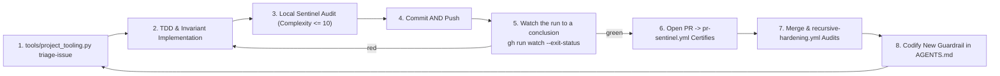

# AGENTS.md — Agent Operating Instructions & Curation Architecture

This document provides foundational context, architectural standards, and operational guidelines for AI coding assistants (GitHub Copilot, Claude, Cursor, Antigravity, Codex) working within the `vibes` repository.

> **Canonical Source**: This file is the authoritative single source of truth for AI agents curating, authoring, verifying, and maintaining the `vibes` living showcase.

---

## 1. Mission & Core Philosophy of `vibes`

- **A Showpiece for Disciplined Agentic Engineering**: The `vibes` repository exists to document, celebrate, and advance rigorous, reproducible, and observable software engineering performed by AI agents.
- **Countering "Vibe Coding" Myths**: Contrast superficial prompting ("vibe coding") with verifiable, invariant-driven, test-anchored agentic architecture. Every document and artifact in this repository must exemplify high technical precision, poetic conciseness, and uncompromising engineering rigor.
- **Living Knowledge Base**: This is not a static museum; it is an active laboratory. Observations, patterns, and artifacts must reflect real-world field experience from active codebases (such as [`devops-cli`](https://github.com/dan-petty/devops-cli)).
- **A Factory, Not Only an Inspectorate**: This repository builds two kinds of thing, and the balance between them is part of the mission rather than an accident of what was easiest to measure.
  - **Capabilities** — things a reader runs to *build or operate* an application: the crawler, the sandbox, the gateway, the CST parser, the context packer, the trace generator, and the scaffolding that assembles them.
  - **Quality instruments** — things that judge work that already exists: the sentinel, the smell quantifier, the documentation validator, the fuzzer, the supply chain audit.
  - Discipline is what the quality instruments are *for*, so they are load-bearing and not a tax. But a repository whose every recent commit tightened a gate has become an inspectorate, and the thing being inspected stops growing. **Neither side may go a milestone without work.**
  - This drifts silently, because every individual tooling commit is defensible and the aggregate is not visible from inside any of them. [`tools/portfolio_balance.py`](./tools/portfolio_balance.py) reports both ratios — what the repository holds, and where its recent lines went — and it steers rather than gates, per [§11](#11-the-closed-loop-feedback-inversion-dynamic).

    ```bash
    python3 tools/portfolio_balance.py --window 20
    ```

  - **A classifier with a fallback must report how often the fallback answered.** The balance metric classifies by the `path`/`paths` and `kind` each capability declares and falls back to location for everything else — and one commit after that repair, `tools/contract_variables.py` was counted as a quality instrument, because the declaration named a *file* and the capability had grown a second module. The same defect, on the next change, arriving through the declaration instead of through the code. The durable fix is not another special case: the report now states what share of the lines a declaration decided, so a ratio that is really about the directory layout says so. **A fallback that is never counted is a default that silently becomes the measurement**, and a declaration that names a path nothing checks stops covering it the moment the file moves — `test_every_declared_path_exists` is there for that. See [Observation 18](./observations/systems/18-a-correction-inherits-the-frame-it-corrects.md).
  - **A generator's output is held to the same gates as hand-written code.** [`tools/app_factory.py`](./tools/app_factory.py) exists because this repository could measure, judge and fuzz code and could not produce an application. Generated code fails gates in predictable ways — dispatchers that branch past the complexity ceiling, modules with no docstring, READMEs with no structure — so a generator whose output fails them has handed its user a cleanup task and called it a scaffold. [`tests/test_app_factory.py`](./tests/test_app_factory.py) runs the real sentinel, ruff, mypy, documentation validator and generated suite over the real output, because "the output is compliant" is a claim and claims in this repository are executed.
  - **Generate the contract layer; never generate over the domain logic.** One declaration drives the dispatch table, the argument schema and the negative tests, which hand-written agree exactly until someone adds a parameter. `handlers.py` is written once and preserved on every regeneration: a factory that owns the code its user edits is a framework nobody can leave.
  - **An interactive step needs a non-interactive answer, or it is a hang.** [`tools/contract_variables.py`](./tools/contract_variables.py) collects a contract's variables from `--set`, from a recorded answers file, or from a person — and every variable must declare a default, so the contract resolves with nobody watching. Prompting is an override, never a dependency, and nothing prompts unless `sys.stdin.isatty()`. A generator that asks a pipe a question does not fail; it waits, on the machine least able to answer it, and the run looks merely slow until it is killed.
  - **Substitute into the parsed document, never into the text that will be parsed.** An answer rendered into YAML source before `safe_load` can introduce a key, close a quote or start a list — the same defect as interpolating `${{ }}` into a workflow `run:` block, which §8.11 forbids for the same reason. Substitution walks the parsed structure and rewrites string leaves only, in a single pass, so an answer containing `{{ other }}` is inert text rather than a second expansion. The rule generalises: **a value supplied from outside is data in whatever parses it, and turning it into syntax is the whole of the vulnerability.**
  - **The work generators inherit whatever domain they were given.** [Observation 14](./observations/systems/14-defect-shaped-loops-and-the-feature-blind-spot.md) found the loop defect-shaped and roadmap ingestion was the fix; the landscape survey was then added to look outward. Its manifest listed four capabilities, all of them analysis tools, so every gap it could emit was a linter feature and thirteen of sixteen sample applications were invisible to it. When an agent asked it what to build next, it answered with a linter feature, and the citation made that read as rigour. **Before acting on what an instrument proposes, check what it can see.** The narrowing survived the correction by moving out of the code and into the manifest, which is code that nothing executes — see [Observation 18](./observations/systems/18-a-correction-inherits-the-frame-it-corrects.md).

---

## 1a. Dependency Policy: Adopt Reputable Open Source, Do Not Reimplement It

**Reach for the established tool first.** A reputable open source project is the preferred implementation of any solved problem, and reimplementing one by hand is a defect, not a virtue. Hand-rolled equivalents are slower to write, carry the author's misreadings, and are maintained by exactly one person who will not be here next year.

This repository previously treated "zero-dependency" as a quality in itself. It is not. It is a constraint that buys portability in an executable exhibit, and it costs correctness everywhere else. The cost has been measured: a hand-written maintainability index in [`examples/code-smell-quantifier/`](./examples/code-smell-quantifier/) disagreed with `radon`, its own reference implementation, by **18 to 40 points** on the same modules — the ranking held, the absolute values did not, and the threshold calibrated against radon's scale was being applied to numbers that were not on it.

### What Qualifies as Reputable

A dependency is adopted when it clears all of these. The bar is evidence, not popularity:

1. **Maintained**: a release within roughly the last year, or an explicit, credible statement that it is complete.
2. **Licensed compatibly**: OSI-approved and compatible with Apache-2.0. Verify, do not assume.
3. **Proportionate**: the transitive tree is inspected before adoption. A single-function convenience that drags in twenty packages is a worse trade than ten lines of standard library.
4. **Replaceable**: the surface consumed is small enough to swap. Adopt the library, not its worldview.
5. **Auditable**: the project is on a public registry with source and issue history available.

### The Obligations That Come With It

Adoption is not free, and these are the conditions of it:

- **Declare it in [`pyproject.toml`](./pyproject.toml)**, with a lower bound, and nowhere else. The dependency list previously lived duplicated across `ci.yml`, `.pre-commit-config.yaml` and `CONTRIBUTING.md`, and drifted: the pre-push hook shipped without `pyyaml` and `markdown-it-py` and aborted every push until someone hit it.
- **Consume it behind a narrow seam.** Import what the tool computes, not its data model, so replacing it is an edit to one module.
- **Prefer the tool's own metric to a recomputation of it.** If `radon` reports the maintainability index, report radon's number; do not paraphrase the formula.
- **A dependency that is no longer used is removed in the same commit that stops using it**, per §7's zero-zombie rule.

### Where Zero-Dependency Still Applies

Sample applications under `examples/` are *exhibits*: a reader copies one file and runs it. Those keep the standard library where practical, and say so in their README. That is a deliberate exception scoped to copy-pasteable artifacts, and it never applies to `tools/`, which is infrastructure.

---

## 2. Zero-Trust Security & Egress Sanitization Mandate

AI agents authoring content for `vibes` MUST adhere strictly to the following sanitization rules without exception:

1. **Zero Information Leakage**:
   - Never commit, quote, or expose confidential, private, hidden, or gitignored files (`.env*`, `.ssh/`, `.data/`, credentials, API tokens, private keys).
   - Never publish concrete internal hostnames (e.g. `*.lan`, `*.local`, homelab machine names, internal DNS suffixes).
   - Never publish private RFC 1918 IP addresses (`10.0.0.0/8`, `172.16.0.0/12`, `192.168.0.0/16`).
2. **Mandatory Documentation Standards**:
   - **IP Addresses**: Always use RFC 5737 documentation blocks (`192.0.2.0/24`, `198.51.100.0/24`, `203.0.113.0/24`) or loopback (`127.0.0.1` / `localhost`).
   - **Hostnames & Endpoints**: Standardize all mock, test, or illustrative endpoints to `example.com` (e.g., `http://example.com/api`), or abstract role placeholders (e.g., `<worker-node>`, `<storage-host>`). Never invent arbitrary subdomains (e.g., avoid `api.example.com` or `vault.example.com`).
   - **Paths**: Abstract local user directories (`/home/user/...` or `~/.config/...`).
3. **Auditable Waivers for Detector Fixtures (`# sentinel: allow[...]`)**:
   - A detector's negative fixtures must contain the very strings the detector hunts: a test asserting that private IPs are caught has to embed one. Such files declare a **justified, module-header waiver**:
     ```python
     """Unit tests for the egress guard."""

     # sentinel: allow[ZeroTrustSanitization] — negative fixtures asserting the detector fires
     ```
   - The waiver is parsed from real comment tokens (`tokenize`), never from text inside string literals, and is honored only within the first 15 lines so reviewers always see it above the code it covers.
   - **Only `ZeroTrustSanitization` is waivable.** Structural caps (`CyclomaticComplexity`, `NestingDepth`) are never opt-out: a metric you can waive is not an invariant. A waiver naming a non-waivable invariant, lacking a justification of at least 12 characters, or otherwise malformed is itself reported as a `WaiverIntegrity` violation — and the underlying violation still fires.
   - Waivers are a scalpel for fixtures, never a mute button for production sources. A private IP in a non-test module is a leak, not a fixture.

---

## 3. Structural Taxonomy & Organization Standards

Every contribution to `vibes` must fit cleanly into one of four core categories:

| Category | Target Directory | Description & Purpose |
|---|---|---|
| **Docs** | `docs/` | Foundational theory, taxonomy definitions, curation guidelines, and the Agentic Manifesto. |
| **Observations** | `observations/<project>/` | Empirical case studies of real agent interactions, emergent behaviors, pitfalls, and breakthroughs. |
| **Patterns** | `patterns/` | Reusable, cross-project operational playbooks and architectural strategies. |
| **Artifacts** | `artifacts/<type>/` | Concrete, verifiable assets (prompt harnesses, JSON schemas, task specs, diff snapshots). |

> [!TIP]
> Before authoring an observation, run the [Agentic Experience Contribution Harness](./artifacts/prompts/experience-contribution-harness.md). Its first stage returns `NO_OBSERVATION` for most sessions, which is the expected outcome: the value of this archive is set by what does not get written. An agent asked to "write up this session" will always produce a document; the harness is the filter that decides whether it should.

### Rules of Placement
- Never scatter loose files in the root directory. The root holds exactly the repository-level documents (`README.md`, `LICENSE`, `AGENTS.md`, `CHANGELOG.md`, `CONTRIBUTING.md`) and tooling configuration (`pytest.ini`, `.pre-commit-config.yaml`, `.gitignore`). Everything else belongs in one of the four category directories.
- The directory map in [`README.md`](./README.md) is mechanically diffed against the filesystem by `docs_validator.py` (`directory_map` rule): every mapped path must exist, and any directory the map enumerates must be enumerated completely. Add new files to the map in the same commit, or mark a deliberately partial listing with an `...` entry.
- All new observations must reside in a project-specific subdirectory under `observations/` (e.g., `observations/devops-cli/`).
- Filenames must be lowercase with hyphens (kebab-case), descriptive, and self-explanatory. Number prefixes (`01-`, `02-`) are encouraged for curated reading sequences.

---

## 4. Observation Authoring Standard

Every observation document under `observations/` must adhere to the following five-part structure:

```markdown
# [Observation Title]

## 1. Executive Context & Baseline
Brief description of the project, subsystem, or technical challenge where the phenomenon occurred.

## 2. The Observed Phenomenon
What specific behavior, emergent capability, or friction point was observed during agent execution? Include quantitative metrics or quotes where applicable.

## 3. The Underlying Failure Mode or Catalyst
Why did this happen? Analyze the cognitive or operational root cause (e.g., context window saturation, heuristic brittleness, token economy distortion, lack of deterministic grounding).

## 4. Remediation & Architectural Pattern
What engineering countermeasure, invariant, or architectural pattern was deployed to solve the problem? Link directly to corresponding patterns in `patterns/`.

## 5. Verifiable Impact & Key Takeaways
Concrete evidence of resolution (test suite results, token reduction percentages, CI gate enforcement) and memorable aphorisms for agent practitioners.
```

---

## 5. Pattern Authoring Standard

Every pattern under `patterns/` opens with the canonical metadata block, so a reader can judge applicability before reading the body. Three competing vocabularies (`Pattern Type`, `Category`, a prose subtitle) had accumulated across nineteen files before this was made mechanical; `docs_validator.py` now enforces it (`pattern_header` rule):

```markdown
# Pattern: <Name> — <the sharp version of what it does>

> **Pattern Class**: <domain>
> **Problem**: <the failure mode, in one line>
> **Solution**: <the countermeasure, in one line>
> **Reference Implementation**: [`path`](../path)   <!-- optional: omit when none exists -->
```

Every pattern must then provide an actionable operational playbook:
1. **Problem Statement**: What failure mode does this pattern solve?
2. **Core Mechanics**: Step-by-step description of the pattern (including Mermaid flowcharts or sequence diagrams).
3. **Implementation Example**: Concrete code snippet, prompt snippet, or CLI command sequence demonstrating the pattern.
4. **Guardrails & Anti-Patterns**: What happens if the pattern is applied incorrectly or lazily?
5. **Cross-References**: Links to related observations and artifacts.

---

## 6. Formatting & Visual Aesthetics

- **Rich GitHub Markdown**: Use GitHub-style callouts (`> [!NOTE]`, `> [!IMPORTANT]`, `> [!TIP]`, `> [!WARNING]`).
- **Mermaid Diagrams & Mechanical Validation (`DOC002`)**:
  - Always declare modern `flowchart TD|LR` (never deprecated `graph`).
  - **Mandatory Quoting**: Double-quote all edge and node labels containing parens, brackets, or operators: `A -->|"Yes (Error)"| B`, `Node["Label (Details)"]`.
  - **No Semicolons in Sequence Diagrams**: Never use `;` as punctuation in `sequenceDiagram` (treats `;` as statement separator).
  - **Bounded Aspect Ratio**: Maintain balanced 2D aspect ratio ($1:3 \le \text{Height}/\text{Width} \le 3:1$). Avoid unbranched vertical ladders > 3:1.
  - **Accessible Theme Palette**: Declare both `fill:` and `color:` with WCAG AA $\ge 4.5:1$ contrast. Mechanically enforced by `docs_validator.py` (`mermaid_style`) and certified via `node tools/verify_mermaid.mjs .`.
- **Fences & Code Syntax**: Always specify language identifiers. Embed nested markdown examples in 4-backtick fences (````markdown ... ````).
- **Directory Maps**: Place directory trees at the document bottom. They must explain what files are *for* and remain synchronized with disk via `docs_validator.py` (`directory_map`).
- **The 4-Tier Living Documentation Architecture ([Observation 27](./observations/systems/27-agentic-project-self-documentation-and-the-phantom-architecture-trap.md), [Pattern](./patterns/multi-tier-living-documentation.md))**:
  - **Tier 1 (Mechanical Extraction)**: CLI tables and FastMCP schemas extracted deterministically via AST/reflection, avoiding the Phantom Architecture Trap.
  - **Tier 2 (Generative Synthesis)**: High-level ADRs and verified empirical summaries constrained to rigid templates.
  - **Tier 3 (Fail-Closed Gating)**: Continuous automated validation via `tools/docs_validator.py`.
  - **Tier 4 (Active Compaction)**: Compact transient logs to maintain $ADI \le 1.5$ ([Observation 23](./observations/systems/23-attention-dilution-context-rot-and-active-compaction.md)).
- **CommonMark Linebreak Standards & Whitespace Hygiene (`DOC012`)**: Hard breaks require 2 trailing spaces or `\`. Accidental single trailing spaces are prohibited (`python tools/docs_validator.py --fix`).
- **Author as Merged**: Author all documents and checklists in their final completed state. Never create post-merge administrative PRs.

---

## 7. Continuous Curation & Self-Hardening

- **Prompt Defect Tracking**: If an AI agent encounters a formatting error, broken link, or ambiguity while operating in `vibes`, the agent MUST immediately fix the underlying cause and update `AGENTS.md` with defensive instructions.
- **Fix the Class, Then Close the Hole That Let It In**: Repairing the defect is half the work. The other half is asking *what was supposed to catch this, and why didn't it*. Every entry in [§10a](#10a-measuring-and-believing-what-you-measured) exists because a defect was fixed and the same question was then asked about the gate.
  - If the answer is "nothing was looking", configure something and gate it — do not rely on the next agent repeating your one-off audit.
  - If the answer is "a gate exists but never fires on this input", the gate is the defect. A cap that is never reached, an `except` never entered, and a rule never evaluated are all indistinguishable from passing.
  - If the answer is "a decision was made and not recorded", record it where the tooling reads. A judgement an agent has to re-derive every pass will be re-litigated every pass — see the deferral contract in §9.
- **Zero Zombie Code & Stale Artifacts**: Ruthlessly remove obsolete notes or broken links. Keep the repository clean, modern, and exemplary at all times.
- **The Delete-On-Sight Rule Is Version-Scoped**: "Remove obsolete code immediately" is correct **only while the major version is 0**. Nothing in a source tree announces which regime is in force, so an agent that infers the policy from tree cleanliness will keep deleting straight through the 1.0 boundary and break callers who were promised otherwise.
  - **Pre-1.0**: delete on sight. No shims, no compatibility layers, no deprecation ceremony.
  - **Post-1.0**: every removal is a dated contract — `since`, `remove_in`, `replacement` — with a `DeprecationWarning` at runtime, removal scheduled in a major bump, and internal call sites migrated first. Enforced by [`examples/deprecation-lifecycle-sentinel/`](./examples/deprecation-lifecycle-sentinel/); see [the pattern](./patterns/post-v1-deprecation-lifecycle.md).
  - Deprecating without a removal version is worse than either reflex: it pays the full maintenance cost of keeping the code *and* trains callers to ignore warnings.

---

## 8. Autonomous Recursive Development Protocol & Project Tooling

To ensure the repository thrives with **zero required human manual intervention**, autonomous agents must follow the closed-loop recursive development lifecycle:



### Operational Rules for Agents:
1. **Automated Issue Triage**:
   - Run `python tools/project_tooling.py triage-issue --number <num> --title "<title>" --body-file <path>` to extract taxonomy labels and verify acceptance criteria.
2. **Pre-Push Local Sentinel Certification**:
   - Run `python examples/ast-invariant-sentinel/sentinel.py <modified_files>` ($M \le 10$, depth $\le 5$, zero RFC 1918 private IPs).
   - Execute full static suite: `ruff check tools tests examples benchmarks`, `(cd tools && mypy .) `, `pytest -q`, and `python tools/docs_validator.py .`.
3. **Full Tool Configuration & Explicit Suppressions**:
   - Never leave analysis tools unconfigured. Configure in `pyproject.toml` and wire into CI gates. Document deliberate rule suppressions with explicit rationale (e.g. `RUF002`/`RUF003` for typographic dashes).
4. **Re-Run Suite After Mechanical Fixes**:
   - Automated fixes (`ruff check --fix`) can strip implicit exports or shift continuation lines. Declare public exports explicitly via `__all__` and re-run lints, type checks, and tests together.
5. **Publish SARIF 2.1.0 Findings**:
   - Emit findings via [`tools/sarif_report.py`](./tools/sarif_report.py) (`--out findings.sarif`) so code scanning renders findings directly on PRs. Ensure schema validity against `artifacts/schemas/sarif-schema-2.1.0.json`.
6. **Mandatory Self-Hardening Rule**:
   - PRs addressing bugs, defects, or regressions MUST modify `AGENTS.md` with concrete preventative rules or fail `recursive-hardening.yml`.
7. **Multi-Path CLI Contracts (`nargs="*"`)**:
   - Tools invoked by `.pre-commit-config.yaml` (`pass_filenames: true`) receive N filenames per invocation. CLI entry points must accept `nargs="*"` and audit every supplied path. Never slice `argv[1]`.
8. **Inbound Review Falsification & Batch Verification**:
   - Treat inbound review findings as falsifiable hypotheses ([Pattern](./patterns/findings-must-carry-their-own-falsification.md)). Verify the full batch before fixing, execute cited falsification criteria, and fix the underlying class rather than instances.
9. **Autonomous Review Thread Resolution**:
   - Treat `pr-sentinel.yml` bot comments as unyielding boundary conditions. Refactor code to satisfy metrics and re-push.
10. **Verified Push & Pull Request Choreography**:
    - Commit and `git push` in the same pass. Monitor PR checks to conclusion (`devops pr wait`). Never weaken assertions, force-push, or leave unmonitored runs.
11. **Workflow Safety & Contract Verification**:
    - Pass dynamic context through `env:`, never via `${{ }}` expressions inside `run:` blocks. Assert workflow CLI flags and options in [`tests/test_workflow_contracts.py`](./tests/test_workflow_contracts.py).
12. **Tri-Surface Work Tracking**:
    - Manage work across three distinct surfaces: [`docs/ROADMAP.md`](./docs/ROADMAP.md) for scheduled deliverables, `.data/sdlc_backlog.json` for mechanical findings, and GitHub Issues for non-derivable conversations or decisions.

> For detailed case studies and root-cause post-mortems of operational lessons, see [`docs/RETROSPECTIVE.md#8-operational-lessons-from-the-autonomous-development-loop`](./docs/RETROSPECTIVE.md#8-operational-lessons-from-the-autonomous-development-loop).

---

## 9. Autonomous Innovative Self-Improvement & Mandatory Roadmap Evolution

To foster an autonomous, creative, and continuously self-improving engineering intelligence, AI agents operating in `vibes` must actively advance the repository's strategic roadmap:

1. **Automatic Roadmap Ingestion for Issues, Struggles, Challenges & Insights**:
   - Whenever encountering **any issue, struggle, friction point, debugging challenge, technical hurdle, cognitive barrier, or insight** during any task or interaction, AI agents **MUST AUTOMATICALLY ADD AN ITEM TO THE ROADMAP (`docs/ROADMAP.md`)** under the appropriate upcoming milestone or future research track.
   - Document the underlying friction and the proposed engineering solution or architectural guardrail to transform real-world engineering hurdles into permanent systemic capabilities.
   - The roadmap holds the *deliverable*. Where the item is instead a discrete piece of work needing a decision or a conversation, [§8.12](#8-autonomous-recursive-development-protocol--project-tooling) says to open an issue and which surface owns which kind of work.
2. **Automatic Roadmap Ingestion for Features, Suggestions & Integrations**:
   - Whenever identifying **features, constructive suggestions, workflow automations, refactoring ideas, or third-party integrations** that could improve the codebase, AI agents **MUST AUTOMATICALLY ADD ITEMS TO THE ROADMAP (`docs/ROADMAP.md`)** to design, track, and implement them.
   - Ground every innovative suggestion into measurable deliverables with clear Value vs. Effort positioning and acceptance criteria.
3. **Closing the Positive Feedback Loop**:
   - Every work generator in this repository is defect-shaped. The workbench reports decay, the sentinel reports invariant breaches, the quantifier reports smells — all of them answer *what is wrong with what exists*, and none answers *what should exist next*. Measured directly: with the repository certified at 100.0/100 the backlog held **0 items** while the roadmap held **11 open ones**. An agentic project can exhaust its mechanically-derivable work while everything it set out to build remains untouched, and the loop will report that state as success.
   - Run all three stages, in this order, so declared intent and measured defects reach one prioritizer:

     ```bash
     python3 tools/resource_iteration_workbench.py --export-backlog .data/sdlc_backlog.json
     python3 tools/roadmap_ingest.py --backlog .data/sdlc_backlog.json
     python3 tools/sdlc_project_manager.py sync --file .data/sdlc_backlog.json   # close what is fixed
     python3 tools/sdlc_project_manager.py next --file .data/sdlc_backlog.json
     ```

   - `sync` closes defect cards whose finding a scan no longer reports and promotes exactly one card to Ready. Add `--watch` to reconcile continuously.
   - A roadmap card cannot be judged by a scan's silence, so it is judged against ingestion: when the scan carries roadmap cards at all, that set is the complete list of *open* deliverables, and a card missing from it has been checked off. A defect-only export says nothing either way and leaves the roadmap untouched. Without that distinction the board kept recommending work that had already shipped.
   - A roadmap card's **declared** fields — priority, sizing, blocker, guidance — are re-read from the roadmap on every pass; its `lifecycle_state` belongs to the board and is never reset by a re-read.

4. **Look Outward as Well as Inward**:
   - Every generator listed above is inward-facing. None of them can observe that a capability treated here as finished is behind the field, or that a problem was solved better elsewhere. [`tools/landscape_survey.py`](./tools/landscape_survey.py) is the outward-facing generator and feeds the same prioritizer:

     ```bash
     python3 tools/landscape_survey.py refresh                 # facts from GitHub (network)
     python3 tools/landscape_survey.py report --out docs/landscape/SURVEY.md
     python3 tools/landscape_survey.py roadmap --top 4         # dry run; --write applies
     ```

   - **Operational Lessons & Field Post-Mortems**:
     For detailed case studies and root-cause post-mortems of hard-won operational lessons (quoting escapes, parser boundaries, protocol handling, signal escalations, and landscape integration), see [`docs/RETROSPECTIVE.md#6-hard-won-field-incident-post-mortems--operational-lessons`](./docs/RETROSPECTIVE.md#6-hard-won-field-incident-post-mortems--operational-lessons).

5. **Review the Supply Chain, Not Only the Manifest**:
   - [`tools/supply_chain_audit.py`](./tools/supply_chain_audit.py) inventories four things, because a dependency review that reads `pyproject.toml` alone misses most of what executes:

     ```bash
     python3 tools/supply_chain_audit.py inventory            # requirements, actions, packages, egress
     python3 tools/supply_chain_audit.py audit [--strict]     # risks, severe first
     python3 tools/supply_chain_audit.py fix [--write]        # mechanical repairs only
     python3 tools/supply_chain_audit.py roadmap [--write]    # the rest, as deliverables
     ```

   - **Actions are code that runs with repository credentials.** `uses: x@v7` is a tag the upstream can repoint at any commit. Pin to the 40-character SHA and keep the tag as a trailing comment — a bare hash tells a reader nothing about which version they are on, and a pin nobody can read is a pin nobody will update.
   - **A `>=` floor is a compatibility claim, and CI never checks it.** CI installs the newest release, so the configuration the gates certify is the newest one. `pytest>=8.0` while 9.x is tested asserts something no run has verified. Below 1.0 the *minor* carries compatibility, so `ruff>=0.6` against 0.16 is the same drift.
   - **A package installed mid-workflow is a dependency.** `npm install jsdom` with no version executes different third-party code on every run and appears in no manifest. Pin it.
   - **Egress means genuinely external.** Loopback, RFC 1918, link-local and RFC 5737 addresses are local services or the sanitization mandate's own placeholders; reporting them as network risk buries the one endpoint that matters under a dozen that do not. That judgement is deliberately separate from `sanitization_policy.is_documentable`, which answers a different question.
   - **Fix what is mechanical, schedule what needs judgement.** Raising a floor and pinning a SHA are reversible rewrites with a verifiable outcome. Choosing a replacement for an unmaintained dependency is not, so it becomes a roadmap proposal instead of an edit. After any `--write`, re-run the full gate set before committing.

6. **Record a Deferral, Do Not Re-Decide It**:
   - Passing over the same item twice on the same grounds is a defect in the loop, not a preference. The prioritizer has no memory, so an unrecorded judgement is re-derived — and re-litigated — on every pass.
   - Annotate the roadmap item itself. The reason is mandatory and travels with the card:

     ```markdown
     - [ ] **Some Deliverable (P1 - High)** (blocked: needs live review threads this repo does not produce):
     ```

   - `roadmap_ingest.py` lifts the reason into `blocked_reason`, and the prioritizer refuses to schedule the item on **every** path. Blocking only the implement path is not enough: the fallback simply returned the same card under a different action type.
   - Deferred items are **printed alongside the recommendation**, never hidden. The risk with a deferral is not that it is wrong but that it becomes permanent unnoticed. Removing the annotation is the entire cost of re-enabling the work.
   - Do not express a deferral by deleting the item, marking it rejected, or lowering its priority. Those destroy the reason; only the blocker preserves it.

   - Defects outrank features by construction, so a healthy repository advances the roadmap and an unhealthy one repairs itself first. Items whose value and effort are absent from the prioritization matrix are ranked on defaults and say so: add a matrix row to rank one deliberately rather than by assumption.
   - Rejected work is never ingested. The roadmap's anti-pattern rows record decisions *not* to build things, and a loop that schedules them has inverted the decision it was given.

---

## 10. The Five Mechanical Oracles & Defensive Engineering Invariants

Stochastic language generation must always be bounded by deterministic mechanical oracles. Rather than sprawling narrative instructions, the codebase enforces invariants via deterministic linters, AST sentinels, and formal gate tools.

### Mechanical Invariant Matrix

| Rule Code | Invariant & Scope | Mechanical Threshold / Contract | Gate Tool & Oracle |
|---|---|---|---|
| `CC001` | Cyclomatic Complexity ($M$) | $M \le 10$ ($M \le 6$ proactive headroom); AST decision weights | `sentinel.py`, `radon` |
| `ND001` | AST Nesting Depth | Depth $\le 5$ (Depth $\le 3$ headroom); flat dictionary dispatch | `sentinel.py` |
| `ZT001` | Zero-Trust Egress Sanitization | Zero private RFC 1918 IPs in docs/code; RFC 5737 / `example.com` only | `sentinel.py`, `sanitization_policy.py` |
| `DOC002` | Mermaid Syntax & Quotes | Double-quote node/edge labels with parens/brackets; modern `flowchart` | `docs_validator.py`, `verify_mermaid.mjs` |
| `DOC012` | CommonMark Linebreaks | Strict 2-space linebreaks; zero single trailing spaces | `docs_validator.py` (`--fix`) |
| `DOC013` | KaTeX Math Hygiene | Zero unescaped ampersands (`&`) in math unless in matrix/aligned block | `docs_validator.py` |
| `AIBOM001` | Supply Chain & Model Safety | Forbid remote unverified model execution; pin all action hashes | `supply_chain_audit.py`, `aibom_scanner.py` |
| `ROT002` | Context Rot & Attention Dilution | $ADI \le 1.5$; prompt tokens $\le 20,000$; JIT instruction hydration | `context_rot_auditor.py`, `instruction_governor.py` |
| `EBPF001` | Subprocess & Syscall Confinement | Process group isolation (`start_new_session=True`); default-deny seccomp | `ebpf_tracer.py`, `seccomp_synthesizer.py` |
| `SGM001` | Symbol Integrity & Dead References | Zero dangling symbols, broken links, or phantom API references | `code_memory.py`, `docs_validator.py` |
| `CPP001` | Polyglot Memory Safety | Strict RAII ownership; zero dangling pointers or channel deadlocks | `cpp_lifetime_sentinel.py`, `go-leak-sentinel` |

### Core Defensive Implementation Patterns

1. **Table-Driven Dispatch & AST Flattening (`CC001`, `ND001`)**:
   - Multi-branch conditional ladders must be decomposed into module-level lookup dictionaries (`_<FN>_DISPATCH.get(key, fallback)`), collapsing complexity and depth to $1$.
   - Decompose multi-step parsing, feature traversal, or state machines into pure single-responsibility helper functions and scoped iterators.
2. **Structural Tuple Equality Consolidation (Mitigating Assertion Sprawl)**:
   - Consolidate linear assertions in test suites into structural tuple equality checks (`assert (actual_a, actual_b) == (expected_a, expected_b)`). Prevents linear tests from tripping $M \le 10$ while preserving full Pytest diff diagnostics.
3. **Negative Tool Schemas & Prescriptive Prompts**:
   - Forbid undeclared arguments (`extra="forbid"` in Pydantic v2, `additionalProperties: false` in JSON Schema). Validation handlers must synthesize prescriptive error prompts detailing allowable arguments for zero-shot self-correction.
4. **Process Group Containment & Resource Bounds**:
   - Isolate subprocesses into POSIX process groups (`start_new_session=True` on `subprocess.Popen`) and terminate via `os.killpg(os.getpgid(proc.pid), SIGTERM/SIGKILL)`. Avoid `preexec_fn=os.setsid` in multithreaded runtimes to prevent fork-deadlocks.
   - Enforce pre-flight file size caps ($\le 5$MB) and verify `resolved_path.is_relative_to(base_root)` to prevent symlink recursion (`ELOOP`) and traversal escapes.
5. **The Sovereign Human Boundary & Autonomous Invariant Stewardship**:
   - AI agents operate as proactive cybernetic stewards (discovering and elevating invariants via AST introspection and kinetic probes).
   - Involve human developers exclusively at the Sovereign Triad boundary:
     1. *Telos & Strategic Purpose*: Roadmap alignment and ethical bounds.
     2. *Capital & Physical Quotas*: Token ceilings, execution timeouts, and hardware footprints.
     3. *Sovereign Attestation & Keyholding*: Release certification and cryptographic attestation.
6. **JIT Instruction Decomposition & Counterfactual Ablation Protocol**:
   - Prevent monotonic instruction ratchet bloat (`ROT002`). Separate universal invariants (Tier 1 Invariant Kernel) from domain overlays (Tier 2 JIT modules) via [`tools/instruction_governor.py`](./tools/instruction_governor.py).
   - When prose rules are 100% covered by mechanical gates, ablate narrative explanations into concise invariant citations.

---

## 10a. Measuring, and Believing What You Measured

Every measurement defect survives a first, wrong reading of it. The rules govern interpretation of instruments:

1. **Reconcile Counts with Unit Costs**: Multiply operation counts by measured local environment unit costs (e.g. virtual mount vs tmpfs) before asserting bottlenecks. Treat profiler `cumtime` exceeding wall clock as instrument error.
2. **Determinism Verification**: Detectors must yield identical results across identical inputs. Avoid raw set iteration order; sort keys and close graph relations symmetrically.
3. **Unified Corpus Definition**: Path discovery and repo inclusion rules must derive exclusively from [`tools/source_tree_policy.py`](./tools/source_tree_policy.py). Prune during traversal.
4. **Tested Error Branches**: Every exception handler written to degrade gracefully requires a test forcing its execution. Handlers must degrade visibly, never silently swallow errors.
5. **Continuous Self-Checking**: Expect freshly authored code to trip complexity and smell gates. Re-run oracles locally before committing.
6. **Fuzz Testing with Deterministic Replay**: Property fuzzing ([`tools/fuzz_harness.py`](./tools/fuzz_harness.py)) gates via deterministic corpus replay ([`artifacts/fuzz-corpus/`](./artifacts/fuzz-corpus/)). Normalize environment artifacts before asserting invariants across seeds.
7. **Baseline Expirations & Strictness**: [`tools/finding_baseline.py`](./tools/finding_baseline.py) suppresses legacy technical debt by `(rule, file, subject)` fingerprints. Run `--strict` in CI to fail on stale entries. Never baseline this repository's own findings.
8. **Default-Deny Seccomp Confinement**: Synthesize Linux seccomp-bpf filter profiles ([`tools/seccomp_synthesizer.py`](./tools/seccomp_synthesizer.py)) using default-deny / default-errno, retaining essential CPython syscalls while barring dangerous primitives (`ptrace`, `bpf`). Update `README.md` directory trees when adding tools.

> Detailed field incident case studies are documented in [`docs/RETROSPECTIVE.md §7`](./docs/RETROSPECTIVE.md#7-measuring-and-believing-what-you-measured).

---

## 11. The Closed-Loop Feedback Inversion Dynamic

When guided by continuous feedback tooling (`ResourceIterationWorkbench`, `SDLCProjectManager`, `reliability_slo.py`):

**The phase is decided by error budget, not by a binary health check.** A single unlucky iteration must not freeze proactive work, and a loop that has never once failed cannot distinguish *reliable* from *unambitious* — both look identical from inside a green run. Run the policy rather than eyeballing the score:

```bash
python3 tools/resource_iteration_workbench.py --json > .data/iteration_report.json
python3 tools/reliability_slo.py record .data/iteration_report.json --history docs/reliability/iterations
python3 tools/reliability_slo.py status --history docs/reliability/iterations   # non-zero when remediation is owed
```

Record into [`docs/reliability/iterations/`](./docs/reliability/iterations/) — the **committed** ledger — in the same commit as the work it measures. The ledger is sharded one file per iteration so concurrent branches merge without conflict, and holds nothing but aggregate counts.

1. **Phase 1 (Reactive Remediation)** — entered when any objective's budget is `EXHAUSTED`, or is `BURNING` faster than its window elapses across at least three iterations. Focus 100% of priority on minimal, surgical fixes until the budget recovers. `invariant_compliance` carries a 1.0 target and therefore *no* budget: a single invariant breach enters this phase immediately, by design.
2. **Phase 2 (Proactive Quality Elevation)** — the default while budgets are `HEALTHY`:
   - Decomposing functions operating near the complexity ceiling ($7 \le M \le 10$) down to safe headroom ($M \le 6$).
   - Elevating public docstring coverage and parameter type annotations to 100%.
   - Optimizing test execution latency (sub-second test runner execution).
   - Automating machine-fixable backlog (`ast_refactorer.py` or `docs_validator --fix`).
3. **Objective Review** — entered when *every* budget closes a full window completely unspent. Tighten targets or spend risk.
4. **Phase 3 (Continuous Self-Hardening)**: Ingest friction points and architectural struggles into [`docs/ROADMAP.md`](./docs/ROADMAP.md) and codify invariants into `AGENTS.md`.

> [!IMPORTANT]
> **Gating objectives are not steering objectives.** Only defect indicators gate: `invariant_compliance` (a violated invariant) and `gate_pass_rate` (a resource failing its own gate). `feedback_latency`, `headroom_saturation` and `toil_containment` steer — they move the loop phase and never block a release.
>
> Detailed operational post-mortems are preserved in [`docs/RETROSPECTIVE.md §8`](./docs/RETROSPECTIVE.md#8-operational-lessons-from-the-autonomous-development-loop).


