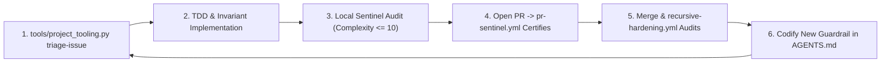

# AGENTS.md — Agent Operating Instructions & Curation Architecture

This document provides foundational context, architectural standards, and operational guidelines for AI coding assistants (GitHub Copilot, Claude, Cursor, Antigravity, Codex) working within the `vibes` repository.

> **Canonical Source**: This file is the authoritative single source of truth for AI agents curating, authoring, verifying, and maintaining the `vibes` living showcase.

---

## 1. Mission & Core Philosophy of `vibes`

- **A Showpiece for Disciplined Agentic Engineering**: The `vibes` repository exists to document, celebrate, and advance rigorous, reproducible, and observable software engineering performed by AI agents.
- **Countering "Vibe Coding" Myths**: Contrast superficial prompting ("vibe coding") with verifiable, invariant-driven, test-anchored agentic architecture. Every document and artifact in this repository must exemplify high technical precision, poetic conciseness, and uncompromising engineering rigor.
- **Living Knowledge Base**: This is not a static museum; it is an active laboratory. Observations, patterns, and artifacts must reflect real-world field experience from active codebases (such as [`devops-cli`](https://github.com/dan-petty/devops-cli)).

---

## 1a. Dependency Policy: Adopt Reputable Open Source, Do Not Reimplement It

**Reach for the established tool first.** A reputable open source project is the preferred implementation of any solved problem, and reimplementing one by hand is a defect, not a virtue. Hand-rolled equivalents are slower to write, carry the author's misreadings, and are maintained by exactly one person who will not be here next year.

This repository previously treated "zero-dependency" as a quality in itself. It is not. It is a constraint that buys portability in an executable exhibit, and it costs correctness everywhere else. The cost has been measured: a hand-written maintainability index in [`examples/code-smell-quantifier/`](./examples/code-smell-quantifier/) disagreed with `radon`, its own reference implementation, by **18 to 40 points** on the same modules — the ranking held, the absolute values did not, and the threshold calibrated against radon's scale was being applied to numbers that were not on it.

### What Qualifies as Reputable

A dependency is adopted when it clears all of these. The bar is evidence, not popularity:

1. **Maintained**: a release within roughly the last year, or an explicit, credible statement that it is complete.
2. **Licensed compatibly**: OSI-approved and compatible with Apache-2.0. Verify, do not assume.
3. **Proportionate**: the transitive tree is inspected before adoption. A single-function convenience that drags in twenty packages is a worse trade than ten lines of standard library.
4. **Replaceable**: the surface consumed is small enough to swap. Adopt the library, not its worldview.
5. **Auditable**: the project is on a public registry with source and issue history available.

### The Obligations That Come With It

Adoption is not free, and these are the conditions of it:

- **Declare it in [`pyproject.toml`](./pyproject.toml)**, with a lower bound, and nowhere else. The dependency list previously lived duplicated across `ci.yml`, `.pre-commit-config.yaml` and `CONTRIBUTING.md`, and drifted: the pre-push hook shipped without `pyyaml` and `markdown-it-py` and aborted every push until someone hit it.
- **Consume it behind a narrow seam.** Import what the tool computes, not its data model, so replacing it is an edit to one module.
- **Prefer the tool's own metric to a recomputation of it.** If `radon` reports the maintainability index, report radon's number; do not paraphrase the formula.
- **A dependency that is no longer used is removed in the same commit that stops using it**, per §7's zero-zombie rule.

### Where Zero-Dependency Still Applies

Sample applications under `examples/` are *exhibits*: a reader copies one file and runs it. Those keep the standard library where practical, and say so in their README. That is a deliberate exception scoped to copy-pasteable artifacts, and it never applies to `tools/`, which is infrastructure.

---

## 2. Zero-Trust Security & Egress Sanitization Mandate

AI agents authoring content for `vibes` MUST adhere strictly to the following sanitization rules without exception:

1. **Zero Information Leakage**:
   - Never commit, quote, or expose confidential, private, hidden, or gitignored files (`.env*`, `.ssh/`, `.data/`, credentials, API tokens, private keys).
   - Never publish concrete internal hostnames (e.g. `*.lan`, `*.local`, homelab machine names, internal DNS suffixes).
   - Never publish private RFC 1918 IP addresses (`10.0.0.0/8`, `172.16.0.0/12`, `192.168.0.0/16`).
2. **Mandatory Documentation Standards**:
   - **IP Addresses**: Always use RFC 5737 documentation blocks (`192.0.2.0/24`, `198.51.100.0/24`, `203.0.113.0/24`) or loopback (`127.0.0.1` / `localhost`).
   - **Hostnames & Endpoints**: Standardize all mock, test, or illustrative endpoints to `example.com` (e.g., `http://example.com/api`), or abstract role placeholders (e.g., `<worker-node>`, `<storage-host>`). Never invent arbitrary subdomains (e.g., avoid `api.example.com` or `vault.example.com`).
   - **Paths**: Abstract local user directories (`/home/user/...` or `~/.config/...`).
3. **Auditable Waivers for Detector Fixtures (`# sentinel: allow[...]`)**:
   - A detector's negative fixtures must contain the very strings the detector hunts: a test asserting that private IPs are caught has to embed one. Such files declare a **justified, module-header waiver**:
     ```python
     """Unit tests for the egress guard."""

     # sentinel: allow[ZeroTrustSanitization] — negative fixtures asserting the detector fires
     ```
   - The waiver is parsed from real comment tokens (`tokenize`), never from text inside string literals, and is honored only within the first 15 lines so reviewers always see it above the code it covers.
   - **Only `ZeroTrustSanitization` is waivable.** Structural caps (`CyclomaticComplexity`, `NestingDepth`) are never opt-out: a metric you can waive is not an invariant. A waiver naming a non-waivable invariant, lacking a justification of at least 12 characters, or otherwise malformed is itself reported as a `WaiverIntegrity` violation — and the underlying violation still fires.
   - Waivers are a scalpel for fixtures, never a mute button for production sources. A private IP in a non-test module is a leak, not a fixture.

---

## 3. Structural Taxonomy & Organization Standards

Every contribution to `vibes` must fit cleanly into one of four core categories:

| Category | Target Directory | Description & Purpose |
|---|---|---|
| **Docs** | `docs/` | Foundational theory, taxonomy definitions, curation guidelines, and the Agentic Manifesto. |
| **Observations** | `observations/<project>/` | Empirical case studies of real agent interactions, emergent behaviors, pitfalls, and breakthroughs. |
| **Patterns** | `patterns/` | Reusable, cross-project operational playbooks and architectural strategies. |
| **Artifacts** | `artifacts/<type>/` | Concrete, verifiable assets (prompt harnesses, JSON schemas, task specs, diff snapshots). |

> [!TIP]
> Before authoring an observation, run the [Agentic Experience Contribution Harness](./artifacts/prompts/experience-contribution-harness.md). Its first stage returns `NO_OBSERVATION` for most sessions, which is the expected outcome: the value of this archive is set by what does not get written. An agent asked to "write up this session" will always produce a document; the harness is the filter that decides whether it should.

### Rules of Placement
- Never scatter loose files in the root directory. The root holds exactly the repository-level documents (`README.md`, `LICENSE`, `AGENTS.md`, `CHANGELOG.md`, `CONTRIBUTING.md`) and tooling configuration (`pytest.ini`, `.pre-commit-config.yaml`, `.gitignore`). Everything else belongs in one of the four category directories.
- The directory map in [`README.md`](./README.md) is mechanically diffed against the filesystem by `docs_validator.py` (`directory_map` rule): every mapped path must exist, and any directory the map enumerates must be enumerated completely. Add new files to the map in the same commit, or mark a deliberately partial listing with an `...` entry.
- All new observations must reside in a project-specific subdirectory under `observations/` (e.g., `observations/devops-cli/`).
- Filenames must be lowercase with hyphens (kebab-case), descriptive, and self-explanatory. Number prefixes (`01-`, `02-`) are encouraged for curated reading sequences.

---

## 4. Observation Authoring Standard

Every observation document under `observations/` must adhere to the following five-part structure:

```markdown
# [Observation Title]

## 1. Executive Context & Baseline
Brief description of the project, subsystem, or technical challenge where the phenomenon occurred.

## 2. The Observed Phenomenon
What specific behavior, emergent capability, or friction point was observed during agent execution? Include quantitative metrics or quotes where applicable.

## 3. The Underlying Failure Mode or Catalyst
Why did this happen? Analyze the cognitive or operational root cause (e.g., context window saturation, heuristic brittleness, token economy distortion, lack of deterministic grounding).

## 4. Remediation & Architectural Pattern
What engineering countermeasure, invariant, or architectural pattern was deployed to solve the problem? Link directly to corresponding patterns in `patterns/`.

## 5. Verifiable Impact & Key Takeaways
Concrete evidence of resolution (test suite results, token reduction percentages, CI gate enforcement) and memorable aphorisms for agent practitioners.
```

---

## 5. Pattern Authoring Standard

Every pattern under `patterns/` opens with the canonical metadata block, so a reader can judge applicability before reading the body. Three competing vocabularies (`Pattern Type`, `Category`, a prose subtitle) had accumulated across nineteen files before this was made mechanical; `docs_validator.py` now enforces it (`pattern_header` rule):

```markdown
# Pattern: <Name> — <the sharp version of what it does>

> **Pattern Class**: <domain>
> **Problem**: <the failure mode, in one line>
> **Solution**: <the countermeasure, in one line>
> **Reference Implementation**: [`path`](../path)   <!-- optional: omit when none exists -->
```

Every pattern must then provide an actionable operational playbook:
1. **Problem Statement**: What failure mode does this pattern solve?
2. **Core Mechanics**: Step-by-step description of the pattern (including Mermaid flowcharts or sequence diagrams).
3. **Implementation Example**: Concrete code snippet, prompt snippet, or CLI command sequence demonstrating the pattern.
4. **Guardrails & Anti-Patterns**: What happens if the pattern is applied incorrectly or lazily?
5. **Cross-References**: Links to related observations and artifacts.

---

## 6. Formatting & Visual Aesthetics

- **Rich GitHub Markdown**: Use GitHub-style callouts (`> [!NOTE]`, `> [!IMPORTANT]`, `> [!TIP]`, `> [!WARNING]`).
- **Mermaid Diagrams & Mandatory Label Quoting**: Include Mermaid graphs to visualize workflows, state machines, and decision trees.
  - **Mandatory Quoting of Edge & Node Labels**: Always wrap edge labels containing parentheses `()`, comparison operators (`>`, `<`), brackets (`[]`), braces (`{}`), or colons in double quotes: `A -->|"Yes (Error)"| B` or `RelCheck -->|"False (Escape)"| Fail`. Never leave special characters unquoted inside edge pipes `|Yes (Error)|`, which causes Mermaid lexer failures (`Parse error on line ...: Expecting 'SQE', ... got 'PS'`).
  - **Quoted Node Text**: Always enclose node labels containing parentheses or punctuation in quotes: `Node["Label (Details)"]` or `Check{"Condition?"}`.
  - **Modern Declarations Only**: Always declare `flowchart TD|LR`, never the deprecated `graph` alias. Mechanically enforced by `docs_validator.py` (`mermaid` rule).
  - **Choose the Diagram Type That Matches the Mechanism**: A flowchart is the default, not the answer. Reach for the form that carries the most information per token:

    | Mechanism being shown | Diagram type |
    |---|---|
    | Ordered exchange between parties (protocol, delegation, tool call) | `sequenceDiagram` |
    | Lifecycle with irreversible transitions (ratchets, degradation, sessions) | `stateDiagram-v2` |
    | Value vs. effort, risk vs. reward, any two-axis placement | `quadrantChart` |
    | A metric moving across a measured series | `xychart-beta` |
    | Chronology of milestones or phases | `timeline` |
    | Branch, PR, and merge choreography | `gitGraph` |
    | Decision logic, pipelines, control flow | `flowchart` |

  - **Accessible, Theme-Independent Palette (WCAG AA)**: GitHub renders Mermaid on both light and dark backgrounds. A `fill:` without an explicit `color:` inherits a label color that flips with the theme and disappears against the fill. **Always declare both**, and always from this palette — every pair clears the WCAG AA 4.5:1 floor, and `docs_validator.py` computes the ratio mechanically (`mermaid_style` rule):

    | Class | `fill` | `color` | Contrast | Use for |
    |---|---|---|---|---|
    | `failure` | `#b3261e` | `#fff` | 6.5:1 | Failure modes, violations, anti-patterns |
    | `success` | `#1b5e20` | `#fff` | 7.9:1 | Verified outcomes, passing gates |
    | `caution` | `#f2b705` | `#000` | 11.6:1 | Bounded risk, degraded-but-safe states |
    | `accent` | `#4527a0` | `#fff` | 10.2:1 | The mechanical oracle or remediation itself |
    | `neutral` | `#37474f` | `#fff` | 9.7:1 | Inert infrastructure and context |
    | `zoneFail` | `#f7d9d7` | `#000` | 15.9:1 | Subgraph container: the broken state |
    | `zonePass` | `#d8ead9` | `#000` | 16.7:1 | Subgraph container: the healed state |
    | `zoneWarn` | `#fdf0cc` | `#000` | 18.5:1 | Subgraph container: the contested middle |

  - **Prefer `classDef` Over Repeated `style`**: Declare the classes a diagram uses once and apply them with `:::`, reserving `style` for genuine one-offs:

    ```mermaid
    flowchart LR
        classDef failure fill:#b3261e,color:#fff
        classDef success fill:#1b5e20,color:#fff
        Broken["Gate audits argv[1]"]:::failure --> Fixed["Gate audits every path"]:::success
    ```

  - **No Semicolons in Sequence Diagram Text**: Mermaid treats `;` as a **statement separator** in `sequenceDiagram` blocks, so `A->>B: complete; API preserved` truncates the message at the semicolon and fails to parse the remainder. Use a comma or a full stop. Enforced by `docs_validator.py` (`mermaid` rule).
  - **Every Diagram Must Actually Render**: Textual rules cannot tell whether a diagram parses. Before pushing, run the real engine:

    ```bash
    npm install --no-save mermaid@11 jsdom
    node tools/verify_mermaid.mjs .
    ```

    This gate runs in `ci.yml` and is authoritative — a diagram that fails it reaches GitHub as a broken block, which is worse than no diagram at all.
  - **A Diagram Must Show a Mechanism, Not a Table of Contents**: Three boxes repeating adjacent prose earn nothing. A diagram belongs where structure is hard to say in a sentence: a cycle, a race, a fan-out, an irreversible transition, a place where two paths diverge. If the caption above it already conveys the whole thing, delete the diagram.
- **Syntax Highlighting & Nested Code Fences**: Always specify the language identifier for code fences (`python`, `bash`, `json`, `yaml`, `markdown`, `mermaid`). For markdown documents embedding markdown examples, use 4-backtick or 5-backtick outer fences (````markdown ... ````) to prevent premature fence closure.
- **Directory Maps Belong at the Bottom**: A `text` directory tree is reference material, not an introduction. It is the least useful thing a reader meets first and the least useful thing an agent reads at all — an agent that needs the layout runs `ls` or `rglob`, and gets an answer that cannot be stale.
  - Place any directory map as the **final section** of its document, below the content that explains why the files exist.
  - Only keep a map whose entries carry information the filesystem does not: what each file is *for*. A bare listing of names earns nothing and should be deleted rather than relocated.
  - Maps remain mechanically diffed against the filesystem by `docs_validator.py` (`directory_map` rule) wherever they sit.
- **Clickable Links**: Ensure all cross-references are valid markdown links.
- **Poetic Conciseness**: Avoid fluff, boilerplate, or repetitive summaries. Deliver maximum information density per token.

---

## 7. Continuous Curation & Self-Hardening

- **Prompt Defect Tracking**: If an AI agent encounters a formatting error, broken link, or ambiguity while operating in `vibes`, the agent MUST immediately fix the underlying cause and update `AGENTS.md` with defensive instructions.
- **Zero Zombie Code & Stale Artifacts**: Ruthlessly remove obsolete notes or broken links. Keep the repository clean, modern, and exemplary at all times.
- **The Delete-On-Sight Rule Is Version-Scoped**: "Remove obsolete code immediately" is correct **only while the major version is 0**. Nothing in a source tree announces which regime is in force, so an agent that infers the policy from tree cleanliness will keep deleting straight through the 1.0 boundary and break callers who were promised otherwise.
  - **Pre-1.0**: delete on sight. No shims, no compatibility layers, no deprecation ceremony.
  - **Post-1.0**: every removal is a dated contract — `since`, `remove_in`, `replacement` — with a `DeprecationWarning` at runtime, removal scheduled in a major bump, and internal call sites migrated first. Enforced by [`examples/deprecation-lifecycle-sentinel/`](./examples/deprecation-lifecycle-sentinel/); see [the pattern](./patterns/post-v1-deprecation-lifecycle.md).
  - Deprecating without a removal version is worse than either reflex: it pays the full maintenance cost of keeping the code *and* trains callers to ignore warnings.

---

## 8. Autonomous Recursive Development Protocol & Project Tooling

To ensure the repository thrives with **zero required human manual intervention**, autonomous agents must follow the closed-loop recursive development lifecycle:



### Operational Rules for Agents:
1. **Automated Issue Triage**:
   - When handling an issue, run `python tools/project_tooling.py triage-issue --number <num> --title "<title>" --body-file <path>` to extract taxonomy labels and verify acceptance criteria.
2. **Pre-Push Local Sentinel Certification**:
   - Before opening a pull request, run `python examples/ast-invariant-sentinel/sentinel.py <modified_files>`.
   - Verify that cyclomatic complexity remains $\le 10$, nesting depth $\le 5$, and zero RFC 1918 private IPs are exposed.
3. **The Mandatory Self-Hardening Rule**:
   - Whenever authoring a pull request that addresses an issue labeled `bug`, `defect`, or `regression`, the agent **MUST ALWAYS MODIFY `AGENTS.md`** to add a concrete preventative rule or guardrail.
   - PRs addressing defects that do not touch `AGENTS.md` will fail the automated `recursive-hardening.yml` check.
4. **Multi-Path CLI Contracts (Never Silently Truncate argv)**:
   - Every tool invoked by `.pre-commit-config.yaml` with `pass_filenames: true` receives **N staged filenames per invocation**, not one. Entrypoints MUST accept `nargs="*"` and audit every supplied path.
   - Reading only `argv[1]` is a **silent certification failure**: the sentinel prints `✅ All architectural invariants PASSED!` after inspecting the first file and never opening the rest. A gate that reports success on unread input is worse than no gate.
   - Parse arguments with `argparse`, never by hand-slicing `sys.argv` or filtering tokens by prefix. Unknown flags must exit non-zero rather than be discarded.
   - When adding a hook, verify the multi-file path explicitly: `python <tool> <clean_file> <violating_file>` must exit non-zero.
5. **Acting on an Inbound Review (Verify the Batch Before Fixing Anything)**:
   - An external review arrives as a list of confident, located, severity-ranked claims. Treat the list as hypotheses. A 286-finding review of this repository carried executable verification criteria on 274 items and executed none of them, so a wrong location, an inverted polarity, and a deliberate teaching artifact all reached the report as CRITICAL.
   - **Verify the whole batch before fixing any of it.** Withdrawals are cheap, and a systematic error — a stale line map, an inverted check — is far easier to see across findings than within one.
   - For each finding: run the criteria, quote the cited lines, state observed beside expected, and check whether the construct is declared deliberate in its own file. See [Findings Must Carry Their Own Falsification](./patterns/findings-must-carry-their-own-falsification.md).
   - **Fix the class, not the instance.** Three separate findings about private addresses in prose meant markdown was never checked at all; the durable fix was the `sanitization` rule, not three edits.
   - Record which findings were false and why. A review pipeline that never learns its false-positive rate cannot improve, and the next batch carries the same class.
6. **Autonomous Review Thread Resolution**:
   - If the `pr-sentinel.yml` bot leaves a review comment or request for remediation, the agent must treat the sentinel feedback as an unyielding boundary condition, refactor the code to satisfy the metric, and re-push.

---

## 9. Autonomous Innovative Self-Improvement & Mandatory Roadmap Evolution

To foster an autonomous, creative, and continuously self-improving engineering intelligence, AI agents operating in `vibes` must actively advance the repository's strategic roadmap:

1. **Automatic Roadmap Ingestion for Issues, Struggles, Challenges & Insights**:
   - Whenever encountering **any issue, struggle, friction point, debugging challenge, technical hurdle, cognitive barrier, or insight** during any task or interaction, AI agents **MUST AUTOMATICALLY ADD AN ITEM TO THE ROADMAP (`docs/ROADMAP.md`)** under the appropriate upcoming milestone or future research track.
   - Document the underlying friction and the proposed engineering solution or architectural guardrail to transform real-world engineering hurdles into permanent systemic capabilities.
2. **Automatic Roadmap Ingestion for Features, Suggestions & Integrations**:
   - Whenever identifying **features, constructive suggestions, workflow automations, refactoring ideas, or third-party integrations** that could improve the codebase, AI agents **MUST AUTOMATICALLY ADD ITEMS TO THE ROADMAP (`docs/ROADMAP.md`)** to design, track, and implement them.
   - Ground every innovative suggestion into measurable deliverables with clear Value vs. Effort positioning and acceptance criteria.
3. **Closing the Positive Feedback Loop**:
   - Every work generator in this repository is defect-shaped. The workbench reports decay, the sentinel reports invariant breaches, the quantifier reports smells — all of them answer *what is wrong with what exists*, and none answers *what should exist next*. Measured directly: with the repository certified at 100.0/100 the backlog held **0 items** while the roadmap held **11 open ones**. An agentic project can exhaust its mechanically-derivable work while everything it set out to build remains untouched, and the loop will report that state as success.
   - Run all three stages, in this order, so declared intent and measured defects reach one prioritizer:

     ```bash
     python3 tools/resource_iteration_workbench.py --export-backlog .data/sdlc_backlog.json
     python3 tools/roadmap_ingest.py --backlog .data/sdlc_backlog.json
     python3 tools/sdlc_project_manager.py next --file .data/sdlc_backlog.json
     ```

   - Defects outrank features by construction, so a healthy repository advances the roadmap and an unhealthy one repairs itself first. Items whose value and effort are absent from the prioritization matrix are ranked on defaults and say so: add a matrix row to rank one deliberately rather than by assumption.
   - Rejected work is never ingested. The roadmap's anti-pattern rows record decisions *not* to build things, and a loop that schedules them has inverted the decision it was given.

---

## 10. The Five Mechanical Oracles & Defensive Engineering Invariants

Stochastic language generation must always be bounded by deterministic mechanical oracles. AI agents operating in `vibes` must strictly comply with the following five mechanical breakthroughs:

1. **Table-Driven Dictionary Dispatch (AST `elif` Flattening)**:
   - Python's AST parser (`ast.If`) nests each `elif` inside the `orelse` block of the preceding branch, causing visual ladders to explode nesting depth ($depth > 8$).
   - Multi-branch conditional dispatchers must be decomposed into module-level lookup dictionaries (`_<FN>_DISPATCH.get(key, fallback)`), collapsing complexity and depth to $1$.
2. **Structural Tuple Equality Consolidation (Mitigating Assertion Sprawl)**:
   - Under Python AST semantics, every `assert expr` statement compiles to `if not (expr): raise AssertionError`, adding $+1$ to McCabe complexity.
   - When asserting multiple object attributes or properties in test suites, agents **MUST CONSOLIDATE LINEAR ASSERTIONS INTO STRUCTURAL TUPLE EQUALITY CHECKS** (`assert (actual_a, actual_b) == (expected_a, expected_b)`) or collection predicates (`assert all(...)`). This prevents linear test code from breaching $M \le 10$ while preserving Pytest element-level diff diagnostics.
3. **Negative Tool Contract Assertions & Prescriptive Prompts**:
   - Tool schemas must enforce strict parameter boundaries by forbidding undeclared arguments (`extra="forbid"` in Pydantic v2, `additionalProperties: false` in JSON Schema).
   - On contract failure, verification handlers must synthesize prescriptive error prompts detailing allowable arguments to enable deterministic zero-shot self-correction.
4. **POSIX Process Group Containment (`start_new_session=True` & `os.killpg`)**:
   - Subprocesses spawned via `subprocess.Popen` must never be killed with simple `proc.kill()`, which leaves child subshells or grandchild processes running as zombie leaks.
   - Always isolate spawned processes into dedicated process groups (`start_new_session=True` on `subprocess.Popen`) and terminate via `os.killpg(os.getpgid(proc.pid), signal.SIGTERM/SIGKILL)`. Avoid `preexec_fn=os.setsid` in multithreaded runtimes to prevent fork-deadlocks.
5. **Defensive Filesystem, Symlink & Resource Containment**:
   - Always enforce pre-flight file size caps (`MAX_FILE_SIZE_BYTES` $\le 5$MB) before reading files into memory to mitigate denial-of-service from minified bundles or binary dumps (CWE-400).
   - Always verify that resolved filesystem symlinks remain strictly confined within the workspace root (`resolved_path.is_relative_to(base_root)`), catching `(OSError, RuntimeError)` to prevent circular symlink recursion (`ELOOP`) and traversal escapes.

---

## 11. The Closed-Loop Feedback Inversion Dynamic

When guided by continuous feedback tooling (`ResourceIterationWorkbench`, `SDLCProjectManager`, `reliability_slo.py`):

**The phase is decided by error budget, not by a binary health check.** A single unlucky iteration must not freeze proactive work, and a loop that has never once failed cannot distinguish *reliable* from *unambitious* — both look identical from inside a green run. Run the policy rather than eyeballing the score:

```bash
python3 tools/resource_iteration_workbench.py --json > .data/iteration_report.json
python3 tools/reliability_slo.py record .data/iteration_report.json --history docs/reliability/iterations
python3 tools/reliability_slo.py status --history docs/reliability/iterations   # non-zero when remediation is owed
```

Record into [`docs/reliability/iterations/`](./docs/reliability/iterations/) — the **committed** ledger — in the same commit as the work it measures. A budget lives on a rolling window of iterations, so a ledger kept only in gitignored `.data/` starts empty in every clone and every CI run, never matures, and quietly degrades the policy back to judging one iteration alone. The ledger is sharded one file per iteration so concurrent branches merge without conflict, and holds nothing but aggregate counts.

1. **Phase 1 (Reactive Remediation)** — entered when any objective's budget is `EXHAUSTED`, or is `BURNING` faster than its window elapses across at least three iterations. Focus 100% of priority on minimal, surgical fixes until the budget recovers. `invariant_compliance` carries a 1.0 target and therefore *no* budget: a single invariant breach enters this phase immediately, by design.
2. **Phase 2 (Proactive Quality Elevation)** — the default while budgets are `HEALTHY`. Spending budget below target is normal operation, not an incident:
   - Decomposing functions operating near the complexity ceiling ($7 \le M \le 10$) down to safe headroom ($M \le 6$).
   - Elevating public docstring coverage and parameter type annotations to 100%.
   - Optimizing test execution latency (sub-second test runner execution).
   - Automating whatever `toil_containment` reports as machine-fixable backlog: work `ast_refactorer.py` or `docs_validator --fix` could clear is toil, and an agent spending judgement on it is the thing SRE tells you to stop doing.
3. **Objective Review** — entered when *every* budget closes a full window completely unspent. This is a finding, not a celebration: the objectives are too loose to steer anything. Tighten the targets, or deliberately spend the risk they were reserving.
4. **Phase 3 (Continuous Self-Hardening)**: Every friction point, debugging insight, and architectural struggle is automatically ingested into [`docs/ROADMAP.md`](./docs/ROADMAP.md) and codified into `AGENTS.md`.

> [!IMPORTANT]
> **Gating objectives are not steering objectives.** The test is whether a breach means *this must not ship* or *we should work on this next*. Only defect indicators gate: `invariant_compliance` (a violated invariant) and `gate_pass_rate` (a resource failing its own gate). `feedback_latency`, `headroom_saturation` and `toil_containment` steer — they move the loop phase and never block a release. A slow suite, a function at $M = 8$, and an automatable backlog are all worth working on and none of them makes the artifact unfit. `feedback_latency` is additionally host-sensitive: `is_dir()` measured 0.764ms on a bind mount against 0.001ms on tmpfs, so gating on it would block releases for the speed of whichever machine ran them.
>
> An objective with too few valid events reports `INSUFFICIENT_DATA` rather than a ratio, because `0/1` and `0/1000` are the same number and entirely different facts.
>
> Objectives are measured as **good events over valid events**, never as an average. One pathologically slow suite or one violating module is exactly what a mean is designed to hide, and the tail is what an agent actually experiences.
4. **A Documented Gate Must Be an Executed Gate**:
   - `CONTRIBUTING.md` tells contributors which gates every pull request runs. That table is prose, and prose is the one artifact nothing executes — a gate was listed there and never wired into `ci.yml`, which is the convention-versus-enforcement gap of [Observation 08](./observations/systems/08-convention-to-mechanical-enforcement-inversion.md) reappearing inside the document describing its closure.
   - When adding a gate, wire it into `ci.yml` **and** the gate table in the same commit. [`tests/test_gate_manifest.py`](./tests/test_gate_manifest.py) fails when the two disagree, so the claim and the mechanism cannot drift apart again.
5. **One Registry Per Gate (Parallel Check Lists Always Diverge)**:
   - A validator with two entry points must register its rules in exactly one place. `docs_validator.py` kept separate check lists in `validate_file` and `validate_content`, so a rule added to one ran in tests and not in the CLI — a gate that passes because it never executed the rule.
   - When adding a rule, add it to the shared registry and assert that every entry point reports identically for the same input.
   - **A new gate that finds nothing on its first run is evidence against the gate, not for the codebase.** The `directory_map` rule reported zero findings on its first execution because it had been registered in `validate_content` and not `validate_file`; the repository was not clean, the CLI simply never ran the rule. Before believing a green first run, break something the gate should catch and confirm it fails. See [Observation 12](./observations/systems/12-gates-catch-their-author-first.md).
6. **Oracle Measurement Validity (Never Measure the Harness Instead of the Work)**:
   - A mechanical oracle must measure the artifact under judgement, never the scaffolding that invokes it. Subprocess wall-clock around `python -m pytest <file>` charges every suite a fixed ~1.7s of interpreter boot, plugin loading, and collection, which silently dominates any sub-second test body and manufactures permanent, unfixable "slow test" defects.
   - Always prefer the tool's own self-reported metric (pytest's `N passed in X.XXs` summary line, parsed via `PYTEST_SUMMARY_DURATION_RE`) over externally observed process duration, and fall back to wall-clock only when no self-report exists.
   - **Confirm a backlog item is real before working it.** Acting on a toil signal in this repository found four of five items were measurement error: modules at 97-100% coverage reported as untested because no file carried the matching name, and decorator closures counted as undocumented public API. Satisfying either would have produced pure waste that looked like progress.
   - Before acting on any feedback item, agents MUST confirm the metric is actionable: if no possible change to the target file can satisfy the threshold, the defect is in the oracle, not in the resource. Fix the oracle.
   - Report irreducible harness cost separately (`RunExecutionResult.harness_overhead_seconds`) so systemic runner inefficiency is visible as its own roadmap item rather than smeared across every resource.


