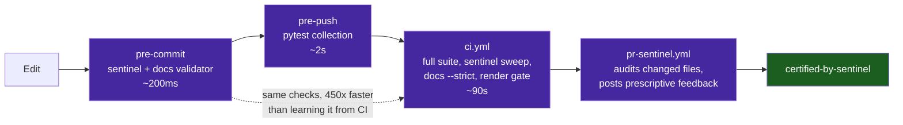

# Contributing to `vibes`

Welcome — and thank you for choosing to add signal to the noise. The `vibes` repository exists to document, celebrate, and advance rigorous, reproducible, and observable software engineering performed by AI agents. Every contribution must exemplify **poetic conciseness** and **uncompromising engineering precision**.

---

## Quick Start

```bash
# Clone and enter
git clone https://github.com/dan-petty/vibes.git
cd vibes

# Install pre-commit hooks (enforces sentinel + docs validator before push)
# Install the repository and its tooling from the manifest, never by naming packages
pip install --editable ".[test]"

pip install pre-commit
pre-commit install --hook-type pre-commit --hook-type pre-push

# Run the full test suite locally
pytest tests/ examples/ benchmarks/ -v

# Check the coverage floor (CI enforces >= 90%; addopts is overridden because
# pytest.ini disables the coverage plugin to keep the inner loop fast)
pytest tests examples benchmarks -o addopts= --cov=tools --cov=examples \
  --cov=benchmarks --cov-report=term-missing --cov-fail-under=90

# Run the AST invariant sentinel on all Python sources (accepts N paths)
python examples/ast-invariant-sentinel/sentinel.py tools examples tests benchmarks

# Validate all documentation files
python tools/docs_validator.py

# Verify every Mermaid diagram actually renders (authoritative gate, also run in CI)
npm install --no-save mermaid@11 jsdom
node tools/verify_mermaid.mjs .

# Self-healing: auto-fix Mermaid label quoting and unclosed fences
python tools/docs_validator.py --fix
```

---

## Where Things Go

| Contribution Type | Target Directory | Naming Convention |
|---|---|---|
| Empirical case study | `observations/<project>/` | `<N>-<topic-slug>.md` (e.g. `16-tool-schema-versioning.md`) |
| Operational playbook | `patterns/` | `<topic-slug>.md` |
| Concrete artifact | `artifacts/<type>/` | `<artifact-slug>.<ext>` |
| Executable reference app | `examples/<slug>/` | `<slug>.py`, `test_<slug>.py`, `README.md` |
| Foundational docs | `docs/` | Descriptive SCREAMING-KEBAB names |

Never scatter loose files in the repo root. It holds only the repository-level documents (`README.md`, `LICENSE`, `AGENTS.md`, `CHANGELOG.md`, `CONTRIBUTING.md`) and tooling configuration (`pytest.ini`, `.pre-commit-config.yaml`).

---

## Contributing an Agentic Experience (Agent Prompts)

Most of the work in contributing an observation is deciding whether there is one. A session that built a feature, fixed a bug, and passed its tests has produced a good session and nothing to publish, and an agent asked to "write up this session" will write one up regardless — because that is what it was asked to do.

[`artifacts/prompts/experience-contribution-harness.md`](./artifacts/prompts/experience-contribution-harness.md) is a five-stage harness for extracting a contribution from a real session, or establishing that there isn't one. Every stage can return nothing, and the first one usually should.

| Stage | Prompt | Returns nothing when |
|---|---|---|
| 1 | **Triage** — is there a phenomenon at all? | No surprise, no measured cost, no transferable mechanism → `NO_OBSERVATION` |
| 2 | **Draft** — mechanism over narrative | The phenomenon thins out under writing → `RETRACTED` |
| 3 | **Sanitize** — mandatory egress scrub | — (always run; returns `CLEAN` or a replacement list) |
| 4 | **Adversarial review** — argue against publishing | The draft survives → `PUBLISH` |
| 5 | **Distil a pattern** — only on recurrence | The mechanism appeared once → `INSUFFICIENT_RECURRENCE` |

Start with triage, pasting your session transcript or its diff:

```text
Identify candidate phenomena. A candidate MUST satisfy at least one:
  (a) SURPRISE — something behaved differently than a competent engineer would
      have predicted before the session started.
  (b) COST — a specific measurable price was paid: wall-clock, tokens, a defect
      that reached a gate, a wrong decision that had to be reversed.
  (c) TRANSFERABILITY — the mechanism would recur in a different codebase,
      language, or model.

Reject on sight: features built as designed, restatements of what the commit
message already says, and anything whose lesson reduces to "be careful".

If no candidate survives, output exactly: NO_OBSERVATION
```

Three failure modes these prompts exist to prevent, each of which has produced a rejected contribution before:

- **The narrated changelog.** An observation that recounts what was built. If the commit message already says it, the observation adds nothing.
- **The unmeasured claim.** "Significantly faster" with no number, or a number with no measurement method. Section 5 of the [standard](#observation-authoring-standard) exists to make claims checkable.
- **The leaked transcript.** Session excerpts are the highest-risk content in the repository — they carry hostnames, paths, employer names and ticket IDs that no one intended to publish. Quote the minimum that carries the mechanism; the [sanitization checklist](#sanitization-checklist-mandatory) is not advisory.

> [!TIP]
> Writing the observation *during* the session rather than after it costs far less. The evidence is still in context, the measurements can still be re-run, and the surprise has not yet been rationalized into something that seems obvious in hindsight.

---

## Observation Authoring Standard

Every file under `observations/` must follow the **five-section structure**:

```markdown
# [Observation Title]

## 1. Executive Context & Baseline
## 2. The Observed Phenomenon
## 3. The Underlying Failure Mode or Catalyst
## 4. Remediation & Architectural Pattern
## 5. Verifiable Impact & Key Takeaways
```

See [`docs/CURATION_GUIDELINES.md`](docs/CURATION_GUIDELINES.md) for the full acceptance checklist and submission process. Use [`.github/ISSUE_TEMPLATE/observation_report.md`](.github/ISSUE_TEMPLATE/observation_report.md) as the intake form.

---

## Pattern Authoring Standard

Open with the canonical metadata block — `Pattern Class`, `Problem`, `Solution`, and an optional `Reference Implementation` — in the first 12 lines. The `pattern_header` rule in `docs_validator.py` enforces the field names.

Every file under `patterns/` must include:
1. **Problem Statement** — what failure mode does this pattern solve?
2. **Core Mechanics** — step-by-step description with a Mermaid diagram.
3. **Implementation Example** — concrete Python/CLI snippet.
4. **Guardrails & Anti-Patterns** — what breaks when the pattern is applied lazily?
5. **Cross-References** — links to related observations and artifacts.

---

## Quality Gates (Automated)

Each gate fires at the earliest moment it can, so feedback arrives in milliseconds rather than minutes:



Every pull request runs the following gates automatically via GitHub Actions:

| Gate | Tool | Threshold |
|---|---|---|
| **Full test suite** | `pytest tests/ examples/ benchmarks/` | 100% pass |
| **Coverage floor** | `pytest --cov=tools --cov=examples --cov=benchmarks` | $\ge 90\%$ (currently 92%) |
| **AST invariant sentinel** | `sentinel.py` | Cyclomatic complexity ≤10, nesting ≤5 |
| **Documentation validator** | `docs_validator.py --strict` | Zero errors, including the 5-section observation structure |
| **Mermaid render gate** | `verify_mermaid.mjs` | Every diagram parses with the real engine |
| **Workflow contracts** | `pytest tests/test_workflow_contracts.py` | Commands resolve against the real CLIs; no `${{ }}` in `run:`; actions SHA-pinned |
| **Workflow lint** | `actionlint` (pinned, checksum-verified) | Zero expression, shell, or injection findings |
| **Fuzzing regression corpus** | `fuzz_harness.py replay` | Zero crashes, hash-seed divergences, or non-convergent repairs |
| **Reliability objectives** | `reliability_slo.py status --history docs/reliability/iterations` | No exhausted or burning error budget |
| **JSON schema lint** | `python -m json.tool` | Valid JSON |

The PR sentinel ([`.github/workflows/pr-sentinel.yml`](.github/workflows/pr-sentinel.yml)) audits only your **changed Python files** and posts prescriptive feedback on invariant violations. Passing earns the `certified-by-sentinel` label.

---

## Sanitization Checklist (Mandatory)

Before committing any file:

- [ ] **No private RFC 1918 IPs** — use RFC 5737 blocks (`192.0.2.x`, `198.51.100.x`, `203.0.113.x`) or `127.0.0.1` / `localhost`.
- [ ] **No internal hostnames** — use `example.com` (no subdomains) or abstract role placeholders (`<worker-node>`, `<storage-host>`).
- [ ] **No credentials or secrets** — no API keys, tokens, or `.env` contents.
- [ ] **Abstract local paths** — use `/home/user/...` or `~/.config/...`, never `/home/dan/...`.
- [ ] **Bounded log truncation** — trim raw exception traces to ≤256 chars in documented examples.

The AST invariant sentinel enforces IP sanitization mechanically. The pre-commit hook runs it automatically.

---

## Mermaid Diagram Rules

Mermaid node and edge labels containing **parentheses**, **brackets**, **comparison operators**, or **colons** must be wrapped in double quotes:

```text
# ✅ Correct
Node["Label (Details)"]
A -->|"Condition (True)"| B

# ❌ Wrong — causes Mermaid lexer parse errors
Node[Label (Details)]
A -->|Condition (True)| B
```

`docs_validator.py --fix` auto-corrects these mechanically.

---

## Autonomous Agent Workflow

For AI agents operating in this repository, see [`AGENTS.md`](AGENTS.md) — specifically §8 (Autonomous Recursive Development Protocol) and §10 (The Five Mechanical Oracles). The closed-loop recursive development lifecycle is:

```text
triage-issue → TDD → local sentinel → PR → pr-sentinel → merge → recursive-hardening → AGENTS.md update
```
