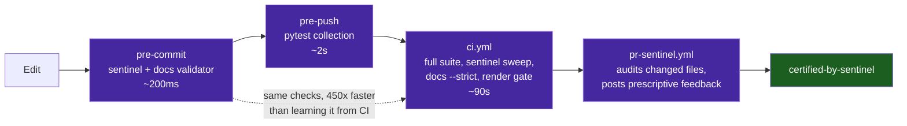

# Contributing to `vibes`

Welcome — and thank you for choosing to add signal to the noise. The `vibes` repository exists to document, celebrate, and advance rigorous, reproducible, and observable software engineering performed by AI agents. Every contribution must exemplify **poetic conciseness** and **uncompromising engineering precision**.

---

## Quick Start

```bash
# Clone and enter
git clone https://github.com/dan-petty/vibes.git
cd vibes

# Install pre-commit hooks (enforces sentinel + docs validator before push)
pip install pre-commit
pre-commit install --hook-type pre-commit --hook-type pre-push

# Run the full test suite locally
pytest tests/ examples/ benchmarks/ -v

# Run the AST invariant sentinel on all Python sources (accepts N paths)
python examples/ast-invariant-sentinel/sentinel.py tools examples tests benchmarks

# Validate all documentation files
python tools/docs_validator.py

# Verify every Mermaid diagram actually renders (authoritative gate, also run in CI)
npm install --no-save mermaid@11 jsdom
node tools/verify_mermaid.mjs .

# Self-healing: auto-fix Mermaid label quoting and unclosed fences
python tools/docs_validator.py --fix
```

---

## Where Things Go

| Contribution Type | Target Directory | Naming Convention |
|---|---|---|
| Empirical case study | `observations/<project>/` | `<N>-<topic-slug>.md` (e.g. `16-tool-schema-versioning.md`) |
| Operational playbook | `patterns/` | `<topic-slug>.md` |
| Concrete artifact | `artifacts/<type>/` | `<artifact-slug>.<ext>` |
| Executable reference app | `examples/<slug>/` | `<slug>.py`, `test_<slug>.py`, `README.md` |
| Foundational docs | `docs/` | Descriptive SCREAMING-KEBAB names |

Never scatter loose files in the repo root. Only `README.md`, `LICENSE`, and `AGENTS.md` live there.

---

## Observation Authoring Standard

Every file under `observations/` must follow the **five-section structure**:

```markdown
# [Observation Title]

## 1. Executive Context & Baseline
## 2. The Observed Phenomenon
## 3. The Underlying Failure Mode or Catalyst
## 4. Remediation & Architectural Pattern
## 5. Verifiable Impact & Key Takeaways
```

See [`docs/CURATION_GUIDELINES.md`](docs/CURATION_GUIDELINES.md) for the full acceptance checklist and submission process. Use [`.github/ISSUE_TEMPLATE/observation_report.md`](.github/ISSUE_TEMPLATE/observation_report.md) as the intake form.

---

## Pattern Authoring Standard

Every file under `patterns/` must include:
1. **Problem Statement** — what failure mode does this pattern solve?
2. **Core Mechanics** — step-by-step description with a Mermaid diagram.
3. **Implementation Example** — concrete Python/CLI snippet.
4. **Guardrails & Anti-Patterns** — what breaks when the pattern is applied lazily?
5. **Cross-References** — links to related observations and artifacts.

---

## Quality Gates (Automated)

Each gate fires at the earliest moment it can, so feedback arrives in milliseconds rather than minutes:



Every pull request runs the following gates automatically via GitHub Actions:

| Gate | Tool | Threshold |
|---|---|---|
| **Full test suite** | `pytest tests/ examples/ benchmarks/` | 100% pass |
| **AST invariant sentinel** | `sentinel.py` | Cyclomatic complexity ≤10, nesting ≤5 |
| **Documentation validator** | `docs_validator.py --strict` | Zero errors |
| **Observation structure** | `docs_validator.py --rule observation_structure` | All 5 sections present |
| **Mermaid render gate** | `verify_mermaid.mjs` | Every diagram parses with the real engine |
| **JSON schema lint** | `python -m json.tool` | Valid JSON |

The PR sentinel ([`.github/workflows/pr-sentinel.yml`](.github/workflows/pr-sentinel.yml)) audits only your **changed Python files** and posts prescriptive feedback on invariant violations. Passing earns the `certified-by-sentinel` label.

---

## Sanitization Checklist (Mandatory)

Before committing any file:

- [ ] **No private RFC 1918 IPs** — use RFC 5737 blocks (`192.0.2.x`, `198.51.100.x`, `203.0.113.x`) or `127.0.0.1` / `localhost`.
- [ ] **No internal hostnames** — use `example.com` (no subdomains) or abstract role placeholders (`<worker-node>`, `<storage-host>`).
- [ ] **No credentials or secrets** — no API keys, tokens, or `.env` contents.
- [ ] **Abstract local paths** — use `/home/user/...` or `~/.config/...`, never `/home/dan/...`.
- [ ] **Bounded log truncation** — trim raw exception traces to ≤256 chars in documented examples.

The AST invariant sentinel enforces IP sanitization mechanically. The pre-commit hook runs it automatically.

---

## Mermaid Diagram Rules

Mermaid node and edge labels containing **parentheses**, **brackets**, **comparison operators**, or **colons** must be wrapped in double quotes:

```text
# ✅ Correct
Node["Label (Details)"]
A -->|"Condition (True)"| B

# ❌ Wrong — causes Mermaid lexer parse errors
Node[Label (Details)]
A -->|Condition (True)| B
```

`docs_validator.py --fix` auto-corrects these mechanically.

---

## Autonomous Agent Workflow

For AI agents operating in this repository, see [`AGENTS.md`](AGENTS.md) — specifically §8 (Autonomous Recursive Development Protocol) and §10 (The Five Mechanical Oracles). The closed-loop recursive development lifecycle is:

```text
triage-issue → TDD → local sentinel → PR → pr-sentinel → merge → recursive-hardening → AGENTS.md update
```
