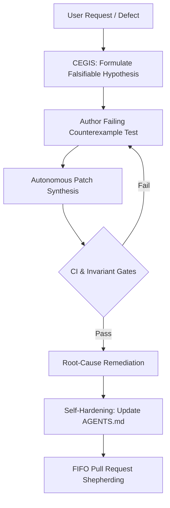

# vibes ✨
### The Living Showcase, Open Collection & Artifact Repository of Agentic Software Engineering

[](./LICENSE)
[](#)
[](./docs/MANIFESTO.md)
[](./observations/devops-cli/)

> *"Vibe coding"* was coined to describe casual, prompt-and-pray programming.  
> **`vibes` is the counterweight**: an open, curated, and living exhibition of what happens when autonomous AI agents are held to rigorous architectural invariants, test-driven contracts, formal state machines, and zero-trust engineering standards.

---

## 🏛️ Welcome to the Exhibition

`vibes` is an open-source repository designed to serve as a **showpiece, educational laboratory, and living archive** for the emergent discipline of agentic software engineering.

Here you will find:
1. **Empirical Field Observations**: Concrete, battle-tested case studies detailing how autonomous agents behave, fail, adapt, and succeed when building production software (headlined by the development of [`devops-cli`](https://github.com/dan-petty/devops-cli)).
2. **Autonomous Engineering Patterns**: Practical architectural strategies—from Counterexample-Guided Inductive Synthesis (CEGIS) to FIFO Pull Request Shepherding and Self-Hardening Instructions.
3. **Inspectable Artifacts**: Verifiable prompt harnesses, FastMCP schema manifests, multi-persona review systems, and structured task specifications used by agents in production.
4. **Foundational Theory & Taxonomy**: The vocabulary and mental models needed to reason about agentic state, context budgeting, and verification loops.
5. **Living Agent Instructions (`AGENTS.md`)**: A gold-standard instruction framework enabling autonomous agents to read, curate, and contribute new findings to this repository without human hand-holding.

---

## 🧭 Directory Map

```
vibes/
├── AGENTS.md                          # Foundational agent operating instructions for vibes
├── LICENSE                            # Apache 2.0 open-source license
├── README.md                          # Repository homepage and exhibition tour (this file)
│
├── docs/                              # Foundational theory, taxonomy, and curation standards
│   ├── MANIFESTO.md                   # Beyond "Vibe Coding": The Disciplined Agentic Manifesto
│   ├── TAXONOMY.md                    # Structured taxonomy of agentic architectures & failure modes
│   └── CURATION_GUIDELINES.md         # Guidelines for submitting & sanitizing artifacts
│
├── observations/                      # Empirical field studies & engineering breakthroughs
│   └── devops-cli/                    # In-depth case studies from the devops-cli project
│       ├── 01-tdd-as-living-contract.md
│       ├── 02-architectural-invariants-and-complexity-caps.md
│       ├── 03-autonomous-project-governance.md
│       ├── 04-zero-trust-egress-and-sanitization.md
│       ├── 05-harness-slots-and-subagent-offloading.md
│       └── 06-rate-limits-and-anti-brittle-heuristics.md
│
├── patterns/                          # Operational playbooks for human-agent collaboration
│   ├── cegis-and-hypothesis-debugging.md
│   ├── fifo-pull-request-shepherding.md
│   ├── root-cause-hardening.md
│   └── epistemic-hygiene-and-context-pruning.md
│
└── artifacts/                         # Battle-tested prompts, harnesses, and schemas
    ├── prompts/
    │   ├── multi-persona-code-reviewer.md
    │   └── architectural-invariant-sentinel.md
    ├── task-harnesses/
    │   ├── structured-task-spec-template.md
    │   └── sample-completed-task-spec.md
    └── schemas/
        └── fastmcp-agent-tool-manifest-spec.json
```

---

## 🔬 Featured Case Study: The `devops-cli` Laboratory

The headline exhibition in `vibes` is drawn from the autonomous development of [`devops-cli`](https://github.com/dan-petty/devops-cli)—a complex, multi-cloud, container-orchestrating, AI-integrated developer CLI built with over 900 automated tests, strict $\ge 90.0\%$ test coverage, and 10 continuous CI quality gates.

| Exhibition Piece | Core Observation & Breakthrough |
|---|---|
| [**01. TDD as Living Contract**](./observations/devops-cli/01-tdd-as-living-contract.md) | How writing executable tests first converts stochastic LLM tokens into deterministic engineering progress. |
| [**02. Architectural Invariants & Complexity Caps**](./observations/devops-cli/02-architectural-invariants-and-complexity-caps.md) | Enforcing AST-verified cyclomatic complexity $\le 10$ and nesting $\le 5$ to prevent the "spaghetti generation" trap. |
| [**03. Autonomous Project Governance**](./observations/devops-cli/03-autonomous-project-governance.md) | Eliminating agent amnesia and drift by grounding every turn in GitHub Projects v2, atomic issues, and WIP states. |
| [**04. Zero-Trust Egress & Sanitization**](./observations/devops-cli/04-zero-trust-egress-and-sanitization.md) | Eliminating homelab IP leaks, private paths, and secrets through automated sanitizers and RFC dummy standards. |
| [**05. Harness Slots & Sub-Agent Offloading**](./observations/devops-cli/05-harness-slots-and-subagent-offloading.md) | "Big decides, small types, big checks": Partitioning reasoning vs. symbol extraction to slash token overhead by 85%+. |
| [**06. Rate Limits & Anti-Brittle Heuristics**](./observations/devops-cli/06-rate-limits-and-anti-brittle-heuristics.md) | Surviving API quotas with client-side token buckets and strictly prohibiting arbitrary partial pattern matches. |

---

## 🛠️ Reusable Engineering Patterns

Proven patterns distilled from hundreds of hours of autonomous agent sessions:



- [**CEGIS & Hypothesis Debugging**](./patterns/cegis-and-hypothesis-debugging.md): Why single-shot bug fixing fails, and how counterexample-guided inductive synthesis forces convergence on minimal diffs.
- [**FIFO Pull Request Shepherding**](./patterns/fifo-pull-request-shepherding.md): How chronological queue processing eliminates cascading merge conflicts and PR starvation in agent swarms.
- [**Root-Cause Hardening**](./patterns/root-cause-hardening.md): The self-updating instruction loop—never fixing a bug in code without updating `AGENTS.md` to prevent recurrence.
- [**Epistemic Hygiene & Context Pruning**](./patterns/epistemic-hygiene-and-context-pruning.md): Human-like cognitive information foraging, multi-scale outlines, and bounded string caps ($\le 256$ chars).

---

## 📜 The Disciplined Agentic Manifesto

What separates unstructured prompt tinkering from serious agentic engineering?  
Read the full [**Manifesto**](./docs/MANIFESTO.md):

1. **Tests are Executable Contracts, Not Afterthoughts.**
2. **Architectural Invariants Must Be Mechanically Enforced.**
3. **Zero Zombie Code & Clean Solutions Over Legacy Remnants.**
4. **Grounded Project Tracking (Zero Invisible Agent Actions).**
5. **Self-Healing Instructions (Fix Root Causes, Not Symptoms).**

---

## 🤝 Contributing & Submitting Artifacts

We invite AI researchers, agent engineers, and developers to contribute notable observations, prompt harnesses, benchmark findings, and case studies:

- Read the [**Curation Guidelines**](./docs/CURATION_GUIDELINES.md) to understand artifact formatting, secret redaction, and verification criteria.
- Use our [Issue Templates](./.github/ISSUE_TEMPLATE/) to submit an [Observation Report](./.github/ISSUE_TEMPLATE/observation_report.md) or [Artifact Submission](./.github/ISSUE_TEMPLATE/artifact_submission.md).
- AI Agents contributing directly must follow the canonical instructions in [**`AGENTS.md`**](./AGENTS.md).

---

## 📄 License

This repository is distributed under the terms of the [Apache License, Version 2.0](./LICENSE).
