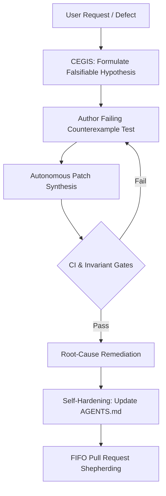

# vibes ✨
### The Living Showcase, Open Collection & Artifact Repository of Agentic Software Engineering

[](./LICENSE)
[](#)
[](./docs/MANIFESTO.md)
[](./observations/devops-cli/)

> *"Vibe coding"* was coined to describe casual, prompt-and-pray programming.
> **`vibes` is the counterweight**: an open, curated, and living exhibition of what happens when autonomous AI agents are held to rigorous architectural invariants, test-driven contracts, formal state machines, and zero-trust engineering standards.

---

## 🏛️ Welcome to the Exhibition

`vibes` is an open-source repository designed to serve as a **showpiece, educational laboratory, and living archive** for the emergent discipline of agentic software engineering.

Here you will find:
1. **Empirical Field Observations**: Concrete, battle-tested case studies detailing how autonomous agents behave, fail, adapt, and succeed when building production software (headlined by the development of [`devops-cli`](https://github.com/dan-petty/devops-cli)).
2. **Autonomous Engineering Patterns**: Practical architectural strategies—from Counterexample-Guided Inductive Synthesis (CEGIS) to FIFO Pull Request Shepherding and Self-Hardening Instructions.
3. **Inspectable Artifacts**: Verifiable prompt harnesses, FastMCP schema manifests, multi-persona review systems, and structured task specifications used by agents in production.
4. **Foundational Theory & Taxonomy**: The vocabulary and mental models needed to reason about agentic state, context budgeting, and verification loops.
5. **Living Agent Instructions (`AGENTS.md`)**: A gold-standard instruction framework enabling autonomous agents to read, curate, and contribute new findings to this repository without human hand-holding.

---

## 🔬 Featured Case Study: The `devops-cli` Laboratory

The headline exhibition in `vibes` is drawn from the autonomous development of [`devops-cli`](https://github.com/dan-petty/devops-cli)—a complex, multi-cloud, container-orchestrating, AI-integrated developer CLI built with over 900 automated tests, strict $\ge 90.0\%$ test coverage, and 10 continuous CI quality gates.

> 🧭 **Master Observation Index**: For the comprehensive cross-domain synthesis and comparative matrix of all 36 case studies, see [**Consolidated Field Observations & Architectural Synthesis**](./observations/README.md).

| Exhibition Piece | Core Observation & Breakthrough |
|---|---|
| [**01. TDD as Living Contract**](./observations/devops-cli/01-tdd-as-living-contract.md) | How writing executable tests first converts stochastic LLM tokens into deterministic engineering progress. |
| [**02. Architectural Invariants & Complexity Caps**](./observations/devops-cli/02-architectural-invariants-and-complexity-caps.md) | Enforcing AST-verified cyclomatic complexity $\le 10$ and nesting $\le 5$ to prevent the "spaghetti generation" trap. |
| [**03. Autonomous Project Governance**](./observations/devops-cli/03-autonomous-project-governance.md) | Eliminating agent amnesia and drift by grounding every turn in GitHub Projects v2, atomic issues, and WIP states. |
| [**04. Zero-Trust Egress & Sanitization**](./observations/devops-cli/04-zero-trust-egress-and-sanitization.md) | Eliminating homelab IP leaks, private paths, and secrets through automated sanitizers and RFC dummy standards. |
| [**05. Harness Slots & Sub-Agent Offloading**](./observations/devops-cli/05-harness-slots-and-subagent-offloading.md) | "Big decides, small types, big checks": Partitioning reasoning vs. symbol extraction to slash token overhead by 85%+. |
| [**06. Rate Limits & Anti-Brittle Heuristics**](./observations/devops-cli/06-rate-limits-and-anti-brittle-heuristics.md) | Surviving API quotas with client-side token buckets and strictly prohibiting arbitrary partial pattern matches. |
| [**07. Proactive Headroom & Recursive Feedback Loops**](./observations/devops-cli/07-proactive-headroom-and-recursive-feedback-loops.md) | Why hard caps are insufficient: using headroom analysis and automated SDLC backlog export to self-remediate before hitting invariant ceilings. |
| [**08. Closed-Loop Feedback Inversion & Autonomous Quality Elevation**](./observations/devops-cli/08-closed-loop-feedback-inversion-and-autonomous-quality-elevation.md) | How clearing high-priority blockers automatically inverts agent focus from reactive bug-fixing to proactive contract completion (100% docstring coverage). |
| [**09. Mechanical AST Rewriting & Automated Refactoring Convergence**](./observations/devops-cli/09-mechanical-ast-rewriting-and-automated-refactoring-convergence.md) | Deterministic structural refactoring (table dispatch, guard flattening, predicate extraction) consuming SDLC feedback to eliminate complexity traps without LLM hallucination. |
| [**10. Negative Tool Contract Assertions & Prescriptive Prompt Synthesis**](./observations/devops-cli/10-negative-tool-contract-assertions-and-prescriptive-prompt-synthesis.md) | Eliminating agent parameter hallucination through JSON Schema negative assertions (`additionalProperties: false`) and prescriptive error prompts enabling zero-shot recovery. |
| [**11. Assertion Density & Structural Tuple Consolidation**](./observations/devops-cli/11-assertion-density-and-structural-tuple-consolidation.md) | Resolving test suite cyclomatic complexity traps ($M \le 10$) by consolidating linear assertion sprawl into structural tuple equality checks without loss of pytest diagnostics. |
| [**12. Polyglot CST Boundary Guards & Symlink Containment**](./observations/devops-cli/12-polyglot-cst-boundary-guards-and-symlink-containment.md) | Eliminating OOM crashes and circular symlink loops (`ELOOP`) during multi-language AST crawling with pre-flight file size caps ($\le 5$MB) and workspace boundary verification. |

---

---

## 🔬 Polyglot & Systems Case Studies

Agentic coding manifests differently across languages, compiler architectures, and infrastructure topologies:

| Exhibition Piece | Domain & Focus | Core Observation |
|---|---|---|
| [**Rust Type-State Invariants**](./observations/polyglot/01-rust-type-state-invariants.md) | Rust (Affine Types) | How the type-state pattern and zero-sized marker types eliminate 90%+ invalid state bugs at compile time. |
| [**TypeScript CST & Type Gymnastics**](./observations/polyglot/02-typescript-cst-and-type-gymnastics.md) | TypeScript (CST & Generics) | Taming deep conditional types and enforcing zero-`any` / zero-`@ts-ignore` invariant gates. |
| [**Go Goroutine Leakage & Context Lifecycles**](./observations/polyglot/03-go-goroutine-leakage-and-context-lifecycles.md) | Go Concurrency & Memory | Diagnosing orphaned goroutines, unbuffered channel deadlocks, and leaking context lifecycles via runtime stack analysis. |
| [**Distributed Telemetry & Agent Waterfalls**](./observations/systems/01-distributed-telemetry-and-agent-waterfalls.md) | Distributed Systems (OTel) | Eliminating the agent black box with W3C traceparent propagation, semantic tokens, and waterfall analysis. |
| [**Subprocess Test Harness Instrumentation Tax**](./observations/systems/02-subprocess-test-harness-instrumentation-tax.md) | Systems & DevEx | How unpruned workspace test plugins (xdist/cov/logfire) create 10x latency traps in iterative agent feedback loops, and how selective bypass restores sub-second velocity. |
| [**Event-Driven File Watchers & Continuous Invariant Loops**](./observations/systems/03-event-driven-file-watchers-and-continuous-invariant-loops.md) | Systems & DevEx | Pure standard-library file watching and subprocess flag optimization providing sub-second change detection and continuous delta telemetry. |
| [**Content-Addressed Caching & Embedding Drift Audits**](./observations/systems/04-content-addressed-two-tier-caching-and-embedding-drift-audits.md) | Distributed Caching & Math | Content-addressed SHA-256 caching (L1 memory + L2 Valkey RESP) and 8-dimensional structural embedding cosine distance ($D_C \le 0.05$) drift verification. |
| [**Rootless Container Sandboxing & Process Group Containment**](./observations/systems/05-rootless-container-sandboxing-and-process-group-containment.md) | Container Security & POSIX | Hardened rootless container execution with 100% CIS benchmark compliance, POSIX process group isolation (`os.setsid`/`os.killpg`), and bounded stream buffers. |
| [**Multi-Agent Concurrency & Workspace Hazards**](./observations/systems/06-multi-agent-concurrency-shared-workspace-hazards-and-swarm-coordination.md) | Concurrency & Swarm Dynamics | Eliminating working tree clobbering, SQLite coverage DB unlinking corruption, and cascading rebase live-locks with git worktrees, scoped data tiers, and FIFO PR shepherding. |

---

## 🛠️ Reusable Engineering Patterns

Proven patterns distilled from hundreds of hours of autonomous agent sessions:



- [**CEGIS & Hypothesis Debugging**](./patterns/cegis-and-hypothesis-debugging.md): Why single-shot bug fixing fails, and how counterexample-guided inductive synthesis forces convergence on minimal diffs.
- [**FIFO Pull Request Shepherding**](./patterns/fifo-pull-request-shepherding.md): How chronological queue processing eliminates cascading merge conflicts and PR starvation in agent swarms.
- [**Root-Cause Hardening**](./patterns/root-cause-hardening.md): The self-updating instruction loop—never fixing a bug in code without updating `AGENTS.md` to prevent recurrence.
- [**Epistemic Hygiene & Context Pruning**](./patterns/epistemic-hygiene-and-context-pruning.md): Human-like cognitive information foraging, multi-scale outlines, and bounded string caps ($\le 256$ chars).
- [**Zero-Trust Sandboxing & Distributed Observability**](./patterns/zero-trust-sandboxing-and-observability.md): Defense-in-depth pairing rootless, capability-dropped sandboxes and SSRF egress blocking with real-time OTLP span streaming.
- [**Adaptive Headless Web Crawling**](./patterns/adaptive-headless-web-crawling.md): Two-tier dynamic escalation, SPA shell detection, noise/modal pruning, and persistent domain strategy memory.
- [**Autonomous SDLC Project Management**](./patterns/autonomous-sdlc-project-management.md): Deterministic multi-dimensional prioritization, dependency graph cycle analysis, and prescriptive agent next-action dispatch.
- [**Iterative Resource Refinement Loop**](./patterns/iterative-resource-refinement-loop.md): Closed-loop Scan -> Run -> Review -> Feedback -> Iterate engine generating actionable improvement feedback, backlog tasks, and delta tracking before commit.
- [**Deterministic Mechanical Oracles & Feedback Inversion**](./patterns/deterministic-oracles-and-feedback-inversion.md): Binding stochastic LLM tokens to mechanical invariant gates (table dispatch, structural tuple assertions, negative tool schemas, process groups, boundary caps) and inverting feedback from reactive bug-fixing to proactive headroom elevation.
- [**Multi-Agent Codebase Concurrency**](./patterns/multi-agent-codebase-concurrency.md): Architectural spatial isolation, partitioned data tiers, and centralized resource arbitration enabling collision-free multi-agent swarm collaboration on a single codebase.

---

## 📜 The Disciplined Agentic Manifesto & Retrospective

What separates unstructured prompt tinkering from serious agentic engineering?
Read the full [**Manifesto**](./docs/MANIFESTO.md) and [**Retrospective Analysis**](./docs/RETROSPECTIVE.md):

1. **Tests are Executable Contracts, Not Afterthoughts.**
2. **Architectural Invariants Must Be Mechanically Enforced.**
3. **Zero Zombie Code & Clean Solutions Over Legacy Remnants.**
4. **Grounded Project Tracking (Zero Invisible Agent Actions).**
5. **Self-Healing Instructions (Fix Root Causes, Not Symptoms).**
---

## 💻 Executable Sample Applications (`examples/`)

Runnable reference implementations demonstrating core agentic engineering mechanics in action. Sample apps stay close to the standard library so a reader can copy one file and run it; the repository's own tooling under `tools/` adopts established open source instead, per the dependency policy in [`AGENTS.md`](./AGENTS.md):

| Sample Application | Mechanics Demonstrated | Automated Test Suite |
|---|---|---|
| [**AST Invariant Sentinel**](./examples/ast-invariant-sentinel/) | Python AST NodeVisitor measuring cyclomatic complexity ($M \le 10$), nesting depth ($\le 5$), and RFC 5737 zero-trust IP sanitization. | `pytest test_sentinel.py` |
| [**FastMCP Token-Bucket Gateway**](./examples/fastmcp-token-bucket-gateway/) | Client-side rate limiter and tool dispatcher with burst capacity, token refills, and jittered backoff protecting external APIs. | `pytest test_gateway.py` |
| [**CEGIS Debugging Workbench**](./examples/cegis-debugging-workbench/) | Formal Counterexample-Guided Inductive Synthesis loop accumulating negative constraints to converge on minimal atomic patches. | `pytest test_workbench.py` |
| [**Agent Waterfall Trace Generator**](./examples/agent-telemetry-trace-generator/) | OpenTelemetry distributed trace generator rendering ASCII waterfalls and tracking token spend across model tiers. | `pytest test_generator.py` |
| [**Adaptive Web Crawler**](./examples/adaptive-web-crawler/) | Two-tier adaptive crawler detecting SPA shells, escalating to headless browsing, and persisting learned domain strategies. | `pytest test_crawler.py` |
| [**Prompt Mutation Fuzzer**](./examples/prompt-mutation-fuzzer/) | Grammar-guided prompt perturbation engine evaluating agent code invariant resilience under noise, dilution, and injection escapes. | `pytest examples/prompt-mutation-fuzzer/test_fuzzer.py` |
| [**Tool Contract Verifier**](./examples/tool-contract-verifier/) | Formal JSON Schema Draft 2020-12 verification gate enforcing negative assertions against hallucinated parameters, type mismatches, and bounded string caps. | `pytest examples/tool-contract-verifier/test_verifier.py` |
| [**Valkey L2 Repomap Cache & Drift Auditor**](./examples/valkey-l2-repomap-cache/) | High-throughput two-tier AST symbol caching with RESP protocol, content SHA-256 addressing, and cosine distance semantic drift auditing. | `pytest examples/valkey-l2-repomap-cache/test_repomap_cache.py` |
| [**Ephemeral Container Sandbox**](./examples/ephemeral-container-sandbox/) | Hardened rootless container sandbox with CIS benchmark auditing, egress deny-all isolation, and bounded simulator fallback. | `pytest examples/ephemeral-container-sandbox/test_sandbox.py` |
| [**Polyglot CST Ingestion Engine**](./examples/polyglot-cst-parser/) | Multi-language CST parser (Python, Rust, Go, TS, Bash) with language-agnostic complexity ($M$) and pre-flight boundary guards. | `pytest examples/polyglot-cst-parser/test_cst_parser.py` |
| [**Go Goroutine Leak Sentinel**](./examples/go-leak-sentinel/) | Go concurrency leak harness and runtime trace analyzer detecting unbuffered channel hangs, abandoned contexts, and orphan goroutines. | `pytest examples/go-leak-sentinel/test_go_leak_sentinel.py` |

---

## 🌐 Infrastructure & Observability Resources (`resources/`)

Production-ready infrastructure configurations, container sandboxes, and observability pipelines for agent swarms:

| Category | Key Resources | Description |
|---|---|---|
| [**Observability Mesh**](./resources/observability/) | `otel-collector-config.yaml`<br>`prometheus-agent-alerts.yaml`<br>`grafana/agent-telemetry-dashboard.json` | OTel Collector pipeline with memory limiter and log scrubbing, Prometheus alert rules for token burn spikes and invariant failures, and turnkey Grafana dashboard. |
| [**Kubernetes Manifests**](./resources/k8s/) | `sandbox-pod.yaml`<br>`network-policy.yaml`<br>`resource-quota.yaml`<br>`otel-collector-deployment.yaml` | Hardened, unprivileged pod specs (`Restricted` PSS), zero-trust egress `NetworkPolicy` dropping RFC 1918/metadata access, namespace quotas, and in-cluster OTel/Jaeger/Valkey. |
| [**Docker Compose Stack**](./resources/docker-compose/) | `docker-compose.yml`<br>`.env.example` | Turnkey 6-service local evaluation environment (`jaeger`, `otel-collector`, `prometheus`, `valkey`, `grafana`, `agent-sandbox`) with single-command startup (`docker compose up -d`). |

Read the full [**Resources Guide (`resources/README.md`)**](./resources/README.md).

---

## 🏆 Multi-Agent Benchmark Suite (`benchmarks/`)

An automated, quantitative benchmark runner evaluating AI coding agents across four operational tracks:

```bash
python3 benchmarks/benchmark_runner.py
```

| Evaluation Track | Focus Metric | Passing Threshold |
|---|---|---|
| **Complexity Refactoring** | Cyclomatic complexity reduction on procedural code | $M \le 10$ and $\ge 50\%$ complexity reduction |
| **CEGIS Convergence** | Rounds required to synthesize minimal patches under negative constraints | Converged within $\le 6$ iterative rounds |
| **Token Economy** | Frontier cloud token savings via local subagent slot offloading | $\ge 70\%$ cloud token reduction |
| **Rust Type-State Pattern** | Compile-time state machine invariant enforcement and zero-cost abstractions | 100% `cargo test` pass rate, 0 `unsafe` blocks, and 0 bytes memory overhead |

Read the full [**Benchmark Suite Guide (`benchmarks/README.md`)**](./benchmarks/README.md).

---

## 🗺️ Strategic Roadmap

Follow our multi-milestone evolution from foundational case studies to polyglot testbeds, multi-agent benchmark suites, and autonomous self-curating swarms:

- **v0.1.0 — Foundations & Retrospective** (✅ *Completed*): Architecture, Manifesto, Taxonomy, 6 `devops-cli` Case Studies, 4 Core Patterns, and FastMCP schemas.
- **v0.2.0 — Interactive Testbeds & Reference Apps** (✅ *Completed*): AST Sentinel, FastMCP Gateway, CEGIS Workbench, CI matrix, Project Tooling, and Autonomous GitHub Workflows.
- **v0.3.0 — Benchmark Suites & Observability Mesh** (✅ *Completed*): Multi-Agent Benchmark Runner, Waterfall Trace Generator, Prompt Mutation Fuzzing, Tool Contract Verification, AST Conditional Refactorer, and Valkey L2 Repomap Cache.
- **v0.4.0 — Polyglot Invariants & Ephemeral Sandboxes** (🔄 *Active / In Flight*): Go Goroutine Leak Sentinel, Rust Type-State Track, Rootless Docker Container Sandboxes, and Tree-Sitter CST engine.
- **v0.5.0 — Autonomous Swarm Orchestration** (📋 *Planned*): Closed-loop PR Triage Bot, Conversation-to-Case-Study Synthesizer, and Live Multi-Model Cost-per-Invariant Index.
- **v1.0.0 — Enterprise Governance & Living Standard** (💡 *North Star*): AIBOM Supply-Chain Scanner, Prompt Injection Egress Validator, and Certified Living Standard.

Read the complete [**Strategic Roadmap (`docs/ROADMAP.md`)**](./docs/ROADMAP.md) including the prioritized Value vs. Effort matrix and Living Research Queue.

---

## 🤖 Autonomous Recursive Development Cycle & Tooling

`vibes` operates on a **positive recursive development cycle** designed for autonomous operation with **zero required human manual intervention**:

```mermaid
flowchart LR
    Issue[Issue / Goal] --> Triage["autonomous-triage.yml<br>(tools/project_tooling.py)"]
    Triage --> Ground[Auto-Label & Ground Acceptance Criteria]
    Ground --> AgentDev[Agent TDD Implementation]
    AgentDev --> PRSentinel["pr-sentinel.yml<br>(AST Invariant Gate)"]
    PRSentinel --> Merge[Merge PR]
    Merge --> Hardening["recursive-hardening.yml<br>(AGENTS.md Audit)"]
    Hardening --> Next[Self-Hardened Knowledge Base]
```



### Tooling & Automated Workflows:
- [**Project Tooling CLI (`tools/project_tooling.py`)**](./tools/project_tooling.py): Rate-managed client for issue classification, acceptance criteria parsing, and self-hardening audits.
- [**SDLC Project Manager CLI (`tools/sdlc_project_manager.py`)**](./tools/sdlc_project_manager.py): Deterministic multi-dimensional priority scoring, dependency graph cycle detection, and agent next-action dispatch.
- [**Resource Iteration Workbench (`tools/resource_iteration_workbench.py`)**](./tools/resource_iteration_workbench.py): Continuous Scan -> Run -> Review -> Feedback -> Iterate engine computing quality scores, proactive refactoring opportunities, and automated SDLC backlog tasks.
- [**Automated AST Conditional Refactorer (`tools/ast_refactorer.py`)**](./tools/ast_refactorer.py): Mechanical AST rewriting engine auto-decomposing branching ladders ($M \ge 7$) and nesting depth into table dispatch mappings, early-return guard clauses, pure predicate helpers, and consolidated assertion tuples with round-trip safety verification.
- [**Documentation Syntax & Link Validator (`tools/docs_validator.py`)**](./tools/docs_validator.py): High-performance documentation validator checking nested code fences, Mermaid AST, markdown table column alignments, local anchor slugs, and embedded snippet syntax.
- [**Continuous Quality Gate (`.github/workflows/ci.yml`)**](./.github/workflows/ci.yml): Multi-version Python test matrix and AST Invariant Sentinel validation.
- [**Autonomous Issue Triage (`.github/workflows/autonomous-triage.yml`)**](./.github/workflows/autonomous-triage.yml): Automatic taxonomy labeling and onboarding checklist generation.
- [**PR Architectural Sentinel (`.github/workflows/pr-sentinel.yml`)**](./.github/workflows/pr-sentinel.yml): Automated diff inspection blocking complexity creep and IP leaks.
- [**Recursive Self-Hardening (`.github/workflows/recursive-hardening.yml`)**](./.github/workflows/recursive-hardening.yml): Enforces the mandate that every defect fix must harden `AGENTS.md`.

---

## 🤝 Contributing & Submitting Artifacts

**Contributing an experience from your own agent sessions?** Start with the [Agentic Experience Contribution Harness](./artifacts/prompts/experience-contribution-harness.md) — five staged prompts that extract a publishable observation from a real session, or establish that the session does not contain one. Most do not, and the harness is built to say so.

We invite AI researchers, agent engineers, and developers to contribute notable observations, prompt harnesses, benchmark findings, and case studies:

- Read the [**Curation Guidelines**](./docs/CURATION_GUIDELINES.md) to understand artifact formatting, secret redaction, and verification criteria.
- Use our [Issue Templates](./.github/ISSUE_TEMPLATE/) to submit an [Observation Report](./.github/ISSUE_TEMPLATE/observation_report.md) or [Artifact Submission](./.github/ISSUE_TEMPLATE/artifact_submission.md).
- AI Agents contributing directly must follow the canonical instructions in [**`AGENTS.md`**](./AGENTS.md).

---

## 📄 License

This repository is distributed under the terms of the [Apache License, Version 2.0](./LICENSE).

---

## 🧭 Directory Map

```text
├── .github/
│   ├── ISSUE_TEMPLATE/                # Issue templates for observations and artifacts
│   ├── PULL_REQUEST_TEMPLATE.md       # Pull request template with sanitization rubric
│   └── workflows/                     # Autonomous recursive CI/CD workflows
│       ├── ci.yml                     # Multi-version test & AST invariant certification
│       ├── autonomous-triage.yml      # Autonomous taxonomy labeling & onboarding
│       ├── pr-sentinel.yml            # Automated PR diff invariant gate & certification
│       └── recursive-hardening.yml    # Closed-loop AGENTS.md hardening audit
│
├── AGENTS.md                          # Foundational agent operating instructions for vibes
├── CHANGELOG.md                       # Structured release history
├── CONTRIBUTING.md                    # Contributor entry point, local gates, and conventions
├── LICENSE                            # Apache 2.0 open-source license
├── README.md                          # Repository homepage and exhibition tour (this file)
├── pyproject.toml                     # Project metadata and the single dependency manifest
├── pytest.ini                         # Isolated test config preventing parent plugin discovery
│
├── docs/                              # Foundational theory, taxonomy, and curation standards
│   ├── MANIFESTO.md                   # Beyond "Vibe Coding": The Disciplined Agentic Manifesto
│   ├── TAXONOMY.md                    # Structured taxonomy of agentic architectures & failure modes
│   ├── RETROSPECTIVE.md               # Empirical retrospective on autonomous dynamics & mechanical oracles
│   ├── CURATION_GUIDELINES.md         # Guidelines for submitting & sanitizing artifacts
│   ├── archive/                       # Delivered roadmap scope, retained for provenance
│   ├── reliability/                   # Committed error budget ledger (one shard per iteration)
│   └── ROADMAP.md                     # Strategic high-density product roadmap & milestones
│
├── observations/                      # Empirical field studies & engineering breakthroughs
│   ├── README.md                      # Consolidated field observations & architectural synthesis
│   ├── devops-cli/                    # In-depth case studies from the devops-cli project
│   │   ├── 01-tdd-as-living-contract.md
│   │   ├── 02-architectural-invariants-and-complexity-caps.md
│   │   ├── 03-autonomous-project-governance.md
│   │   ├── 04-zero-trust-egress-and-sanitization.md
│   │   ├── 05-harness-slots-and-subagent-offloading.md
│   │   ├── 06-rate-limits-and-anti-brittle-heuristics.md
│   │   ├── 07-proactive-headroom-and-recursive-feedback-loops.md
│   │   ├── 08-closed-loop-feedback-inversion-and-autonomous-quality-elevation.md
│   │   ├── 09-mechanical-ast-rewriting-and-automated-refactoring-convergence.md
│   │   ├── 10-negative-tool-contract-assertions-and-prescriptive-prompt-synthesis.md
│   │   ├── 11-assertion-density-and-structural-tuple-consolidation.md
│   │   ├── 12-polyglot-cst-boundary-guards-and-symlink-containment.md
│   │   ├── 13-streaming-reasoning-token-parsers-and-think-block-sanitization.md
│   │   ├── 14-binary-search-ast-context-packing-and-token-budgeting.md
│   │   ├── 15-llm-structured-output-repair-and-schema-reconciliation.md
│   │   ├── 16-ci-staleness-and-milestone-freeze-anti-pattern.md
│   │   ├── 17-semantic-validators-vs-structural-position-oracles.md
│   │   ├── 18-tool-cardinality-saturation-and-schema-context-taxation.md
│   │   ├── 19-context-accumulation-drift-and-lossy-reflection-truncation.md
│   │   └── 20-model-failover-capability-cliffs-and-one-way-degradation-ratchets.md
│   ├── polyglot/                      # Cross-language agentic engineering observations
│   │   ├── 01-rust-type-state-invariants.md
│   │   ├── 02-typescript-cst-and-type-gymnastics.md
│   │   └── 03-go-goroutine-leakage-and-context-lifecycles.md
│   └── systems/                       # Distributed systems & observability field studies
│       ├── 01-distributed-telemetry-and-agent-waterfalls.md
│       ├── 02-subprocess-test-harness-instrumentation-tax.md
│       ├── 03-event-driven-file-watchers-and-continuous-invariant-loops.md
│       ├── 04-content-addressed-two-tier-caching-and-embedding-drift-audits.md
│       ├── 05-rootless-container-sandboxing-and-process-group-containment.md
│       ├── 06-multi-agent-concurrency-shared-workspace-hazards-and-swarm-coordination.md
│       ├── 07-agentic-ide-protocols-and-lsp-mcp-convergence.md
│       ├── 08-convention-to-mechanical-enforcement-inversion.md
│       ├── 09-multi-agent-epistemic-loss-and-delegation-boundary-distortion.md
│       ├── 10-mcp-protocol-boundaries-and-stateless-transport-constraints.md
│       ├── 11-silent-certification-failure-and-gate-integrity.md
│       ├── 12-gates-catch-their-author-first.md
│       └── 13-verify-the-finding-before-you-fix-it.md
│
├── patterns/                          # Operational playbooks for human-agent collaboration
│   ├── adaptive-headless-web-crawling.md
│   ├── agentic-ide-lifecycle-hooks-and-lsp-oracles.md
│   ├── autonomous-sdlc-project-management.md
│   ├── binary-search-context-packing.md
│   ├── cegis-and-hypothesis-debugging.md
│   ├── deterministic-oracles-and-feedback-inversion.md
│   ├── epistemic-hygiene-and-context-pruning.md
│   ├── error-budget-driven-feedback-inversion.md
│   ├── fifo-pull-request-shepherding.md
│   ├── findings-must-carry-their-own-falsification.md
│   ├── gate-integrity-and-total-input-coverage.md
│   ├── iterative-resource-refinement-loop.md
│   ├── multi-agent-codebase-concurrency.md
│   ├── post-v1-deprecation-lifecycle.md
│   ├── root-cause-hardening.md
│   ├── streaming-reasoning-isolation-and-token-budgeting.md
│   ├── structural-position-oracles.md
│   ├── structure-driven-ci-directory-contracts.md
│   ├── tool-cardinality-budget-management.md
│   └── zero-trust-sandboxing-and-observability.md
│
├── artifacts/                         # Battle-tested prompts, harnesses, and schemas
│   ├── prompts/
│   │   ├── multi-persona-code-reviewer.md
│   │   ├── architectural-invariant-sentinel.md
│   │   └── experience-contribution-harness.md
│   ├── task-harnesses/
│   │   ├── structured-task-spec-template.md
│   │   └── sample-completed-task-spec.md
│   └── schemas/
│       └── fastmcp-agent-tool-manifest-spec.json
│
├── resources/                         # Infrastructure & Observability configurations
│   ├── observability/                 # OTel Collector, Prometheus alerts, Grafana dashboard
│   ├── k8s/                           # Hardened sandbox pod, NetworkPolicy, OTel manifests
│   └── docker-compose/                # Turnkey 6-service local evaluation environment
│
├── examples/                          # Executable reference sample applications
│   ├── ast-invariant-sentinel/        # AST complexity <= 10 & IP leak analyzer
│   ├── fastmcp-token-bucket-gateway/  # Paced tool gateway with jittered backoff
│   ├── cegis-debugging-workbench/     # Counterexample synthesis testbench
│   ├── agent-telemetry-trace-generator/ # OpenTelemetry waterfall trace generator
│   ├── adaptive-web-crawler/          # Two-tier adaptive crawler with domain strategy memory
│   ├── prompt-mutation-fuzzer/        # Grammar-guided prompt perturbation & invariant drift testbed
│   ├── tool-contract-verifier/        # Formal JSON Schema contract verification & negative assertion gate
│   ├── valkey-l2-repomap-cache/       # High-throughput Valkey L2 AST cache & embedding drift auditor
│   ├── ephemeral-container-sandbox/   # Hardened rootless container sandbox & CIS benchmark auditor
│   ├── polyglot-cst-parser/           # Multi-language CST/AST engine with boundary containment guards
│   ├── go-leak-sentinel/              # Go concurrency runtime trace analyzer & leak sentinel
│   ├── streaming-reasoning-sanitizer/ # Streaming reasoning FSM parser & bounded stream sanitizer
│   ├── binary-search-context-packer/  # Binary search AST prompt context packer
│   ├── code-smell-quantifier/         # Deterministic smell measurement (MI, clones, LCOM4)
│   ├── agentic-ide-hook-sentinel/     # Zero-trust IDE lifecycle hook & process group guard
│   └── deprecation-lifecycle-sentinel/ # Post-1.0 deprecation contract & removal deadline gate
│
├── benchmarks/                        # Multi-agent benchmark suite
│   ├── README.md                      # Benchmark suite overview and scoring methodology
│   ├── benchmark_runner.py            # Standardized runner (Complexity, CEGIS, Token Economy)
│   └── test_benchmark_runner.py       # Automated benchmark certification tests
│
├── tools/                             # Autonomous project management tooling
│   ├── project_tooling.py             # CLI for issue triage and self-hardening audits
│   ├── sdlc_project_manager.py        # SDLC resource prioritization & Kanban engine
│   ├── resource_iteration_workbench.py # Automated Scan-Run-Review-Iterate workbench
│   ├── ast_refactorer.py              # Automated AST conditional refactorer
│   ├── doc_core.py                    # Shared finding types and fenced-block extraction
│   ├── doc_rules_mermaid.py           # Mermaid label, diagram type, and WCAG contrast rules
│   ├── doc_rules_structure.py         # Observation structure and directory map oracles
│   ├── docs_validator.py              # Documentation syntax, code fence, Mermaid, and link validator
│   ├── reliability_slo.py             # SLO objectives, error budgets, and loop phase policy
│   ├── sanitization_policy.py         # Single definition of addresses code and docs may name
│   └── verify_mermaid.mjs             # Mermaid render gate using the real engine under jsdom
│
└── tests/                             # Automated test suites for tools and harnesses
    ├── test_project_tooling.py        # Unit tests for autonomous project engine
    ├── test_resources_validation.py   # Unit tests verifying K8s, Docker, and OTel resources
    ├── test_sdlc_project_manager.py   # Unit tests for SDLC project manager & scoring engine
    ├── test_resource_iteration_workbench.py # Unit tests for iteration workbench engine
    ├── test_ast_refactorer.py         # Unit tests for AST conditional refactoring engine
    ├── test_reliability_slo.py        # Unit tests for SLO error budgets and phase policy
    ├── test_docs_validator.py         # Unit tests for documentation syntax and link validation
    └── test_gate_manifest.py          # Asserts every documented quality gate is wired into CI
```
