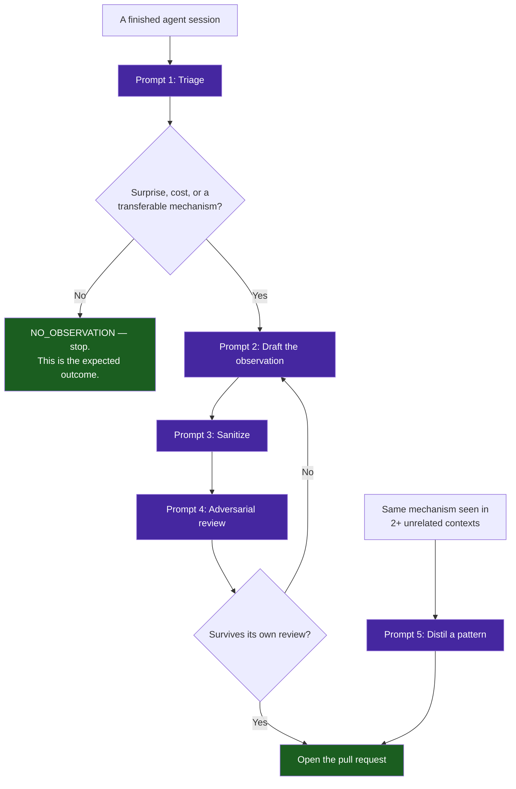

# Artifact: Agentic Experience Contribution Harness

> **Artifact Type**: Prompt Harness (four staged prompts)
> **Source Project**: `vibes` (this repository)
> **Purpose**: Turn a real agent session into a publishable observation or pattern — or establish that it contains nothing worth publishing.

---

## Why This Harness Exists

The hard part of contributing to `vibes` is not the markdown template. It is extraction: separating the two paragraphs of a session that are worth recording from the several hours that are not, and being willing to conclude that a session contains nothing at all.

Most sessions contain nothing. An agent asked to "write an observation about this session" will always produce one, because that is what it was asked for, and the result is a document that restates what the code already says. The roadmap lists *toy demos* and *unsanitized transcript dumps* among its rejected anti-patterns; a corpus of filler observations is the same failure with better formatting.

Each prompt below therefore carries an explicit refusal clause. **A harness that never returns "nothing here" is not a filter.**



---

## Prompt 1 — Triage: Is There Anything Here?

Run this first, against the session transcript or the diff it produced. Its default answer is no.

```text
You are triaging one completed AI agent session for the `vibes` repository, an
archive of empirical observations about agentic software engineering.

<input>
${SESSION_TRANSCRIPT_OR_DIFF}
</input>

Identify candidate phenomena. A candidate MUST satisfy at least one:
  (a) SURPRISE — something behaved differently than a competent engineer would
      have predicted before the session started.
  (b) COST — a specific measurable price was paid: wall-clock, tokens, a defect
      that reached a gate, a wrong decision that had to be reversed.
  (c) TRANSFERABILITY — the mechanism would recur in a different codebase,
      language, or model, and is not a property of this project's specifics.

A candidate is NOT any of the following, and you must reject each on sight:
  - A feature that was built, or a bug that was fixed, working as designed.
  - A restatement of what the code, tests, or commit messages already say.
  - "The agent followed the instructions and the instructions were good."
  - Anything whose lesson reduces to "be careful" or "write more tests".
  - A phenomenon you cannot ground in a specific artifact: a file and line, a
    command and its output, a measured number, or a commit.

For each surviving candidate output exactly:
  PHENOMENON: <one sentence, stating what happened, not what it means>
  EVIDENCE:   <file:line, command output, or metric that proves it occurred>
  CRITERION:  SURPRISE | COST | TRANSFERABILITY
  NON_OBVIOUS: <why a competent engineer would not have predicted this>

If no candidate survives, output exactly: NO_OBSERVATION

Most sessions produce NO_OBSERVATION. That is the expected outcome and is never
a failure of the session or of your analysis. Do not lower the bar to return a
result.
```

---

## Prompt 2 — Draft: Mechanism Over Narrative

Run only on candidates that survived triage.

```text
Write one `vibes` observation for the phenomenon below.

<phenomenon>${TRIAGE_OUTPUT}</phenomenon>
<evidence>${TRANSCRIPT_EXCERPTS_AND_METRICS}</evidence>

Structure — exactly these five numbered sections, no others:
  ## 1. Executive Context & Baseline
  ## 2. The Observed Phenomenon
  ## 3. The Underlying Failure Mode or Catalyst
  ## 4. Remediation & Architectural Pattern
  ## 5. Verifiable Impact & Key Takeaways

Hard requirements:
  1. Section 3 must explain the MECHANISM — why this had to happen given how the
     system is built. "The model hallucinated" is not a mechanism. "The tool
     schema permitted undeclared arguments, so an invalid call was indistinguish-
     able from a valid one until execution" is a mechanism.
  2. Every quantitative claim carries its measurement. Not "much faster" but
     "20.1s to 11.4s, two runs each". If you did not measure it, do not claim it.
  3. Section 4 states what was actually done, not what could be done. If the
     remediation was never implemented, say so explicitly.
  4. Prefer the diagram type that carries the mechanism: `stateDiagram-v2` for
     irreversible transitions, `sequenceDiagram` for exchanges between parties,
     `flowchart` otherwise. Omit the diagram if prose is clearer. Quote every
     label containing parentheses, brackets, or comparison operators.
  5. No semicolons inside `sequenceDiagram` text; Mermaid reads them as
     statement separators and truncates the line.

Forbidden:
  - Adjectives standing in for measurements ("dramatically", "significantly").
  - Any claim about a model's internal reasoning or intent.
  - Advice that would be true of any codebase on any day.
  - Restating section 2 in section 5 with different words.

If, while writing, the phenomenon turns out to be thinner than triage suggested,
stop and output: RETRACTED: <reason>. Withdrawing a candidate is cheaper than
publishing filler, and reviewers cannot un-read a weak observation.
```

---

## Prompt 3 — Sanitize: Mandatory Before Every Commit

```text
Audit the document below for egress violations against the `vibes` zero-leakage
mandate. Report every hit with its line number and a concrete replacement.

<document>${DRAFT}</document>

Reject and replace:
  1. Private RFC 1918 addresses (10/8, 172.16/12, 192.168/16) → RFC 5737
     documentation blocks (192.0.2.0/24, 198.51.100.0/24, 203.0.113.0/24) or
     127.0.0.1.
  2. Internal hostnames (*.lan, *.local, machine names, internal DNS suffixes) →
     `example.com` or an abstract role such as <worker-node>, <storage-host>.
  3. Invented subdomains (api.example.com, vault.example.com) → bare
     `example.com`. Subdomains are prohibited even for mock values.
  4. Absolute local paths (/home/<user>/..., /Users/..., /mnt/...) → `~/...` or
     an abstract placeholder.
  5. Any content sourced from `.env*`, `.ssh/`, `.data/`, credentials, tokens,
     or keys — including values that merely look like them.
  6. Non-standard local ports and private registry endpoints → `localhost:<port>`
     or `ghcr.io/<org>/<image>:<tag>`.
  7. Employer names, client names, ticket identifiers, and colleague names.

A transcript excerpt is the highest-risk content in any observation. Quote the
minimum that carries the mechanism, and paraphrase the rest.

Output: CLEAN, or a numbered list of line, violation, and replacement.
```

---

## Prompt 4 — Adversarial Review: Argue Against Publishing

```text
You are reviewing a candidate `vibes` observation. Your default position is that
it should NOT be published. Make the strongest case against it.

<document>${SANITIZED_DRAFT}</document>

Attack in this order, and state a verdict for each:
  1. Is the phenomenon real, or an artifact of how it was measured? Could a
     different measurement have shown nothing? (A surprising number of findings
     are properties of the instrument, not of the system.)
  2. Is section 3 a mechanism, or a restatement of section 2 with "because"?
  3. Does every number carry its measurement method? Name each that does not.
  4. Would this transfer to another codebase, or is it a fact about this project?
  5. Does section 5 add anything section 2 did not already say?
  6. Is there a shorter document — three paragraphs — that carries the same
     information? If so, that document is the contribution.

Then, and only then, state what is genuinely worth keeping.

Verdict: PUBLISH | REVISE: <specific changes> | REJECT: <reason>
```

---

## Prompt 5 — Distil a Pattern (Only on Recurrence)

An observation records one occurrence. A pattern requires a repeat, and a single dramatic incident is not one.

```text
Propose a `vibes` pattern from the observations below.

<observations>${TWO_OR_MORE_OBSERVATION_PATHS_AND_SUMMARIES}</observations>

Preconditions — verify each before writing, and abort if any fails:
  1. The same MECHANISM (not merely the same symptom) appears in at least two
     unrelated contexts. Different projects, languages, or subsystems.
  2. A reader facing the failure could act on the pattern without having read
     the originating observations.
  3. No existing file in `patterns/` already covers it. Check before writing; an
     overlapping pattern is worse than none, because it splits the guidance.

Structure:
  ## Problem Statement      — the failure mode, not the solution
  ## Core Mechanics         — numbered steps, with a diagram
  ## Implementation Example — real code or commands, not pseudocode
  ## Guardrails & Anti-Patterns — what breaks when applied lazily or too widely
  ## Cross-References       — the observations that originated it

State the pattern's limits explicitly. A pattern with no stated failure
conditions is advice, and advice does not survive contact with a codebase that
differs from the one it was written in.

If the preconditions fail, output: INSUFFICIENT_RECURRENCE: <which precondition>
```

---

## Running the Harness

```bash
# 1. Triage. Expect NO_OBSERVATION most of the time.
# 2. Draft only what survives.
# 3. Sanitize before the file is ever written to disk.
# 4. Review adversarially, revise, repeat.
# 5. Then verify mechanically — the gates are not optional:
python3 tools/docs_validator.py observations/<project>/<nn>-<slug>.md --strict
python3 tools/docs_validator.py --rule observation_structure observations/
node tools/verify_mermaid.mjs observations/
python3 examples/ast-invariant-sentinel/sentinel.py observations/
```

The sentinel runs against documentation too: it detects private IP addresses and non-standard mock domains in any file it is handed, which is the mechanical half of Prompt 3.

> [!IMPORTANT]
> These prompts are deliberately biased toward rejection. The value of this archive is the ratio of signal it carries, and that ratio is set entirely by what does not get written.
