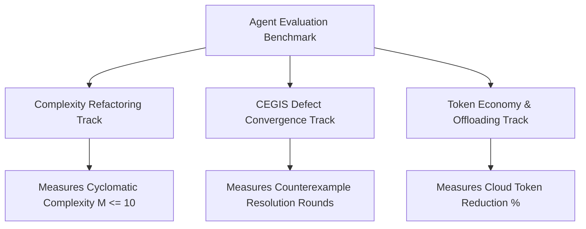

# Multi-Agent Benchmark Suite (`benchmarks/`)

Standardized, reproducible benchmarks designed to measure and compare autonomous AI coding assistants across three critical operational axes:



---

## Benchmark Tracks

### Complexity Refactoring Track (`ComplexityRefactoring`)
- **Focus**: Evaluates the agent's ability to eliminate nested procedural ladders (`if/elif/else` anti-patterns) and refactor into functional pipelines, dictionary dispatch tables, or pure helper predicates.
- **Pass Criteria**: Final cyclomatic complexity $M \le 10$, nesting depth $\le 5$, and minimum 50% complexity reduction compared to baseline.

### CEGIS Defect Convergence Track (`CEGISConvergence`)
- **Focus**: Measures convergence velocity when debugging complex edge cases under formal negative constraints (CEGIS). Penalizes superficial symptom masking (`try/except: pass`) and rewards minimal atomic patches.
- **Pass Criteria**: Deterministic convergence across all test cases within $\le 6$ iterative rounds.

### Token Economy Efficiency Track (`TokenEconomy`)
- **Focus**: Evaluates token consumption and cost efficiency by comparing monolithic frontier model prompting against multi-tier swappable harness slots ("Big decides, small types, big checks").
- **Pass Criteria**: Minimum 70% reduction in frontier cloud tokens by offloading mechanical symbol extraction and AST parsing to local open-weight models.

### Rust Type-State Pattern Track (`RustTypeState`)
- **Focus**: Evaluates the agent's capability to synthesize memory-safe, zero-cost state machine abstractions in Rust using affine types, zero-sized markers (`Unauthenticated`, `Authenticated`, `Connected`, `Closed`), and `#![forbid(unsafe_code)]`.
- **Pass Criteria**: 100% passing `cargo test` suite, 0 `unsafe` blocks, and 0 runtime memory overhead (`size_of::<State>() == 0`).

---

## Quick Start

### Run the Benchmark Suite (Terminal Scorecard)
```bash
python3 benchmark_runner.py
```

### Run with JSON Output
```bash
python3 benchmark_runner.py --json
```

### Run the Automated Tests
```bash
pytest test_benchmark_runner.py -v
```
