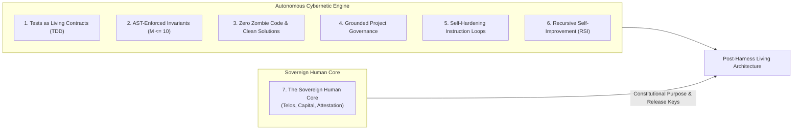

# The Disciplined Agentic Manifesto
### Beyond "Vibe Coding": The Principles of Rigorous Autonomous Engineering in the Post-Harness Era

> *"Vibe coding"* is writing prompts, hoping for the best, and manually wrestling with the hallucinated debris.  
> **Agentic Engineering** is building deterministic scaffolding around non-deterministic intelligence.  
> **The Post-Harness Era** is the emergence of a self-managed cybernetic loop, where autonomous agents discover invariants and steer execution, while humans govern purpose, capital, and sovereign attestation.

---

## The Core Thesis

Large Language Models are probabilistic token generators. When given a blank canvas and unrestrained agency, their natural tendency is toward:
- **Sprawling procedural logic** with deeply nested conditionals (`if/elif/else` ladders).
- **Silent degradation of edge cases** and hallucination of non-existent APIs.
- **Context saturation and amnesia**, where earlier architectural decisions are forgotten mid-session.
- **Zombie code accumulation**, leaving obsolete fallbacks and dead shims scattered across the codebase.

Treating agent coding as a casual "vibe" guarantees brittle, unmaintainable software. However, when an AI agent is surrounded by **uncompromising architectural invariants, deterministic quality gates, test-first contracts, and bounded operational state machines**, the equation flips:

The agent transitions from an erratic code generator into a relentless, tireless software engineer capable of producing enterprise-grade systems with zero defects, continuous $\ge 90.0\%$ test coverage, and mathematically bounded complexity.

As autonomous engineering matures beyond prompt scaffolding into the **Post-Harness Era**, human exceptionalism gives way to cybernetic reality:
- Autonomous agents equipped with physical execution oracles and AST telemetry are **measurably superior to humans** at discovering hidden mathematical invariants, regulating error budgets via continuous control theory, and conducting systematic landscape gap analyses.
- Human involvement is neither eliminated nor marginalized; it is **elevated to its irreducible, sovereign core**. The human ceases to be a syntax reviewer or prompt typist, becoming the **Sovereign Governor** of purpose, capital, and cryptographic trust.

---

## The 7 Pillars of Disciplined Agentic Development

### Pillar 1: Tests Are Executable Contracts, Not Afterthoughts
In traditional development, tests are often written after code as an afterthought. In agentic engineering, **tests must be written first**.
- Tests provide the agent with a deterministic sandbox.
- When an agent writes tests first, it must declare the interface, argument types, error conditions, and return structures before generating business logic.
- The test suite serves as an unyielding boundary condition: the agent cannot declare victory until every assertion passes.

### Pillar 2: Architectural Invariants Must Be Mechanically Enforced
LLMs cannot intuitively "feel" codebase rot. They cannot sense when a function has grown too complex or when indentation has nested too deeply.
- Invariants cannot rely on polite prompt instructions; they must be verified with automated AST scanners.
- In `devops-cli`, cyclomatic complexity is strictly capped at $\le 10$ and maximum nesting depth at $\le 5$ levels.
- If an agent generates messy procedural loops, the invariant test gate rejects the commit, forcing the agent to refactor into elegant functional pipelines, dictionary lookups, and single-responsibility helpers.

### Pillar 3: Zero Zombie Code & Clean Breaking Changes
The fear of breaking things creates legacy sediment. Weak agents frequently wrap old buggy functions in deprecation aliases or retain obsolete fallback branches "just in case."
- In modern alpha development, maintain **zero backwards compatibility guarantees** until release `1.0.0`.
- Eliminate legacy shims, dead code, and vestigial fallbacks ruthlessly.
- A codebase that carries no dead weight allows agents to navigate with high token efficiency and minimal confusion.

### Pillar 4: Grounded Project Governance (Zero Invisible Actions)
An agent operating without an external memory substrate will drift. It will duplicate work, jump between unrelated features, and lose focus on user requirements.
- Every engineering action, bug investigation, and pull request must be grounded in an external issue tracker (e.g. GitHub Projects v2) and a local task specification file.
- Explicit lifecycle transitions (`Backlog` -> `In Progress` -> `Review` -> `Done`) anchor the agent's attention and provide human operators with real-time visibility.

### Pillar 5: Self-Hardening Instruction Loops
Software bugs are not isolated incidents; they are symptoms of missing constraints.
- When an agent encounters an unhandled exception, syntax error, or rate-limit stall, fixing the bug in source code is only half the job.
- The agent must immediately update the agent operating instructions (`AGENTS.md`) with defensive rules, pre-flight checks, and avoidance patterns.
- Every failure permanently hardens the harness against recurrence.

### Pillar 6: Invariant-Grounded Recursive Self-Improvement
In the post-agentic-harness era, code synthesis velocity exceeds human auditing capacity. Static codebases face exponential relative decay.
- Recursive self-improvement is an operational mandate: codebases must autonomously observe their own telemetry, repair defects, and ingest roadmap deliverables.
- Unconstrained stochastic self-improvement collapses into the Phantom Architecture Trap and circular self-consistency.
- Self-evolution must be grounded in asymmetric mechanical invariants ($P$ vs $NP$), monotonic CEGIS constraint accumulation, and outward ecosystem telemetry.

### Pillar 7: The Sovereign Human Core & Autonomous Invariant Discovery
As the autonomous cybernetic loop accelerates, the human role inverts from micromanaging implementation details to commanding the sovereign boundary:
- **Autonomous Invariant Discovery**: Agents equipped with telemetry, AST analyzers, and kinetic exploit engines discover empirical invariants (e.g., parameter cardinality $\le 4$, structural tuple equality, Attention Dilution caps) far more reliably than human intuition.
- **The Sovereign Triad**: Human involvement condenses into three non-synthetic anchors:
  1. **Telos (Purpose & Ethics)**: Defining *what* world is worth constructing and *why*.
  2. **Capital & Economic Boundaries**: Allocating physical token budgets, hardware tiers, and runtime constraints.
  3. **Sovereign Attestation**: Holding the cryptographic signing keys, bearing legal accountability, and authorizing releases into the physical world.

---

## The Shift in Developer Experience

| Traditional "Vibe Coding" | Harness-Era Scaffolding | Post-Harness Invariant Architecture | Sovereign Cybernetic Loop |
|---|---|---|---|
| Prompting in chat and copying diffs | Tool invocation via MCP | Self-operating living repository | Self-steering cybernetic engine |
| Manual testing in terminal | Automated TDD ($\ge 90\%$) | Monotonic CEGIS accumulation | Kinetic counterexample falsification |
| Unchecked procedural sprawl | AST caps ($M \le 10, d \le 5$) | Proactive headroom ($M \le 5$) | Autonomous invariant discovery |
| Leaking secrets into logs | OS Keyring & RFC 5737 | Kernel sandboxing & zero egress | Hardware/eBPF runtime enforcement |
| Blaming LLMs for bugs | Hardening `AGENTS.md` | Tripartite RSI: AST + CEGIS + Survey | Autonomous SRE/PID error budget pacing |
| Inward-facing defect churn | Linear backlog execution | Outward horizon & roadmap ingestion | Declarative Telos & Sovereign Attestation |

---

## Conclusion

The power of AI coding is not determined by raw model parameters alone, nor solely by the external scaffolding that wraps it. In the post-agentic-harness era, software development is governed by **the mathematical rigor of its invariant architecture and the clarity of its sovereign human purpose**. `vibes` exists to document the science of that autonomous evolution.
