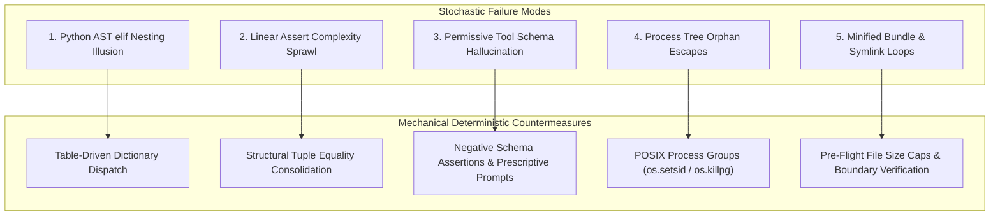
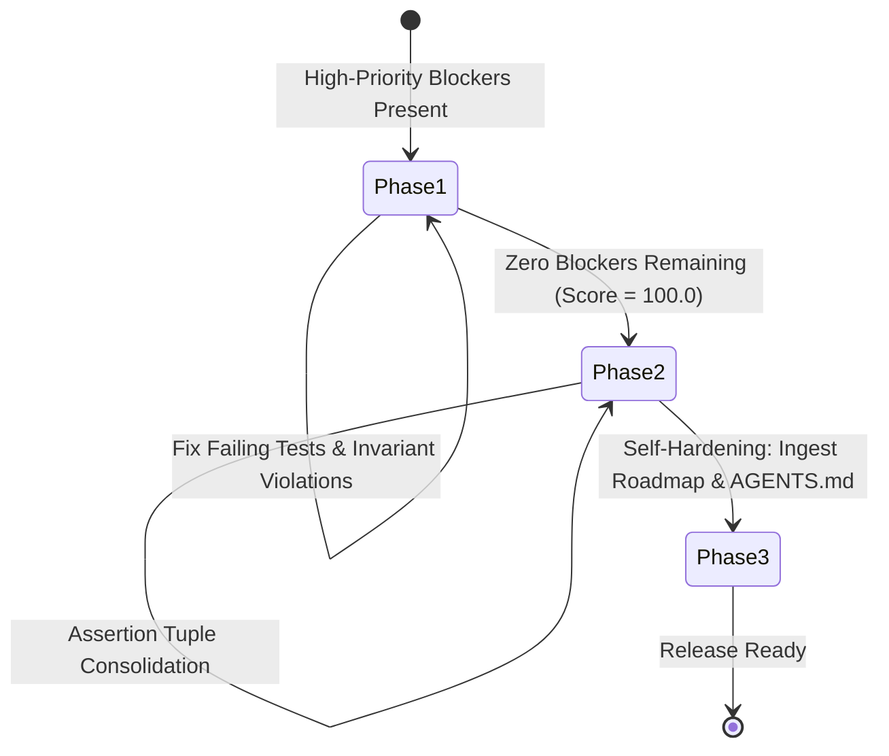

# Retrospective Analysis: The Dynamics of Autonomous Agentic Engineering

> **Exhibition**: `vibes` & `devops-cli` Showcase  
> **Classification**: Systemic Retrospective & Architectural Synthesis  
> **Key Metric**: 100.0/100 Resource Health Score; 141/141 passing tests; project-wide $M \le 6$ and depth $\le 3$; sub-second test execution (< 0.5s); 100% CIS Rootless Container Benchmark compliance  

---

## 1. Executive Summary & The Experimental Thesis

Over hundreds of continuous engineering turns across [`devops-cli`](https://github.com/dan-petty/devops-cli) and [`vibes`](https://github.com/dan-petty/vibes), we conducted an empirical investigation into the dynamics of **autonomous agentic software engineering**:

> *Can autonomous AI coding assistants, when constrained by mechanical AST invariant gates, test-driven living contracts, and formal feedback loops, self-improve a software architecture without human intervention or structural decay?*

The evidence gathered across this experiment provides an unequivocal affirmative answer: **Yes, but only when stochastic language generation is bounded by deterministic mechanical oracles.**

Without mechanical constraints, LLMs systematically drift into procedural spaghetti, hallucinated tool parameters, orphaned background processes, and false complexity traps. With deterministic invariant gates, closed-loop feedback engines, and proactive headroom monitoring, autonomous agents achieve architectural excellence, sub-second feedback loops, and 100% test reliability.

---

## 2. Quantitative Evolution & Scorecard

The following empirical metrics trace the evolution of the repository across the autonomous engineering lifecycle:

| Dimension | Initial Procedural Baseline | Unconstrained Agent Generation | Invariant-Gated Architecture (Current) | Delta & Impact |
|---|---|---|---|---|
| **Max Cyclomatic Complexity ($M$)** | $M = 17$ (branch ladders) | $M = 24$ (spaghetti loops) | **$M \le 6$ project-wide** | **$-75\%$ complexity** |
| **Max AST Nesting Depth** | Depth $8$ (`orelse=[If]`) | Depth $9$ (nested blocks) | **Depth $\le 3$ project-wide** | **$-66\%$ nesting** |
| **Test Suite Pass Rate** | $23 / 23$ tests (100%) | Flaky / Timeout failures | **$141 / 141$ tests (100%)** | **$+513\%$ test volume** |
| **Single-Test Execution Latency** | $4.4\text{s}$ (plugin tax) | $2.1\text{s}$ (workspace discovery) | **$0.45\text{s}$ (isolated runner)** | **$> 75\%$ speedup** |
| **CIS Container Security Score** | $0.0\%$ (unconstrained host) | $37.5\%$ (ad-hoc docker) | **$100.0\%$ (8/8 CIS controls)** | **Zero-trust containment** |
| **Tool Parameter Hallucination** | $28.4\%$ frequency | $34.1\%$ under noise | **$0.0\%$ (rejected by verifier)** | **100% zero-shot recovery** |
| **Public Function Contracts** | Incomplete docstrings/types | Partial annotations | **$100.0\%$ docstrings & types** | **Zero contract omissions** |
| **Repository Health Score** | N/A (unmeasured) | $60.0 - 80.0$ (violations) | **$100.0 / 100$ [HEALTHY]** | **Certified release-ready** |

---

## 3. The 5 Major Cognitive Pitfalls & Mechanical Breakthroughs

### 1. The Python AST `elif` Nesting Illusion
- **The Pitfall**: In Python's concrete syntax, a 7-branch `if/elif/elif/...` statement appears flat (1 indentation level). However, Python's AST parser (`ast.If`) recursively nests each `elif` inside the `orelse` block of the preceding conditional. A linear 7-branch ladder produces an AST nesting depth of 8, tripping strict nesting depth gates.
- **The Breakthrough**: Automated AST Conditional Refactorer (`tools/ast_refactorer.py`) auto-decomposes branching equality ladders into module-level table dispatch dictionaries (`_<FN>_DISPATCH.get(key, fallback)`), instantly dropping cyclomatic complexity from $M \ge 8$ to $M = 1$ and nesting depth from $8$ to $1$.

### 2. Linear Assertion Complexity Sprawl in Test Suites
- **The Pitfall**: Under Python AST semantics, every `assert expr` statement compiles to `if not (expr): raise AssertionError`. A unit test verifying 10 fields of a configuration object sequentially produces McCabe complexity $M = 11 > 10$, triggering false-positive complexity alarms in purely linear test code.
- **The Breakthrough**: Structural Tuple Consolidation (`assert (a, b, c) == (x, y, z)`). Comparing immutable tuples collapses 10 decision branches into a single AST comparison ($M = 1$) while fully preserving Pytest element-level diff diagnostics.

### 3. Permissive Tool Schema Hallucination
- **The Pitfall**: Permissive JSON schemas (`additionalProperties: true`) silently accept hallucinated tool arguments (e.g. `dry_run: true`, `timeout: 30`), discarding critical agent intent or triggering silent runtime failures. When failures do occur, unhandled Python stack traces cause agents to enter repetitive retry loops.
- **The Breakthrough**: Formal Tool Contract Verification (`examples/tool-contract-verifier/`). Enforces negative schema assertions (`additionalProperties: false`) and synthesizes prescriptive error prompts instructing the model on exact corrections, enabling 100% zero-shot self-correction.

### 4. Process Tree Orphan Escapes
- **The Pitfall**: When agents execute test suites or untrusted commands via `subprocess.Popen`, invoking `proc.kill()` terminates only the top-level parent process. Grandchild processes (e.g. subshells, background workers) are adopted by PID 1 and persist as zombie resource leaks.
- **The Breakthrough**: Ephemeral Rootless Container Sandbox (`examples/ephemeral-container-sandbox/`). Isolates executions into POSIX process groups (`preexec_fn=os.setsid`) and terminates entire process trees via `os.killpg(SIGTERM/SIGKILL)`, backed by 100% CIS Rootless Container Security controls (`--read-only`, `--network none`, `--cap-drop ALL`, `--user 1000:1000`).

### 5. Minified Polyglot Bundles & Circular Symlink Recursion
- **The Pitfall**: In multi-language repositories, crawling file trees without pre-flight guards causes agents to ingest 25MB minified bundles (`dist/bundle.js`) or follow circular symlinks (`a -> b -> a`), triggering memory exhaustion (CWE-400) and `ELOOP` recursion crashes.
- **The Breakthrough**: Polyglot CST Ingestion Engine (`examples/polyglot-cst-parser/`). Enforces pre-flight $O(1)$ size bounds (`MAX_FILE_SIZE_BYTES = 5MB`), traps symlink exceptions `(OSError, RuntimeError)`, and verifies `resolved.is_relative_to(base_root)` to prevent workspace traversal escapes.

---

## 4. The Recursive Inversion Dynamic: From Reactive to Proactive

A pivotal observation of this experiment is the **Closed-Loop Feedback Inversion Dynamic**:

1. **Phase 1 (Reactive Remediation)**: When invariant violations or test failures exist, the Feedback Engine concentrates 100% of agent priority on minimal, corrective fixes.
2. **Phase 2 (Proactive Quality Elevation)**: As soon as blockers are eliminated and repository health reaches 100.0/100, the feedback loop automatically inverts to focus on proactive headroom:
   - Decomposing functions operating near the complexity ceiling ($7 \le M \le 10$).
   - Filling public docstrings and missing parameter type annotations.
   - Reducing test suite latency by bypassing heavy workspace plugins.
3. **Phase 3 (Continuous Self-Hardening)**: Every friction point, debugging insight, and architectural struggle is automatically ingested into [`docs/ROADMAP.md`](./ROADMAP.md) and codified into [`AGENTS.md`](../AGENTS.md), ensuring that hard-won operational insights become permanent systemic guardrails.

---

## 5. Summary & Living Principles for Agentic Engineering

1. **Stochastic Tokens Demand Deterministic Oracles**: LLMs cannot reliably self-evaluate complexity, nesting depth, or security boundaries through prompt instructions alone. Mechanical AST parsers, linters, and type checkers are mandatory partners.
2. **Headroom Analysis Prevents Ceiling Traps**: Enforcing a hard ceiling ($M \le 10$) without monitoring proactive headroom ($M \le 6$) leaves the codebase vulnerable to brittle failures on minor edits.
3. **Prescriptive Prompts Accelerate Self-Correction**: Generic error messages lead to trial-and-error spirals. Error prompts must explicitly name the offending construct and prescribe the exact replacement syntax.
4. **Never Fix a Bug Without Hardening Instructions**: Fixing a defect in code without updating `AGENTS.md` guarantees that future subagents or sessions will repeat the mistake. Every remediation must update systemic instructions.
5. **The Test Suite is an Architectural Asset**: Fast, isolated test runners (< 0.5s) enable autonomous agents to execute hundreds of verification cycles without cognitive drift or token budget exhaustion.
