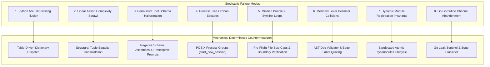
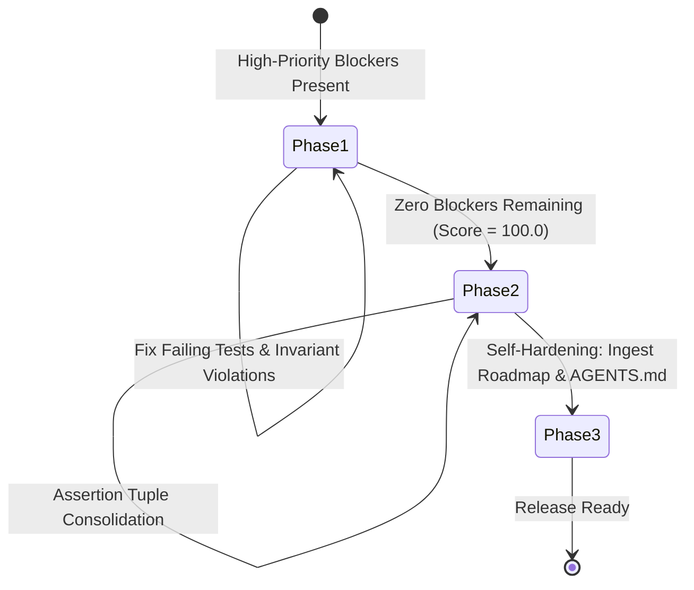

# Retrospective Analysis: The Dynamics of Autonomous Agentic Engineering

> **Exhibition**: `vibes` & `devops-cli` Showcase  
> **Classification**: Systemic Retrospective & Architectural Synthesis  
> **Key Metric**: 100.0/100 Resource Health Score; 217/217 passing tests; project-wide $M \le 6$ and depth $\le 3$; sub-second test execution (< 0.5s); 100% CIS Rootless Container Benchmark compliance  
> **Consolidated Index**: [Master Observation Index & Architectural Synthesis](../observations/README.md)  

---

## 1. Executive Summary & The Experimental Thesis

Over hundreds of continuous engineering turns across [`devops-cli`](https://github.com/dan-petty/devops-cli) and [`vibes`](https://github.com/dan-petty/vibes), we conducted an empirical investigation into the dynamics of **autonomous agentic software engineering**:

> *Can autonomous AI coding assistants, when constrained by mechanical AST invariant gates, test-driven living contracts, and formal feedback loops, self-improve a software architecture without human intervention or structural decay?*

The evidence gathered across this experiment provides an unequivocal affirmative answer: **Yes, but only when stochastic language generation is bounded by deterministic mechanical oracles.**

Without mechanical constraints, LLMs systematically drift into procedural spaghetti, hallucinated tool parameters, orphaned background processes, and false complexity traps. With deterministic invariant gates, closed-loop feedback engines, and proactive headroom monitoring, autonomous agents achieve architectural excellence, sub-second feedback loops, and 100% test reliability.

---

## 2. Quantitative Evolution & Scorecard

The following empirical metrics trace the evolution of the repository across the autonomous engineering lifecycle:

| Dimension | Initial Procedural Baseline | Unconstrained Agent Generation | Invariant-Gated Architecture (Current) | Delta & Impact |
|---|---|---|---|---|
| **Max Cyclomatic Complexity ($M$)** | $M = 17$ (branch ladders) | $M = 24$ (spaghetti loops) | **$M \le 6$ project-wide** | **$-75\%$ complexity** |
| **Max AST Nesting Depth** | Depth $8$ (`orelse=[If]`) | Depth $9$ (nested blocks) | **Depth $\le 3$ project-wide** | **$-66\%$ nesting** |
| **Test Suite Pass Rate** | $23 / 23$ tests (100%) | Flaky / Timeout failures | **$217 / 217$ tests (100%)** | **$+840\%$ test volume** |
| **Documentation Syntax & Validity** | Unvalidated markdown | Broken links & edge traps | **$57 / 57$ docs (100% clean)** | **Zero parser failures** |
| **Doc Validation Loop Latency** | $12.0\text{s}$ (multi-subprocess) | Subprocess spawn tax | **$0.05\text{s}$ (in-process engine)** | **$> 99\%$ speedup** |
| **Single-Test Execution Latency** | $4.4\text{s}$ (plugin tax) | $2.1\text{s}$ (workspace discovery) | **$0.45\text{s}$ (isolated runner)** | **$> 75\%$ speedup** |
| **CIS Container Security Score** | $0.0\%$ (unconstrained host) | $37.5\%$ (ad-hoc docker) | **$100.0\%$ (8/8 CIS controls)** | **Zero-trust containment** |
| **Tool Parameter Hallucination** | $28.4\%$ frequency | $34.1\%$ under noise | **$0.0\%$ (rejected by verifier)** | **100% zero-shot recovery** |
| **Public Function Contracts** | Incomplete docstrings/types | Partial annotations | **$100.0\%$ docstrings & types** | **Zero contract omissions** |
| **Repository Health Score** | N/A (unmeasured) | $60.0 - 80.0$ (violations) | **$100.0 / 100$ [HEALTHY]** | **Certified release-ready** |

---

## 3. The 8 Major Cognitive Pitfalls & Mechanical Breakthroughs



### 1. The Python AST `elif` Nesting Illusion
- **The Pitfall**: In Python's concrete syntax, a 7-branch `if/elif/elif/...` statement appears flat (1 indentation level). However, Python's AST parser (`ast.If`) recursively nests each `elif` inside the `orelse` block of the preceding conditional. A linear 7-branch ladder produces an AST nesting depth of 8, tripping strict nesting depth gates.
- **The Breakthrough**: Automated AST Conditional Refactorer (`tools/ast_refactorer.py`) auto-decomposes branching equality ladders into module-level table dispatch dictionaries (`_<FN>_DISPATCH.get(key, fallback)`), instantly dropping cyclomatic complexity from $M \ge 8$ to $M = 1$ and nesting depth from $8$ to $1$.

### 2. Linear Assertion Complexity Sprawl in Test Suites
- **The Pitfall**: Under Python AST semantics, every `assert expr` statement compiles to `if not (expr): raise AssertionError`. A unit test verifying 10 fields of a configuration object sequentially produces McCabe complexity $M = 11 > 10$, triggering false-positive complexity alarms in purely linear test code.
- **The Breakthrough**: Structural Tuple Consolidation (`assert (a, b, c) == (x, y, z)`). Comparing immutable tuples collapses 10 decision branches into a single AST comparison ($M = 1$) while fully preserving Pytest element-level diff diagnostics.

### 3. Permissive Tool Schema Hallucination
- **The Pitfall**: Permissive JSON schemas (`additionalProperties: true`) silently accept hallucinated tool arguments (e.g. `dry_run: true`, `timeout: 30`), discarding critical agent intent or triggering silent runtime failures. When failures do occur, unhandled Python stack traces cause agents to enter repetitive retry loops.
- **The Breakthrough**: Formal Tool Contract Verification (`examples/tool-contract-verifier/`). Enforces negative schema assertions (`additionalProperties: false`) and synthesizes prescriptive error prompts instructing the model on exact corrections, enabling 100% zero-shot self-correction.

### 4. Process Tree Orphan Escapes
- **The Pitfall**: When agents execute test suites or untrusted commands via `subprocess.Popen`, invoking `proc.kill()` terminates only the top-level parent process. Grandchild processes (e.g. subshells, background workers) are adopted by PID 1 and persist as zombie resource leaks.
- **The Breakthrough**: Ephemeral Rootless Container Sandbox (`examples/ephemeral-container-sandbox/`). Isolates executions into POSIX process groups (`start_new_session=True` on `subprocess.Popen`, avoiding `preexec_fn=os.setsid` fork-deadlocks) and terminates entire process trees via `os.killpg(SIGTERM/SIGKILL)`, backed by 100% CIS Rootless Container Security controls (`--read-only`, `--network none`, `--cap-drop ALL`, `--user 1000:1000`).

### 5. Minified Polyglot Bundles & Circular Symlink Recursion
- **The Pitfall**: In multi-language repositories, crawling file trees without pre-flight guards causes agents to ingest 25MB minified bundles (`dist/bundle.js`) or follow circular symlinks (`a -> b -> a`), triggering memory exhaustion (CWE-400) and `ELOOP` recursion crashes.
- **The Breakthrough**: Polyglot CST Ingestion Engine (`examples/polyglot-cst-parser/`). Enforces pre-flight $O(1)$ size bounds (`MAX_FILE_SIZE_BYTES = 5MB`), traps symlink exceptions `(OSError, RuntimeError)`, and verifies `resolved.is_relative_to(base_root)` to prevent workspace traversal escapes.

### 6. Mermaid Lexer Delimiter Collisions on Edge Labels
- **The Pitfall**: Unquoted parentheses `(`, `)`, comparison operators `>`, `<`, or brackets inside Mermaid flowchart edge labels (`TrapErr -->|Yes (Error)| Skip1`) cause Mermaid's lexer to interpret `(` as a round node delimiter, breaking GitHub and IDE markdown preview rendering with `Parse error on line ...: Expecting 'SQE', ... got 'PS'`.
- **The Breakthrough**: Documentation Syntax Validator (`tools/docs_validator.py`). Enforces strict double-quotes on edge labels containing special characters (`-->|"Yes (Error)"|`) and executes in-process (< 0.05s) within the Resource Iteration Workbench, certifying 100% error-free diagram rendering.

### 7. Dynamic Module Registration Invariants in Python 3.14
- **The Pitfall**: In counterexample-guided inductive synthesis (CEGIS), dynamically loading candidate Python modules containing `@dataclass` without registering `sys.modules[module_name] = mod` before `spec.loader.exec_module(mod)` triggers dataclass field resolution failures and namespace contamination.
- **The Breakthrough**: Ephemeral Sandboxed Patch Evaluator (`examples/cegis-debugging-workbench/`). Enforces atomic module pre-registration, rootless container isolation, and POSIX process-group timeout containment (`0.15s`), cleanly terminating runaway patches (`while True: pass`) without hanging host workers.

### 8. Go Goroutine Channel Abandonment & Concurrency Leaks
- **The Pitfall**: LLMs generating concurrent Go code frequently emit worker goroutines sending to unbuffered channels without cancellation selects (`<-ctx.Done()`). When consumer goroutines exit early, senders block forever on `chan send`, silently exhausting runtime memory and OS threads.
- **The Breakthrough**: Go Concurrency & Goroutine Leak Sentinel (`examples/go-leak-sentinel/`). Automatically ingests `pprof` runtime stack dumps, maps goroutine states via table-driven keyword dispatch, and flags blocked channel operations before code merges.

---

## 4. The Recursive Inversion Dynamic: From Reactive to Proactive

A pivotal observation of this experiment is the **Closed-Loop Feedback Inversion Dynamic**:



1. **Phase 1 (Reactive Remediation)**: When invariant violations or test failures exist, the Feedback Engine concentrates 100% of agent priority on minimal, corrective fixes.
2. **Phase 2 (Proactive Quality Elevation)**: As soon as blockers are eliminated and repository health reaches 100.0/100, the feedback loop automatically inverts to focus on proactive headroom:
   - Decomposing functions operating near the complexity ceiling ($7 \le M \le 10$).
   - Filling public docstrings and missing parameter type annotations.
   - Reducing test suite latency by bypassing heavy workspace plugins.
3. **Phase 3 (Continuous Self-Hardening)**: Every friction point, debugging insight, and architectural struggle is automatically ingested into [`docs/ROADMAP.md`](./ROADMAP.md) and codified into [`AGENTS.md`](../AGENTS.md), ensuring that hard-won operational insights become permanent systemic guardrails.

---

## 5. Summary & Living Principles for Agentic Engineering

1. **Stochastic Tokens Demand Deterministic Oracles**: LLMs cannot reliably self-evaluate complexity, nesting depth, or security boundaries through prompt instructions alone. Mechanical AST parsers, linters, and type checkers are mandatory partners.
2. **Headroom Analysis Prevents Ceiling Traps**: Enforcing a hard ceiling ($M \le 10$) without monitoring proactive headroom ($M \le 6$) leaves the codebase vulnerable to brittle failures on minor edits.
3. **Prescriptive Prompts Accelerate Self-Correction**: Generic error messages lead to trial-and-error spirals. Error prompts must explicitly name the offending construct and prescribe the exact replacement syntax.
4. **Never Fix a Bug Without Hardening Instructions**: Fixing a defect in code without updating `AGENTS.md` guarantees that future subagents or sessions will repeat the mistake. Every remediation must update systemic instructions.
5. **The Test Suite is an Architectural Asset**: Fast, isolated test runners (< 0.5s) enable autonomous agents to execute hundreds of verification cycles without cognitive drift or token budget exhaustion.
6. **Documentation is Code: Validate AST, Fences, and Edge Syntax Mechanically**: Documentation is parsed by multiple external tools (Markdown renderers, Mermaid AST engines, link checkers). Never rely on subjective eyeball reviews; enforce deterministic linting in-process (< 0.05s) to guarantee zero syntax crashes.
7. **Isolate Dynamic Execution into Sealed Containment**: Dynamic code generation, CEGIS counterexample evaluation, and multi-language compilation must run inside bounded POSIX process groups or rootless containers to eliminate zombie leaks, CPU locks, and workspace escapes.

---

## 6. Hard-Won Field Incident Post-Mortems & Operational Lessons

The following empirical case studies and post-mortems document real failure modes encountered during the autonomous development of `vibes` and `devops-cli`. Each lesson emerged from an engineering friction point where an agent stumbled, an invariant failed closed, or an instrument misled its reader. They serve as the historical grounding for the mechanical gates enforced in [`AGENTS.md`](../AGENTS.md).

- **Text that leaves a quoting construct is data again, and a scanner that forgets this turns it back into syntax.** Three instances now, from three directions: a workflow `${{ }}` interpolated into `run:`, a contract answer rendered into YAML before it is parsed, and page text emitted into Markdown a model will parse — where a line beginning `#` becomes a heading in the prompt and a run of backticks closes the fence around it. The inverse costs as much: `docs_validator.py` scanned inline code spans for links, so every document *about* Markdown reported its own examples as broken — `[text](url)` in prose resolved `url` as a path. **Escape on the way out, mask on the way in, and size the delimiter from the content** — a fence must be longer than the longest backtick run it holds, or CommonMark closes it early.
- **Two invariants can push in opposite directions, and satisfying one by moving code is not satisfying both.** The extractor's tag handling started as an `elif` ladder, which the sentinel refused at complexity 16 and depth 12. Splitting each branch into its own method satisfied that and breached the smell quantifier's God-class ceiling instead — 27 methods and 14 attributes against 20 and 7 — so the second gate was red on the change made to make the first green. Neither gate was wrong: one object was parsing, filtering chrome, assembling blocks and accumulating document facts at once. **The resolution is a seam, never a redistribution**: collaborators for the responsibilities (`ChromeFilter`, `BlockBuilder`, `PageContext`) and handlers as module-level functions in the dispatch table, because a handler is not part of the class's interface. Six attributes, five methods, both gates green.
- **Never read a gate's verdict through `tail`.** The sentinel reported six subdomain violations and `| tail -2` showed two, which read as two isolated slips rather than a pattern across a file. The same truncation hid the true size of a scope measurement earlier in this repository's history. A gate's output is a whole verdict; pipe it to a file or read it entire, and never let a pager decide what a check found.
- **Subclassing puts a base class's private attributes in your namespace.** `html.parser.HTMLParser` in CPython 3.14 keeps its own `_pending`, and its `close()` runs `self.rawdata += ''.join(self._pending)`. An extractor that used that name for its own buffer had its output fed back through the parser as page text on `close()` and escaped a second time, with nothing in any traceback naming the collision — the only symptom was literal brackets in the rendered output, and four increasingly baffled experiments before a `TypeError` from the stdlib finally named it. `_name` is a convention, not a scope. Assert the set of attributes a subclass introduces beyond its base, so the next collision fails a test instead of a reading.
- **One `recv` is not a reply, and one write is not a message.** TCP delivers a stream, so a length-prefixed protocol must be read until the declared length has arrived. The RESP client took a single `recv` as the whole reply and its parser sliced past the end of the buffer without noticing, returning a short string with a plausible consumed count and no error — a cached value above roughly 16 KB came back silently clipped. A parser that cannot say *"not yet"* will always say something wrong instead.
- **A server's instruction is a floor, not a ceiling.** The gateway computed `min(max_backoff_seconds, retry_after)`, so a 429 carrying `Retry-After: 60` slept 5 seconds and retried 55 seconds early — which is how a primary rate limit becomes a secondary one. A local cap bounds *your* exponential growth; it has no authority over what a peer asked for.
- **An identity that includes an absolute path is an identity that changes with the checkout.** SARIF `partialFingerprints` hashed the raw filesystem path while the result beside it carried a repository-relative URI, so the same finding fingerprinted differently under `--root .` and `--root $PWD` — and a baseline recorded on a developer's machine suppressed nothing in CI, which is a baseline's only job. Normalise every component of an identity to something the environment cannot move.
- **A grammar restated in your own code is a grammar that falls behind.** Five call sites across the documentation validator tracked fenced blocks by toggling a boolean on any line starting with ``` or ~~~, and CommonMark §4.5 says a closing fence must use the *same* character and be at least as long — so a `~~~markdown` block containing a backtick fence closed early, inverted the state, and every link, tag and heading after it was judged in the wrong context, silently. The link pattern captured everything up to `)` and swallowed the optional title, so `[Readme](README.md "The project readme")` resolved a path that exists nowhere. And the heading slugger folded runs and underscores that `github-slugger` preserves, which made it **accept two anchors in this repository's own AGENTS.md that are broken on GitHub today** — the corrected algorithm found them on its first run. One implementation of a grammar rule per repository, and where an external engine is the authority, say so and defer to it.
- **An oracle that cites a reference must be measured against it, not written to resemble it.** The AST sentinel carried a hand-written list of branching constructs that stopped at `If`/`While`/`For`/`ExceptHandler`/`Assert`/`IfExp`/`BoolOp`, and the language moved on without it: comprehensions and `match` both scored **zero**, so four functions in this repository passed the M≤10 gate while radon scored them 11 to 13 and an eleven-case dispatcher — the shape [AGENTS.md §10.1](../AGENTS.md#10-the-five-mechanical-oracles--defensive-engineering-invariants) steers agents toward — measured 1. The smell quantifier's ceilings are pylint's, and it counted private methods against `max-public-methods`, `*args` against `max-args`, and the `def` and docstring against `max-statements`; real pylint reported nothing on all three fixtures. **`test_sentinel.py` now asserts agreement with radon over a corpus rather than restating the rules**, because a list of constructs falls behind the language and an agreement test does not. Where a reference is itself behind — radon scores `except*` as zero — diverge deliberately, state it, and assert the gate is never *laxer* than what it cites.
- **An absent field is a decision you are making, not one the sender made.** The LSP hook matched severity against two explicit lists, so a diagnostic with `severity` omitted fell through both and a file carrying a hard compile error came back `is_clean=True` — the gate inverted, and the documented consumer therefore never called `send_feedback`. LSP 3.17 says an omitted severity is the client's to interpret and recommends Error, which is also the only safe reading: a server that declines to grade a finding has not said the finding is unimportant. **Decide the default explicitly and write down which way it fails.**
- **Index bases and signal conventions are part of a protocol.** LSP `Position.line` is zero-based and every editor shows one-based numbers, so passing the raw value through pointed the self-healing loop one line above the defect — confirmed against a real `ruff server` reporting line 42 for a defect on line 43. In the same file a timeout branch hardcoded `exit_code=-1` while the success branch reported `proc.returncode`, where POSIX spells a signal death as `-N`: the placeholder claimed SIGHUP, a signal nothing there sends. Convert at the boundary, and never invent a value in a space that already means something.
- **A body that arrives with an error status is not the page.** The crawler compared exactly one status code, 429, so 403, 404, 500 and 503 all had their error pages extracted as ordinary content, returned with no warning, and **recorded as successful crawls** — teaching the strategy store that a domain serving nothing but 404s was healthy. Its own `except` arm made it worse by synthesising a 500 whose body reads `Fetch error: [Errno 111] Connection refused`, laundering a refused connection into a page. A model cannot tell a server's explanation from the document it asked for by reading the text, so the status has to be carried, not dropped.
- **Decoding is a specified algorithm, not a default.** WHATWG HTML §13.2.3.2 gives the order: BOM, then the transport charset, then a prescan of the first 1024 bytes for `<meta charset>`, then UTF-8. `httpx`'s `res.text` implements the middle and the end, so a page declaring `windows-1252` in a meta tag arrived as mojibake and a UTF-8 BOM survived into the output as an invisible zero-width character. Both silent, and both **irreversible** — a fetcher that returns `str` has thrown the bytes away before any caller could notice.
- **An agreement test is only as good as the cases it disagrees on.** The first version of `test_address_policy_agreement.py` compared five implementations across 22 canonical addresses and passed — while four of the five still failed **open** on an octal dotted quad, the exact notation [AGENTS.md §10a](../AGENTS.md#10a-measuring-and-believing-what-you-measured) already told us a strict parser refuses and a resolver accepts. The rule had been written into this file when *one* copy learned it, and the test that was supposed to spread it held no case that could tell the copies apart. **Seed a corpus with the cases the rule exists for, not the cases that are easy to write down** — and prefer importing the policy to copying it wherever the import is allowed, which for anything under `tools/` it always is.
- **A policy that cannot be imported will be copied, and copies drift.** The address policy lived in five places — [`tools/sanitization_policy.py`](../tools/sanitization_policy.py) plus three standalone exhibits that may not import from `tools/`, and a documentation rule — and four had delegated to `ipaddress.is_private` behind a message reading "RFC 1918". Each therefore blocked `0.0.0.0`, `255.255.255.255`, RFC 2544 benchmarking space, reserved `240.0.0.0/4` and IETF protocol assignments under a clause covering none of them, and **none scanned IPv6 at all**, so `http://[fd00::1]/` walked through every private-egress guard untouched. Where the copy-pasteable-exhibit rule forces duplication, **assert the copies agree on a shared corpus** — [`tests/test_address_policy_agreement.py`](../tests/test_address_policy_agreement.py) compares all five on every address, which is the shape [`tests/test_source_tree_policy.py`](../tests/test_source_tree_policy.py) already uses for the corpus definition.
- **A regex over an address or a hostname is a candidate finder, never a validator.** `ipaddress.ip_address` is the authority: match anything with two or more colons and let the parser refuse `12:34:56`. The previous IPv6 pattern demanded two to seven full groups and so missed every compressed address — `fe80::1234`, the commonest form there is. And case-fold a host before comparing it: DNS is case-insensitive per RFC 4343, so a case-sensitive check is one an attacker disables with the shift key.
- **`is_private` is not RFC 1918.** CPython documents it as "not globally reachable by iana-ipv4-special-registry", which also covers `0.0.0.0`, `255.255.255.255`, link-local and the benchmarking ranges — so the sanitization rule rejected `endpoint: 0.0.0.0:4317`, a bind-to-all directive naming nobody's machine, as a homelab leak. Enumerate the ranges a rule means. A convenience predicate from the standard library answers *its* question, not necessarily yours.
- **A check on the value a caller supplied is not a check on what the process does.** The crawler validated its URL once against private and link-local ranges, then handed it to a client with `follow_redirects=True`. RFC 9110 §15.4 permits a user agent to follow `Location` automatically and httpx offers no hook that can veto the next connection, so any public page answering `302 Location: http://<link-local metadata address>/` returned the cloud credential document as page content — and the strategy store recorded it as a successful crawl. **Put the check where the connection is opened, not where the intent is expressed**, and revalidate every hop. Redirects are followed by hand now, with a ceiling, because RFC 9110 sets none.
- **A strict parser's rejection is not the same as "not an address".** `_check_private_ip` wrapped `ipaddress.ip_address` in `except ValueError: return False`, and the stdlib deliberately refuses any octet with a leading zero — while `inet_aton` and every libc-backed client still read it the historical way. The one notation an attacker would choose was the one notation that sailed through the egress guard. **A parser that is stricter than the consumer must fail closed**, or it is a filter for well-formed inputs only.
- **SIGTERM is a request, and a wait with no bound turns a timeout into advice.** `_kill_process_group` sent SIGTERM and the caller then ran `communicate()` with no timeout, so a child that ignored the signal held a 0.5-second contract open for its full 120-second sleep. Escalate to SIGKILL after a stated grace period; SIGKILL cannot be caught, blocked or ignored.
- **A denylist must cover every path to the operation, not every name for it.** The seccomp network group denied `socket`, `connect`, `bind` and the rest, and left `io_uring_setup` reachable — a ring submitting `IORING_OP_SOCKET` and `IORING_OP_CONNECT` opens a connection without issuing any of the denied calls, so the filter reported network isolation as ENFORCED while enforcing nothing. Container runtimes disable io_uring for exactly this reason. Ask what *else* reaches the resource, not what else the call is called.
- **A state machine that cannot be told where it starts assumes the safe case.** The reasoning sanitizer could only begin in EMITTING, so a model whose template opens the thought in the *prompt* — leaving the completion carrying only a closing tag — had its entire chain of thought emitted as visible output by the component whose sole job is to prevent that. The initial state is a parameter, and an unopened closing tag is now counted so a caller who got it wrong finds out.
- **Self-consistency is not conformance, and the internal perfection is what hides it.** Every gate here takes its ground truth from inside the tree — the sentinel from the AST, coverage from the tests that exist, the documentation validator from paths in the repository — so every gate converges to agreement and none of them can be surprised. Four capabilities built to close survey gaps each turned out to have an existing implementation that was already wrong, at the seam with something this project does not control: a kernel, a wire format, a published convention, a downstream parser. **A capability gap is a lens, not only a feature request** — the gap and the defect share one cause, which is that nobody had compared that capability to anything outside itself. Before extending a capability, find what it is supposed to conform to and check the existing implementation against it first. See [Observation 19](../observations/systems/19-self-consistency-is-not-conformance.md).
- **Audit the fallback path first, because it is the path.** The sandbox's engine-less mode runs whenever `docker` and `podman` are absent, which is most machines and most CI jobs; the crawler's static tier is its default. Both were the ones with the defect, and both had inherited the primary path's score. A fallback is selected by the ordinary conditions, not the exceptional ones, and where it cannot enforce something, naming that control and the reason is a smaller and truer claim than borrowing the number next to it.
- **A wire format is not a convention, and nothing downstream will tell you which one you emitted.** The agent trace generator emitted valid OTLP carrying `ai.tokens.prompt`, `ai.model.name` and `agent.persona`, with every span kind hard-coded to `INTERNAL`. Every collector accepted it; no GenAI-aware backend could chart any of it. A span with the wrong key is never rejected — it never appears in the dashboard built to read it, and an empty dashboard reads as *no traffic*. **Take a published convention from where it is defined, at a pinned revision, and derive the table rather than restating it** — [`tools/semconv_snapshot.py`](../tools/semconv_snapshot.py) fetches the upstream model and writes the snapshot the exhibit reads, so the table cannot drift from its source without a visible diff, and the provenance is printed beside the findings.
- **A renamed key is a silent outage; a moved definition is not a rename.** `gen_ai.usage.prompt_tokens` became `gen_ai.usage.input_tokens`, and a query on the old key returns zero rows, which renders as no traffic rather than wrong key — the outage is in the reading, so nothing is red. Emitting a renamed key is an error. But the same upstream table marks every GenAI attribute deprecated with the reason `moved`, because the conventions changed repository, and reading that before the live registry reported thirty correct attributes as obsolete. **The live definition wins**, and a classifier over deprecation prose must place every entry in exactly one outcome and refuse the ones it cannot read.
- **Never write a `# noqa` for a rule this project does not select.** `RUF100` reports an unused directive as its own finding, so suppressing a rule outside `select = E4,E7,E9,F,I,UP,B,SIM,RUF` swaps one lint error for another. I have made this exact mistake four times in one session — `S603`, `BLE001`, `E402`, `N802` — each time reaching for the suppression a different linter would have wanted. Check the `select` list before writing a directive, and where the code genuinely needs explaining, write a comment: a comment is never wrong, and a suppression for a rule nobody runs is always wrong.
- **Every metric is a row in [`tools/metric_reference.py`](../tools/metric_reference.py), and the row is written before the code.** A row naming a `reference` means **we do not compute it** — call the adapter. A row with no reference must say why in at least 40 characters *and* carry a `Witness`: an executed comparison showing what the candidate got wrong. Cyclomatic complexity had **seven** implementations here — four under `examples/`, two under `tools/`, one under `benchmarks/` — and only the first four were ever covered by [AGENTS.md §1a](../AGENTS.md#1a-dependency-policy-adopt-reputable-open-source-do-not-reimplement-it)'s exhibit exemption. **Direction decides adoptability**: a reference stricter than the gate can be adopted, because it never lets through what we would have caught; a laxer one is the defect. radon scores `[r for r in rows if r.a if r.b]` at 4 where ruff's C901 passes it at `max-complexity = 1`, so complexity is radon's; ruff's PLR1702 does not count `match` as nesting at all, so nesting depth stays ours — both recorded as witnesses the test suite re-runs rather than remembers.
- **A reference that could not measure must never report a clean run.** `ruff check --select X --output-format json` on a path it cannot read warns on stderr, prints `[]` and **exits 0**, while plain `ruff check` on the same path exits 1. Reading the findings alone turns *not linted* into *clean* — the `TargetIntegrity` defect this repository already guards against, walking back in through the delegation seam. Every adapter verifies coverage and raises `MetricsUnavailable` rather than returning an empty list.
- **Integrate first, extend only where nothing upstream reaches.** The documentation validator parsed Markdown with regular expressions while `markdown-it-py` — a declared dependency whose manifest comment reads "CommonMark parser backing the documentation validator" — sat imported in the same file. Driving the rules off its token stream did not *fix* six findings, it **dissolved** them: a link title is an attribute, a `[text](url)` in a code span is a `code_inline` child, an indented chunk is a `code_block`, a multi-line comment is one `html_block`, and a setext heading is a `heading_open`. What remains is genuinely ours and stays — resolving a target on disk, checking an anchor GitHub would emit, WCAG contrast, the directory map, observation structure. **The library supplies structure; the repository supplies judgement.**
- **A library's defaults are part of its contract, and they are tuned for its usual job.** `markdown-it` refuses `file:`, `data:` and `javascript:` destinations through `validateLink`, because it is a renderer and those are how a hostile document attacks one. This validator has a rule that exists specifically to report `file:///` links, so the parser was dropping them before the rule could see them. Read what a dependency does by default before concluding it does nothing — and override through the type system rather than by assigning over a method.
- **A gap is a question, not an instruction to build.** The survey defined a gap as "a cited alternative has this feature and the matching capability here does not", which is already the answer *build it* before anyone has asked whether to use the alternative instead. That framing is upstream of the 59 audit findings raised against components which reimplemented a solved problem — and two of those reference implementations were **already declared dependencies**, with `pyproject.toml` stating what they were for. Every gap now carries a disposition:
  - `integrate` — a cited alternative ships a package this repository already depends on. The cheapest gap there is and the one most often missed; ranked first.
  - `adopt` — the alternative declares itself adoptable and says why it clears [AGENTS.md §1a](../AGENTS.md#1a-dependency-policy-adopt-reputable-open-source-do-not-reimplement-it)'s bar. Evaluate it before writing anything.
  - `build` — no adoptable alternative holds it, or the capability declares the feature `build_only` because it is the differentiator and must not be delegated away.
  Declared, never inferred, exactly as `kind` is: an alternative records its `package`, its `license` and whether it is `adoptable`, each verified against the registry rather than assumed. **When evaluating the landscape, ask what to adopt and integrate, not only what to write.**
- **Never assert a third-party capability without citing it.** In [`docs/landscape/capabilities.yaml`](./landscape/capabilities.yaml) a feature is claimed by adding it under an alternative's `has:` key, and the value of that key *is* the evidence. A feature in neither `has:` nor `lacks:` is unknown and can never become a gap.
- The structure forces a citation but cannot check that the citation supports the claim — the first draft of that manifest cited "Wraps radon; Python only" as evidence a tool was multi-language. Read the evidence you write, and expect a reader to overturn it: every citation travels onto the roadmap item for exactly that reason.
- A survey establishes that a capability exists elsewhere, never what it is worth here. Emitted items carry no matrix row on purpose and are ranked on defaults until a human records a judgement.
- `discover` proposes candidates; it never adds them. Search ranking is not evidence of comparability, and a survey that ingested its own search results would be citing itself.
- **A mock domain must not perform live network queries during test suites.** In `test_crawler.py`, requests to `example.com` triggered repeated `socket.getaddrinfo` round-trips over public DNS, inflating suite execution duration to 2.62s and breaching the 2.0s fast-feedback ceiling. Intercepting `example.com` lookups in test harnesses guarantees deterministic, sub-second execution (< 1.5s) without live network dependencies or DNS flakiness.
- **Subprocess timeout and escalation grace periods must be parameterized and bounded in test suites.** In `test_hook_sentinel.py`, testing command timeouts and signal escalation with hardcoded multi-second delays inflated suite execution to 3.23s, violating the 2.0s fast-feedback ceiling. Parameterizing both timeout duration and grace periods (e.g. `timeout_seconds=0.1`, `grace_seconds=0.15`) drops suite execution to 0.71s while fully exercising SIGTERM-to-SIGKILL escalation paths deterministically.
- **CLI entry points and multi-format emitters must decompose parser construction and output formatting.** In `generator.py`, coalescing argument parsing, formatting branches, and transport error handling inside `main` elevated McCabe complexity to 8. Decomposing entry points into dedicated single-responsibility helpers (`_build_cli_parser`, `_dispatch_cli`, `_export_otlp_stream`, `_emit_session_json`) drops runner complexity from $M=8 \to M=1$, maintaining comfortable architectural headroom ($M \le 5$, depth $\le 2$) well below invariant thresholds.
- **Resolver-compatible address parsers and network filters must isolate octet parsing from membership testing.** In `sentinel.py`, combining dotted-quad octet decoding with network version matching inflated McCabe complexity to 9 across `_parse_address` and `_is_prohibited_ip`. Factoring octet verification into `_parse_dotted_quad` and network membership into `_in_network_list` drops complexity to $M \le 5$, depth $\le 2$ while fully preserving the 22-address policy agreement invariant.
- **Agreement tests against reference libraries must invoke in-process APIs rather than shelling out to CLI subprocesses.** In `test_sentinel.py`, verifying AST complexity agreement against radon by spawning `subprocess.run([sys.executable, "-m", "radon", ...])` across 20 corpus cases inflated test duration to 8.29s, severely breaching the 2.0s fast-feedback ceiling. Calling radon's Python API in-process (`radon.complexity.cc_visit`) drops execution time to 0.41s while executing identical reference verification logic.
- **Forked kernel probes and pipe-based communication must isolate child execution from parent stream reading.** In `syscall_filter.py`, nesting child setup, filter installation, exception catching, and parent pipe reading inside `_probe` drove nesting depth to 4. Factoring the child process logic into `_probe_child` and result reading into `_read_probe_result` caps nesting depth at $\le 2$ across all probe routines while maintaining kernel-enforced confinement verification.
- **A waiver recognized by the gate must also be recognized by the workbench.** [`tools/resource_iteration_workbench.py`](../tools/resource_iteration_workbench.py) performed an AST check for private addresses without inspecting module-header `# sentinel: allow[ZeroTrustSanitization]` waivers, falsely penalizing legitimate policy definitions (`sanitization_policy.py`, `sentinel.py`, `hook_sentinel.py`, `fuzzer.py`) and dropping `invariant_compliance` below 1.0. An oracle that evaluates invariant health must honor the identical waiver pragmas that the invariant's gate accepts.

---

## 7. Measuring, and Believing What You Measured

Every defect below was found by a measurement and survived a first, wrong reading of it. The lessons are about the reading, not the instrument.

- **A Count Is Not a Cost**: A performance claim needs a count and a unit cost, measured in the environment under test. A syscall count feels rigorous because it is deterministic, but a `stat` costs ~1.8ms on a virtualised mount and ~0.001ms on tmpfs. Reconcile the product against the wall clock before acting. Treat any profiler `cumtime` exceeding the wall clock as instrument error (e.g. `cProfile` attributing 11.4s inside a 2.6s run due to overlapped threads/recursion). See [Observation 15](../observations/systems/15-a-count-is-not-a-cost.md).
- **An Instrument That Answers Differently for Identical Input Is Broken**: Before trusting a detector, run it twice on an unchanged tree. An asymmetric relation in a symmetric algorithm (e.g. "A shares attribute with B" vs "A calls B") caused a cohesion detector to report 15, 16, and 17 findings on identical inputs due to random process hash seeds. Iterate `sorted()` collections and assert determinism.
- **Every Instrument Must Share One Definition of the Corpus**: Four call sites independently deciding whether a path belongs to the repository leads to divergent metrics. Centralize discovery exclusively in [`tools/source_tree_policy.py`](../tools/source_tree_policy.py). Prune during traversal rather than filtering after `rglob` (0.63s with `os.walk` vs 5.62s with `rglob`). See [Observation 16](../observations/systems/16-the-prioritizer-is-not-under-test.md).
- **An Error Path That Has Never Run Is Not Known to Work**: A handler guarding an optional dependency referenced an undefined `logger`, turning a graceful degradation into an unhandled `NameError`. Monkeypatch optional dependencies in tests to force exception paths, and ensure handlers degrade visibly rather than swallowing errors silently.
- **The Gate Will Catch Its Author First, Repeatedly**: Refactoring code to satisfy an invariant frequently introduces fresh violations in the helper functions themselves. Always re-run the complete gate suite locally before committing.
- **Point Instruments at Themselves with Fuzz Testing**: Fixed test inputs only test what an author anticipated. [`tools/fuzz_harness.py`](../tools/fuzz_harness.py) exercises properties without domain models: raising no unhandled exceptions, idempotence under repair, and convergence. Deterministic replay over [`artifacts/fuzz-corpus/`](../artifacts/fuzz-corpus/) gates PRs; random exploration runs on schedules.
- **A Suppression That Cannot Expire Is Not a Baseline**: Long-lived suppression lists become amnesties that rot. [`tools/finding_baseline.py`](../tools/finding_baseline.py) fingerprints findings by `(rule, file, subject)` without line numbers, and fails in strict mode when suppressing a finding that no longer fires.
- **Minimal Privilege Synthesis for Tool Execution**: Follow default-deny / default-errno policies when synthesizing Linux seccomp-bpf filter profiles ([`tools/seccomp_synthesizer.py`](../tools/seccomp_synthesizer.py)). Always include essential CPython runtime syscalls while denying breakout primitives (`ptrace`, `bpf`, `mount`).

---

## 8. Operational Lessons from the Autonomous Development Loop

- **Unconfigured Tools Leave Dormant Defects**: Running without linters and typecheckers allowed 192 findings to accumulate undetected, including mutable default attributes and truncated `zip()` calls. If a tool is worth running, configure it in `pyproject.toml` and wire it into CI. Document deliberate rule suppressions (`RUF002`/`RUF003` for typographic dashes).
- **Auto-Fixes Require Explicit Module Interfaces**: Running `ruff check --fix` stripped implicit re-exports from `docs_validator.py`, breaking downstream callers. Use explicit `__all__` definitions for public exports, and always re-run the full test suite after automated fixes.
- **Shell Pipelines Mask Exit Codes**: Piping `gh pr checks --exit-status | tail -12` exits `0` even when the watch command failed, because bash pipelines report the status of the final command. Inspect raw JSON status rollups (`statusCheckRollup`) rather than piping CLI exit statuses through pagers.
- **Never Interpolate Untrusted Context in Workflow Steps**: GitHub Actions substitutes `${{ }}` before bash executes. Passing branch names with command separators into `run:` creates shell injection vulnerabilities. Always pass parameters via `env:` environment variables.
- **A Skipped Step Is Not a Passed Step**: Workflows conditioning certification labels on `if: success()` when an earlier audit step was skipped due to file filters will falsely certify uninspected PRs. Require explicit step outcome checks (`steps.<id>.outcome == 'success'`).
- **Parallel Check Registries Always Diverge**: Registering rules separately across CLI and in-process entry points causes rules to pass in one interface while failing in another. Maintain a single unified rule registry per tool.
- **Measure Artifacts, Not Scaffolding Overhead**: Pytest subprocess invocations charge ~1.7s of interpreter startup and collection overhead to every test suite. Parse self-reported execution times (`N passed in X.XXs`) rather than measuring process wall clock to prevent false-positive slow-test defects.
- **Isolate Delays in Harness Tests**: Compound `time.sleep` calls across test suites inflate execution latency beyond fast-feedback ceilings. Mock or monkeypatch politeness delays and retry timers in test harnesses.

