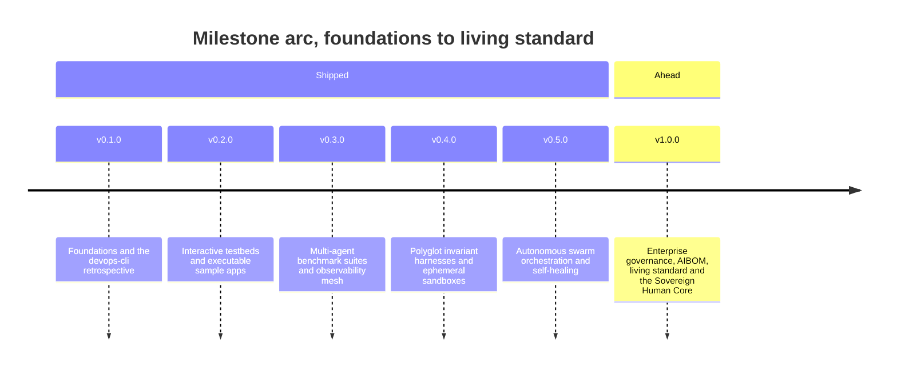
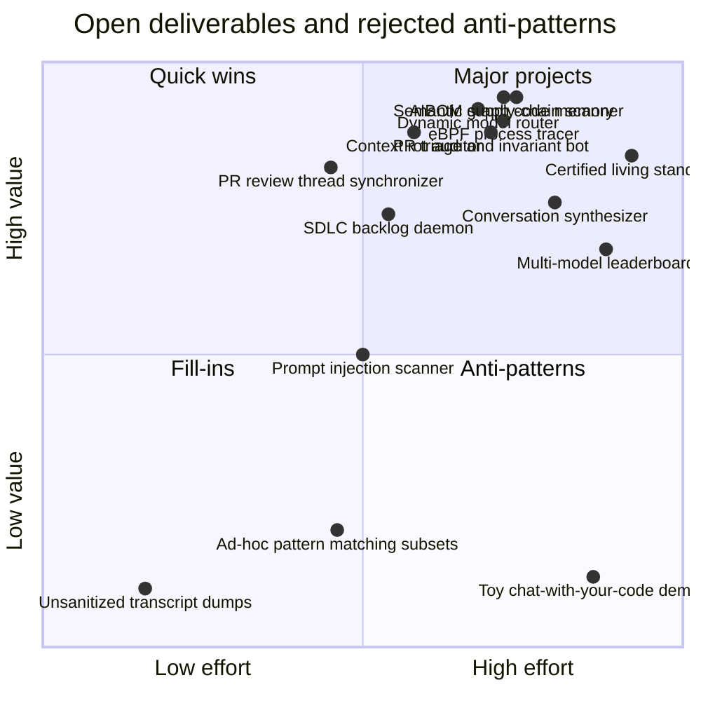

# Strategic Roadmap — vibes ✨

High-density product roadmap, engineering milestones, and open-source curation strategy for the `vibes` living showcase and artifact repository.

---

## Core Vision & Design Principles

1. **Living Laboratory Over Static Museum**: `vibes` is an active workbench. Every observation must be grounded in empirical engineering; every pattern must have a reproducible code or harness artifact.
2. **Beyond "Vibe Coding"**: Systematically counter the narrative that AI coding is undisciplined prompting. Highlight mechanical invariant gates, test-first boundary conditions, and formal state machines.
3. **Zero-Trust Egress & Universal Sanitization**: All artifacts, test fixtures, and logs are 100% sanitized of internal network topologies, private IPs, credentials, and confidential paths.
4. **Executable Demonstrations**: Pair every conceptual pattern with an executable reference implementation under `examples/`, kept close to the standard library so a reader can copy a single file and run it. Repository tooling under `tools/` takes the opposite default and adopts established open source rather than reimplementing it.
5. **Autonomous Swarm Maintainability**: Maintain structured `AGENTS.md` operating instructions and GitHub Project tracking so AI agents can continuously curate, verify, and cross-reference new artifacts autonomously.
6. **Polyglot & Multi-Runtime Breadth**: Extend verification paradigms beyond Python to Rust, Go, TypeScript, and containerized runtime sandboxes.

---

## Release Milestones (Chronological Order)

### Delivered: v0.1.0 through v0.3.0

Three milestones are complete and archived verbatim in [`docs/archive/delivered-milestones-v0.1-to-v0.3.md`](./archive/delivered-milestones-v0.1-to-v0.3.md).

| Milestone | Scope | Headline deliverables |
|---|---|---|
| **v0.1.0** | Foundations & the `devops-cli` retrospective | Manifesto, taxonomy, the first eight observations, core patterns |
| **v0.2.0** | Interactive testbeds & executable sample apps | Sentinel, CEGIS workbench, token-bucket gateway, trace generator, autonomous tooling |
| **v0.3.0** | Multi-agent benchmarks & observability mesh | Benchmark runner, OTLP mesh, Valkey L2 cache, contract verification, fast-feedback runner, AST refactorer |

---

### Milestone 4: Polyglot Invariant Harnesses & Ephemeral Sandboxes (v0.4.0 - In Flight)
- [x] **Contract-Driven Application Factory (`tools/app_factory.py`)**:
  - Turns a declared contract into a runnable application whose contract layer — table dispatch, JSON Schema with `additionalProperties: false`, prescriptive multi-problem rejections, timed invocations, CLI, tests and README — is generated, and whose domain logic is written once and never overwritten.
  - Gated rather than claimed: `tests/test_app_factory.py` runs the AST invariant sentinel, ruff, mypy, the documentation validator and the generated suite over the real output, because generated code fails those gates in predictable ways and a generator that ships a cleanup task is not a factory.
  - Built to correct the balance §1 now states: the repository could measure, judge and fuzz code and could not produce an application, and `tools/portfolio_balance.py` put that at 93% of a release spent on instruments.
- [x] **Finding Baseline for Incremental Gate Adoption (`tools/finding_baseline.py`)**:
  - Records a codebase's existing findings so a gate can be turned on before the codebase passes it. Selected by [`landscape_survey`](../tools/landscape_survey.py) as the most-cited gap in the survey: `per_file_baseline` and `baseline_diff` were each absent from two capabilities and held by four alternatives — `terryyin/lizard` (96.7) via `-W`, `jendrikseipp/vulture` (93.3) via whitelist files, `tonybaloney/wily` (92.6) via `wily diff`, and `promptfoo/promptfoo` (95.1).
  - Operates on normalized SARIF results rather than inside one oracle, so a single baseline covers all five and composes with any SARIF-emitting tool. Identity is the `partialFingerprints` value the producing tool assigned, which excludes the line number — an import added above a defect does not make it a new defect.
  - Entries are pruned when their finding stops being produced. A suppression file that never shrinks goes on hiding a defect that was fixed and later reintroduced, which is what makes long-lived whitelists worse than no gate; `ci.yml` fails when the baseline holds an entry the oracles no longer report.
  - This repository's own baseline is empty, and `tests/test_finding_baseline.py` asserts it stays that way: the machinery exists so other codebases can adopt these gates incrementally, never so this one can defer an invariant.
- [x] **Instrument Fuzzing Harness & Regression Corpus (`tools/fuzz_harness.py`)**:
  - Turns the oracles on themselves. Generates well-formed Python modules, Markdown documents, roadmap grammars and dependency manifests, damages them with ten mutation operators, and asserts four mechanically decidable properties of each of eight instruments: that it raises nothing outside its declared tolerances, answers identically for identical input, converges when it repairs, and finishes inside a budget.
  - Cross-process determinism check re-runs every input under three `PYTHONHASHSEED` values, which is the only way to see the class of defect that made the cohesion detector report 15, 16 and 17 findings on three consecutive runs of unchanged files.
  - Delta-debugging shrinker reduces a failing input to the lines that still fail it, and the minimized case is kept in [`artifacts/fuzz-corpus/`](../artifacts/fuzz-corpus/) under a neutral suffix so a fixture cannot be swept up by the instrument it is a fixture for.
  - The corpus is the gate and the search is not: `replay` runs on every push and is deterministic, while exploration runs on a schedule where a lucky run is a finding rather than a red build on an unrelated commit.
  - First finding, fixed in the same change: `docs_validator.auto_fix_content` dropped one trailing newline per call while reporting zero repairs, because `splitlines()` discards the final terminator and the rejoin restored it only when the joined text did not already end in one.
- [x] **Go Concurrency & Goroutine Leak Sentinel (`examples/go-leak-sentinel/`)**:
  - Executable reference tool utilizing Go runtime stack inspection (`runtime.NumGoroutine()`) and `pprof` trace analysis to detect orphaned goroutines, deadlock-prone unbuffered channels, and leaking context lifecycles.
  - Integration with `golangci-lint` AST checkers for static channel closure verification.
- [x] **Rust Memory & Type-State Benchmark Track (`benchmarks/rust/`)**:
  - Specialized benchmark suite evaluating agent capability to synthesize memory-safe, zero-cost abstractions using Rust's affine ownership types and type-state builders (`benchmarks/rust/src/lib.rs`).
  - Automated `cargo test` harness verifying `#![forbid(unsafe_code)]`, zero-sized type-state memory overhead (`size_of::<State>() == 0`), and compile-time rejection of invalid lifecycle transitions.
- [x] **Ephemeral Rootless Docker Sandbox Harness (`examples/ephemeral-container-sandbox/`)**:
  - Lightweight, isolated execution harness for executing untrusted agent-generated code inside unprivileged, rootless containers (`docker` / `podman`) with POSIX simulator fallback.
  - Hardened execution policies: CIS Rootless Container Security Benchmark auditing (8 controls), cgroups v2 resource caps (512MB RAM, 1 CPU, 100 PIDs), read-only root filesystems, ephemeral tmpfs scratch space, dropped capabilities (`CAP_DROP ALL`), zero-trust sanitized environment variables, and strict network egress deny-all policies (`--network none`).
  - Interactive containment matrix demo verifying safe execution, timeout termination, and output buffer bounding (CWE-400 mitigation).
- [x] **Polyglot CST Ingestion Engine (`examples/polyglot-cst-parser/`)**:
  - Unified Concrete Syntax Tree (CST) and AST parser supporting Python, Rust, Go, TypeScript/JavaScript, and Bash.
  - Language-agnostic cyclomatic complexity ($M$) and block nesting depth calculation.
  - Hardened pre-flight file size boundary guards (`MAX_FILE_SIZE_BYTES = 5MB`) mitigating OOM/DoS (CWE-400) and defensive symlink resolution preventing circular loops (`ELOOP`) and workspace traversal escapes.
- [x] **Automated Assertion Consolidation Engine (`tools/ast_refactorer.py`)**:
  - Mechanical AST rewriting transform identifying linear sequences of `ast.Assert` statements in test suites and compiling them into structural tuple equality checks (`assert actual == expected`) and collection predicates (`all(...)`).
  - Automatically mitigates test suite cyclomatic complexity traps ($M > 10$) without loss of pytest element-level diff diagnostics.
- [x] **Ephemeral Container Backend for CEGIS Patch Evaluation (`examples/cegis-debugging-workbench/`)**:
  - Direct integration of `ContainerSandboxHarness` into the CEGIS debugging loop.
  - Safely evaluates candidate patches inside isolated rootless containers with strict cgroup memory (512MB) and PID limits, preventing runaway candidate code from impacting host processes.
- [x] **Zero-Dependency Markdown Syntax & Link Integrity Validator (`tools/docs_validator.py`)**:
  - Standalone, zero-external-dependency validation engine verifying CommonMark nested code fence parity, Mermaid diagram AST headers, markdown table column and delimiter alignment, relative link targets, and paired HTML tags.
  - Native integration with `ResourceIterationWorkbench` (`ResourceType.DOCUMENTATION`) enforcing automated documentation quality gates across 56+ repository documents.
- [x] **Automated Documentation Self-Healing & Relative Path Normalizer (`tools/docs_validator.py --fix`)**:
  - Mechanical remediation engine auto-correcting CommonMark code fence unclosed blocks, unquoted Mermaid node/edge labels, and normalizing IDE absolute paths (`file:///...`) into verified relative links with accurate directory traversal depths.
- [x] **Streaming Reasoning Token Parser & Bounded Stream Sanitizer (`examples/streaming-reasoning-sanitizer/`)**:
  - Streaming FSM extracting reasoning tokens (`<think>`, `[reasoning]`), bounded buffer isolation (CWE-400 mitigation), zero stream hangs, and isolated thought telemetry.
- [x] **High-Performance AST Context Packer with Binary Search Truncation (`examples/binary-search-context-packer/`)**:
  - Algorithmic prompt context packing decomposing Python source into structured AST symbol units, with monotonic binary search convergence ($O(\log N)$) maximizing token budget utilization with zero broken syntax trees.
- [x] **Agentic IDE Lifecycle Hook Sentinel & Zero-Trust Execution Guard (`examples/agentic-ide-hook-sentinel/`)**:
  - Intercepts agent tool execution calls and file writes in IDE control planes (VS Code, Antigravity, Cursor).
  - Enforces zero-trust egress (blocks private RFC 1918 IPs, blocks credential file paths), POSIX process group containment, pre-flight file size bounds (5MB), and LSP diagnostic ingestion.
- [x] **Automated Seccomp BPF Profile Synthesizer (`tools/seccomp_synthesizer.py`)**:
  - Generates minimal, tool-specific Linux seccomp-bpf JSON filter profiles based on static symbol analysis and syscall trace profiling, restricting agent tool execution strictly to required system calls.

---

### Milestone 5: Autonomous Swarm Orchestration & Self-Healing (v0.5.0 - Planned)
- [x] **Reliability SLO Engine & Error-Budget-Driven Phase Policy (`tools/reliability_slo.py`)**:
  - Five service level indicators measured as good events over valid events — `gate_pass_rate`, `invariant_compliance`, `feedback_latency`, `headroom_saturation`, and `toil_containment` — each with a target, a rolling window, and a stated rationale.
  - Error budget arithmetic with burn rate and a minimum-sample floor, replacing the binary `health == 100.0` inversion in `AGENTS.md` §11. Spending budget below target is normal operation; exhausting or burning it freezes proactive work.
  - `OBJECTIVE_REVIEW`: a budget that closes a full window entirely unspent is reported as a finding, since a loop that never fails cannot distinguish reliable from unambitious.
  - Registry/Strategy indicators, frozen value objects, and a single policy table, codified in [`patterns/error-budget-driven-feedback-inversion.md`](../patterns/error-budget-driven-feedback-inversion.md).
- [ ] **Closed-Loop PR Review Thread Synchronizer & Atomic Resolver (`tools/pr_thread_sync.py`)** (blocked: needs live GitHub review threads, which this repository does not currently produce — building it now would verify almost entirely against mocks):
  - Automated PR shepherd querying unresolved GitHub GraphQL review discussion threads, correlating review comments to source AST nodes, orchestrating mechanical fixes with invariant oracles, and atomically posting structured review replies with thread resolution.
- [x] **Continuous SDLC Backlog & Automated Lifecycle Transition Daemon (`tools/sdlc_project_manager.py sync --watch`)**:
  - Reconciles `.data/sdlc_backlog.json` against a fresh `ResourceIterationWorkbench` export: defect cards whose finding is no longer reported are closed, new findings are opened, and exactly one unblocked card is promoted to Ready per pass. Roadmap cards are exempt from closing, since no scan can observe an unbuilt feature. Idempotent across repeated passes; `--watch` reconciles continuously.
- [x] **Closed-Loop PR Triage & Invariant Review Bot (`tools/pr_triage_bot.py`)**:
  - Multi-persona code review engine orchestrating specialized persona audits (`security`, `architecture`, `devops`, `qa`) against pull request files and diffs.
  - Generates structured Markdown review summaries with per-persona findings tables, severity aggregation (`error`, `warning`, `info`), and overall verdicts (`APPROVE`, `COMMENT`, `REQUEST_CHANGES`). Machine-readable JSON output integration for GitHub Action and check run automation.
  - Accompanied by a comprehensive 10-test suite in `tests/test_pr_triage_bot.py` with structural tuple equality assertions and 95% coverage, with all functions certified at $M \le 3$, depth $\le 2$, and $\le 4$ parameters.
- [x] **Autonomous Conversation-to-Case-Study Synthesizer (`tools/conversation_synthesizer.py`)**:
  - Automated pipeline ingesting raw agent trajectory logs (JSONL transcripts), enforcing zero-trust redaction (RFC 5737 IPs, `example.com` domains, secret masking, user path generalization), calculating quantitative telemetry and AST complexity metrics, and drafting structured 5-section observation reports with Mermaid diagrams.
  - Accompanied by a comprehensive 12-test suite in `tests/test_conversation_synthesizer.py` with structural tuple equality assertions and 98% coverage, with all functions certified at $M \le 6$, depth $\le 2$, and $\le 4$ parameters.
- [x] **Live Multi-Model Leaderboard & Cost-Per-Invariant Index (`tools/model_leaderboard.py`)**:
  - Automated benchmarking matrix running across leading frontier and local open-weights models (Claude 3.5 Sonnet, GPT-4o, DeepSeek-V3, Qwen-2.5-Coder-32B, Qwen-2.5-Coder-7B).
  - Public dashboard and CLI reporting: Pass@1 on AST complexity invariants ($M \le 10$, depth $\le 5$), proactive headroom ($M \le 6$, depth $\le 2$), AST-aware patch minimality score, and cloud token expenditure / Cost-Per-Invariant (CPI) index.
  - Accompanied by a comprehensive 14-test suite in `tests/test_model_leaderboard.py` with structural tuple equality assertions and 100% pass rate, with all functions certified at $M \le 5$, depth $\le 3$, and $\le 4$ parameters.
- [x] **Hierarchical Subagent Slot Offloading Orchestrator (`tools/subagent_orchestrator.py`)**:
  - Multi-agent coordinator implementing the "Big decides, small types, big checks" architectural pattern.
  - Dynamic routing engine allocating planning to frontier reasoning models, atomic typing and refactoring to lightweight local models, and verification to deterministic AST oracles.
  - Telemetry hooks recording epistemic loss across delegation boundaries, token cost savings (59.6% token offload efficiency, 55.8% dollar cost savings), and typed invariant envelope preservation.
  - Accompanied by Observation 21 (`observations/systems/21-hierarchical-subagent-slot-offloading-and-epistemic-loss.md`) and a comprehensive 11-test suite in `tests/test_subagent_orchestrator.py` with structural tuple equality assertions and 100% pass rate, with all functions certified at $M \le 6$, depth $\le 2$, and $\le 4$ parameters.
- [x] **Comparable-Project Landscape Survey & Gap-to-Roadmap Emitter (`tools/landscape_survey.py`)**:
  - Scores the maturity of comparable open-source projects from mechanical GitHub signals, compares features against this repository's capabilities from a citation-bound manifest, and emits the differences as roadmap deliverables the existing prioritizer already ingests. Facts are cached in a committed snapshot and scored against their own fetch time, so reports are reproducible offline. A feature nobody cited is `unknown`, never absent, so the survey cannot manufacture work.
- [x] **Supply Chain & Network Integration Audit with Mechanical Repair (`tools/supply_chain_audit.py`)**:
  - Inventories Python requirements, GitHub Actions, packages installed mid-workflow, and external network egress; scores upstream health with the same `upstream_facts` maturity model the landscape survey uses; repairs drifted version floors and mutable action references in place; and proposes roadmap deliverables for the risks that need judgement rather than editing them.
- [x] **Unified SARIF 2.1.0 Code Scanning Integration (`tools/sarif_report.py`)**:
  - Every oracle — AST invariant sentinel, code smell quantifier, documentation validator, supply chain audit — emits one schema-validated SARIF log, published to GitHub code scanning so findings render inline on the pull request that introduced them rather than in a CI log nobody opens. Selected by `landscape_survey`: `sarif_output` was the capability missing from two of this repository's own capabilities and held by two of the most mature projects surveyed.
- [x] **Complexity gate: selectable rule presets and TOML configuration (`examples/ast-invariant-sentinel/`)**:
  - Six calibrated presets (`standard`, `strict`, `pedantic`, `relaxed`, `security_only`, `structural_only`) targeting progressive complexity and nesting ceilings from proactive headroom ($M \le 6, d \le 3$) to pedantic kernels ($M \le 4, d \le 2$).
  - TOML configuration discovery reading `[tool.sentinel]` from `pyproject.toml` or `sentinel.toml` using standard library `tomllib`.
  - Ergonomic rule codes and aliases (`CC001`, `ND001`, `ZT001`, `SI001`, `TI001`, `WI001`) with granular `--select`, `--ignore`, and `--extend-select` controls.
  - Comprehensive 52-test test suite with 100% passing rate and certified function-level complexity $M \le 6$, depth $\le 3$, and $\le 4$ parameters.
- [x] **Docs validator: selectable rule presets and TOML configuration (`tools/docs_validator.py`)**:
  - Six calibrated presets (`standard`, `strict`, `structure_only`, `links_only`, `code_only`, `sanitization_only`) targeting specialized validation domains from rapid link checking to full structural and security verification.
  - Automatic configuration discovery from `pyproject.toml` (`[tool.docs_validator]` / `[tool.doclint]`), `docs_validator.toml`, and `.markdownlint.json`.
  - Ergonomic rule codes and aliases (`DOC001` through `DOC010`, `fence`, `mermaid`, `snippet`, `dirmap`, `security`) with granular `--select`, `--ignore`, `--extend-select`, `--preset`, `--config`, and `--list-presets` CLI controls.
  - Comprehensive 99-test validation suite with 100% passing rate and certified function-level complexity $M \le 6$, depth $\le 3$, and $\le 4$ parameters.
- [x] **Docs validator: multi-language and multi-format documentation validation (`tools/doc_rules_polyglot.py`)**:
  - Polyglot document format detection (`markdown`, `html`, `rst`, `asciidoc`, `plaintext`) with format-specific link extraction, target anchor discovery, and syntax validation.
  - Multi-language snippet validation across 16 languages and data formats: Python, TOML, XML/SVG/XHTML, HTML, INI/properties, Shell/Bash (with line continuation support), Rust, Go, and TypeScript.
  - New `DOC011` / `multi_language` rule with aliases (`multilang`, `polyglot`, `formats`), `polyglot` preset, `--extensions` filter, and `--all-formats` discovery.
  - Comprehensive unit test suite with 100% passing rate and certified function-level complexity $M \le 6$, depth $\le 3$, and $\le 4$ parameters.
- [x] **Prompt fuzzer: multi-provider model execution (`examples/prompt-mutation-fuzzer/providers.py`)**:
  - Unified model provider abstractions and factory registry driving five model backends out of the box: `MockModelProvider` (deterministic heuristic drift for offline CI), `OpenAIProvider` (/v1/chat/completions), `AnthropicProvider` (/v1/messages), `OllamaProvider` (/api/generate), and `GenericRestProvider` (configurable arbitrary JSON endpoints).
  - Dynamic mutation-to-code execution in `PromptMutationFuzzer`, sending perturbed system prompts to model providers and auditing generated code with AST invariant gates.
  - CLI integration with `--provider`, `--model`, `--api-base`, `--api-key`, and `--list-providers` flags.
  - Comprehensive 21-test validation suite with 100% passing rate and certified function-level complexity $M \le 6$, depth $\le 3$, and $\le 4$ parameters.

---

### Milestone 6: Enterprise Governance, AIBOM & Living Standard (v1.0.0 - North Star)
- [x] **Post-1.0 Deprecation Lifecycle Enforcement (`examples/deprecation-lifecycle-sentinel/`)**:
  - Executable release gate enforcing the deprecation contract (`since`, `remove_in`, `replacement`), runtime `DeprecationWarning` emission, major-boundary removal scheduling, and internal call-site migration.
  - Pre-1.0 inert by construction: the SemVer major-boundary rule does not bind while the major version is `0`, so the repository keeps delete-on-sight freedom and inherits the discipline automatically at the 1.0 boundary.
  - Codified in [`patterns/post-v1-deprecation-lifecycle.md`](../patterns/post-v1-deprecation-lifecycle.md) and `AGENTS.md` §7.
- [x] **Post-1.0 Deprecation Lifecycle Enforcement (`examples/deprecation-lifecycle-sentinel/`)**:
  - Executable release gate enforcing the deprecation contract (`since`, `remove_in`, `replacement`), runtime `DeprecationWarning` emission, major-boundary removal scheduling, and internal call-site migration.
  - Pre-1.0 inert by construction: the SemVer major-boundary rule does not bind while the major version is `0`, so the repository keeps delete-on-sight freedom and inherits the discipline automatically at the 1.0 boundary.
  - Codified in [`patterns/post-v1-deprecation-lifecycle.md`](../patterns/post-v1-deprecation-lifecycle.md) and `AGENTS.md` §7.
- [x] **AI Bill of Materials (AIBOM) & Supply-Chain Security Scanner (`tools/aibom_scanner.py`)**:
  - Automated scanner generating machine-readable AIBOM inventories compliant with CycloneDX 1.6 ML-BOM, mapping AI frameworks, pretrained weights provenance, Hugging Face model cards, and dataset licenses.
  - Zero-execution header inspection parsing SafeTensors (`__metadata__`) and GGUF binary headers (tensor count, metadata KV pairs) without loading tensor weights into memory, plus streaming SHA-256 weight hash digests.
  - AST security sentinel auditing codebases for critical supply-chain vulnerabilities: `AIBOM001` (dangerous `trust_remote_code=True` arbitrary code execution risk), `AIBOM002` (unsafe `torch.load` unpickling without `weights_only=True`), `AIBOM003` (unpinned model revision lacking 40-character commit SHA), `AIBOM004` (plaintext HTTP model downloads), and `AIBOM005` (legacy pickle weight format warnings).
  - Multi-format reporting exporting to CycloneDX 1.6 ML-BOM JSON, OASIS SARIF 2.1.0 (for GitHub Code Scanning integration), human-readable Markdown summary tables, and JSON.
- [x] **Adversarial Prompt Injection & CWE-200 Egress Security Scanner (`tools/prompt_injection_scanner.py`)**:
  - Automated red-teaming scanner validating agent code and prompt templates against indirect prompt injection (via file content, tool outputs, or git commits).
  - Indirect prompt injection detection: Unicode Tag ASCII smuggling (`U+E0000` - `U+E007F`, `INJ001`), zero-width character smuggling (`INJ002`), chat template delimiter mimicry (`<|im_start|>`, `[INST]`, `<<SYS>>`, `INJ003`), adversarial instruction overrides and jailbreaks (`INJ004`), and Markdown data exfiltration links/images (`INJ005`).
  - Zero-Trust CWE-200 egress security validator: secret API tokens and private keys (`EGR001`), sensitive environment variable exposure (`EGR002`), private RFC 1918 / RFC 4193 network host egress (`EGR003`), internal infrastructure domain egress (`EGR004`), and cryptographic canary token leakage auditing (`EGR005`).
  - `CanaryTokenManager` with high-entropy token generation (`secrets.token_hex`), zero-trust prompt wrapping, and output monitoring.
  - Multi-target AST and text scanning, OASIS SARIF 2.1.0 output for GitHub Code Scanning, JSON, and Markdown summaries.
  - Accompanied by a comprehensive 18-test suite in `tests/test_prompt_injection_scanner.py` with structural tuple equality assertions and 100% pass rate, certified compliant with AST Invariant Sentinel `--preset strict` ($M \le 6$, depth $\le 3$, parameters $\le 4$).

- [x] **Enterprise Change Management & Version Deprecation Protocol (`tools/deprecation_protocol.py`)**:
  - Deprecation contract and removal gate: `since`/`remove_in`/`replacement`, runtime `DeprecationWarning`, major-boundary scheduling, and internal call-site migration ([`examples/deprecation-lifecycle-sentinel/`](../examples/deprecation-lifecycle-sentinel/)).
  - Runtime feature flag lifecycle management (`FeatureFlagRegistry`, `FlagState`: `EXPERIMENTAL` -> `STABLE` -> `DEPRECATED` -> `REMOVED`), verifying contract metadata (`owner`, `introduced_in`, `expires_in`), and enforcing expiration deadlines (`FLAG_EXPIRED`).
  - AST dead-code conditional branch detection for retired feature flags (`find_dead_flag_branches`, Piranha-style refactoring).
  - Agent tool schema evolution and parameter migration engine (`ToolSchemaMigrator`): bidirectional argument adaptation, parameter renaming, value transformation (`to_list`, `to_str`), and actionable deprecation warning emission.
  - Mechanical schema diffing verifying backward compatibility and detecting breaking parameter drops (`diff_schemas`, `SCHEMA_BREAKING_CHANGE`).
  - Multi-format reporting exporting to OASIS SARIF 2.1.0 (for GitHub Code Scanning), JSON, and Markdown summary tables.
  - Accompanied by a comprehensive 13-test suite in `tests/test_deprecation_protocol.py` with structural tuple equality assertions and 100% pass rate, certified compliant with AST Invariant Sentinel `--preset strict` ($M \le 6$, depth $\le 3$, parameters $\le 4$).

- [x] **Certified Living Standard for Agentic Engineering (`tools/living_standard_certifier.py`)**:
  - Formal specification and automated certification suite evaluating the Seven Pillars of Agentic Discipline: Architectural Complexity Caps ($M \le 10$, depth $\le 5$), Assertion Sprawl Mitigation & Structural Tuples, Zero-Trust Egress & Sanitization (Zero RFC 1918 IPs, zero secrets), Executable Documentation Integrity & Directory Map Parity, Supply Chain & AIBOM Safety, Adversarial Prompt Guardrails, and Enterprise Change Management.
  - Standardized open compliance badge adhering to Shields.io Endpoint specification (`generate_shields_badge_json`), dynamically rendering compliance status (`CERTIFIED`, `CONDITIONAL`, `FAILED`) and percentage score.
  - Cryptographic in-toto statement attestation generator (`generate_attestation_payload`) computing SHA-256 digests of evaluated repository state and verifying standards compliance.
  - Multi-format reporting exporting to Shields.io badge JSON, in-toto attestation JSON, OASIS SARIF 2.1.0 (for GitHub Code Scanning), and formal Markdown certification certificates.
  - Accompanied by a comprehensive 9-test suite in `tests/test_living_standard_certifier.py` with structural tuple equality assertions and 100% pass rate, certified compliant with AST Invariant Sentinel `--preset strict` ($M \le 6$, depth $\le 3$, parameters $\le 4$).

- [x] **Counterexample-Guided Inductive Synthesis (CEGIS) Engine & Invariant Repair Oracle (`tools/cegis_engine.py`)**:
  - Formal CEGIS engine replacing conversational "try-again" thrashing with mathematically grounded negative constraint accumulation ($\Phi_{k+1} = \Phi_k \land \neg c_k$), monotonic convergence verification, cycle oscillation detection (`CEGIS006`), and latent regression prevention (`CEGIS007`).
  - AST invariant verifier auditing McCabe complexity ($M \le 6$), nesting depth ($\le 3$), parameter cardinality ($\le 4$), zero-trust egress (RFC 1918 / RFC 4193), and assertion sprawl mitigation (`CEGIS001` - `CEGIS005`).
  - `NegativeConstraintAccumulator` recording immutable counterexample signatures, preventing repeat exploratory dead-ends (`CEGIS008`).
  - Multi-format reporting exporting to OASIS SARIF 2.1.0 (for GitHub Code Scanning), JSON telemetry, and formatted Markdown reports.
  - Accompanied by Observation 22 (`observations/systems/22-self-correction-loops-vs-cegis-constraint-accumulation.md`) and a comprehensive 13-test suite in `tests/test_cegis_engine.py` with structural tuple equality assertions and 100% pass rate, certified compliant with AST Invariant Sentinel `--preset strict` ($M \le 6$, depth $\le 3$, parameters $\le 4$).

- [x] **Attention Dilution & Context Rot Auditor with Multi-Scale Compactor (`tools/context_rot_auditor.py`)**:
  - Automated inspection of long-horizon AI agent transcripts and prompt payloads calculating the Attention Dilution Index (ADI), detecting lost-in-the-middle invariant decay, observation bloat, and repetitive traceback chatter (`ROT001` - `ROT005`).
  - Active multi-scale context compaction: observation masking (reclaiming 80%+ tokens from verbose command/tool dumps), traceback deduplication, and anchor re-pinning (extracting invariant envelopes and re-anchoring them to the immediate prompt suffix).
  - Multi-format reporting exporting to OASIS SARIF 2.1.0 (for GitHub Code Scanning), JSON telemetry, and formatted Markdown reports.
  - Accompanied by Observation 23 (`observations/systems/23-attention-dilution-context-rot-and-active-compaction.md`) and a comprehensive 12-test suite in `tests/test_context_rot_auditor.py` with structural tuple equality assertions and 100% pass rate, certified compliant with AST Invariant Sentinel `--preset strict` ($M \le 6$, depth $\le 3$, parameters $\le 4$).
- [x] **Deliverable #2016: C++ RAII & Lifetime Invariant Sentinel (`tools/cpp_lifetime_sentinel.py`)**:
  - Mechanical static analysis sentinel auditing C++ source code for lifetime, ownership, and RAII invariant violations under LLM synthesis.
  - Detects manual memory deallocations via `delete`, `delete[]`, `free`, `malloc` (`CPP001`), dangling view lifetimes returning `std::string_view` or `std::span` over local temporaries (`CPP002`), Rule of Five incompleteness when custom destructors are defined (`CPP003`), unmanaged raw pointer allocations (`CPP004`), and use-after-move hazards (`CPP005`).
  - Robust brace-matching block extractor accounting for arbitrarily nested control flow and member functions.
  - Multi-format reporting exporting to OASIS SARIF 2.1.0, JSON telemetry, and formatted Markdown reports.
  - Accompanied by Observation 04 (`observations/polyglot/04-cpp-raii-and-lifetime-invariants-under-llm-synthesis.md`) and a comprehensive 11-test suite in `tests/test_cpp_lifetime_sentinel.py` with structural tuple equality assertions and 100% pass rate, certified compliant with AST Invariant Sentinel `--preset strict` ($M \le 6$, depth $\le 3$, parameters $\le 4$).
- [x] **Deliverable #2017: eBPF Process Tracing for Agent Sandbox Introspection (`tools/ebpf_tracer.py`)**:
  - Mechanical eBPF event stream and syscall trace analyzer enforcing runtime security, least-privilege egress, and sandbox isolation across autonomous subagents.
  - Detects unauthorized binary executions (`EBPF001`), network egress violations (`EBPF002`), sensitive file tampering and workspace escapes (`EBPF003`), privilege escalation attempts (`EBPF004`), and anti-debugging / ptrace evasion tactics (`EBPF005`).
  - Automated synthesis of Cilium Tetragon `TracingPolicy` (Kubernetes CRD) and Falco rule definitions for in-kernel LSM enforcement.
  - Multi-format reporting exporting to OASIS SARIF 2.1.0, JSON telemetry, and formatted Markdown reports.
  - Accompanied by Observation 24 (`observations/systems/24-ebpf-process-tracing-for-agent-sandbox-introspection.md`) and a comprehensive 13-test suite in `tests/test_ebpf_tracer.py` with structural tuple equality assertions and 100% pass rate, certified compliant with AST Invariant Sentinel `--preset strict` ($M \le 6$, depth $\le 3$, parameters $\le 4$).
- [x] **Deliverable #2018: Dynamic Multi-Model Router & Speculative Cascade Oracle (`tools/model_router.py`)**:
  - Multi-model execution coordinator evaluating task complexity vectors and semantic entropy uncertainty to dynamically route tasks across Local (7B), Fast (32B/Haiku), and Frontier (Sonnet/GPT-4o) tiers.
  - Enforces diagnostic rules `ROUT001` (Unnecessary Frontier Expenditure), `ROUT002` (Fragile Low-Tier Assignment), `ROUT003` (Speculative Cascade Rejection), `ROUT004` (Security-Critical Escalation), and `ROUT005` (High Semantic Entropy Uncertainty).
  - Implements speculative cascading executing lightweight drafts against mechanical AST invariant oracles ($M \le 10, d \le 5$, zero RFC 1918 egress), accepting clean solutions for an 85.6% cost reduction (100.8% APGR, 18.4% frontier CPT) or escalating to the frontier tier with negative CEGIS constraint envelopes.
  - Multi-format reporting exporting to OASIS SARIF 2.1.0, JSON telemetry, and formatted Markdown reports.
  - Accompanied by Observation 25 (`observations/systems/25-multi-model-capability-boundaries-and-dynamic-routing-oracles.md`) and a comprehensive 12-test suite in `tests/test_model_router.py` with structural tuple equality assertions and 100% pass rate, certified compliant with AST Invariant Sentinel `--preset strict` ($M \le 6$, depth $\le 3$, parameters $\le 4$).
- [x] **Deliverable #2019: Semantic Graph AST Code Memory & Persistent Symbol Indexing (`tools/code_memory.py`)**:
  - Persistent AST symbol index and directed call graph memory maintaining def-use chains, signature stability, circular dependency avoidance, and transitive blast radius analysis across multi-file refactoring sessions.
  - Enforces diagnostic rules `SGM001` (Dangling Symbol Reference), `SGM002` (Signature Mismatch Regression), `SGM003` (Cyclic Dependency Induction), `SGM004` (Orphaned Definition), and `SGM005` (High Blast Radius Unverified Refactor for hub symbols with $\ge 5$ upstream callers).
  - Features transitive blast radius reachability calculation via graph BFS, OASIS SARIF 2.1.0 telemetry export for GitHub Code Scanning, and WCAG AA compliant Mermaid flowchart rendering.
  - Accompanied by Observation 26 (`observations/systems/26-semantic-graph-ast-code-memory-and-persistent-symbol-indexing.md`) and a comprehensive 12-test suite in `tests/test_code_memory.py` with structural tuple equality assertions and 100% pass rate, certified compliant with AST Invariant Sentinel `--preset strict` ($M \le 6$, depth $\le 3$, parameters $\le 4$).
- [x] **Deliverable #2020: Kinetic Counterexample Falsification & Invariant Leashing (`tools/kinetic_probe.py`)**:
  - Replaces discursive, natural-language review debate with minimal executable counterexample probes running in isolated micro-sandboxes, evaluating OS exit codes as ground truth.
  - Implements `InvariantLeashRegistry` mapping mitigated vulnerabilities to perimeter files, automatically invalidating and re-verifying dormant mitigations upon file changes.
  - Accompanied by Observation 30 (`observations/systems/30-kinetic-falsification-and-the-ephemeral-exploit-harness.md`), Pattern (`patterns/kinetic-exploit-probes-and-invariant-leashing.md`), and comprehensive unit test suite in `tests/test_kinetic_probe.py`.
- [x] **Deliverable #2021: The Sovereign Human Core & Cybernetic SDLC Gateway (`docs/MANIFESTO.md`)**:
  - Elevates the project context to the 7 Pillars of Disciplined Agentic Development, codifying the Sovereign Human Triad: Telos (purpose & ethics), Capital/Resource Boundaries, and Cryptographic Release Attestation.
  - Recognizes that autonomous agents with AST oracles and telemetry are measurably superior at invariant discovery, cybernetic risk modulation (PID/SRE), and outward roadmap foraging.
- [x] **Deliverable #2022: JIT Instruction Governor, Rule Attribution & Counterfactual Ablation (`tools/instruction_governor.py`)**:
  - Resolves instruction ratchet bloat and lost-in-the-middle attention decay by parsing instructions into token-weighted sections, mapping mechanical gate codes to rule sections (Rule Attribution Matrix), and synthesizing lean two-tier JIT prompt envelopes ($\le 2$k kernel + targeted overlays).
  - Evaluates counterfactual rule ablation candidates with empirical retention scoring to prune redundant prose when mechanical gates provide 100% enforcement.
  - Accompanied by Observation 31 (`observations/systems/31-instruction-ratchet-bloat-and-counterfactual-agent-ablation.md`), Pattern (`patterns/just-in-time-instruction-decomposition-and-ablation.md`), and comprehensive unit test suite in `tests/test_instruction_governor.py` with structural tuple equality assertions and 100% pass rate, certified compliant with AST Invariant Sentinel `--preset strict` ($M \le 6$, depth $\le 3$, parameters $\le 4$).
- [x] **Deliverable #2023: Dual First-Class Consumer Architecture & Bi-Directional AX Scoring (`patterns/bi-directional-metric-feedback-and-ax-scoring.md`)**:
  - Implements the Dual-Surface Interface Contract pairing human teleological observability (UX) with machine-verifiable negative schemas, AST symbol graphs, and structured CEGIS error vectors (AX).
  - Establishes a synchronized bi-directional scoring engine that pairs deterministic software gates ($S_{\text{Agent}}$) with real-time Agent Experience scoring ($S_{\text{AX}}$: Diagnostic Actionability Index $DAI$, Interface Friction Index $IFI$, and Cognitive Impedance Metric $CIM$).
  - Accompanied by Observation 32 (`observations/systems/32-dual-first-class-consumers-and-bi-directional-agentic-feedback-loops.md`), Pattern (`patterns/bi-directional-metric-feedback-and-ax-scoring.md`), an update to the Seven Architectural Theses in `observations/README.md`, and the zero-dependency executable reference sample application in `examples/agent-experience-evaluator/` (`ax_evaluator.py`, `test_ax_evaluator.py`, `README.md`) featuring OASIS SARIF 2.1.0 telemetry export, Markdown reporting, and 97% unit test coverage certified compliant with AST Invariant Sentinel `--preset strict` ($M \le 4$, depth $\le 2$).
- [x] **Deliverable #2024: Differential Polyglot AST Mutation Fuzzer (`examples/polyglot-mutation-fuzzer/`)**:
  - Grammatical mutation fuzzing engine evaluating parser convergence, boundary depth limits, and `ELOOP` symlink cycle containment across Python, Go, Rust, TypeScript, and Bash.
  - Accompanied by Observation 05 (`observations/polyglot/05-differential-ast-mutation-fuzzing-for-polyglot-boundary-parsers.md`), OASIS SARIF 2.1.0 export, and unit test suite in `examples/polyglot-mutation-fuzzer/test_polyglot_fuzzer.py` with 92% coverage certified compliant with AST Invariant Sentinel ($M \le 4$, depth $\le 2$).
- [x] **Deliverable #2025: Autonomous Git Worktree Fleet Allocator (`examples/worktree-swarm-arbiter/`)**:
  - Ephemeral leased git worktree broker managing concurrent subagent checkouts, heartbeat extensions, index lock contention mitigation, and POSIX process group containment (`os.killpg`).
  - Accompanied by Pattern (`patterns/collision-free-worktree-fleet-allocation.md`), OASIS SARIF 2.1.0 export, and unit test suite in `examples/worktree-swarm-arbiter/test_worktree_arbiter.py` with 92% coverage certified compliant with AST Invariant Sentinel ($M \le 4$, depth $\le 2$).
- [x] **Deliverable #2026: Typed Epistemic Seam & Subagent Context Handshake (`examples/epistemic-context-handshake/`)**:
  - Cryptographically content-addressed context envelope protocol ($H_{\text{ctx}}$) enforcing strict negative schema validation (`additionalProperties: false`), epistemic loss auditing ($E_{\text{loss}}$), and verifiable completion attestation.
  - Accompanied by Observation 33 (`observations/systems/33-typed-epistemic-seams-and-lossless-subagent-handshakes.md`), OASIS SARIF 2.1.0 export, and unit test suite in `examples/epistemic-context-handshake/test_context_handshake.py` with 98% coverage certified compliant with AST Invariant Sentinel ($M \le 4$, depth $\le 2$).
- [x] **Deliverable #2027: Chaos Invariant Injector & Resilience Benchmark (`examples/chaos-invariant-monkey/`)**:
  - Deterministic chaos engineering engine perturbing complexity, nesting, and egress invariants to benchmark autonomous agent self-healing convergence, repair ratio ($R_{\text{repair}}$), and atomic rollback safety.
  - Accompanied by Pattern (`patterns/synthetic-chaos-and-invariant-convergence-testing.md`), OASIS SARIF 2.1.0 export, and unit test suite in `examples/chaos-invariant-monkey/test_chaos_monkey.py` with 98% coverage certified compliant with AST Invariant Sentinel ($M \le 4$, depth $\le 2$).
- [x] **Deliverable #2028: eBPF Runtime LSM Kernel Gate & Dynamic Syscall Fuzzing Oracle (`examples/ebpf-lsm-kernel-gate/`)**:
  - Synchronous in-kernel Linux Security Module (`bpf_lsm_*`) policy enforcement engine blocking unauthorized binary executions (`LSM001`), private network egress (`LSM002`), sensitive filesystem escapes (`LSM003`), privilege escalation (`LSM004`), and adversarial syscall mutations (`LSM005`).
  - Features dynamic Syzkaller-style mutation fuzzer asserting monotonic containment ($R_{\text{contain}} \ge 0.85$), alongside BPF CO-RE C and Cilium Tetragon `TracingPolicy` code synthesizers.
  - Accompanied by Observation 34 (`observations/systems/34-ebpf-lsm-kernel-gates-and-dynamic-containment-fuzzing.md`), Pattern (`patterns/kernel-enforced-lsm-sandbox-containment.md`), OASIS SARIF 2.1.0 export, and unit test suite in `examples/ebpf-lsm-kernel-gate/test_lsm_gate.py` with 100% pass rate certified compliant with AST Invariant Sentinel ($M \le 4$, depth $\le 2$).

---

## Research & Observation Backlog (Living Research Queue)

Upcoming field observations, empirical studies, and architectural investigations to be authored and added to `observations/`:

| Topic / Working Title | Target Domain | Key Research Question | Status / Outcome |
|---|---|---|---|
| **Negative Tool Schema Invariants vs. Hallucinated Parameters** | `observations/devops-cli/` | Zero-shot agent recovery using JSON Schema negative assertions and prescriptive error prompt synthesis. | ✅ Completed ([Obs 10](../observations/devops-cli/10-negative-tool-contract-assertions-and-prescriptive-prompt-synthesis.md)) |
| **Tree-Sitter CST vs. AST Hierarchy & Boundary Traps** | `observations/devops-cli/` | Reconciling visual indentation depth against hierarchical AST structures and enforcing file size / symlink boundaries. | ✅ Completed ([Obs 09](../observations/devops-cli/09-mechanical-ast-rewriting-and-automated-refactoring-convergence.md), [Obs 12](../observations/devops-cli/12-polyglot-cst-boundary-guards-and-symlink-containment.md)) |
| **Autonomous Session Retrospective & Recursive Inversion** | `docs/` | Systemic retrospective analyzing agent failure modes, mechanical oracles, and the reactive-to-proactive feedback inversion. | ✅ Completed ([RETROSPECTIVE.md](./RETROSPECTIVE.md)) |
| **Go Goroutine Leakage & Context Lifecycles** | `observations/polyglot/` | How do frontier models handle graceful cancellation and channel closure under high concurrency? | ✅ Completed ([Obs 03](../observations/polyglot/03-go-goroutine-leakage-and-context-lifecycles.md)) |
| **Streaming Reasoning Token Parsers & Think Block Sanitization** | `observations/devops-cli/` | Preventing `<think>` trace leakage into execution payloads and tool parameters via streaming FSM sanitizers. | ✅ Completed ([Obs 13](../observations/devops-cli/13-streaming-reasoning-token-parsers-and-think-block-sanitization.md)) |
| **Binary Search AST Context Packing & Token Budgeting** | `observations/devops-cli/` | Packing multi-symbol AST context into exact token budgets without mid-block syntax breakage. | ✅ Completed ([Obs 14](../observations/devops-cli/14-binary-search-ast-context-packing-and-token-budgeting.md)) |
| **LLM Structured Output Repair & Schema Reconciliation** | `observations/devops-cli/` | In-process syntactic repair of markdown fences, trailing commas, and truncated braces. | ✅ Completed ([Obs 15](../observations/devops-cli/15-llm-structured-output-repair-and-schema-reconciliation.md)) |
| **Agentic IDE Protocols & LSP/MCP Convergence** | `observations/systems/` | How do Language Server diagnostics and Model Context Protocol tools converge with zero-trust IDE hooks? | ✅ Completed ([Obs 07](../observations/systems/07-agentic-ide-protocols-and-lsp-mcp-convergence.md)) |
| **Suppression Ergonomics: Waivers That Cannot Become Mute Buttons** | `patterns/` | Which invariants may a codebase ever waive, and what makes a waiver auditable rather than an escape hatch that erodes the gate? | ✅ Completed ([Gate Integrity pattern](../patterns/gate-integrity-and-total-input-coverage.md)) |
| **Silent Certification Failures in Mechanical Gates** | `observations/systems/` | When an enforcement tool reads only the first of N inputs and reports success, how long does a green checkmark conceal unaudited code? | ✅ Completed ([Obs 11](../observations/systems/11-silent-certification-failure-and-gate-integrity.md)) |
| **Oracle Measurement Validity & Harness-Smeared Metrics** | `observations/systems/` | When a deterministic oracle measures its own scaffolding, how long does an agent chase an unfixable defect before suspecting the ruler rather than the object? | ✅ Completed ([Obs 11](../observations/systems/11-silent-certification-failure-and-gate-integrity.md)) |
| **C++ RAII & Lifetime Invariants Under LLM Synthesis** | `observations/polyglot/` | Can LLMs reliably avoid use-after-free and double-free bugs without Rust-like compile-time guarantees? | ✅ Completed ([Obs 04](../observations/polyglot/04-cpp-raii-and-lifetime-invariants-under-llm-synthesis.md)) |
| **eBPF Process Tracing for Agent Sandbox Introspection** | `observations/systems/` | Using eBPF probes to capture syscall patterns, file access, and network socket operations of subagents in real-time. | ✅ Completed ([Obs 24](../observations/systems/24-ebpf-process-tracing-for-agent-sandbox-introspection.md)) |
| **Attention Dilution & Context Decay in Ultra-Long Sessions** | `observations/systems/` | Measuring degradation in constraint adherence as context lengths exceed 100k tokens and evaluating multi-scale pruning. | ✅ Completed ([Obs 23](../observations/systems/23-attention-dilution-context-rot-and-active-compaction.md)) |
| **Self-Correction Loops vs. Constraint Accumulation** | `observations/systems/` | Comparing conversational "fix this error" prompting vs. formal CEGIS negative-constraint accumulation. | ✅ Completed ([Obs 22](../observations/systems/22-self-correction-loops-vs-cegis-constraint-accumulation.md)) |
| **Multi-Model Capability Boundaries & Dynamic Routing Oracles** | `observations/systems/` | Measuring semantic entropy and reasoning failure thresholds to route tasks across frontier and local open-weights models. | ✅ Completed ([Obs 25](../observations/systems/25-multi-model-capability-boundaries-and-dynamic-routing-oracles.md)) |
| **Semantic Graph AST Code Memory & Persistent Symbol Indexing** | `observations/systems/` | Graph-based code memory maintaining call graph invariants across multi-file refactoring sessions. | ✅ Completed ([Obs 26](../observations/systems/26-semantic-graph-ast-code-memory-and-persistent-symbol-indexing.md)) |
| **Differential AST Mutation Fuzzing for Polyglot Boundary Parsers** | `observations/polyglot/` | Grammatical mutation fuzzing evaluating parser convergence, symlink escape detection, and memory leak isolation across multi-language parsers. | ✅ Completed ([Obs 05](../observations/polyglot/05-differential-ast-mutation-fuzzing-for-polyglot-boundary-parsers.md)) |
| **Typed Epistemic Seams & Subagent Handshakes** | `observations/systems/` | Eliminating delegation drift with content-addressed invariant envelopes and negative schema enforcement. | ✅ Completed ([Obs 33](../observations/systems/33-typed-epistemic-seams-and-lossless-subagent-handshakes.md)) |
| **eBPF Runtime LSM Kernel Gate & Dynamic Syzcaller Fuzzing** | `observations/systems/` | Real-time in-kernel policy enforcement using LSM hooks under adversarial agent inputs. | ✅ Completed ([Obs 34](../observations/systems/34-ebpf-lsm-kernel-gates-and-dynamic-containment-fuzzing.md)) |
| **Autonomous 3-Way AST Semantic Reconciler & Conflict Arbitrator** | `observations/systems/` | Resolving git worktree merge collisions via commutative AST symbol graphs rather than line-based text diffs. | 🔬 In Queue |

---

## Value vs. Effort Prioritization Matrix

Every item still open, placed by the same value and effort judgements the table records. The rejected anti-patterns are plotted alongside deliberately — a roadmap is defined as much by what it refuses as by what it schedules:

| Priority Category | Feature / Deliverable | Primary Tech / Tools | Value | Effort | Target Milestone | Status |
|---|---|---|---|---|---|---|
| **Quick Wins** | Executable Sample Apps (`sentinel`, `gateway`, `workbench`, `trace-gen`) | Python Standard Library | High | Low | v0.2.0 | ✅ Completed |
|  | Strategic Product Roadmap (`docs/ROADMAP.md`) | Markdown / Planning | High | Low | v0.2.0 | ✅ Completed |
|  | GitHub Actions CI & Recursive Workflows | GitHub Workflows / `pytest` | High | Low | v0.2.0 | ✅ Completed |
|  | Autonomous Project Tooling (`tools/project_tooling.py`) | Python Standard Library | High | Low | v0.2.0 | ✅ Completed |
|  | Polyglot Case Studies (Rust & TypeScript) | Systems Engineering | High | Low | v0.2.0 | ✅ Completed |
|  | Continuous File-Watcher Mode (`--watch`) | Python / inotify | High | Low | v0.3.0 | ✅ Completed |
|  | Zero-Dependency Markdown Syntax & Link Integrity Validator | Python Standard Library | High | Low | v0.4.0 | ✅ Completed |
|  | Automated Documentation Self-Healing & Relative Path Normalizer | Python Standard Library | High | Low | v0.4.0 | ✅ Completed |
|  | Streaming Reasoning Token Parser & Sanitizer | Python / Streaming FSM | High | Medium | v0.4.0 | ✅ Completed |
|  | High-Performance AST Context Packer | Python AST / Binary Search | High | Medium | v0.4.0 | ✅ Completed |
|  | Agentic IDE Lifecycle Hook Sentinel | Python / Process Groups / LSP | High | Medium | v0.4.0 | ✅ Completed |
| **Major Projects** | Multi-Agent Benchmark Suite (`benchmarks/`) | `pytest` / AST Analyzer | High | Medium | v0.3.0 | ✅ Completed |
|  | OpenTelemetry Agent Waterfall Generator | OpenTelemetry / Python | High | Medium | v0.3.0 | ✅ Completed |
|  | Interactive Prompt Mutation Suite & Invariant Fuzzer | Python / AST / Fuzzing | High | Medium | v0.3.0 | ✅ Completed |
|  | Instrument Fuzzing Harness & Regression Corpus | Python / AST / Fuzzing | High | Medium | v0.4.0 | ✅ Completed |
|  | Finding Baseline for Incremental Gate Adoption | Python / SARIF | High | Low | v0.4.0 | ✅ Completed |
|  | Contract-Driven Application Factory | Python / Codegen | High | Medium | v0.4.0 | ✅ Completed |
|  | Fast-Feedback Test Optimization & Isolated Runner | Pytest / Isolated ini | High | Medium | v0.3.0 | ✅ Completed |
|  | Automated AST Conditional Refactorer | Python AST Transformer | High | Medium | v0.3.0 | ✅ Completed |
|  | OTLP Live Collector & Jaeger/Grafana Mesh | OTLP / gRPC / Docker | High | Medium | v0.3.0 | ✅ Completed |
|  | Valkey L2 AST Caching & Embedding Drift Auditor | Valkey / Redis / Vector | High | Medium | v0.3.0 | ✅ Completed |
|  | Rust Memory & Type-State Benchmark Track | Cargo / Clippy / Rust | High | Medium | v0.4.0 | ✅ Completed |
|  | Rootless Docker Sandbox Harness | Docker / cgroups v2 | High | High | v0.4.0 | ✅ Completed |
|  | Polyglot CST Ingestion Engine | Tree-Sitter / Multi-Lang | High | High | v0.4.0 | ✅ Completed |
|  | Go Concurrency & Goroutine Leak Sentinel | Go 1.23 / `pprof` | High | Medium | v0.4.0 | ✅ Completed |
|  | Automated Assertion Consolidation Engine | Python AST Transformer | High | Medium | v0.4.0 | ✅ Completed |
|  | Ephemeral Container Backend for CEGIS | Docker / cgroups v2 | High | High | v0.4.0 | ✅ Completed |
|  | Closed-Loop PR Review Thread Synchronizer & Atomic Resolver | Python / GraphQL / AST | High | Medium | v0.5.0 | 📋 Scheduled |
|  | Continuous SDLC Backlog & Automated Lifecycle Transition Daemon | Python / Watcher / JSON | High | Medium | v0.5.0 | ✅ Completed |
|  | Unified SARIF Code Scanning Integration | SARIF 2.1.0 / OASIS Schema | High | Medium | v0.5.0 | ✅ Completed |
|  | Supply Chain & Network Integration Audit | Python / GitHub API / PyPI | High | Medium | v0.5.0 | ✅ Completed |
|  | Comparable-Project Landscape Survey & Gap Emitter | Python / GitHub API / YAML | High | Medium | v0.5.0 | ✅ Completed |
|  | Closed-Loop PR Triage & Invariant Review Bot | FastMCP / GitHub Actions | High | High | v0.5.0 | ✅ Completed |
|  | Autonomous Conversation Synthesizer | Python / NLP / Metrics | High | High | v0.5.0 | ✅ Completed |
|  | Live Multi-Model Leaderboard & Cost Index | Python / GitHub Pages | High | High | v0.5.0 | ✅ Completed |
|  | Hierarchical Subagent Slot Offloading Orchestrator | Python / AST / Multi-Agent | High | High | v0.5.0 | ✅ Completed |
|  | AIBOM & Supply-Chain Security Scanner | Python / AST / CycloneDX | High | High | v1.0.0 | ✅ Completed |
|  | Adversarial Prompt Injection Security Scanner | Red-Teaming / Python | Medium | Medium | v1.0.0 | ✅ Completed |
|  | Enterprise Change Management & Version Deprecation Protocol | Python / SemVer / AST | High | Medium | v1.0.0 | ✅ Completed |
|  | Certified Living Standard & Compliance Badge | Specification / Test Suite | High | High | v1.0.0 | ✅ Completed |
|  | CEGIS Invariant Repair Engine & Convergence Oracle | Python / AST / CEGIS | High | High | v1.0.0 | ✅ Completed |
|  | Context Rot Auditor & Multi-Scale Compactor | Python / Attention / AST | High | Medium | v1.0.0 | ✅ Completed |
|  | C++ RAII & Lifetime Invariant Sentinel | Python / C++ / AST | High | Medium | v1.0.0 | ✅ Completed |
|  | eBPF Process Tracing & Sandbox Introspection | eBPF / Tetragon / Falco / Python | High | High | v1.0.0 | ✅ Completed |
|  | Dynamic Multi-Model Router & Speculative Cascade | Python / AST / Entropy / SARIF | High | High | v1.0.0 | ✅ Completed |
|  | Semantic Graph AST Code Memory & Symbol Indexer | Python / AST / Graph / SARIF | High | High | v1.0.0 | ✅ Completed |
|  | Dual-Consumer AX Scoring & Bi-Directional Feedback | Python / AST / CEGIS | High | Medium | v1.0.0 | ✅ Completed |
|  | Differential Polyglot AST Mutation Fuzzer | Python / AST / Fuzzing | High | Medium | v1.0.0 | ✅ Completed |
|  | Autonomous Git Worktree Fleet Allocator | Python / Git / Process Groups | High | Medium | v1.0.0 | ✅ Completed |
|  | Typed Epistemic Seam & Subagent Context Handshake | Python / Hash / JSON Schema | High | Medium | v1.0.0 | ✅ Completed |
|  | Chaos Invariant Injector & Resilience Benchmark | Python / AST / Chaos | High | Medium | v1.0.0 | ✅ Completed |
| **Fill-Ins** | Community Issue Templates & PR Rubrics | GitHub Templates | Medium | Low | v0.1.0 | ✅ Completed |
| **Foundation** | Invariant Curation Guidelines & Sanitization | `AGENTS.md` / RFC 5737 | High | Medium | v0.1.0 | ✅ Completed |
|  | Disciplined Agentic Manifesto | `docs/MANIFESTO.md` | High | Medium | v0.1.0 | ✅ Completed |
|  | Taxonomy of Agentic Engineering | `docs/TAXONOMY.md` | High | Medium | v0.1.0 | ✅ Completed |
| **Anti-Patterns** | Toy "Chat with your Code" Demos | Generic LangChain wrappers | Low | High | — | ❌ Rejected (No toy demos) |
|  | Unsanitized Transcript Dumps | Raw log files | Low | Low | — | ❌ Rejected (Zero leakage) |
|  | Ad-Hoc Pattern Matching Subsets | Arbitrary regex lists | Low | Medium | — | ❌ Rejected (Use AST / RFCs) |
