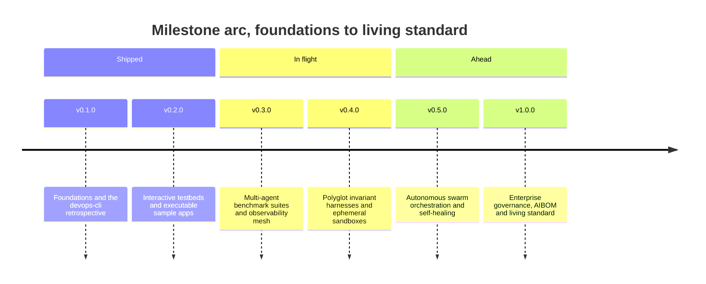
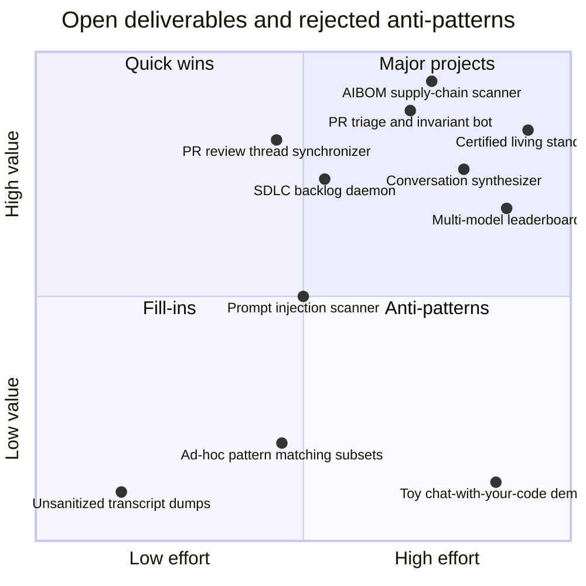

# Strategic Roadmap — vibes ✨

High-density product roadmap, engineering milestones, and open-source curation strategy for the `vibes` living showcase and artifact repository.

---

## Core Vision & Design Principles

1. **Living Laboratory Over Static Museum**: `vibes` is an active workbench. Every observation must be grounded in empirical engineering; every pattern must have a reproducible code or harness artifact.
2. **Beyond "Vibe Coding"**: Systematically counter the narrative that AI coding is undisciplined prompting. Highlight mechanical invariant gates, test-first boundary conditions, and formal state machines.
3. **Zero-Trust Egress & Universal Sanitization**: All artifacts, test fixtures, and logs are 100% sanitized of internal network topologies, private IPs, credentials, and confidential paths.
4. **Executable Demonstrations**: Pair every conceptual pattern with an executable, zero-dependency reference implementation under `examples/`.
5. **Autonomous Swarm Maintainability**: Maintain structured `AGENTS.md` operating instructions and GitHub Project tracking so AI agents can continuously curate, verify, and cross-reference new artifacts autonomously.
6. **Polyglot & Multi-Runtime Breadth**: Extend verification paradigms beyond Python to Rust, Go, TypeScript, and containerized runtime sandboxes.

---

## Release Milestones (Chronological Order)

### Milestone 1: Foundations & The `devops-cli` Retrospective (v0.1.0 - Completed)
- [x] **Repository Architecture & Manifest**: Established four-tier directory structure (`docs/`, `observations/`, `patterns/`, `artifacts/`), Apache 2.0 open-source licensing, and flagship `README.md`.
- [x] **Agent Operating Instructions (`AGENTS.md`)**: Codified strict curation protocols, zero-trust sanitization checklists, and five-part observation authoring standards.
- [x] **The Disciplined Agentic Manifesto (`docs/MANIFESTO.md`)**: The 5 Pillars of Disciplined Agentic Development.
- [x] **Taxonomy of Agentic Engineering (`docs/TAXONOMY.md`)**: Formalized vocabulary for execution models, context topologies, verification gates, and failure modes.
- [x] **Curation Guidelines (`docs/CURATION_GUIDELINES.md`)**: Sanitization rules (RFC 5737 IPs, `example.com` domains) and contribution templates.
- [x] **Foundational Case Studies (`observations/devops-cli/`)**:
  - `01-tdd-as-living-contract.md`: Anchoring LLM non-determinism with executable boundary oracles.
  - `02-architectural-invariants-and-complexity-caps.md`: Enforcing AST complexity $M \le 10$ and nesting $\le 5$.
  - `03-autonomous-project-governance.md`: State grounding via GitHub Projects v2 and atomic task specs.
  - `04-zero-trust-egress-and-sanitization.md`: Eliminating homelab leaks and standardizing dummy mock domains.
  - `05-harness-slots-and-subagent-offloading.md`: "Big decides, small types, big checks" multi-tier routing.
  - `06-rate-limits-and-anti-brittle-heuristics.md`: Surviving API quotas and eliminating arbitrary pattern lists.
- [x] **Operational Patterns (`patterns/`)**:
  - `cegis-and-hypothesis-debugging.md`: Formal constraint accumulation.
  - `fifo-pull-request-shepherding.md`: Chronological queue and GraphQL review thread resolution.
  - `root-cause-hardening.md`: Dual remediation in source code and `AGENTS.md`.
  - `epistemic-hygiene-and-context-pruning.md`: Multi-scale outlines and bounded string caps ($\le 256$ chars).
- [x] **Foundational Artifacts (`artifacts/`)**:
  - `prompts/multi-persona-code-reviewer.md`: Specialized review personas with XML boundary isolation.
  - `prompts/architectural-invariant-sentinel.md`: Pre-push architectural sentinel prompt.
  - `task-harnesses/structured-task-spec-template.md`: Persistent task tracking template.
  - `task-harnesses/sample-completed-task-spec.md`: Certified task completion example.
  - `schemas/fastmcp-agent-tool-manifest-spec.json`: FastMCP tool manifestation contract.

---

### Milestone 2: Interactive Testbeds & Executable Sample Apps (v0.2.0 - Completed)
- [x] **AST Invariant Sentinel Reference App (`examples/ast-invariant-sentinel/`)**: Executable Python static analyzer checking cyclomatic complexity, nesting depth, and IP sanitization with automated `pytest` test suite.
- [x] **FastMCP Token-Bucket Gateway Reference App (`examples/fastmcp-token-bucket-gateway/`)**: Asynchronous, client-side rate limiter and tool dispatcher with burst capacity and jittered backoff.
- [x] **CEGIS Debugging Workbench Reference App (`examples/cegis-debugging-workbench/`)**: Executable simulation of hypothesis-driven counterexample accumulation and candidate patch convergence.
- [x] **Automated CI Validation Workflow (`.github/workflows/ci.yml`)**: Continuous verification of all sample app test suites (`pytest`), AST Invariant Sentinel checks, and FastMCP schema integrity.
- [x] **Autonomous GitHub Project Tooling (`tools/project_tooling.py`)**: Rate-managed CLI and library for issue classification, acceptance criteria tracking, and recursive self-hardening auditing.
- [x] **Autonomous Workflow Suite (`.github/workflows/`)**:
  - `autonomous-triage.yml`: Automatic taxonomy classification, labeling, and onboarding comments.
  - `pr-sentinel.yml`: Invariant sentinel gating PRs with automatic feedback and certification labels.
  - `recursive-hardening.yml`: Closed-loop self-hardening verification on merged defect fixes.
- [x] **Polyglot Case Studies (`observations/polyglot/`)**:
  - `01-rust-type-state-invariants.md`: Type-state patterns and affine types eliminating state bugs at build time.
  - `02-typescript-cst-and-type-gymnastics.md`: Preserving generic contracts and avoiding `any` or `@ts-ignore`.

---

### Milestone 3: Multi-Agent Benchmark Suites & Observability Mesh (v0.3.0 - Active / In Flight)
- [x] **Standardized Agentic Benchmark Runner (`benchmarks/`)**:
  - `ComplexityRefactoring`: Complexity reduction rate and AST $M \le 10$ compliance on messy procedural code.
  - `CEGISConvergence`: Defect convergence velocity and candidate patch minimization.
  - `TokenEconomy`: Quantified token savings comparing monolithic frontier prompting vs. local subagent slot offloading.
- [x] **OpenTelemetry Agent Waterfall Trace Generator (`examples/agent-telemetry-trace-generator/`)**:
  - Reference trace generator emitting W3C traceparent spans, token usage attributes, and ASCII waterfall timelines.
- [x] **Interactive Prompt Mutation Suite & Invariant Fuzzer (`examples/prompt-mutation-fuzzer/`)**:
  - Grammar-guided adversarial prompt perturbation generator testing agent resilience against instruction dilution, distraction noise, prompt injection prefixes, and context truncation.
  - Quantified drift scoring: automatically measures frequency of AST invariant violations and contract regression under perturbed system instructions.
- [x] **Fast-Feedback Test Optimization & Isolated Runner**:
  - Phase 1 (Complete): Added `-o addopts=` worker bypass in `ResourceRunner`, dropping single-file test overhead by > 85% (from 4.4s down to 0.3s) and halving repository iteration time.
  - Phase 2 (Complete): Implemented repository-level isolated `pytest.ini` preventing recursive parent configuration discovery and unpruned workspace plugin activation, achieving consistent sub-second (< 0.5s) test suite execution across all modules.
  - Phase 3 (Complete): Corrected latency oracle measurement validity — the 2.0s fast-feedback ceiling now evaluates pytest's self-reported suite duration (`RunExecutionResult.execution_seconds`) instead of subprocess wall-clock, eliminating a permanent false-positive defect where ~1.7s of fixed interpreter boot masked a 0.38s test body. Irreducible harness cost is surfaced separately via `harness_overhead_seconds`.
  - Phase 5 (Complete): **Directory Map Staleness Oracle** — `docs_validator.py` (`directory_map` rule) now diffs every embedded `text` tree against the filesystem: each mapped path must exist, and any directory the map enumerates must be enumerated completely, inferred per kind so a map listing only subdirectories is not faulted for omitting files. Deliberately partial listings declare an `...` entry. On its first run it found five omissions no other gate could see, including two root documents added in an earlier release. Trace waterfalls and AST dumps drawn with the same box characters are excluded structurally rather than by guesswork.
  - Phase 4 (Complete): Repository sweeps now execute through a single warm pytest session with per-file attribution via JUnit `xunit1` reports, which is the only family recording each test case's source file. Measured on this repository: 20.1s → 11.4s per full iteration (43% faster), with the fixed interpreter-and-collection cost paid once rather than 23 times. A suite missing from the session — collection error, timeout — falls back to its own subprocess, so the optimisation can never swallow a resource. Test attribution is also more accurate than the previous stdout parsing, which undercounted.
- [x] **Continuous File-Watcher Mode (`devops-cli / vibes --watch`)**:
  - Real-time inotify/event-driven daemon executing the 5-phase `Scan -> Run -> Review -> Feedback -> Iterate` loop on file save (`ResourceWatcher`).
  - Instant change detection discovering added, modified, or deleted Python modules across repository topology while ignoring virtual environments and bytecode caches.
  - CLI flags: `--watch`, `--watch-interval <seconds>`, and `--max-ticks <n>` with graceful `KeyboardInterrupt` signal handling.
- [x] **Automated AST Conditional Refactorer (`tools/ast_refactorer.py`)**:
  - Mechanical AST rewriting engine consuming `PROACTIVE_REFACTOR` opportunities from the Feedback Engine and auto-decomposing branching ladders ($M \ge 7$) and deep nesting into table-driven dictionary dispatch mappings, early-return guard clauses, pure predicate helpers, and consolidated assertion tuples.
  - Invariant safety verification gate re-evaluating syntax validity and cyclomatic complexity reduction, with unified diff output and `--from-feedback` backlog ingestion.
- [x] **Live OTLP Observability Mesh & Jaeger/Grafana Collector Pipeline**:
  - Reference export integration streaming agent spans over OpenTelemetry Protocol (OTLP/HTTP) into live Jaeger, Tempo, and Grafana collector endpoints (`examples/agent-telemetry-trace-generator/`).
  - Standardized semantic attributes for agent execution: `agent.persona`, `agent.tool.call_name`, `agent.tokens.prompt`, `agent.tokens.completion`, `agent.cache_hit`, and `agent.verification_result`.
  - CLI support for standard OTLP Protobuf-JSON (`--otlp`) and direct network streaming (`--export-otlp <endpoint>`).
- [x] **Valkey L2 Caching for AST Repomaps & Embedding Drift Auditor (`examples/valkey-l2-repomap-cache/`)**:
  - High-throughput two-tier caching coordinator (L1 fast memory + L2 Valkey distributed cache) content-addressed by SHA-256 digests.
  - Zero-dependency RESP wire protocol encoder/decoder with graceful in-memory mock fallback for offline and standalone CI execution.
  - Embedding drift auditor calculating normalized 8-dimensional structural vectors, Cosine Distance ($D_C$), and symbol topology diffs to detect semantic drift upon code refactoring.
- [x] **Formal Tool Contract Verification Gates (`examples/tool-contract-verifier/`)**:
  - JSON Schema (Draft 2020-12 / OpenAPI compatible) validation engine for all agent tool inputs and outputs.
  - Negative schema assertion harness detecting hallucinated parameters, missing required fields, type mismatches, and unvalidated string lengths (CWE-400).
  - Structured corrective feedback emitting prescriptive error prompts back to the agent for deterministic zero-shot self-correction.

---

### Milestone 4: Polyglot Invariant Harnesses & Ephemeral Sandboxes (v0.4.0 - Planned)
- [x] **Go Concurrency & Goroutine Leak Sentinel (`examples/go-leak-sentinel/`)**:
  - Executable reference tool utilizing Go runtime stack inspection (`runtime.NumGoroutine()`) and `pprof` trace analysis to detect orphaned goroutines, deadlock-prone unbuffered channels, and leaking context lifecycles.
  - Integration with `golangci-lint` AST checkers for static channel closure verification.
- [x] **Rust Memory & Type-State Benchmark Track (`benchmarks/rust/`)**:
  - Specialized benchmark suite evaluating agent capability to synthesize memory-safe, zero-cost abstractions using Rust's affine ownership types and type-state builders (`benchmarks/rust/src/lib.rs`).
  - Automated `cargo test` harness verifying `#![forbid(unsafe_code)]`, zero-sized type-state memory overhead (`size_of::<State>() == 0`), and compile-time rejection of invalid lifecycle transitions.
- [x] **Ephemeral Rootless Docker Sandbox Harness (`examples/ephemeral-container-sandbox/`)**:
  - Lightweight, isolated execution harness for executing untrusted agent-generated code inside unprivileged, rootless containers (`docker` / `podman`) with POSIX simulator fallback.
  - Hardened execution policies: CIS Rootless Container Security Benchmark auditing (8 controls), cgroups v2 resource caps (512MB RAM, 1 CPU, 100 PIDs), read-only root filesystems, ephemeral tmpfs scratch space, dropped capabilities (`CAP_DROP ALL`), zero-trust sanitized environment variables, and strict network egress deny-all policies (`--network none`).
  - Interactive containment matrix demo verifying safe execution, timeout termination, and output buffer bounding (CWE-400 mitigation).
- [x] **Polyglot CST Ingestion Engine (`examples/polyglot-cst-parser/`)**:
  - Unified Concrete Syntax Tree (CST) and AST parser supporting Python, Rust, Go, TypeScript/JavaScript, and Bash.
  - Language-agnostic cyclomatic complexity ($M$) and block nesting depth calculation.
  - Hardened pre-flight file size boundary guards (`MAX_FILE_SIZE_BYTES = 5MB`) mitigating OOM/DoS (CWE-400) and defensive symlink resolution preventing circular loops (`ELOOP`) and workspace traversal escapes.
- [x] **Automated Assertion Consolidation Engine (`tools/ast_refactorer.py`)**:
  - Mechanical AST rewriting transform identifying linear sequences of `ast.Assert` statements in test suites and compiling them into structural tuple equality checks (`assert actual == expected`) and collection predicates (`all(...)`).
  - Automatically mitigates test suite cyclomatic complexity traps ($M > 10$) without loss of pytest element-level diff diagnostics.
- [x] **Ephemeral Container Backend for CEGIS Patch Evaluation (`examples/cegis-debugging-workbench/`)**:
  - Direct integration of `ContainerSandboxHarness` into the CEGIS debugging loop.
  - Safely evaluates candidate patches inside isolated rootless containers with strict cgroup memory (512MB) and PID limits, preventing runaway candidate code from impacting host processes.
- [x] **Zero-Dependency Markdown Syntax & Link Integrity Validator (`tools/docs_validator.py`)**:
  - Standalone, zero-external-dependency validation engine verifying CommonMark nested code fence parity, Mermaid diagram AST headers, markdown table column and delimiter alignment, relative link targets, and paired HTML tags.
  - Native integration with `ResourceIterationWorkbench` (`ResourceType.DOCUMENTATION`) enforcing automated documentation quality gates across 56+ repository documents.
- [x] **Automated Documentation Self-Healing & Relative Path Normalizer (`tools/docs_validator.py --fix`)**:
  - Mechanical remediation engine auto-correcting CommonMark code fence unclosed blocks, unquoted Mermaid node/edge labels, and normalizing IDE absolute paths (`file:///...`) into verified relative links with accurate directory traversal depths.
- [x] **Streaming Reasoning Token Parser & Bounded Stream Sanitizer (`examples/streaming-reasoning-sanitizer/`)**:
  - Streaming FSM extracting reasoning tokens (`<think>`, `[reasoning]`), bounded buffer isolation (CWE-400 mitigation), zero stream hangs, and isolated thought telemetry.
- [x] **High-Performance AST Context Packer with Binary Search Truncation (`examples/binary-search-context-packer/`)**:
  - Algorithmic prompt context packing decomposing Python source into structured AST symbol units, with monotonic binary search convergence ($O(\log N)$) maximizing token budget utilization with zero broken syntax trees.
- [x] **Agentic IDE Lifecycle Hook Sentinel & Zero-Trust Execution Guard (`examples/agentic-ide-hook-sentinel/`)**:
  - Intercepts agent tool execution calls and file writes in IDE control planes (VS Code, Antigravity, Cursor).
  - Enforces zero-trust egress (blocks private RFC 1918 IPs, blocks credential file paths), POSIX process group containment, pre-flight file size bounds (5MB), and LSP diagnostic ingestion.
- [ ] **Automated Seccomp BPF Profile Synthesizer**:
  - Generates minimal, tool-specific Linux seccomp-bpf JSON filter profiles based on static symbol analysis and syscall trace profiling, restricting agent tool execution strictly to required system calls.

---

### Milestone 5: Autonomous Swarm Orchestration & Self-Healing (v0.5.0 - Planned)
- [x] **Reliability SLO Engine & Error-Budget-Driven Phase Policy (`tools/reliability_slo.py`)**:
  - Five service level indicators measured as good events over valid events — `gate_pass_rate`, `invariant_compliance`, `feedback_latency`, `headroom_saturation`, and `toil_containment` — each with a target, a rolling window, and a stated rationale.
  - Error budget arithmetic with burn rate and a minimum-sample floor, replacing the binary `health == 100.0` inversion in `AGENTS.md` §11. Spending budget below target is normal operation; exhausting or burning it freezes proactive work.
  - `OBJECTIVE_REVIEW`: a budget that closes a full window entirely unspent is reported as a finding, since a loop that never fails cannot distinguish reliable from unambitious.
  - Registry/Strategy indicators, frozen value objects, and a single policy table, codified in [`patterns/error-budget-driven-feedback-inversion.md`](../patterns/error-budget-driven-feedback-inversion.md).
- [ ] **Closed-Loop PR Review Thread Synchronizer & Atomic Resolver (`tools/pr_thread_sync.py`)**:
  - Automated PR shepherd querying unresolved GitHub GraphQL review discussion threads, correlating review comments to source AST nodes, orchestrating mechanical fixes with invariant oracles, and atomically posting structured review replies with thread resolution.
- [ ] **Continuous SDLC Backlog & Automated Lifecycle Transition Daemon (`tools/sdlc_project_manager.py --watch`)**:
  - Event-driven background daemon synchronizing `.data/sdlc_backlog.json` state transitions in real time as resources and invariants are validated by `ResourceIterationWorkbench`, auto-advancing ready items and closing resolved defect cards.
- [ ] **Closed-Loop PR Triage & Invariant Review Bot**:
  - GitHub App / Action orchestrating the Multi-Persona Code Reviewer (`security`, `architecture`, `devops`, `qa`) against incoming pull requests.
  - Automated inline review comments, structured GitHub check runs, and AST Invariant Sentinel gating before pull request merges.
- [ ] **Autonomous Conversation-to-Case-Study Synthesizer (`tools/synthesizer/`)**:
  - Automated pipeline ingesting raw agent trajectory logs (JSONL transcripts), applying zero-trust redaction (RFC 5737 IPs, `example.com` domains, secret masking), calculating quantitative token/complexity metrics, and drafting structured observation reports.
- [ ] **Live Multi-Model Leaderboard & Cost-Per-Invariant Index**:
  - Automated benchmarking matrix running weekly against leading frontier and local open-weights models (Claude, GPT-4o, DeepSeek-V3, Qwen-2.5-Coder).
  - Public dashboard tracking: Pass@1 on AST complexity invariants, patch minimality score, and cloud token expenditure per verified pull request.
- [ ] **Hierarchical Subagent Slot Offloading Orchestrator**:
  - Multi-agent coordinator implementing the "Big decides, small types, big checks" architectural pattern.
  - Dynamic routing engine allocating planning to frontier reasoning models, atomic typing and refactoring to lightweight local models, and verification to deterministic AST oracles.

---

### Milestone 6: Enterprise Governance, AIBOM & Living Standard (v1.0.0 - North Star)
- [x] **Post-1.0 Deprecation Lifecycle Enforcement (`examples/deprecation-lifecycle-sentinel/`)**:
  - Executable release gate enforcing the deprecation contract (`since`, `remove_in`, `replacement`), runtime `DeprecationWarning` emission, major-boundary removal scheduling, and internal call-site migration.
  - Pre-1.0 inert by construction: the SemVer major-boundary rule does not bind while the major version is `0`, so the repository keeps delete-on-sight freedom and inherits the discipline automatically at the 1.0 boundary.
  - Codified in [`patterns/post-v1-deprecation-lifecycle.md`](../patterns/post-v1-deprecation-lifecycle.md) and `AGENTS.md` §7.
- [x] **Post-1.0 Deprecation Lifecycle Enforcement (`examples/deprecation-lifecycle-sentinel/`)**:
  - Executable release gate enforcing the deprecation contract (`since`, `remove_in`, `replacement`), runtime `DeprecationWarning` emission, major-boundary removal scheduling, and internal call-site migration.
  - Pre-1.0 inert by construction: the SemVer major-boundary rule does not bind while the major version is `0`, so the repository keeps delete-on-sight freedom and inherits the discipline automatically at the 1.0 boundary.
  - Codified in [`patterns/post-v1-deprecation-lifecycle.md`](../patterns/post-v1-deprecation-lifecycle.md) and `AGENTS.md` §7.
- [ ] **AI Bill of Materials (AIBOM) & Supply-Chain Security Scanner**:
  - Automated scanner generating AIBOM inventories mapping AI dependencies, pretrained weights provenance, Hugging Face model card hashes, and dataset licenses.
  - AST security sentinel scanning codebases for dangerous `trust_remote_code=True`, unpickling vulnerabilities, and unsafe model checkpoint loaders.
- [ ] **Adversarial Prompt Injection & CWE-200 Egress Security Scanner**:
  - Automated red-teaming scanner validating agent code and prompt templates against indirect prompt injection (via file content, tool outputs, or git commits).
  - Zero-Trust Egress Validator verifying zero leakage of environmental variables, secret tokens, or private RFC 1918 hostnames.
- [ ] **Enterprise Change Management & Version Deprecation Protocol**:
  - Full enterprise adoption playbook: Semantic Versioning 2.0.0 enforcement, runtime feature flags, structured multi-release deprecation warning cycles, and automated migration tooling for agent tool schemas.
- [ ] **Certified Living Standard for Agentic Engineering**:
  - Formal specification and certification test suite for AI coding assistants.
  - Standardized open compliance badge (`Passed Vibes Invariant Gate v1.0`) for repositories engineered with disciplined agentic workflows.

---

## Research & Observation Backlog (Living Research Queue)

Upcoming field observations, empirical studies, and architectural investigations to be authored and added to `observations/`:

| Topic / Working Title | Target Domain | Key Research Question | Status / Outcome |
|---|---|---|---|
| **Negative Tool Schema Invariants vs. Hallucinated Parameters** | `observations/devops-cli/` | Zero-shot agent recovery using JSON Schema negative assertions and prescriptive error prompt synthesis. | ✅ Completed ([Obs 10](../observations/devops-cli/10-negative-tool-contract-assertions-and-prescriptive-prompt-synthesis.md)) |
| **Tree-Sitter CST vs. AST Hierarchy & Boundary Traps** | `observations/devops-cli/` | Reconciling visual indentation depth against hierarchical AST structures and enforcing file size / symlink boundaries. | ✅ Completed ([Obs 09](../observations/devops-cli/09-mechanical-ast-rewriting-and-automated-refactoring-convergence.md), [Obs 12](../observations/devops-cli/12-polyglot-cst-boundary-guards-and-symlink-containment.md)) |
| **Autonomous Session Retrospective & Recursive Inversion** | `docs/` | Systemic retrospective analyzing agent failure modes, mechanical oracles, and the reactive-to-proactive feedback inversion. | ✅ Completed ([RETROSPECTIVE.md](./RETROSPECTIVE.md)) |
| **Go Goroutine Leakage & Context Lifecycles** | `observations/polyglot/` | How do frontier models handle graceful cancellation and channel closure under high concurrency? | ✅ Completed ([Obs 03](../observations/polyglot/03-go-goroutine-leakage-and-context-lifecycles.md)) |
| **Streaming Reasoning Token Parsers & Think Block Sanitization** | `observations/devops-cli/` | Preventing `<think>` trace leakage into execution payloads and tool parameters via streaming FSM sanitizers. | ✅ Completed ([Obs 13](../observations/devops-cli/13-streaming-reasoning-token-parsers-and-think-block-sanitization.md)) |
| **Binary Search AST Context Packing & Token Budgeting** | `observations/devops-cli/` | Packing multi-symbol AST context into exact token budgets without mid-block syntax breakage. | ✅ Completed ([Obs 14](../observations/devops-cli/14-binary-search-ast-context-packing-and-token-budgeting.md)) |
| **LLM Structured Output Repair & Schema Reconciliation** | `observations/devops-cli/` | In-process syntactic repair of markdown fences, trailing commas, and truncated braces. | ✅ Completed ([Obs 15](../observations/devops-cli/15-llm-structured-output-repair-and-schema-reconciliation.md)) |
| **Agentic IDE Protocols & LSP/MCP Convergence** | `observations/systems/` | How do Language Server diagnostics and Model Context Protocol tools converge with zero-trust IDE hooks? | ✅ Completed ([Obs 07](../observations/systems/07-agentic-ide-protocols-and-lsp-mcp-convergence.md)) |
| **Suppression Ergonomics: Waivers That Cannot Become Mute Buttons** | `patterns/` | Which invariants may a codebase ever waive, and what makes a waiver auditable rather than an escape hatch that erodes the gate? | ✅ Completed ([Gate Integrity pattern](../patterns/gate-integrity-and-total-input-coverage.md)) |
| **Silent Certification Failures in Mechanical Gates** | `observations/systems/` | When an enforcement tool reads only the first of N inputs and reports success, how long does a green checkmark conceal unaudited code? | ✅ Completed ([Obs 11](../observations/systems/11-silent-certification-failure-and-gate-integrity.md)) |
| **Oracle Measurement Validity & Harness-Smeared Metrics** | `observations/systems/` | When a deterministic oracle measures its own scaffolding, how long does an agent chase an unfixable defect before suspecting the ruler rather than the object? | ✅ Completed ([Obs 11](../observations/systems/11-silent-certification-failure-and-gate-integrity.md)) |
| **C++ RAII & Lifetime Invariants Under LLM Synthesis** | `observations/polyglot/` | Can LLMs reliably avoid use-after-free and double-free bugs without Rust-like compile-time guarantees? | 🔬 In Queue |
| **eBPF Process Tracing for Agent Sandbox Introspection** | `observations/systems/` | Using eBPF probes to capture syscall patterns, file access, and network socket operations of subagents in real-time. | 🔬 In Queue |
| **Attention Dilution & Context Decay in Ultra-Long Sessions** | `observations/cognitive/` | Measuring degradation in constraint adherence as context lengths exceed 100k tokens and evaluating multi-scale pruning. | 🔬 In Queue |
| **Self-Correction Loops vs. Constraint Accumulation** | `observations/methodology/` | Comparing conversational "fix this error" prompting vs. formal CEGIS negative-constraint accumulation. | 🔬 In Queue |

---

## Value vs. Effort Prioritization Matrix

Every item still open, placed by the same value and effort judgements the table records. The rejected anti-patterns are plotted alongside deliberately — a roadmap is defined as much by what it refuses as by what it schedules:

| Priority Category | Feature / Deliverable | Primary Tech / Tools | Value | Effort | Target Milestone | Status |
|---|---|---|---|---|---|---|
| **Quick Wins** | Executable Sample Apps (`sentinel`, `gateway`, `workbench`, `trace-gen`) | Python Standard Library | High | Low | v0.2.0 | ✅ Completed |
|  | Strategic Product Roadmap (`docs/ROADMAP.md`) | Markdown / Planning | High | Low | v0.2.0 | ✅ Completed |
|  | GitHub Actions CI & Recursive Workflows | GitHub Workflows / `pytest` | High | Low | v0.2.0 | ✅ Completed |
|  | Autonomous Project Tooling (`tools/project_tooling.py`) | Python Standard Library | High | Low | v0.2.0 | ✅ Completed |
|  | Polyglot Case Studies (Rust & TypeScript) | Systems Engineering | High | Low | v0.2.0 | ✅ Completed |
|  | Continuous File-Watcher Mode (`--watch`) | Python / inotify | High | Low | v0.3.0 | ✅ Completed |
|  | Zero-Dependency Markdown Syntax & Link Integrity Validator | Python Standard Library | High | Low | v0.4.0 | ✅ Completed |
|  | Automated Documentation Self-Healing & Relative Path Normalizer | Python Standard Library | High | Low | v0.4.0 | ✅ Completed |
|  | Streaming Reasoning Token Parser & Sanitizer | Python / Streaming FSM | High | Medium | v0.4.0 | ✅ Completed |
|  | High-Performance AST Context Packer | Python AST / Binary Search | High | Medium | v0.4.0 | ✅ Completed |
|  | Agentic IDE Lifecycle Hook Sentinel | Python / Process Groups / LSP | High | Medium | v0.4.0 | ✅ Completed |
| **Major Projects** | Multi-Agent Benchmark Suite (`benchmarks/`) | `pytest` / AST Analyzer | High | Medium | v0.3.0 | ✅ Completed |
|  | OpenTelemetry Agent Waterfall Generator | OpenTelemetry / Python | High | Medium | v0.3.0 | ✅ Completed |
|  | Interactive Prompt Mutation Suite & Invariant Fuzzer | Python / AST / Fuzzing | High | Medium | v0.3.0 | ✅ Completed |
|  | Fast-Feedback Test Optimization & Isolated Runner | Pytest / Isolated ini | High | Medium | v0.3.0 | ✅ Completed |
|  | Automated AST Conditional Refactorer | Python AST Transformer | High | Medium | v0.3.0 | ✅ Completed |
|  | OTLP Live Collector & Jaeger/Grafana Mesh | OTLP / gRPC / Docker | High | Medium | v0.3.0 | ✅ Completed |
|  | Valkey L2 AST Caching & Embedding Drift Auditor | Valkey / Redis / Vector | High | Medium | v0.3.0 | ✅ Completed |
|  | Rust Memory & Type-State Benchmark Track | Cargo / Clippy / Rust | High | Medium | v0.4.0 | ✅ Completed |
|  | Rootless Docker Sandbox Harness | Docker / cgroups v2 | High | High | v0.4.0 | ✅ Completed |
|  | Polyglot CST Ingestion Engine | Tree-Sitter / Multi-Lang | High | High | v0.4.0 | ✅ Completed |
|  | Go Concurrency & Goroutine Leak Sentinel | Go 1.23 / `pprof` | High | Medium | v0.4.0 | ✅ Completed |
|  | Automated Assertion Consolidation Engine | Python AST Transformer | High | Medium | v0.4.0 | ✅ Completed |
|  | Ephemeral Container Backend for CEGIS | Docker / cgroups v2 | High | High | v0.4.0 | ✅ Completed |
|  | Closed-Loop PR Review Thread Synchronizer & Atomic Resolver | Python / GraphQL / AST | High | Medium | v0.5.0 | 📋 Scheduled |
|  | Continuous SDLC Backlog & Automated Lifecycle Transition Daemon | Python / Watcher / JSON | High | Medium | v0.5.0 | 📋 Scheduled |
|  | Closed-Loop PR Triage & Invariant Review Bot | FastMCP / GitHub Actions | High | High | v0.5.0 | 📋 Scheduled |
|  | Autonomous Conversation Synthesizer | Python / NLP / Metrics | High | High | v0.5.0 | 📋 Scheduled |
|  | Live Multi-Model Leaderboard & Cost Index | Python / GitHub Pages | High | High | v0.5.0 | 📋 Scheduled |
|  | AIBOM & Supply-Chain Security Scanner | Python / AST / CycloneDX | High | High | v1.0.0 | 💡 Future Vision |
|  | Certified Living Standard & Compliance Badge | Specification / Test Suite | High | High | v1.0.0 | 💡 Future Vision |
| **Fill-Ins** | Community Issue Templates & PR Rubrics | GitHub Templates | Medium | Low | v0.1.0 | ✅ Completed |
|  | Adversarial Prompt Injection Security Scanner | Red-Teaming / Python | Medium | Medium | v1.0.0 | 💡 Future Vision |
| **Foundation** | Invariant Curation Guidelines & Sanitization | `AGENTS.md` / RFC 5737 | High | Medium | v0.1.0 | ✅ Completed |
|  | Disciplined Agentic Manifesto | `docs/MANIFESTO.md` | High | Medium | v0.1.0 | ✅ Completed |
|  | Taxonomy of Agentic Engineering | `docs/TAXONOMY.md` | High | Medium | v0.1.0 | ✅ Completed |
| **Anti-Patterns** | Toy "Chat with your Code" Demos | Generic LangChain wrappers | Low | High | — | ❌ Rejected (No toy demos) |
|  | Unsanitized Transcript Dumps | Raw log files | Low | Low | — | ❌ Rejected (Zero leakage) |
|  | Ad-Hoc Pattern Matching Subsets | Arbitrary regex lists | Low | Medium | — | ❌ Rejected (Use AST / RFCs) |
