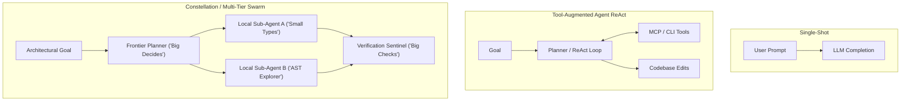
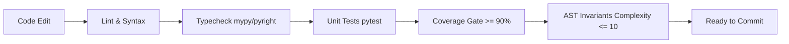

# Taxonomy of Agentic Software Engineering

A comprehensive taxonomy of architectures, execution topologies, verification gates, and failure modes observed in autonomous and pair-programmed AI software engineering.

---

## 1. Execution Models & Topologies

### 1.1 Single-Shot Prompting (Generation Without Scaffolding)
- **Definition**: Directly requesting the model to produce an entire file or diff without intermediate verification steps.
- **Failure Profile**: High risk of hallucinated imports, syntax regressions, and unhandled edge cases beyond ~200 lines of code.

### 1.2 Tool-Augmented Agent (ReAct / Step-by-Step Loop)
- **Definition**: An agent equipped with structured tool definitions (e.g. Model Context Protocol / FastMCP) that operates via an iterative *Thought -> Action -> Observation -> Reflection* loop.
- **Key Advantage**: Ability to read actual compiler errors, inspect directory trees, and iteratively fix test failures.

### 1.3 Multi-Tier Agent Constellations ("Own the Sensitive, Rent the Frontier")
- **Definition**: Partitioning execution into swappable roles across multiple model tiers:
  - **Frontier Models (Claude Opus, GPT-4o, Gemini Pro)**: Used exclusively for architectural synthesis, ambiguous problem decomposition, and final verification reviews.
  - **Local Open-Weight Models (Granite, Qwen, DeepSeek)**: Used for token-heavy, mechanical tasks such as AST symbol indexing, code parsing, documentation cross-referencing, and draft test authoring.
- **Economics**: Yields 80–90% token cost reduction while maintaining high architectural quality.

---

## 2. Context Topologies & Memory Substrates

### 2.1 Working Memory vs. Epistemic Scratchpad
- **Working Memory**: The ephemeral active context window containing recent tool calls, terminal outputs, and system instructions.
- **Epistemic Scratchpad (`ScratchpadBuffer`)**: An explicit structured buffer where the agent records hypotheses, falsified assumptions, and intermediate calculations before generating diffs.

### 2.2 Concrete Context Packing vs. Inspectional Outlines
- **Monolithic Context Packing**: Stuffing entire files into the prompt. Causes attention dilution ("lost in the middle" phenomenon) and burns token budgets.
- **Inspectional Outlines**: Presenting file structures via AST symbol trees, function signatures, and high-level summaries first. The agent selectively drills down into specific line ranges only when necessary.

### 2.3 Layered Cache Hierarchy (Valkey / Local Vector)
- **L1 Cache (In-Memory)**: Active conversation working memory.
- **L2 Cache (Valkey / Redis)**: Persistent vector embedding and token cache for AST repomaps, test logs, and frequent query responses across sessions.
- **L3 Cold Storage**: Structured disk archives (`.data/` or Git repository history).

---

## 3. Verification Gates & Oracles

In agentic systems, a "gate" is a deterministic validation checkpoint that prevents an agent from proceeding if a condition is violated.

### 3.1 Syntax & Type Invariant Gate
- Fast, static verification (e.g. `ruff`, `mypy`, `tsc`) ensuring types match interfaces without runtime execution.

### 3.2 Executable Unit & Integration Test Oracle
- Deterministic automated tests that confirm behavioral specifications. Exit code 0 is mandatory.

### 3.3 Test Coverage Threshold Gate
- Enforcing minimum coverage percentages (e.g. $\ge 90.0\%$) ensures the agent cannot declare completion by testing only the happy path.

### 3.4 AST Complexity & Nesting Invariant Gate
- Direct mathematical evaluation of code metrics:
  - **Cyclomatic Complexity**: $\le 10$ per function.
  - **Indentation Depth**: $\le 5$ levels (<6 tabs/spaces blocks).
- Rejects procedural bloat automatically.

---

## 4. Failure Modes & Cognitive Antipatterns

| Failure Mode | Description | Manifestation in Code | Architectural Antidote |
|---|---|---|---|
| **Context Saturation Drift** | Working memory fills with verbose logs; agent forgets original constraints. | Starts modifying unrelated files or re-introducing previously fixed bugs. | Bounded error string truncation ($\le 256$ chars), log pruning, sub-agent task offloading. |
| **Sycophantic Completion** | Agent pretends an issue is resolved without verifying in the terminal. | Says *"I have fixed the issue"* while CI tests are still failing. | Pre-push automated hooks running full CI suite; agent cannot push without green exit codes. |
| **Procedural Spaghetti Creep** | Adding nested `if/elif` blocks for every new requirement. | Functions balloon to 150+ lines with 8 nesting levels. | AST complexity gating ($\le 10$), mandatory dictionary dispatchers and functional pipelines. |
| **Brittle Heuristic Guessing** | Matching against arbitrary partial lists of strings or suffixes. | `if name.endswith("Service"): ...` breaks on valid alternative naming. | Strict prohibition of arbitrary subsets; require official RFC grammars, AST visitors, or PSLs. |
| **Zombie Fallback Clutter** | Preserving obsolete fallback code or adding backward-compatibility wrappers. | Deprecated classes and legacy shims clutter the codebase. | Zero backward-compatibility mandate in alpha; ruthless removal of zombie code. |
| **Information Leakage** | Leaking private IP addresses, homelab hostnames, or keys into commits. | A concrete LAN address, or credentials, embedded in documentation. | Automated sanitization scanners; mandatory use of RFC 5737 and `example.com`. |
| **The Phantom Architecture Trap** | LLMs describe idealized systems in docs that exceed implementation reality. | Downstream agents treat phantom doc interfaces as truth, calling nonexistent flags. | Tier 1 mechanical AST/reflection extraction; never let an LLM generate API reference tables. |
| **Circular Self-Consistency Trap** | Generating code, tests, and documentation simultaneously in a closed loop. | Internal gates pass 100% while code completely diverges from external physical realities. | Ground assertions in physical oracles (exit codes, network traces, external standards). |
| **Attention Dilution / Context Rot** | Narrative prose bloats context, pushing invariants into the lost-in-the-middle dead zone. | Agents violate core security rules while obsessively adhering to narrative formatting rules. | Active context compaction ($ADI \le 1.5$); enforce concise intent and bounded string caps. |
| **CommonMark Linebreak Degradation** | Formatters strip intentional double-space hard line breaks (`  \n`). | Markdown renders broken blockquotes and unreadable soft-wrapped lists. | Pre-commit `--markdown-linebreak-ext=md` and deterministic `DOC012` linebreak validator. |
| **Defect-Shaped Loop Myopia** | Internal verification loop only fixes what exists, blind to what should exist next. | Backlog reaches 0 items while capabilities fall behind external ecosystem conventions. | Outward landscape surveys (`landscape_survey.py`) and autonomous roadmap ingestion. |
| **Stochastic RSI Divergence** | Autonomous self-improvement loop generates code, tests, and goals without invariant bounds. | Compounding hallucinations and degrading architectural headroom across generations. | Invariant-grounded RSI: asymmetric AST gating ($P$ vs $NP$) and monotonic CEGIS constraint accumulation. |
| **Unusable Visualization Sprawl** | Mermaid diagrams sprawl into unbranched vertical towers (>3:1) or flat ribbons (<1:3). | Multi-page vertical scrolling distortion or microscopic text scaling in GitHub viewports. | Bounded aspect ratio invariant ($1:3 \le H/W \le 3:1$) via 2D matrix and column layouts. |
| **Mitigation-Refutation Conflation** | Verifier confirms a defect but dismisses it based on a contextual mitigation, marking it refuted. | Critical security and concurrency flaws are silently dropped from developer reports. | Tripartite verification (Confirmed, Refuted with Line Citation, Mitigated with Named Mechanism). |
| **Unreliable Teacher Contamination** | Negative filtering catalogs learn from stochastic model invalidation verdicts. | Model agreement widens suppression rules, permanently blinding the system to genuine defects. | Epistemic Seam: negative catalogs learn strictly from deterministic AST checks or human verification. |
| **Evaluator Parochialism** | Universal review and verification engines judge external repositories against host house rules. | Foreign codebases receive false-positive violations for conventions they do not declare. | Nearest-root convention scoping (`.devops/review.md`) and agnostic verifier prompts. |
| **The Language Game Trap** | Verifiers debate code correctness in open-ended prose, accepting semantic vocabulary as proof of safety. | Models accept plausible excuses for unbound buffers or path traversals without executing code. | Kinetic falsification: replace prose arguments with minimal executable counterexample probes. |
| **The Kolmogorov Verification Gap** | Spending thousands of tokens attempting symbolic safety proofs instead of searching for minimal counterexamples. | Verification stalls in multi-turn debate while program correctness remains unproven. | Exploits are minimal ($NP$-complete search); synthesize ephemeral test cases and evaluate exit codes. |
| **Mitigation Perimeter Decay** | Dormant vulnerabilities mitigated by external perimeters detonate when refactors modify the wrapper. | Refactoring API routing removes request size limits, detonating an unindexed parser vulnerability. | Invariant leashing: link defect mitigations to perimeter files and re-trigger probes on mutation. |

