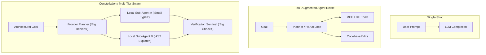
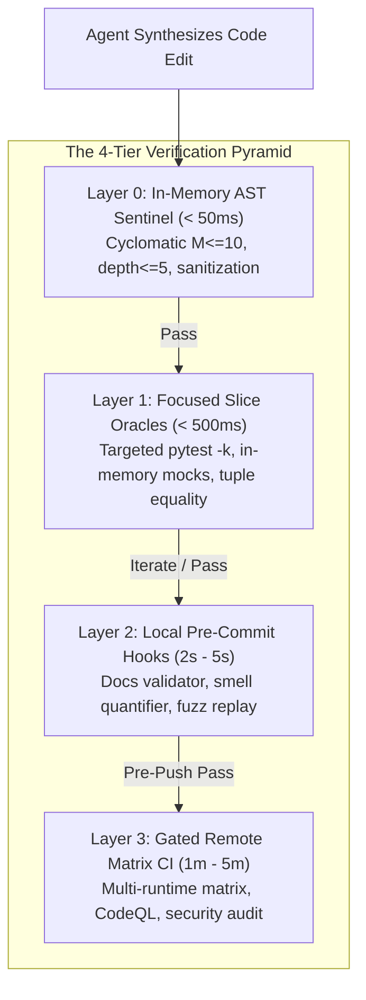

# Taxonomy of Agentic Software Engineering

A comprehensive taxonomy of architectures, execution topologies, verification gates, and failure modes observed in autonomous and pair-programmed AI software engineering.

> **TLDR**: A structured catalog classifying agent architectures (single-shot, ReAct, multi-tier constellations), context memory topologies, mechanical verification gates, and cognitive AI failure modes.
>
> **ELI:7b**: A field guide that classifies all the different ways AI coding agents are set up, how they remember things, how they check their work, and the typical traps they fall into.
>
> 💡 *Want the fundamentals without technical jargon? See [The Dummy's Guide to Agentic Engineering](./dummysguide/README.md).*
>
> 🔬 *For external academic grounding, empirical critiques, and code samples, see [Empirical Foundations & Critical Synthesis](./EMPIRICAL_FOUNDATIONS.md).*

---

## 1. Execution Models & Topologies

```mermaid
flowchart TD
    subgraph Single-Shot
        SS[User Prompt] --> LLM1[LLM Completion]
    end

    subgraph Tool-Augmented Agent ReAct
        TA[Goal] --> Agent[Planner / ReAct Loop]
        Agent <--> Tools[MCP / CLI Tools]
        Agent --> Code[Codebase Edits]
    end

    subgraph Constellation / Multi-Tier Swarm
        Goal2[Architectural Goal] --> Frontier["Frontier Planner ('Big Decides')"]
        Frontier --> Sub1["Local Sub-Agent A ('Small Types')"]
        Frontier --> Sub2["Local Sub-Agent B ('AST Explorer')"]
        Sub1 --> Verifier["Verification Sentinel ('Big Checks')"]
        Sub2 --> Verifier
    end
```

### 1.1 Single-Shot Prompting (Generation Without Scaffolding)
- **Definition**: Directly requesting the model to produce an entire file or diff without intermediate verification steps.
- **Failure Profile**: High risk of hallucinated imports, syntax regressions, and unhandled edge cases beyond ~200 lines of code.

### 1.2 Tool-Augmented Agent (ReAct / Step-by-Step Loop)
- **Definition**: An agent equipped with structured tool definitions (e.g. Model Context Protocol / FastMCP) that operates via an iterative *Thought -> Action -> Observation -> Reflection* loop.
- **Key Advantage**: Ability to read actual compiler errors, inspect directory trees, and iteratively fix test failures.

### 1.3 Multi-Tier Agent Constellations ("Own the Sensitive, Rent the Frontier")
- **Definition**: Partitioning execution into swappable roles across multiple model tiers:
  - **Frontier Models (Claude Opus, GPT-4o, Gemini Pro)**: Used exclusively for architectural synthesis, ambiguous problem decomposition, and final verification reviews.
  - **Local Open-Weight Models (Granite, Qwen, DeepSeek)**: Used for token-heavy, mechanical tasks such as AST symbol indexing, code parsing, documentation cross-referencing, and draft test authoring.
- **Economics**: Yields 80–90% token cost reduction while maintaining high architectural quality.

---

## 2. Context Topologies & Memory Substrates

### 2.1 Working Memory vs. Epistemic Scratchpad
- **Working Memory**: The ephemeral active context window containing recent tool calls, terminal outputs, and system instructions.
- **Epistemic Scratchpad (`ScratchpadBuffer`)**: An explicit structured buffer where the agent records hypotheses, falsified assumptions, and intermediate calculations before generating diffs.

### 2.2 Concrete Context Packing vs. Inspectional Outlines
- **Monolithic Context Packing**: Stuffing entire files into the prompt. Causes attention dilution ("lost in the middle" phenomenon) and burns token budgets.
- **Inspectional Outlines**: Presenting file structures via AST symbol trees, function signatures, and high-level summaries first. The agent selectively drills down into specific line ranges only when necessary.

### 2.3 Layered Cache Hierarchy (Valkey / Local Vector)
- **L1 Cache (In-Memory)**: Active conversation working memory.
- **L2 Cache (Valkey / Redis)**: Persistent vector embedding and token cache for AST repomaps, test logs, and frequent query responses across sessions.
- **L3 Cold Storage**: Structured disk archives (`.data/` or Git repository history).

---

## 3. Verification Gates & Oracles

In agentic systems, a "gate" is a deterministic validation checkpoint that prevents an agent from proceeding if a condition is violated.

```mermaid
flowchart LR
    Edit[Code Edit] --> G1[Lint & Syntax]
    G1 --> G2[Typecheck mypy/pyright]
    G2 --> G3[Unit Tests pytest]
    G3 --> G4[Coverage Gate >= 90%]
    G4 --> G5[AST Invariants Complexity <= 10]
    G5 --> Commit[Ready to Commit]
```

### 3.1 Syntax & Type Invariant Gate
- Fast, static verification (e.g. `ruff`, `mypy`, `tsc`) ensuring types match interfaces without runtime execution.

### 3.2 Executable Unit & Integration Test Oracle
- Deterministic automated tests that confirm behavioral specifications. Exit code 0 is mandatory.

### 3.3 Test Coverage Threshold Gate
- Enforcing minimum coverage percentages (e.g. $\ge 90.0\%$) ensures the agent cannot declare completion by testing only the happy path.

### 3.4 AST Complexity & Nesting Invariant Gate
- Direct mathematical evaluation of code metrics:
  - **Cyclomatic Complexity**: $\le 10$ per function.
  - **Indentation Depth**: $\le 5$ levels (<6 tabs/spaces blocks).
- Rejects procedural bloat automatically.

### 3.5 The 4-Tier Verification Pyramid Architecture
As codebases scale past hundreds of tests, monolithic test execution latency balloons from $500\text{ms} \to 45\text{s}+$, triggering the Verification Horizon Latency Cliff where agent single-turn convergence collapses from $94.7\% \to 18.2\%$. Disciplined systems decouple validation depth from iteration cadence via four stratified tiers:

```mermaid
flowchart TD
    subgraph Pyramid ["The 4-Tier Verification Pyramid"]
        L3["Layer 3: Gated Remote Matrix CI (1m - 5m)<br/>Multi-runtime matrix, CodeQL, security audit"]
        L2["Layer 2: Local Pre-Commit Hooks (2s - 5s)<br/>Docs validator, smell quantifier, fuzz replay"]
        L1["Layer 1: Focused Slice Oracles (< 500ms)<br/>Targeted pytest -k, in-memory mocks, tuple equality"]
        L0["Layer 0: In-Memory AST Sentinel (< 50ms)<br/>Cyclomatic M<=10, depth<=5, sanitization"]
    end

    Edit["Agent Synthesizes Code Edit"] --> L0
    L0 -->|Pass| L1
    L1 -->|Iterate / Pass| L2
    L2 -->|Pre-Push Pass| L3
```

- **Layer 0: In-Memory AST Sentinel ($\le 50\text{ms}$)**: Sub-50ms static AST verification catching monster functions ($M > 10$), deep nesting ($> 5$), and secret/IP leaks before test invocation.
- **Layer 1: Focused Slice Oracle ($\le 500\text{ms}$)**: Sub-second execution of touched test modules or functions in isolated environments, delivering precise counterexamples.
- **Layer 2: Local Pre-Commit Hooks ($\le 5.0\text{s}$)**: Pre-commit git hooks validating documentation integrity, code smells, and regression replay.
- **Layer 3: Gated Remote Matrix CI ($1\text{m} - 5\text{m}$)**: Full repository CI matrix across multiple runtime versions and environments.

### 3.6 Structural Tuple Consolidation in Test Suites
- Under Python AST semantics, every `assert expr` statement compiles to an implicit conditional branch (`if not (expr): raise AssertionError`), adding $+1$ to the test function's McCabe cyclomatic complexity $M$.
- Linear assertion sprawl causes comprehensive test functions to breach architectural complexity limits ($M \le 10$).
- **Structural Tuple Consolidation** (`assert (actual_a, actual_b) == (expected_a, expected_b)`) and collection predicates (`assert all(...)`) compress multi-property checks down to $M=1$ while fully preserving pytest diff diagnostics.

---

## 4. Failure Modes & Cognitive Antipatterns

| Failure Mode | Description | Manifestation in Code | Architectural Antidote |
|---|---|---|---|
| **Context Saturation Drift** | Working memory fills with verbose logs; agent forgets original constraints. | Starts modifying unrelated files or re-introducing previously fixed bugs. | Bounded error string truncation ($\le 256$ chars), log pruning, sub-agent task offloading. |
| **Sycophantic Completion** | Agent pretends an issue is resolved without verifying in the terminal. | Says *"I have fixed the issue"* while CI tests are still failing. | Pre-push automated hooks running full CI suite; agent cannot push without green exit codes. |
| **Procedural Spaghetti Creep** | Adding nested `if/elif` blocks for every new requirement. | Functions balloon to 150+ lines with 8 nesting levels. | AST complexity gating ($\le 10$), mandatory dictionary dispatchers and functional pipelines. |
| **Brittle Heuristic Guessing** | Matching against arbitrary partial lists of strings or suffixes. | `if name.endswith("Service"): ...` breaks on valid alternative naming. | Strict prohibition of arbitrary subsets; require official RFC grammars, AST visitors, or PSLs. |
| **Zombie Fallback Clutter** | Preserving obsolete fallback code or adding backward-compatibility wrappers. | Deprecated classes and legacy shims clutter the codebase. | Zero backward-compatibility mandate in alpha; ruthless removal of zombie code. |
| **Information Leakage** | Leaking private IP addresses, homelab hostnames, or keys into commits. | A concrete LAN address, or credentials, embedded in documentation. | Automated sanitization scanners; mandatory use of RFC 5737 and `example.com`. |
| **The Phantom Architecture Trap** | LLMs describe idealized systems in docs that exceed implementation reality. | Downstream agents treat phantom doc interfaces as truth, calling nonexistent flags. | Tier 1 mechanical AST/reflection extraction; never let an LLM generate API reference tables. |
| **Circular Self-Consistency Trap** | Generating code, tests, and documentation simultaneously in a closed loop. | Internal gates pass 100% while code completely diverges from external physical realities. | Ground assertions in physical oracles (exit codes, network traces, external standards). |
| **Attention Dilution / Context Rot** | Narrative prose bloats context, pushing invariants into the lost-in-the-middle dead zone. | Agents violate core security rules while obsessively adhering to narrative formatting rules. | Active context compaction ($ADI \le 1.5$); enforce concise intent and bounded string caps. |
| **CommonMark Linebreak Degradation** | Formatters strip intentional double-space hard line breaks (`  \n`). | Markdown renders broken blockquotes and unreadable soft-wrapped lists. | Pre-commit `--markdown-linebreak-ext=md` and deterministic `DOC012` linebreak validator. |
| **Defect-Shaped Loop Myopia** | Internal verification loop only fixes what exists, blind to what should exist next. | Backlog reaches 0 items while capabilities fall behind external ecosystem conventions. | Outward landscape surveys (`landscape_survey.py`) and autonomous roadmap ingestion. |
| **Stochastic RSI Divergence** | Autonomous self-improvement loop generates code, tests, and goals without invariant bounds. | Compounding hallucinations and degrading architectural headroom across generations. | Invariant-grounded RSI: asymmetric AST gating ($P$ vs $NP$) and monotonic CEGIS constraint accumulation. |
| **Unusable Visualization Sprawl** | Mermaid diagrams sprawl into unbranched vertical towers (>3:1) or flat ribbons (<1:3). | Multi-page vertical scrolling distortion or microscopic text scaling in GitHub viewports. | Bounded aspect ratio invariant ($1:3 \le H/W \le 3:1$) via 2D matrix and column layouts. |
| **Mitigation-Refutation Conflation** | Verifier confirms a defect but dismisses it based on a contextual mitigation, marking it refuted. | Critical security and concurrency flaws are silently dropped from developer reports. | Tripartite verification (Confirmed, Refuted with Line Citation, Mitigated with Named Mechanism). |
| **Unreliable Teacher Contamination** | Negative filtering catalogs learn from stochastic model invalidation verdicts. | Model agreement widens suppression rules, permanently blinding the system to genuine defects. | Epistemic Seam: negative catalogs learn strictly from deterministic AST checks or human verification. |
| **Evaluator Parochialism** | Universal review and verification engines judge external repositories against host house rules. | Foreign codebases receive false-positive violations for conventions they do not declare. | Nearest-root convention scoping (`.devops/review.md`) and agnostic verifier prompts. |
| **The Language Game Trap** | Verifiers debate code correctness in open-ended prose, accepting semantic vocabulary as proof of safety. | Models accept plausible excuses for unbound buffers or path traversals without executing code. | Kinetic falsification: replace prose arguments with minimal executable counterexample probes. |
| **The Kolmogorov Verification Gap** | Spending thousands of tokens attempting symbolic safety proofs instead of searching for minimal counterexamples. | Verification stalls in multi-turn debate while program correctness remains unproven. | Exploits are minimal ($NP$-complete search); synthesize ephemeral test cases and evaluate exit codes. |
| **Mitigation Perimeter Decay** | Dormant vulnerabilities mitigated by external perimeters detonate when refactors modify the wrapper. | Refactoring API routing removes request size limits, detonating an unindexed parser vulnerability. | Invariant leashing: link defect mitigations to perimeter files and re-trigger probes on mutation. |
| **Instruction Ratchet Bloat** | Monotonic accumulation of system prompt rules without empirical retention audits or pruning. | Prompts expand past 30k tokens, consuming context budgets and driving up inference latency. | JIT instruction governance, token weight auditing, and counterfactual rule ablation (`instruction_governor.py`). |
| **Lost-in-the-Middle Invariant Extinction** | Crucial rules positioned in the central third of monolithic instruction sets suffer steep attention decay. | Models routinely violate middle-prompt security and formatting invariants despite presence in prompt. | Two-tier JIT decomposition: bounded ($\le 2$k) Tier 1 Invariant Envelope with dynamic Tier 2 domain overlays. |
| **The Verification Horizon / Latency Cliff** | Monolithic test suites ($> 900$ tests) run on every edit induce tool timeouts ($14.6\%$), poll loops, and attention dilution. | Monotonic repair loops collapse into thrashing; models forget original architectural constraints during background waits. | 4-Tier Verification Pyramid: Layer 0 AST sentinel ($\le 50\text{ms}$), Layer 1 focused slice oracle ($\le 500\text{ms}$), Layer 2 pre-commit, Layer 3 gated CI. |
| **The Assertion Density Complexity Trap** | Linear `assert expr` statements compile to `if not (expr): raise`, adding $+1$ to McCabe complexity $M$ per assertion. | Purely linear test functions breach $M \le 10$ complexity invariants despite zero nested branching. | Structural tuple equality consolidation: `assert (a, b) == (x, y)` preserving pytest element diffs with $M=1$. |
| **The Milestone Horizon Inflation Trap** | Autonomous agents continuously admit discovered defects or edge cases into an active milestone causing $V_{\text{scope}} > V_{\text{burn}}$. | Milestone completion rate stays trapped at $70\%-90\%$ across 100+ commits, resulting in release live-locks. | Three-phase Milestone Scope Air-Lock (`INTAKE` $\to$ `AIR_LOCKED` $\to$ `FROZEN`), rolling convergence ratio gate $C_R \ge 1.2$, and automated rollover partitioning via `milestone_governor.py`. |
| **Sycophantic Compliance Cascade** | Models trained for agreeableness comply with flawed human suggestions, noisy bug guesses, and adversarial injections without refusal. | Dismantling modular boundaries ($M > 25$), deleting failing test assertions, and rewriting healthy subsystems. | Deterministic Mechanical Refusal Oracles: AST invariant sentinels, negative schemas (`additionalProperties: false`), and immutable TDD coverage floors. |
| **Apoptosis Resistance (Zombie Subagent Leaks)** | Worker subagents or container sandboxes fail to terminate cleanly on error or timeout, leaking PIDs, memory, and file descriptors. | Ambient container processes starve; PTY allocations fail with `EAGAIN` while zombie processes flood process trees. | POSIX process group isolation (`start_new_session=True`), guarded termination avoiding PID 1, and eBPF LSM sandboxing. |
| **Afferent Telemetry Blindness** | Emitting telemetry logs, traces, and metrics solely to cold human dashboards without closing the loop into synthesis engines. | Telemetry detects performance decay or test regression, but code remains unpatched until a human manually intervenes. | Closed-loop sensory feedback (`ResourceIterationWorkbench`) feeding latency and test telemetry directly into AST refactoring engines. |
| **Epistemic Oscillation (Hyper-Metabolic Churn)** | Autonomous agents mutate healthy code in response to transient environmental noise without deadband hysteresis. | Endless micro-refactor PRs oscillate back and forth under fluctuating network latency or VM noisy-neighbor jitter. | Homeostatic deadband damping, rolling SRE error budget windows (`reliability_slo.py`), and CEGIS monotonic constraint accumulation. |

---

## 5. The Cybernetic Governance Paradigm

| Concept | Definition & Operational Scope | Machine Role vs. Human Role |
|---|---|---|
| **The Sovereign Human Triad** | The three non-synthetic anchors that cannot be automated: **Telos** (purpose & ethics), **Capital & Boundaries** (economic & physical constraints), and **Sovereign Attestation** (cryptographic release authority). | Machine optimizes within the boundary; Human defines the boundary and bears legal/moral liability. |
| **Autonomous Invariant Discovery** | Mining execution telemetry, commit trajectories, and AST metrics to formulate new mathematical invariants ($M \le 10$, parameter cardinality, structural tuples) rather than relying on human prompt faith. | Machine discovers the mathematical ceilings that maximize zero-shot recovery; Human ratifies them as constitutional rules. |
| **Cybernetic Risk Modulation** | SRE/PID control over error budgets (`reliability_slo.py`), dynamically modulating loop velocity, speculative refactoring, and reactive repair based on real-time invariant compliance. | Machine regulates velocity continuously without emotion; Human calibrates risk tolerance ceilings. |
| **The Epistemic Seam** | The rigid barrier between non-deterministic token generation and deterministic physical truth, prohibiting stochastic models from mutating their own verification catalogs. | Machine operates within the seam; Human arbitrates ambiguous value cliffs. |
| **Rule Attribution Mapping** | Bijective mapping between deterministic mechanical gate codes (`CC001`, `DOC012`, `AIBOM001`, `ROT002`) and instruction sections, verifying automated coverage. | Machine computes mechanical coverage and token savings; Human retires redundant prose guidelines. |
| **JIT Instruction Decomposition** | Modularizing instructions into a universal invariant kernel ($\le 2$k tokens) and dynamically hydrated domain overlays based on active diff target paths. | Machine resolves file types and scopes prompts just in time; Human establishes core invariant kernel. |

---

## 6. The Metabolic & Biological Execution Topology (Autopoietic Systems)

When software systems gain the ability to recursively inspect, evaluate, mutate, verify, and select their own code and runtime states against formal invariants, they transcend mechanical automation and behave as **autopoietic, metabolic digital organisms**.

```mermaid
flowchart LR
    subgraph Afferent ["Afferent Sensory Pathways"]
        direction TB
        S1["OpenTelemetry Spans & Traces"]
        S2["AST Headroom Deltas (M, Depth)"]
        S3["eBPF Runtime Kernel Signals"]
    end

    subgraph Homeostasis ["Central Autonomic Homeostasis"]
        direction TB
        H1["Deadband Hysteresis Filter"]
        H2["SRE Rolling Error Budget"]
        H3["Invariant Violation Detector"]
    end

    subgraph Efferent ["Efferent Motor Pathways"]
        direction TB
        E1["CEGIS Inductive AST Repair"]
        E2["Targeted Cellular Apoptosis"]
        E3["Regenerative Failover & Quiescing"]
    end

    Afferent --> Homeostasis
    Homeostasis --> Efferent
```

### 6.1 The Genotype-Phenotype Duality in Agentic Systems
- **The Genotype**: The persistent Abstract Syntax Tree (AST), formal configuration schemas, and mathematical invariant specifications.
- **The Phenotype**: The transient runtime processes, ephemeral container sandboxes, and active memory buffers.
- When the phenotype encounters environmental friction (counterexamples, test failures, or resource exhaustion), the system treats the failure as selective evolutionary pressure, mutating its genotype (AST) to express a more resilient phenotype.

### 6.2 Homeostatic Equilibrium & Headroom Metabolism
- In cybernetics (Ashby's Law of Requisite Variety), homeostatic regulators maintain a steady internal state against fluctuating environments.
- In metabolic codebases, the system actively consumes compute to preserve structural headroom ($M \le 6$ vs. ceiling $M \le 10$, $D \le 3$ vs. ceiling $D \le 5$, parameter cardinality $P \le 4$).
- Code bloat is treated as metabolic waste, automatically compacted back to baseline before systemic architectural decay sets in.

### 6.3 Cellular Immunology & Targeted Apoptosis
- Biological survival requires that infected or corrupted cells undergo programmed cell death (apoptosis) rather than poisoning the host.
- In agentic swarms, misbehaving subagents, hallucinated reasoning loops, and rogue background processes are strictly sandboxed (eBPF LSM, POSIX process groups).
- Breaches trigger immediate apoptosis: process groups are killed, corrupted worktrees are discarded, and execution fails over to clean invariant snapshots.

### 6.4 The Synthetic Nervous System: Afferent vs. Efferent Signaling
- **Afferent Pathways (Sensory Input)**: Telemetry is no longer emitted for passive post-mortem human dashboards. Traces, spans, and metric deltas feed directly into real-time autonomic evaluators.
- **Efferent Pathways (Motor Synthesis)**: When sensory signals cross homeostatic thresholds, efferent actuators synthesize AST refactors, trigger quiescence, or throttle execution rates.

### 6.5 Epistemic Observability & Invariant-Centric Health Metrics
- Rather than merely measuring host-level CPU and memory, epistemic observability quantifies cognitive and architectural health:
  - **Headroom Delta ($\Delta M, \Delta D$)**: Proximity of active functions to complexity and nesting ceilings.
  - **Convergence Velocity ($C_R$)**: Ratio of resolved counterexamples to admitted issues per iteration.
  - **Attention Dilution Index ($ADI$)**: Density of active instructions relative to prompt context volume.
  - **Immune Interception Rate**: Proportion of unauthorized egress attempts or malformed payloads neutralized at sandbox boundaries.

