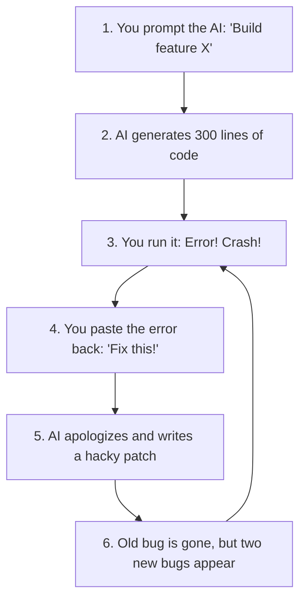

# Chapter 1: Vibe Coding vs. Agent Engineering (Hope vs. Guardrails)

> **TLDR**: "Vibe coding" relies on casual prompts and luck; agent engineering surrounds the AI with automated guardrails and instant feedback so it can't create a mess.
>
> **ELI:7b**: Vibe coding is asking an AI to bake a cake and hoping it doesn't burn down the kitchen. Agent engineering is giving the AI a timer, a recipe, and a smoke detector that fixes the oven automatically.

---

## The Dream vs. The Reality

When people first discover AI coding tools, it feels like magic. You type a sentence into a chat window, hit enter, and fifty lines of working JavaScript appear before your eyes. You feel like a wizard.

Naturally, you think: *"Why stop there? Why not build my entire company's product by just chatting with the AI?"*

This is what Silicon Valley popularized as **"vibe coding"**:
- You don't read the documentation.
- You don't write tests.
- You don't look closely at the generated code.
- You just prompt, press accept, and ride the vibe.

For a toy script or a simple personal webpage with 100 lines of code, vibe coding works fine. But the moment you try to build a real, multi-file application with users, databases, and APIs, vibe coding hits a brick wall.

---

## The Vibe Coding Death Spiral

Here is the exact cycle every developer experiences when vibe coding without guardrails:

Why does this loop happen?

1. **AIs are eager-to-please guessers**: A Large Language Model does not understand logic the way a compiler does. It generates words and symbols that look statistically plausible. If it doesn't know how a library works, it won't say "I don't know"—it will invent a plausible-sounding method name.
2. **AIs cannot see their own mistakes**: Unless an automated tool runs the code and feeds the error back to the AI, the AI genuinely believes the code it just wrote is flawless.
3. **Band-aids on top of band-aids**: When you ask the AI to fix a bug without tests, it doesn't solve the root cause. It wraps the broken code in a `try/except` block or adds a temporary hack. After five iterations, your codebase is an unmaintainable mountain of duct tape.

---

## The Antidote: Agentic Software Engineering

**Agentic Software Engineering** is not about typing better prompts. It is about **building an environment where the AI is physically prevented from making a mess**.

Instead of treating the AI as an all-knowing oracle, you treat it like an extremely fast, enthusiastic junior apprentice who needs:

1. **A clear contract**: An automated test that specifies exactly what needs to be built before writing any application code.
2. **Mechanical rules**: Automated linters and syntax checkers that reject overly complex or messy code immediately.
3. **A clean playground**: An isolated sandbox where the AI can run commands and run tests without risking your computer or leaking your secrets.
4. **An automated feedback loop**: If the AI makes a typo or breaks a rule, a computer script catches it instantly and tells the AI: *"Line 42 failed check X. Fix this line before proceeding."*

---

## The Golden Rule: Computers Must Check Computers

Human beings are terrible at reviewing hundreds of lines of AI-generated code. Our eyes glaze over, we miss subtle off-by-one errors, and we get tired after ten minutes.

Computers, on the other hand, never get tired. A test runner like `pytest` or an AST linter like `ruff` can check 1,000 files in half a second and tell you with 100% mathematical certainty whether every single requirement was met.

> **The Golden Rule**: Never ask a human to review something a computer script could have checked automatically. And never let an AI declare a task finished until the computer script agrees.

---

## Next Steps

Now that you understand why casual vibe coding breaks down and why automated guardrails are essential, let's look at the single most important guardrail of all:

➡️ [**Chapter 2: Test First, Code Second (Giving the AI an Answer Key)**](./02-tests-are-the-answer-key.md)
