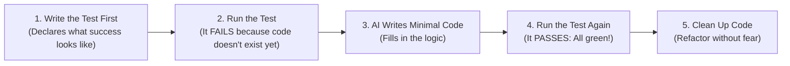

# Chapter 2: Test First, Code Second (Giving the AI an Answer Key)

> **TLDR**: Writing automated tests before writing application code gives the AI a deterministic pass/fail contract, turning vague guesswork into measurable engineering progress.
>
> **ELI:7b**: If you ask an AI to solve a math problem without the answers, it will guess. If you give it the answer key first, it will keep working until every answer matches.

---

## The Student Analogy

Imagine you are tutoring a high school student in physics.

**Method A (The Vibe Way)**:  
You hand the student a blank piece of paper and say: *"Write an essay about gravity, and try to include some formulas."*  
The student writes 500 words. Half of the formulas are slightly wrong, some units are missing, but the prose sounds fancy. Grading this takes you 45 minutes of painful manual review.

**Method B (The Answer Key Way)**:  
You give the student five practice problems with an automated grading machine. The machine checks their answers instantly:
- Problem 1: ✅ Correct!
- Problem 2: ❌ Wrong (expected `9.8`, got `10.2`)
- Problem 3: ✅ Correct!

The student can try as many times as they want. They tweak their calculations, re-run the grader, and immediately see Problem 2 turn green. When all five problems are green, they know with 100% certainty that their homework is done.

**Large Language Models are that student.** When you give them an automated test suite first, you give them the answer key.

---

## What is TDD (Test-Driven Development) in Plain English?

In traditional programming, lazy developers write code first and then maybe write a few tests at the end if they have time.

In **Agentic Engineering**, this order is flipped:



1. **Step 1: Write the Test First**: Before creating the feature, write a test that calls the function with realistic inputs and asserts the expected output.
2. **Step 2: Run the Test**: The test MUST fail. If the test passes before you wrote any code, your test is broken!
3. **Step 3: AI Writes the Code**: Hand the failing test to the AI: *"Write the code to make this test pass."*
4. **Step 4: Run the Test**: The computer runs the test. If it fails, the AI reads the exact error and tries again.
5. **Step 5: Clean Up**: Once all tests pass, the AI can clean up formatting and simplify functions knowing that if it breaks anything, the test will catch it instantly.

---

## A Simple Example: The User Age Calculator

Here is how simple this looks in practice.

### Step 1: The Test (The Contract)

```python
# test_calculator.py
from datetime import date
from calculator import calculate_age

def test_calculate_age_for_birthday():
    # If someone was born on Oct 1, 2000 and today is Oct 1, 2026:
    birth_date = date(2000, 10, 1)
    today = date(2026, 10, 1)

    assert calculate_age(birth_date, today) == 26
```

Notice what this test did:
- It decided the function name: `calculate_age`
- It decided what arguments it accepts: `(birth_date, today)`
- It decided what it returns: an integer `26`

The AI doesn't have to guess what you want. The interface is already locked in!

### Step 2: The Code

Now the AI can write the simplest possible implementation:

```python
# calculator.py
from datetime import date

def calculate_age(born: date, current: date) -> int:
    """Calculate age in whole years given birth date and current date."""
    years = current.year - born.year
    if (current.month, current.day) < (born.month, born.day):
        years -= 1
    return years
```

When you run `pytest`, it passes in 0.02 seconds. Done.

---

## Why Tests Eliminate Hallucinations

When an AI writes code without tests, it has no reality check. It might hallucinate a function called `date.to_age_in_years()` that doesn't actually exist in Python.

When an AI is forced to run the test:
1. Python throws `AttributeError: 'date' object has no attribute 'to_age_in_years'`.
2. The AI reads the traceback.
3. The AI immediately realizes the mistake and uses real Python methods.

The computer catches the hallucination in milliseconds, with zero human effort required.

---

## Next Steps

Having tests is half the battle. But what if the code the AI writes to pass the test is a 200-line monster with ten nested loops?

Let's see how to keep code clean and readable:

➡️ [**Chapter 3: Keep It Simple (Complexity Caps & No Spaghetti)**](./03-keep-code-simple-complexity-caps.md)
