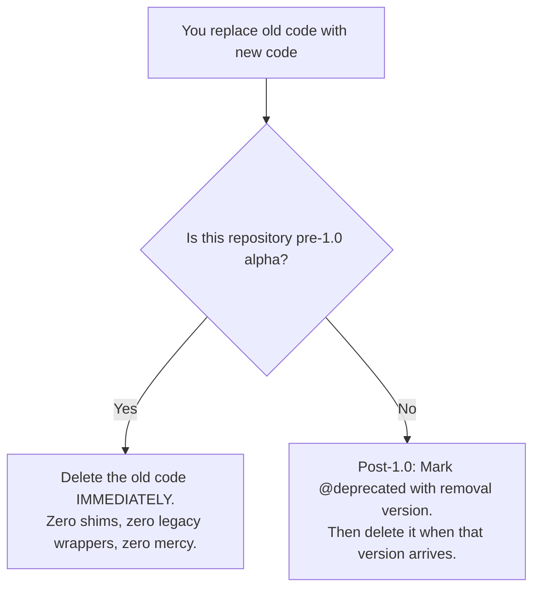

# Chapter 4: No Zombie Code (Delete Dead Code on Sight)

> **TLDR**: Dead functions, commented-out blocks, and vestigial shims pollute model context; ruthless deletion of obsolete code prevents AI confusion and backward-compatibility rot.
>
> **ELI:7b**: When you replace old code with new code, throw the old code in the trash. Never leave dead code lying around, or the AI will resurrect it like a zombie.

---

## What is "Zombie Code"?

Imagine your basement has an old, broken microwave sitting in the corner. You bought a brand-new microwave three years ago and put it on the kitchen counter. But you left the old broken one in the basement *"just in case"*.

One evening, a houseguest wants to heat up some soup. They walk down to the basement, see the microwave, plug it in, and nearly start an electrical fire.

**Zombie code is that broken microwave in your codebase**:
- Functions that are no longer called anywhere.
- Blocks of code commented out with `#` or `//`.
- Deprecated compatibility "shims" and wrappers left over from three refactors ago.
- Temporary files named `utils_old.py` or `handler_v1_backup.js`.

---

## Why Zombie Code Confuses AI Models

Human developers might know from memory: *"Oh, don't look at `calculate_tax_v1`, we stopped using that in July."*

**An AI has no memory of July.** When an AI reads your repository, it reads all the text inside the files you pass it.

When the AI encounters dead code:

1. **It assumes the code is still load-bearing**: If a function exists, the AI assumes someone needs it.
2. **It hallucinates connections**: When you ask the AI to add a new tax feature, it will see both `calculate_tax_v1` and `calculate_tax_v2`. It might modify `v1`, leaving you wondering why your changes had zero effect in production!
3. **It wastes your memory budget**: Every line of dead code takes up precious space in the AI's context window, pushing real instructions and test results out of memory.

---

## The Fear of Deleting Code

Why do developers leave zombie code around in the first place?

**Fear.**
- *"What if I need this logic again next month?"*
- *"What if deleting this breaks something subtle?"*

Here is the secret that frees you from fear:

> **Git already remembers everything you have ever written.**

You do not need to keep commented-out code in your active files. Git keeps an exact, permanent snapshot of every commit, branch, and change forever. If you ever need that old algorithm from last Tuesday, you can find it in git history in five seconds.

Leaving dead code in your active files is like keeping all your past garbage bags in the living room because you might want to look at an old cereal box. Throw it out!

---

## The "Delete on Sight" Rule

In disciplined agentic software development, we follow a simple, ruthless rule:

1. **Pre-1.0 (Active Alpha / Rapid Development)**:
   - There is zero expectation of backwards compatibility.
   - Delete obsolete functions, arguments, and files in the exact same commit where you add the replacement.
   - Never leave a "deprecated" wrapper around an old function during early development. Clean it up right away.
2. **Post-1.0 (Stable Production Release)**:
   - If public users depend on your API, give them a structured transition.
   - Mark the old function as deprecated with a clear warning explaining what to use instead (`remove_in="2.0.0"`).
   - When version 2.0 arrives, delete it completely.

---

## How Clean Codebases Supercharge AI Speed

When a codebase has zero zombie code:
- Files are short and easy to navigate.
- The AI only sees active, working patterns.
- There are no confusing duplicate function names.
- Token consumption drops by 30% to 50%.
- Bug fixes happen in minutes instead of hours.

Be ruthless. Delete dead code on sight!

---

## Next Steps

Now your codebase is simple, tested, and clean of dead zombies. But what about security and privacy? How do you prevent the AI from accidentally leaking your home Wi-Fi or API passwords?

➡️ [**Chapter 5: Safety & Sandboxes (Never Leak Secrets or Your Network)**](./05-privacy-and-sandboxes.md)
