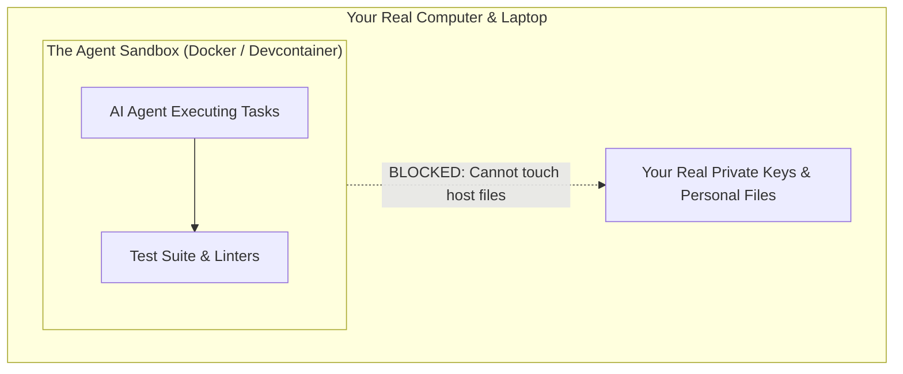

# Chapter 5: Safety & Sandboxes (Never Leak Secrets or Your Network)

> **TLDR**: Protect sensitive credentials and infrastructure by running agents in isolated sandboxes, using dummy domains (`example.com`), and strictly banning private IP leakage.
>
> **ELI:7b**: Never let an AI see your real passwords or your home Wi-Fi address. Give it fake practice data, and run its code in a playpen so a runaway script can't mess up your computer.

---

## Where Does AI Output Go?

When you work with an AI coding agent, it doesn't just display text in your chat window. It writes files, generates test fixtures, authors commit messages, and creates pull requests.

If you aren't careful, that AI will enthusiastically commit:
- Your secret Stripe API key.
- Your personal GitHub personal access token.
- Your home server's private network IP (such as an address in `192.168.0.0/16`).
- Your computer's private username and file paths (`/home/user/Desktop/SecretProject`).

Once those files get pushed to GitHub, **they are permanently public**. Even if you delete the commit five minutes later, automated scrapers have already copied your credentials and started attacking your accounts.

---

## The Zero-Trust Checklist: The 4 Big Rules

In `vibes` and `devops-cli`, we treat security and privacy with zero tolerance. Here are the four simple rules to keep yourself safe:

### 1. Secrets Live in the Keyring, Never in Code

Never put real API keys, passwords, or tokens in a code file, environment file, or config file that gets committed.

- Use your operating system's secure credential store (like OS Keyring or 1Password).
- If a test needs an API key to run, use an obviously fake dummy string: `"test_dummy_key_12345"`.

### 2. The Golden Hostname Rule: Strictly `example.com`

When you write tests, documentation, or code examples that need a URL, **always use `example.com`** (the official RFC-reserved domain for documentation).

- ✅ Good: `http://example.com/api/v1/users`
- ❌ Bad: `http://<private-server>`
- ❌ Bad: `http://api.example.com` (Avoid unnecessary subdomains—keep it to bare `example.com`!)

### 3. The Golden IP Rule: Documentation Blocks Only

Never let private home network or corporate IP addresses appear in your tests or documentation:

- ❌ Never commit private RFC 1918 IPs: `10.0.0.0/8`, `172.16.0.0/12`, or `192.168.0.0/16`.
- ✅ Always use loopback (`127.0.0.1` / `localhost`) or the official RFC 5737 documentation test IPs:
  - `192.0.2.1` (TEST-NET-1)
  - `198.51.100.1` (TEST-NET-2)
  - `203.0.113.1` (TEST-NET-3)

These documentation IPs are mathematically guaranteed never to route across the public internet.

### 4. Abstract Your Machine Names and Paths

When writing examples or docs, don't write:
- `/Users/username/workspaces/project`
- `<personal-laptop-name>`

Use clean, abstract placeholders:
- `<workspace-root>/project`
- `<worker-node>` or `<storage-cluster>`

---

## What is a Sandbox? (The AI Playpen)

When you let an autonomous AI agent run terminal commands, you are giving an artificial intelligence permission to execute programs on your machine.

What if the AI hallucinates a command like:
```bash
rm -rf / tmp/*
```
(Notice the accidental space between `/` and `tmp/*`—that deletes your entire operating system!)

To prevent disasters, we run agents inside an **isolated sandbox**:



- **Containerization (Docker / Devcontainers)**: The agent runs inside a virtual container. If it breaks something, it only breaks the disposable container, not your laptop.
- **Process Group Isolation**: When the agent launches a background worker or server, we bundle it in a dedicated process group (`os.killpg`) so when the test finishes, all spawned sub-processes are terminated cleanly. Zero zombie processes eating up your CPU!

---

## Next Steps

Now you know how to keep your code safe, private, and contained. But what happens when an AI task gets long and complicated? Why do AIs start forgetting instructions mid-way through a job?

➡️ [**Chapter 6: Stopping AI Amnesia (The Grounded Checklist)**](./06-stopping-ai-amnesia.md)
