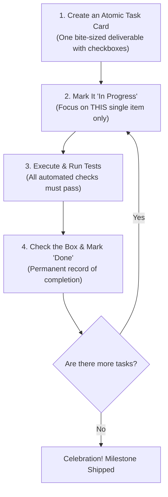

# Chapter 6: Stopping AI Amnesia (The Grounded Checklist)

> **TLDR**: AI context windows degrade over lengthy multi-turn sessions; tracking work in persistent task cards and atomic issues anchors the model and prevents amnesia.
>
> **ELI:7b**: AIs have short-term memory loss. If a task takes more than a few minutes, write down a step-by-step checklist on paper (or a GitHub Issue) so the AI never forgets what it is doing.

---

## The Grocery Store Analogy

Imagine you ask your roommate to go to the grocery store.

**Scenario A**:  
You verbally rattle off twelve items: *"Get oat milk, eggs, sourdough bread, organic peanut butter, apples, laundry detergent, sparkling water, garlic, onions, paper towels, olive oil, and coffee beans."*  
Your roommate nods confidently and leaves. Half an hour later, they return with eggs, coffee beans, and three bags of potato chips they bought on a whim. They completely forgot the rest.

**Scenario B**:  
You hand your roommate a physical index card with checkboxes:
- [ ] 1. Oat milk
- [ ] 2. Eggs
- [ ] 3. Sourdough bread
- [ ] ...

They take a pen, cross off each item in the store aisle, and return with exactly what you asked for. Zero forgotten items, zero surprise potato chips.

---

## Why AIs Suffer from Brain Fog

In machine learning papers, you will hear terms like **"Lost-in-the-Middle Attention Decay"** or **"Context Accumulation Drift"**.

In plain English, it means:

> **When a chat gets too long, the AI forgets what it was told at the beginning.**

Every AI model has a **context window**—a limited capacity for how much text it can see at once. As the conversation progresses:
1. You run a command that outputs 200 lines of terminal logs.
2. The AI reads three files.
3. The conversation grows to 40,000 words.
4. The AI's "attention" spreads thin. It starts ignoring earlier instructions, re-asking questions it already answered, or inventing new architectural plans mid-session.

This is called **AI Amnesia**.

---

## The Solution: The Grounded Task Checklist

The cure for AI amnesia is never to rely on the AI's internal conversational memory. **Always anchor the AI in an external, persistent checklist.**

Whether you use GitHub Issues, a GitHub Projects board, or a simple markdown file, follow the **4-Step Task Loop**:

### 1. Make Tasks "Atomic" (Bite-Sized)

Don't create a task called: *"Build entire user authentication system."* That is way too big and invites amnesia.

Break it into small, atomic deliverables:
- Task 1: Create user database schema with tests
- Task 2: Create password hashing helper with tests
- Task 3: Create login API route with tests
- Task 4: Connect login route to database

### 2. The Golden Rule of Grounded Work

> **Zero Invisible Work**: An AI agent must NEVER start writing code, refactoring files, or making architectural decisions unless there is an active, open task card describing what it is doing.

If you don't write it down:
- The AI will get distracted.
- You won't remember why a file was modified.
- No one can verify whether the work actually met the acceptance criteria.

---

## How to Author Checklists: "Author as Merged"

Here is a practical tip used in `vibes` and `devops-cli`:

When you or the AI write a task description or pull request checklist, **author it in its final completed state**:
- Write clear deliverable descriptions.
- Mark items complete (`- [x]`) as you verify them with real test runs.
- Never open "administrative" cleanup tasks just to change a status label after the work is already merged.

Keep it simple, keep it written down, and the AI will never suffer from brain fog again.

---

## Next Steps

Now you know how to stop AI amnesia. But what about the cost? High-end AI models can be expensive if you use them for every tiny file lookup.

How do you combine big, smart models with small, fast models?

➡️ [**Chapter 7: Big Brains & Fast Hands (Using Big and Small Models Together)**](./07-smart-brains-and-fast-hands.md)
