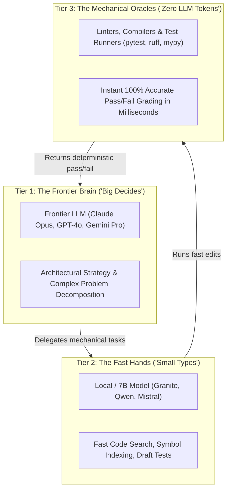

# Chapter 7: Big Brains & Fast Hands (Using Big and Small Models Together)

> **TLDR**: Orchestrating frontier models for high-level reasoning alongside fast open-weight models and deterministic scripts slashes token costs by 85% while speeding up execution.
>
> **ELI:7b**: Don't hire a world-famous architect to sweep the floor. Use big smart models for the master plan, small fast models for fetching and typing, and dumb scripts for grading tests.

---

## The Expensive Architect Analogy

Imagine you are building a custom two-story house.

You hire a brilliant, world-renowned architect. They charge \$500 an hour. They are fantastic at designing structural blueprints, ensuring the foundation won't crack, and making sure the roof doesn't collapse.

Now imagine you ask that \$500/hour architect to:
- Sweep the sawdust off the front porch.
- Carry boxes of nails back and forth across the yard.
- Search through a toolbox to find a 1/2-inch wrench.

That would be financial madness! You'd burn through your entire life savings in a week.

You want the **architect** to design the blueprint. You want a **fast, energetic apprentice** to fetch tools and carry lumber. And you want a **bubble level and tape measure** (simple physical tools) to verify that the walls are straight.

---

## The Three Tiers of Agentic Engineering

When people build with AI, they often make the mistake of using the most expensive, frontier model (like Claude 3.5 Sonnet, GPT-4o, or Gemini Pro) for every single tiny operation:
- Reading a 50-line config file.
- Counting the number of files in a directory.
- Checking if a JSON string has a closing bracket.

This burns through tokens at lightning speed and runs slowly.

Instead, disciplined agentic systems divide work into **three distinct tiers**:

### 1. Tier 1: The Frontier Brain ("Big Decides")
- **Who**: Top-tier cloud models.
- **What they do**: High-level system design, tricky algorithm logic, reviewing security boundaries, deciding milestone roadmaps.
- **Why**: They have deep reasoning and rarely get tricked by complex prompts.

### 2. Tier 2: The Fast Hands ("Small Types")
- **Who**: Fast, cheap open-weight models (like 7B or 14B parameter models running locally via Ollama or vLLM).
- **What they do**: Searching through directories, extracting symbol lists from files, formatting markdown tables, drafting repetitive unit test cases.
- **Why**: They are 10x cheaper and respond in milliseconds.

### 3. Tier 3: The Mechanical Oracles ("Zero LLM Tokens")
- **Who**: Traditional computer programs (Python scripts, `pytest`, `ruff`, `mypy`, git hooks).
- **What they do**: Checking syntax errors, verifying type annotations, counting cyclomatic complexity, verifying file paths.
- **Why**: **Never use an LLM for something a 5-line Python script can do.** A script runs in 0.01 seconds, costs zero dollars, and is 100% mathematically accurate every single time.

---

## The 85% Token Savings Rule: "Rent the Frontier, Own the Workhorse"

When you structure your agent workflow this way:

1. The big frontier model spends 500 tokens writing a clean task blueprint and test specification.
2. A fast local 7B model or an AST script scans the repository for symbol references (saving 10,000 frontier tokens).
3. The test runner (`pytest`) grades the code in 0.4 seconds.
4. The frontier model only steps back in if an unexpected architectural blocker arises.

**Result**: You cut your API bill by **80% to 90%**, your agent runs three times faster, and your codebase stays rock-solid.

---

## 🎓 Conclusion: You Are Ready!

Congratulations! You now understand the core fundamentals of agentic software engineering:

- ✅ **Guardrails over Vibes**: Build an environment where the AI cannot make a mess.
- ✅ **Test First**: Give the AI the answer key before asking it to write code.
- ✅ **Keep It Simple**: Max 10 forks, max 4 indents, no spaghetti code.
- ✅ **No Zombies**: Delete obsolete code on sight.
- ✅ **Zero-Trust Safety**: Protect your secrets and use `example.com`.
- ✅ **Checklists Over Chat**: Ground tasks in written tickets to stop amnesia.
- ✅ **Big Brains & Fast Hands**: Combine smart planners, fast local helpers, and dumb scripts.

With these seven fundamentals in your toolkit, you are ready to build production-grade, reliable software alongside autonomous AI agents.

---

## 🔗 Jump to the Rest of the Archive

Ready to see how these fundamentals are implemented in real production code?

- 🏛️ [**Return to Dummy's Guide Home**](./README.md)
- 📜 [**The Disciplined Agentic Manifesto**](../MANIFESTO.md)
- 🧭 [**Taxonomy of Agentic Engineering**](../TAXONOMY.md)
- 🔬 [**60 Real-World Case Studies (Observations)**](../../observations/README.md)
