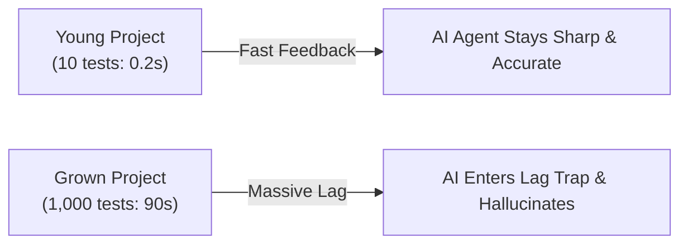
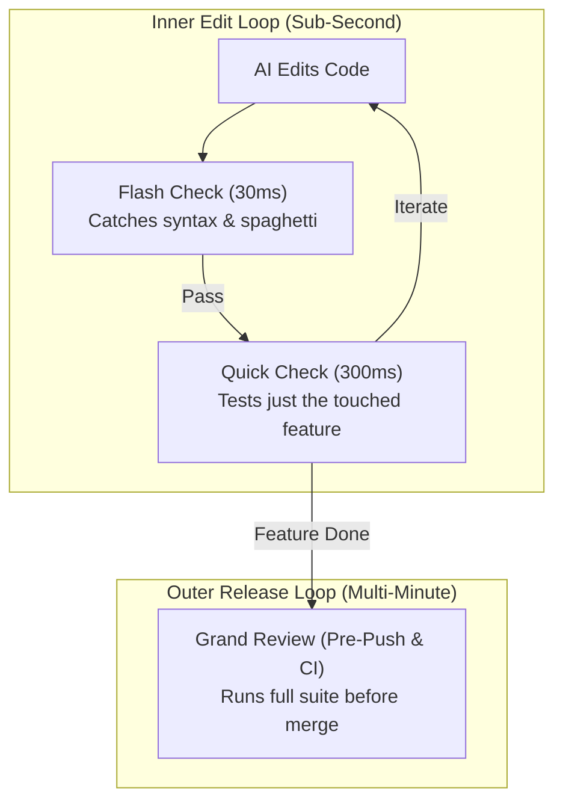

# Chapter 8: Fast Checks Beat Slow Tests (The Verification Speed Trap)
### Why Slow Tests Paralyze AI Agents & How Layered Guardrails Save the Day

> **TLDR**: Running a 2-minute test suite on every minor code edit paralyzes AI agents with latency and context rot; decomposing checks into sub-second layered oracles keeps agents fast, focused, and accurate.
>
> **ELI:7b**: If you have to wait ten minutes every time you check your homework, you'll get bored and make mistakes. If you get instant feedback on the exact line you just touched, you finish without getting distracted.

---

## 🎮 The Video Game Lag Analogy

Imagine you are playing an intense action video game.

- **Scenario A (10ms Ping — Instant Response)**:  
  You press the jump button. Your character jumps instantly. You dodge the incoming fireball, land on the platform, and clear the level. Everything feels smooth, natural, and effortless.

- **Scenario B (5,000ms Ping — Terrible Lag)**:  
  You see an obstacle. You press jump. *Nothing happens.*  
  One second passes... two seconds... three seconds.  
  You wonder: *"Did my controller disconnect? Did the game crash?"*  
  In frustration, you mash the jump button five more times and press crouch.  
  Suddenly, the game unfreezes, executes all your confused button presses at once, and your character leaps backward straight into a pit of lava.

**Large Language Models suffer from the exact same lag problem.**

When an AI coding agent has to wait 60 to 120 seconds every time it runs a test, its working memory gets clogged with terminal logs, polling status messages, and background noise. It loses track of what it was doing, forgets its original instructions, and starts hallucinating wild, speculative excuses for why the code didn't work.

---

## ⏳ The Verification Trap: Why Tests Slow Down

When a software project is brand new, it might only have 10 quick tests. Running them takes 0.2 seconds. The AI writes code, runs the test, sees the green checkmark, and moves on happily.



But as the project grows into a real application:
1. You add database migrations and network stubs.
2. You install heavy test plugins and code coverage tools.
3. You accumulate 1,000 different tests across 50 folders.

Now, running the test suite takes **90 seconds**.

For a human engineer, 90 seconds is just time to stretch or read an email. But for an AI agent that needs to make five small adjustments to fix a tricky bug, a 90-second delay means:

$$5 \text{ edits} \times 90 \text{ seconds} = 7.5 \text{ minutes of dead waiting time}$$

During that wait, three terrible things happen:
- **Tool Timeouts**: The agent's tool runners give up and crash because the command took too long.
- **Attention Dilution**: The agent's prompt context fills up with hundreds of lines of terminal status text, pushing the user's original goal out of its short-term memory.
- **Sycophantic Guessing**: The AI gives up waiting, looks at its own untested code, and pretends: *"Everything looks completely correct to me!"*

---

## 🛡️ The Solution: The 3 Speeds of Testing

To keep AI agents at peak speed and accuracy, disciplined engineering never asks the AI to run the entire massive test suite in its inner edit loop. Instead, testing is split into **three distinct speeds**:

| Speed Tier | How Fast? | What It Checks | What Runs It? |
|---|---|---|---|
| **1. The Flash Check** | 30 milliseconds | Syntax errors, monster functions, leaked passwords | In-memory AST Sentinel (`sentinel.py`) |
| **2. The Quick Check** | 300 milliseconds | The single function or file the AI just touched | Targeted unit test slice (`pytest tests/test_user.py`) |
| **3. The Grand Review** | 1 to 3 minutes | All 1,000 tests, security scanners, multi-platform matrix | Pre-push git hooks & remote GitHub Actions CI |



By keeping the inner edit loop under **one second**, the AI agent never experiences lag. It can test ten ideas in ten seconds, fixing edge cases with laser focus.

---

## 🎯 Good Clues vs. Bad Clues (The CEGIS Principle)

When a test fails, *what* it tells the AI makes the difference between instant success and an infinite loop of frustration.

### The Bad Clue (Vague Stack Trace)
```text
FAILED: test_billing.py - AssertionError
Traceback (most recent call last):
  File "site-packages/framework/runner.py", line 402, in execute
  ... 50 lines of framework internals ...
```
When an AI sees this, it has no idea what went wrong. It starts guessing: *"Maybe the database is broken? Maybe I should delete the whole billing file and rewrite it from scratch?"* This triggers **oscillatory thrashing**—the AI changes A to B, then B back to A, burning money and tokens.

### The Good Clue (Precise Counterexample)
```text
FAILED test_calculate_tax:
  Input: amount=100.0, state="CO"
  Expected output: 102.90
  Actual output:   100.00
  Difference: Missing state tax rate (2.9%) on line 42 of tax_engine.py
```
This is called a **Counterexample**. It gives the AI three crucial facts:
1. What went in (`amount=100.0`).
2. What should have come out (`102.90`).
3. Where the logic failed (`line 42`).

With an algebraic clue like this, even a cheap, fast language model can fix the bug on the very first try.

---

## 📦 Keeping Tests Tidy: The Tuple Trick

There is one hidden trap that trips up almost every AI coder: **test sprawl**.

When testing an object with ten properties, a naive developer writes ten separate assert statements:

```python
# The Messy Way: 10 separate assertions
assert user.id == 101
assert user.name == "Alice"
assert user.email == "alice@example.com"
assert user.role == "admin"
assert user.is_active is True
```

In Python, every single `assert` statement is secretly an `if` statement behind the scenes (`if not (condition): raise AssertionError`). When you write ten asserts in a row, the computer's complexity meter jumps by $+10$, triggering the project's complexity alarms!

The disciplined way to write this is **Structural Tuple Consolidation**:

```python
# The Clean Way: One structural comparison
assert (user.id, user.name, user.email, user.role, user.is_active) == (
    101,
    "Alice",
    "alice@example.com",
    "admin",
    True,
)
```

Both approaches check the exact same data, and Pytest will still highlight the exact attribute that didn't match. But the tuple trick keeps the function's complexity score at a crisp $M=1$, preventing your test suite from becoming a tangled mess.

---

## 🔗 Jump to the Rest of the Guide

Ready to explore more fundamentals?

- 🏛️ [**Return to Dummy's Guide Home**](./README.md)
- 🧭 [**Chapter 9: The Cheat Sheet & Survival Kit**](./09-the-cheat-sheet-and-survival-kit.md)
- 📜 [**Chapter 2: Test First, Code Second**](./02-tests-are-the-answer-key.md)
- 🔬 [**71 Real-World Case Studies (Observations)**](../../observations/README.md)
