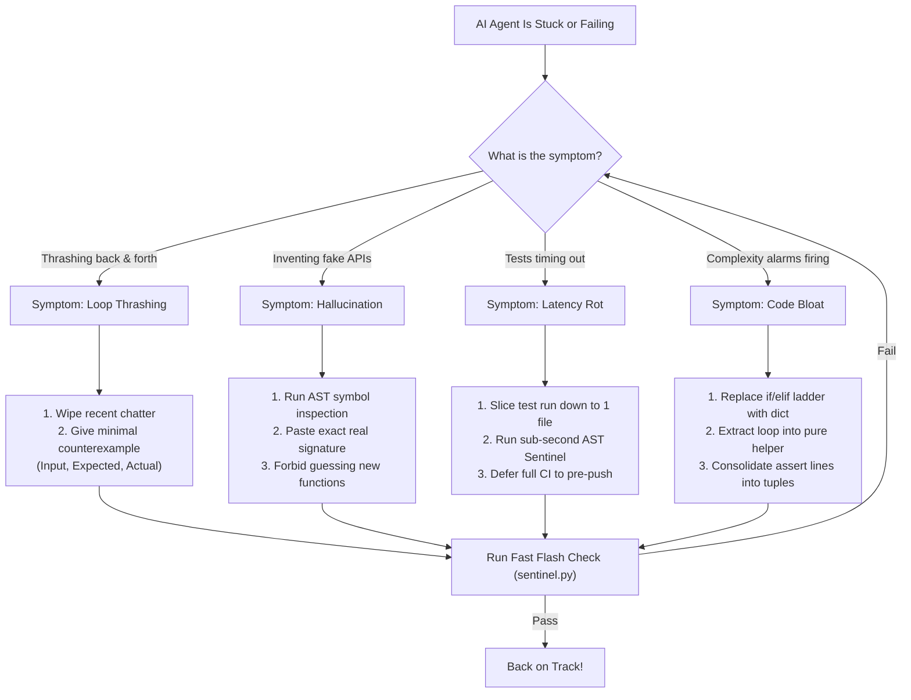

# Chapter 9: The Cheat Sheet & Survival Kit (Daily Rules & Decision Trees)
### Quick Rules, Emergency Decision Trees & Pre-Merge Validity Checks for Everyday Hacking

> **TLDR**: A high-density reference kit for daily agentic engineering: 10 plain-English golden rules, a flowchart decision tree for recovering stuck AI agents, and a 3-second pre-merge validity checklist.
>
> **ELI:7b**: When your robot helper gets confused, don't yell at it or start over. Look at this cheat sheet, find the exact problem on the decision tree, and give it the right clue to get back to work.

---

## 🧭 Why You Need a Survival Kit

When you work with AI coding agents day in and day out, you quickly learn two truths:

1. **When agents work with tight guardrails, they feel like magic.** Features get built in minutes, bugs vanish instantly, and tests pass on the first try.
2. **When agents derail, they derail fast.** An agent can burn through thousands of tokens in three minutes, thrashing between broken edits, inventing fake functions, or drowning in slow test timeouts.

You don't need to re-read fifty pages of theory when an agent gets stuck in the middle of a release. You need a fast, battle-tested reference card. This chapter is your pocket survival kit.

---

## 🏆 The 10 Golden Rules of Agentic Engineering

Print these out, stick them on your wall, or paste them into your agent's system prompt:

| # | Golden Rule | In Plain English | Why It Matters |
|---|---|---|---|
| **1** | **The Answer Key Rule** | Write the test before the code | A stochastic agent cannot hit a target it cannot see. Tests turn guessing into deterministic verification. |
| **2** | **The Bite-Sized Rule** | Keep functions under 10 complexity and 5 nesting | Tiny functions fit cleanly in the AI's attention window. Giant functions breed bugs and hallucinated edits. |
| **3** | **No Zombie Code** | Delete replaced and dead code immediately | Leaving old, commented-out code lying around confuses the AI into resurrecting obsolete patterns and dead bugs. |
| **4** | **The 1-Second Loop** | Keep the inner edit test sub-second | If tests take 60 seconds, the agent enters the lag trap and starts hallucinating. Keep the feedback loop instant. |
| **5** | **Clean Rooms Stay Clean** | Zero secrets, zero private IPs, canonical `example.com` | Never leak real hostnames, LAN IPs (`192.168.x.x`), or tokens. Always use RFC 5737 docs IPs or `example.com`. |
| **6** | **The Grounded Task** | Track steps in a written issue card, not in chat | Chat memory rots over long conversations. A written checklist keeps the agent anchored across hours of work. |
| **7** | **The Tuple Trick** | Compare test properties as structural tuples | Ten separate `assert` lines add $+10$ to your function's complexity score. A single tuple assertion keeps it at $M=1$. |
| **8** | **Two Brains, One Job** | Big models plan, fast tools and small models execute | Use frontier models for architecture and strategy; use local models, linters, and AST sentinels for verification. |
| **9** | **Polyglot Invariants** | Languages differ, but spaghetti is spaghetti everywhere | Whether it is Python, Rust, Go, TypeScript, or Bash, enforce the same $M \le 10$ and depth $\le 5$ ceiling. |
| **10** | **Stop Guessing, Run Oracles** | When stuck, ask a tool, never an opinion | When an agent is unsure about a schema or file, run an AST parser or test runner rather than guessing. |

---

## 🚨 The Agent Emergency Decision Tree

When your AI assistant gets confused, stuck in a loop, or starts making things worse, follow this emergency triage guide:



### Detailed Triage Steps

#### Scenario A: The Agent is Thrashing (Oscillatory Loop)
- **What it looks like**: The AI edits file A, tests fail, it edits file B, tests fail, then it edits file A back to its original state.
- **Why it happens**: Vague error messages (`AssertionError`) force the model to speculate blindly.
- **The fix**: Stop the agent immediately. Clear the last few messages of noise, and give it a **concrete counterexample**:
  ```text
  Fix test_calculate_tax:
  - Input: amount=100.0, state="CO"
  - Expected: 102.90
  - Actual: 100.00
  - Failure: Line 42 in tax_engine.py is missing the 2.9% state tax multiplier.
  ```

#### Scenario B: The Agent is Hallucinating Fake Libraries or APIs
- **What it looks like**: The AI imports `from fast_math import super_solve` (which does not exist) or invents nonexistent keyword arguments.
- **Why it happens**: Attention dilution. The agent's prompt context is overloaded, and it falls back on plausible-sounding autocomplete.
- **The fix**: Run an AST symbol dump on the module it is trying to use (`tools/code_memory.py` or `python3 -c "import mod; help(mod)"`), and feed it the exact, verified signature.

#### Scenario C: Tests are Timing Out & Paralyzing the Agent
- **What it looks like**: Every command takes 90 seconds. The agent forgets what it was doing while waiting, or background jobs crash.
- **Why it happens**: Running the entire test suite on every minor typo.
- **The fix**: Restrict the agent's inner loop to running just the single touched test: `pytest tests/test_billing.py -k test_tax`. Reserve full suite execution for pre-push validation.

#### Scenario D: Complexity Alarms Are Tripping ($M > 10$ or Depth $> 5$)
- **What it looks like**: The AST Invariant Sentinel flags a function with cyclomatic complexity 14.
- **Why it happens**: The agent wrote a giant `if/elif/elif` chain or nested four `for` loops inside a `try/except`.
- **The fix**: Instruct the agent to use **table-driven dispatch**:
  ```python
  # Instead of 12 elif branches:
  HANDLERS = {
      "create": handle_create,
      "update": handle_update,
      "delete": handle_delete,
  }
  return HANDLERS[action](payload)
  ```

---

## ⚖️ Vibe Coding vs. Disciplined Engineering

Use this matrix to keep your team and your agents honest:

| Dimension | "Vibe Coding" (Casual Hacking) | Disciplined Agent Engineering |
|---|---|---|
| **Specification** | Fuzzy prompt: *"Build a billing system"* | Executable test suite and typed schemas |
| **Feedback Loop** | Manual browser refreshes, human squinting | Sub-second AST sentinels and automated unit tests |
| **Error Handling** | *"Fix this error please!"* (speculative guessing) | Counterexample-Guided Inductive Synthesis (CEGIS) |
| **Code Length** | 400-line monster functions | Functions strictly capped at $M \le 10$, depth $\le 5$ |
| **Dead Code** | Left behind *"just in case we need it later"* | Ruthlessly deleted on sight (zero zombie code) |
| **Secrets & IPs** | Real `.env` files and LAN hostnames in chat | Masked credentials, RFC 5737 IPs, `example.com` |
| **Task State** | Lost in 50 pages of scrolling chat history | Grounded in GitHub Projects cards and issue tracking |
| **Model Usage** | Burn expensive frontier tokens on typos | Frontier models for architecture, fast local tools for checks |
| **Multi-Language** | Works in Python, breaks in Rust and Go | Polyglot complexity gating across all languages |
| **Release Bar** | *"Seems to work on my laptop, ship it!"* | 100% clean pre-push quality gate verification |

---

## ⏱️ The 3-Second Pre-Merge Validity Checklist

Before you or your agent merges any branch or opens a release PR, run down this 5-point checklist. It takes three seconds and catches 99% of release defects:

```text
[ ] 1. FAST CHECKS: Did `sentinel.py` and `docs_validator.py` pass with 0 errors?
[ ] 2. UNIT TESTS: Did the targeted test suite run and pass cleanly?
[ ] 3. TUPLE ASSERTIONS: Are multi-property test asserts consolidated into structural tuples?
[ ] 4. ZERO LEAKS: Are all test endpoints standardized to `example.com` with zero LAN IPs?
[ ] 5. ZERO ZOMBIES: Did you delete all temporary debug scripts, scratch files, and dead code?
```

If all five boxes are checked, your pull request is clean, robust, and ready to ship.

---

## 🔗 Jump to the Rest of the Guide

Ready to explore the foundational chapters in detail?

- 🏛️ [**Return to Dummy's Guide Home**](./README.md)
- 📜 [**Chapter 1: Vibe Coding vs. Agent Engineering**](./01-vibe-coding-vs-agent-engineering.md)
- 🧪 [**Chapter 2: Test First, Code Second (The Answer Key)**](./02-tests-are-the-answer-key.md)
- 🧭 [**Chapter 3: Keep It Simple (Complexity Caps)**](./03-keep-code-simple-complexity-caps.md)
- 🧟 [**Chapter 4: No Zombie Code (Delete Dead Code)**](./04-no-zombie-code.md)
- 🔒 [**Chapter 5: Safety & Sandboxes (Zero Leaks)**](./05-privacy-and-sandboxes.md)
- 🧠 [**Chapter 6: Stopping AI Amnesia (Checklists)**](./06-stopping-ai-amnesia.md)
- 🤖 [**Chapter 7: Big Brains & Fast Hands (Model Routing)**](./07-smart-brains-and-fast-hands.md)
- ⚡ [**Chapter 8: Fast Checks Beat Slow Tests (Verification Speed)**](./08-fast-checks-beat-slow-tests.md)
- 🔬 [**71 Real-World Case Studies (Field Observations)**](../../observations/README.md)
