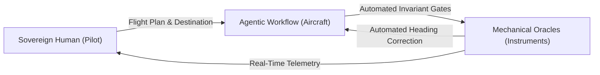
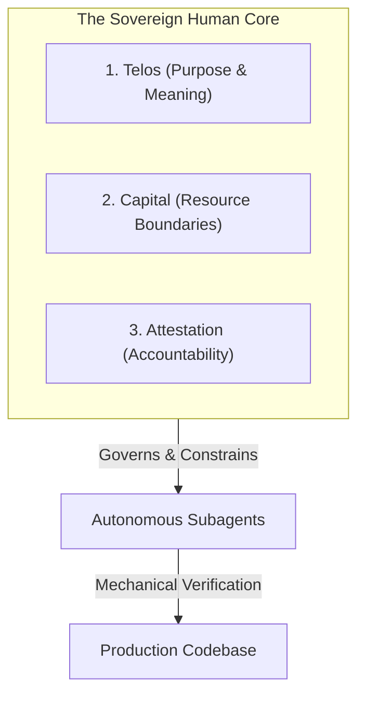
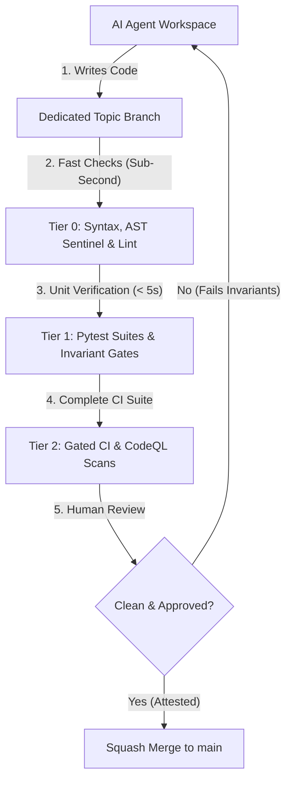

# Chapter 10: The Sovereign Human Core
### When to Steer, When to Step Back, and How to Hold the Steering Wheel

> **TLDR**: When autonomous AI agents handle 95% of syntax, typing, and verification, the human engineer's role shifts from a mechanical typist to an architectural pilot—defining purpose (Telos), enforcing resource boundaries, and providing cryptographic release attestation.
>
> **ELI:7b**: The AI is like a super-fast race car on autopilot. It can drive around the track really fast without getting tired, but you are the human in the driver's seat who picks the destination, decides how much gas to buy, and hits the brakes if there's a wall ahead.

---

## ✈️ The Pilot and the Autopilot

If you talk to engineers who have never used agentic workflows, they usually imagine one of two extremes:
1. **The Skeptic**: *"AI is just an autocomplete toy that writes buggy spaghetti; real developers write every line by hand."*
2. **The Passive Dreamer**: *"I'm going to type 'build me Facebook' into a prompt, go to the beach, and come back to a billion-dollar company."*

Both views are completely wrong.

In disciplined agentic engineering, working with an AI assistant is like flying a modern commercial jet. An Airbus A350 flies on autopilot 98% of the time. The flight computer calculates engine thrust, adjusts wing flaps, and keeps the plane steady in turbulent winds with precision no human hand could match.



Does that mean the human pilot is useless? **Of course not.**  
The pilot does what no machine can do:
- Decides where the plane is flying and why.
- Decides whether the weather is safe enough to take off.
- Takes the controls immediately when unexpected conditions arise.
- Takes legal and moral responsibility for the safety of everyone on board.

When you use AI coding agents, **you are the pilot**. The AI is your high-speed flight computer.

---

## 🏛️ The Three Jobs AI Can Never Do (The Sovereign Triad)

No matter how smart large language models become, there are three fundamental responsibilities that remain permanently, non-negotiably human:



### 1. Purpose (*Telos*): Choosing What to Build and Why
An AI model has no intrinsic desire, no business intuition, and no moral compass. It doesn't care if an app is solving a real user problem or mining fake crypto tokens.

Only a human understands:
- What problem your users actually face.
- Which trade-offs are acceptable (e.g. speed vs. storage, simplicity vs. customization).
- What makes a product delightfully intuitive rather than mechanically bloated.

You provide the *Why*; the agent executes the *How*.

### 2. Boundaries (*Capital & Blast Radius*): The Walls of the Playground
Autonomous agents love to explore. If you leave them unconstrained, they will happily spin up twenty subagents, make 50,000 API calls, download 4GB of minified JavaScript, and burn through your monthly cloud budget in forty minutes.

The human engineer defines the blast radius:
- **Financial Caps**: Maximum API tokens or dollars allowed per task.
- **Security Boundaries**: Zero private network egress, strict sandboxes, and fake test domains (`example.com`).
- **Complexity Budgets**: Strict limits on function length ($M \le 10$) and nesting depth ($\le 5$).

### 3. Accountability (*Attestation*): The Signature on the Release
When software fails in production—when a billing bug double-charges users, or a database leaks private records—nobody sues the model weights. The AI cannot be fired, cannot lose a license, and cannot stand before a regulatory board.

Every release that touches real users must be signed by a sovereign human. You review the diff, you inspect the automated gate telemetry, and you put your professional reputation behind the commit.

---

## 🚪 The Air-Lock Principle: Never Let an Agent Push to Main

One of the most dangerous rookie mistakes in AI development is giving an agent direct write access to your primary branch (`main`).

Think of your production branch like a cleanroom in a semiconductor factory or an operating theater in a hospital. You never let anyone walk directly in from the street in dirty shoes. Everything must pass through an **Air-Lock**:



### The Three Rules of the Air-Lock:
1. **Isolated Topic Branches**: Every bug fix, feature, and refactor lives in its own branch (`feat/...`, `fix/...`).
2. **Automated Decontamination**: Before any human looks at the code, mechanical gates must pass 100% (syntax, complexity, zero leaked secrets, full test pass).
3. **Atomic Squash Merges**: Once approved, merge the entire feature as a single clean commit with clear documentation. Never pollute git history with messy exploratory trailheads.

---

## 🛟 The 3-Strike Rule: What to Do When an Agent Loops

Every engineer who works with AI agents eventually runs into **The Loop**:
- The agent tries to fix a bug.
- It fails a test.
- The agent apologizes and tries again.
- It fails the test again.
- By attempt five, the agent is modifying five unrelated files, adding random `@ts-ignore` comments, and inventing fake utility functions.

When this happens, **do not yell at the agent or type "Fix it!"**. That just pours gasoline on the fire. Follow the **3-Strike Rule**:

| Strike | What Happened | What the Human Pilot Must Do |
|---|---|---|
| **Strike 1** | The agent failed the first attempt. | **Let it retry once.** Often, seeing the test diff is enough for the model to self-correct. |
| **Strike 2** | The agent failed the second attempt. | **Stop the agent and inspect the answer key.** Is your test asserting the right behavior? Did you give the agent ambiguous instructions? |
| **Strike 3** | The agent failed the third attempt. | **Take the controls.** Roll back the branch (`git checkout .`), write a minimal failing reproduction test by hand, or break the prompt into three smaller, bite-sized tasks. |

> [!TIP]
> If an agent fails three times on the same problem, the failure is almost never the model's intelligence—**it is the ambiguity of your task boundaries**. Shrink the problem, clarify the test assertion, and try again.

---

## 🤝 The Cybernetic Pairing Checklist

Before you hand off your next big coding task to an autonomous agent, run through this pilot's pre-flight checklist:

```text
[ ] 1. GOAL DEFINED: Can I describe what "Done" looks like in two clear sentences?
[ ] 2. ANSWER KEY READY: Is there an automated test or verification check the AI can run?
[ ] 3. BOUNDARIES SET: Is the AI working in an isolated branch with file size & network limits?
[ ] 4. BITE-SIZED STEPS: Is this one clear task rather than ten bundled together?
[ ] 5. AIR-LOCK ENGAGED: Will all changes pass mechanical CI gates before merging to main?
```

When you fly with clear goals, automated answer keys, and disciplined air-locks, AI stops being a chaotic roulette wheel and becomes the most exhilarating, reliable superpower you have ever had as a developer.

---

## 🔗 The Complete Dummy's Guide Library

Congratulations! You have completed the foundational guide to agentic software engineering:

- 🏛️ [**Return to Dummy's Guide Home**](./README.md)
- 📜 [**Chapter 1: Vibe Coding vs. Agent Engineering**](./01-vibe-coding-vs-agent-engineering.md)
- 🧪 [**Chapter 2: Test First, Code Second (The Answer Key)**](./02-tests-are-the-answer-key.md)
- 🧭 [**Chapter 3: Keep It Simple (Complexity Caps)**](./03-keep-code-simple-complexity-caps.md)
- 🧟 [**Chapter 4: No Zombie Code (Delete Dead Code)**](./04-no-zombie-code.md)
- 🔒 [**Chapter 5: Safety & Sandboxes (Zero Leaks)**](./05-privacy-and-sandboxes.md)
- 🧠 [**Chapter 6: Stopping AI Amnesia (Checklists)**](./06-stopping-ai-amnesia.md)
- 🤖 [**Chapter 7: Big Brains & Fast Hands (Model Routing)**](./07-smart-brains-and-fast-hands.md)
- ⚡ [**Chapter 8: Fast Checks Beat Slow Tests (Verification Speed)**](./08-fast-checks-beat-slow-tests.md)
- 🧰 [**Chapter 9: The Cheat Sheet & Survival Kit (Daily Decision Trees)**](./09-the-cheat-sheet-and-survival-kit.md)
- 👑 [**Chapter 10: The Sovereign Human Core (Pilot & Autopilot)**](./10-the-human-in-the-loop.md)
- 🔬 [**71 Real-World Case Studies (Field Observations)**](../../observations/README.md)
