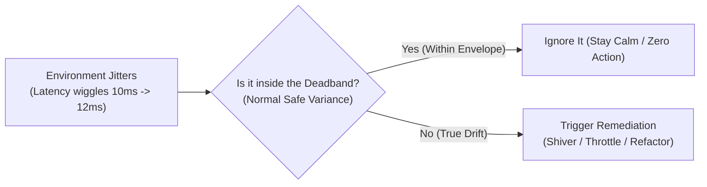
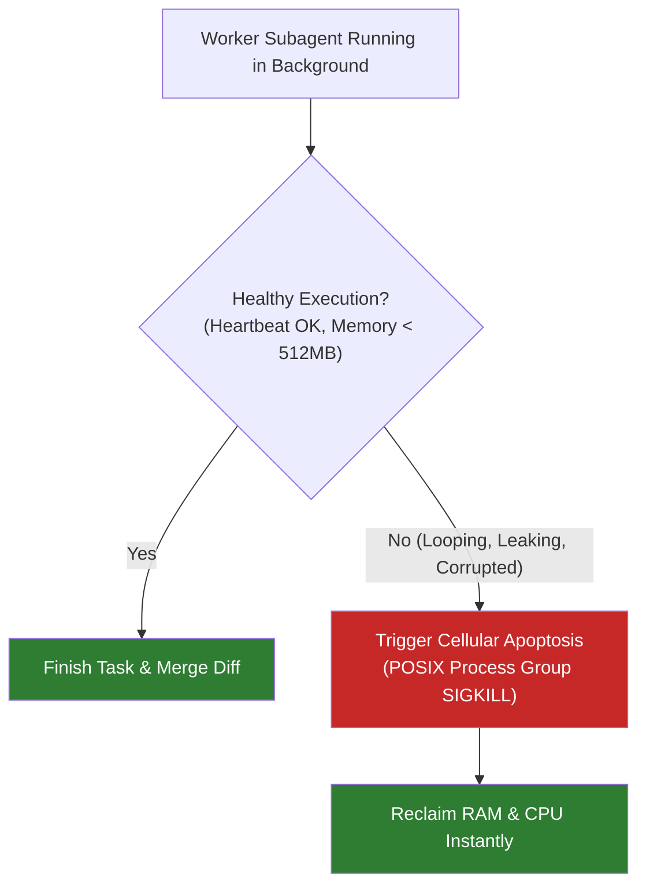
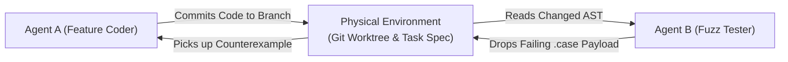
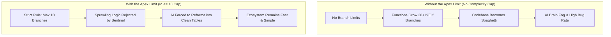

# Chapter 12: Code as Living Tissue (The Biology and Physics of AI)
### Why Coding Agents Behave Like Cells, Ant Colonies, and Sleep Cycles

> **TLDR**: AI software systems stop behaving like inert clockwork blueprints and begin acting like living biological ecosystems—relying on homeostatic shivering deadbands, cellular apoptosis (killing runaway agents), ant-colony stigmergy, and deep-sleep memory compaction.
>
> **ELI:7b**: A traditional program is like a toy car made of plastic bricks: if a piece breaks, it just sits there broken. An AI-powered codebase is like a living plant: it drinks information, cleans up its own dead leaves, fights off bugs like an immune system, and takes naps to clear its brain fog.

---

## 🌿 From Inert Machines to Living Organisms

For seventy years, computer science taught us that software is a mechanical blueprint:
1. An architect draws the blueprint.
2. A programmer writes the lines of code.
3. The computer runs the instructions like a clockwork music box.

If a gear slips or an edge case breaks, the clockwork stops dead. The software cannot heal itself, cannot sense that its parts are rotting, and cannot adapt to cold weather.

When you connect autonomous AI agents to live codebases, continuous test oracles, and background monitors, **that clockwork model dies**.

The codebase stops behaving like a statue and starts behaving like a **living autopoietic organism**—a biological tissue that repairs its own cuts, sheds dead cells, regulates its internal temperature, and coordinates thousands of tiny worker ants.

Here are the six fundamental biological and physical phenomena that explain how modern AI coding actually works.

---

## 1. The Hypothalamus & Shivering: Why AIs Need "Deadbands" (Homeostasis)

Imagine you step outside on a cool autumn morning. The temperature drops from $70^\circ\text{F}$ to $69.8^\circ\text{F}$.

Does your body immediately start violently shivering, clattering your teeth, and burning 4,000 calories?  
**Of course not.** If you reacted to every fraction of a degree, you would collapse from metabolic exhaustion in twenty minutes.

Your brain’s hypothalamus uses a **deadband (hysteresis envelope)**:

Your body ignores small, harmless temperature wiggles. It only activates shivering if your core temperature drifts past a true safety threshold.

### The Coding Equivalent
Untrained AI coding agents have no deadband. If a database ping jumps from $10\text{ms}$ to $13\text{ms}$ for half a second due to normal network noise, an untrained AI panics:
* It rewrites the connection pool.
* It changes the cache strategy.
* It refactors three modules and introduces two brand-new bugs!

Disciplined agent engineering gives the AI a **homeostatic deadband**: the AI observes the sensor, sees that the variance is within the normal envelope, and does what a healthy body does: **nothing**.

---

## 2. The Immune System & Apoptosis: Why We Must Kill Sick Subagents

Every single day, billions of cells in your body make the ultimate sacrifice through **Apoptosis (Programmed Cell Death)**.

If a white blood cell detects that a cell has been hijacked by a virus, or if a cell's internal DNA is damaged beyond repair, a biochemical signal fires. The cell does not fight or scream; it cleanly dismantles its internal machinery, packages its nutrients for its neighbors, and dissolves.

If a damaged cell refuses to undergo apoptosis and keeps multiplying uncontrollably, biology has a name for that: **cancer**.

### The Coding Equivalent
When an autonomous orchestrator spawns worker subagents to test code or crawl documentation, subagents sometimes get stuck:
* An agent enters an infinite retry loop.
* An agent starts hallucinating non-existent files.
* An agent leaks memory or leaves background processes running.

A healthy agentic system acts like an immune system: it doesn't plead with the broken subagent or let it run forever. It triggers **deterministic cellular apoptosis**: sending a clean `SIGKILL` to the entire process group, wiping the temporary workspace, and reclaiming 100% of host resources.

---

## 3. The Ant Colony & Pheromones: Coordination Without a Boss (Stigmergy)

How do 100,000 ants build a towering, climate-controlled anthill with bridges, nurseries, and waste chambers without a single ant acting as the "CEO"?

Ants do not hold morning standup meetings. They communicate through **Stigmergy**—leaving traces in the physical environment.
* Ant A finds food and drops a chemical scent trail (pheromone) on the dirt.
* Ant B doesn't need to speak to Ant A; it simply smells the dirt and follows the path.
* As more ants carry food, the path gets stronger. When the food runs out, the scent evaporates.

### The Coding Equivalent
When people try to build multi-agent systems, they usually make the mistake of creating a giant, chaotic chat room where Agent A, Agent B, and Agent C send paragraphs of text back and forth. Within five minutes, context windows are blown and messages get confused.

Disciplined agent swarms use **stigmergy**:
* Agents don't chat with each other directly.
* Agent A writes a clean diff to an isolated git worktree and checks a box on the task card.
* Agent B inspects the changed file, runs an automated fuzzer, and drops a failing test case (`0xf54c.case`) onto the disk.
* Agent A smells the failing test case on disk and immediately writes the fix.

The filesystem itself coordinates the swarm!

---

## 4. Sleep & Dreaming: Why AIs Need Context Compaction

Why do all mammals require sleep?

During the day, your brain's hippocampus absorbs a firehose of raw sensory data: conversations, street signs, background noises, and emotional reactions. If you stay awake for 72 hours without sleep, the hippocampus saturates:
* You experience brain fog.
* You hallucinate.
* You struggle to remember simple words.

During **Slow-Wave Sleep**, your brain plays back the day's events at high speed, ruthlessly discards 99% of the trivial noise (what color shirt the barista wore), and transfers the distilled, essential lessons into the neocortex as permanent wisdom.

### The Coding Equivalent
Large Language Models experience exact biological brain fog, known as **Softmax Attention Dilution**:
* After 30 turns of running terminal commands, reading 500-line files, and generating compiler output, the context window fills with tens of thousands of tokens of temporary garbage.
* The model gets "sleep-deprived": it forgets earlier rules, ignores safety instructions, and starts hallucinating.

**Context Compaction is the AI taking a deep sleep cycle:**
* The agent pauses execution.
* It discards the raw terminal dumps and transient chatter.
* It distills the core lesson: *"The auth token must be passed in the Authorization header as Bearer."*
* It writes that single lesson into its memory bank, clears the temporary context, and wakes up sharp, refreshed, and alert.

---

## 5. The Wolf in Yellowstone: Why Strict Limits (Invariants) Save the Ecosystem

In 1926, park rangers eliminated all gray wolves from Yellowstone National Park. They thought they were protecting the park.

Instead, an ecological disaster unfolded:
* Without an apex predator, the elk population exploded.
* The elk browsed willow and aspen trees down to the bare dirt.
* Songbirds lost their nesting trees and vanished.
* Beavers starved because there were no willows to build dams.
* Without beaver dams, rivers eroded, water tables dropped, and entire valleys dried up.

In 1995, scientists reintroduced the wolf. The wolves kept the elk moving, willows grew back, beavers returned, dams stabilized the water table, and the geography of the rivers physically shifted. **A single strict boundary healed the entire ecosystem.**

### The Coding Equivalent
In a codebase, the **AST Invariant Sentinel** (the automated rule that says *"no function may have more than 10 decision branches"*) is your ecosystem's wolf.

If you remove the rule, lazy AI models generate monstrous 15-level nested `if/elif` chains that choke the codebase. When the wolf prowls the repository, the AI is forced to decompose its thoughts into lean, beautiful, table-driven functions.

---

## 6. Simulated Annealing: Hot Brainstorming vs. Ice-Cold Verification

When a blacksmith hammers high-carbon steel into a katana, they rely on the physics of **thermal annealing**:
1. **The Hot Phase**: The steel is heated to glowing orange ($1,500^\circ\text{F}$). Atoms vibrate wildly and slide past one another. The smith can shape the curved blade freely.
2. **The Quenching Phase**: The blade is plunged into water. The atoms suddenly lose all thermal energy and freeze into an ultra-dense, razor-sharp crystalline grid.

If the smith quenches the blade too early, it shatters. If they never quench it, it stays soft and bends like lead.

### The Coding Equivalent
Every task in an AI coding workflow has a physical temperature:

| Phase | Thermal State | Model Setting | What the AI Is Doing |
|---|---|---|---|
| **Architectural Ideation** | 🔥 **High Heat** | Temperature $0.7 - 1.0$ | Brainstorming creative features, designing user interfaces, exploring trade-offs. |
| **Draft Synthesis** | 🌤️ **Medium Heat** | Temperature $0.2 - 0.4$ | Writing candidate functions, exploring alternative algorithms. |
| **Compiler & Gate Check** | ❄️ **Absolute Zero** | Temperature $0.0$ (Deterministic) | Checking syntax, running tests, asserting mathematical invariants ($M \le 10$). |

When designing a feature, let the AI run warm and creative. But when the code meets the compiler, freeze the temperature to absolute zero: **no creativity allowed when checking if the bridge will hold.**

---

## 🧠 Summary: The Living Rules of Code

1. **Don't shiver at every breeze**: Use deadbands so your AI doesn't rewrite code on minor noise.
2. **Practice cellular apoptosis**: Kill rogue subagents cleanly; never let zombie processes poison your host.
3. **Communicate like ants**: Leave clues in git worktrees and files rather than holding chaotic chat meetings.
4. **Let the AI sleep**: Compact context frequently to prevent attention dilution and brain fog.
5. **Keep the wolf in the forest**: Strict complexity caps force code to stay lean and healthy.
6. **Heat to shape, freeze to verify**: Be creative during design, but absolute zero when running tests.
