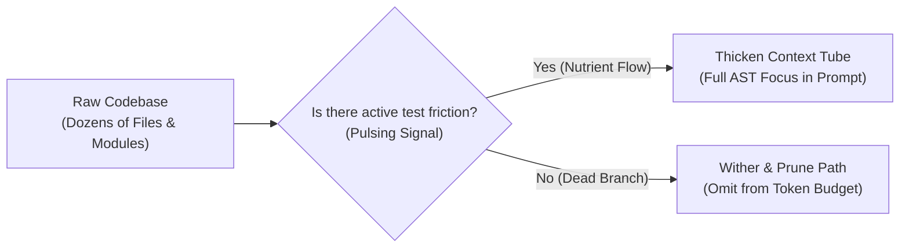
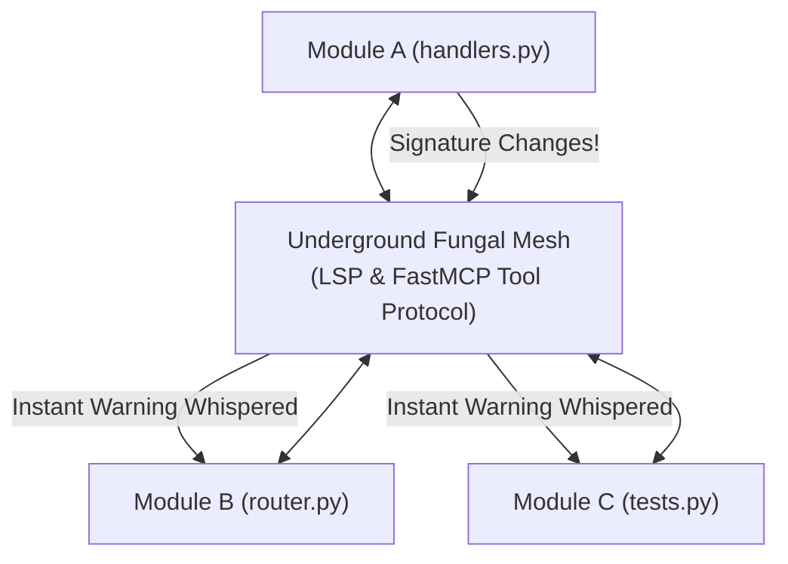
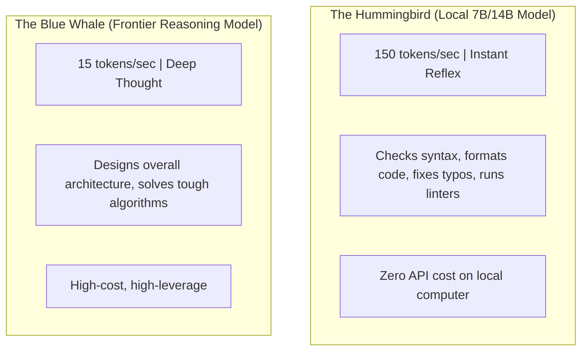

# Chapter 13: Nature's Secret Tricks for AI
### Slime Molds, Fungal Roots, Superconductors, and Forest Fires

> **TLDR**: Nature spent four billion years solving complex network routing, resource allocation, and zero-friction conduction. AI software systems borrow these exact tricks: using slime-mold routing to navigate files, underground fungal networks to broadcast compiler warnings, superconducting tables to eliminate code friction, and controlled forest fires to clear dead code.
>
> **ELI:7b**: You know how trees talk to each other through mushroom roots underground, and how forest fires clear out dead leaves so baby trees can grow? Coding with AI uses the exact same tricks: smart networks connect all the code files together, and we burn away old broken code so the app stays fast and healthy.

---

## 🍄 1. The Slime Mold Navigator (Context Without GPS)

In 2010, scientists in Tokyo did a famous experiment with a bright yellow slime mold called *Physarum polycephalum*.

They placed tiny oat flakes on a wet map in the exact spots of Tokyo's train stations. The slime mold grew out in all directions. Whenever a path carried lots of nutrients, the tubes swelled and grew thick. Whenever a path led nowhere, the tubes withered away.

Within 26 hours, this brainless single-celled organism had built a network that was **virtually identical to the human-engineered Tokyo subway system!**



### How AI Uses This
When an untrained AI is asked to fix a bug, it often tries to load 40 files at once, stuffing its memory with thousands of lines of irrelevant text.

A smart agent acts like the slime mold:
- It sends out tiny pulses to check compiler errors.
- The files that have failing tests swell into sharp focus in the context window.
- The irrelevant helper files wither away and are ignored.
The AI finds the **fastest route to the bug** without needing a human to tell it which files to open.

---

## 🌲 2. The Wood Wide Web: Underground Fungal Networks

In a dense forest, trees look like they are standing alone. But beneath the soil, thousands of miles of fungal mycelium connect the root systems of every birch, pine, and oak tree:
- If a tree in the shade is starving, a tree in the sunshine sends it sugar through the fungus.
- If beetles attack one tree on the edge of the forest, that tree sends an electrical warning through the roots. Neighboring trees receive the warning and start pumping bitter chemicals into their leaves **before the beetles even reach them!**



### How AI Uses This
In an AI coding workstation, the Language Server Protocol (LSP) and Model Context Protocol (FastMCP) are the **underground fungal network**:
- If an agent modifies a function in `handlers.py`, the underground network immediately whispers to `router.py` and `tests.py`: *"The function signature just changed!"*
- The AI sees the warning inside its editor in twelve milliseconds, long before running a slow test or pushing broken code.

---

## ⚡ 3. Superconductors & Friction-Free Code

In physics, when you cool certain metals down to near absolute zero, something magical happens: **electrical resistance drops to exact, literal zero**.

Electrons pair up and glide through the metal without bumping into atoms. A current started in a superconducting ring will flow in circles **forever** without slowing down or creating heat.

### Code Has Resistance Too!
* **High-Resistance Code (Hot and Messy)**:  
  A function with twelve nested `if/elif` statements, global variables, and hidden side effects has massive resistance. When an AI tries to read it, the prompt scatters, the AI gets confused, and it takes four failed attempts to fix a single bug.
* **Superconducting Code (Cold and Clean)**:  
  When an AI refactors that messy logic into a **declarative lookup table** (a dictionary mapping inputs directly to outputs):
  - Cyclomatic complexity drops to $M = 1$.
  - Nesting depth drops to $1$.
  - The logic glides through the AI's context window with zero resistance!

```python
# Superconducting Code: Zero resistance, zero branching
ACTIONS = {
    "login": handle_login,
    "logout": handle_logout,
    "refresh": handle_refresh,
}

def dispatch(action_name: str) -> None:
    handler = ACTIONS.get(action_name, handle_unknown)
    handler()
```

---

## 🔥 4. Forest Fires & The Delete-On-Sight Rule

In the Rocky Mountains, lodgepole pine trees produce pinecones that are glued shut by thick, tough resin. They cannot open in normal spring weather.

They only open when a **forest fire** sweeps through! The intense heat melts the resin, clears away dead, tangled brush that was blocking sunlight, and scatters millions of fresh seeds into nutrient-rich ash.

If humans extinguish every small fire, dead wood piles up for decades until a single lightning strike creates an uncontrollable catastrophe.

### The Coding Equivalent
Many software teams are terrified of deleting old code. They keep obsolete functions, broken fallbacks, and commented-out experiments "just in case." Over time, the codebase turns into an overgrown forest of dead wood.

In disciplined agentic engineering, we practice **controlled burns**:
- If a function is replaced, **delete the old one immediately**.
- Never leave commented-out zombie code in the file.
- Keep the codebase lean so the AI's context window stays clean and fertile for new growth.

---

## 🐋 5. Whales & Hummingbirds: Matching Brain Size to the Job

Biologist Max Kleiber discovered that an animal's metabolism scales to its body size:
* **The Hummingbird**: Heart beats 1,200 times a minute. It moves in a blur, darting from flower to flower with instant reflexes.
* **The Blue Whale**: Heart beats 6 times a minute. It glides through the ocean slowly and majestically, conserving vast amounts of energy.



### The Coding Equivalent
If you ask a giant frontier model (the Blue Whale) to fix a typo in a comment, you are wasting massive amounts of money and waiting twenty seconds for a five-cent job.

If you ask a tiny model (the Hummingbird) to design a distributed database, it will collapse under the weight of the task.

**Smart engineering pairs them together**:
- Let the fast local model (the hummingbird) zip through syntax checks, formatting, and file searches at 150 tokens per second.
- Wake up the big frontier model (the whale) only when you need deep architectural reasoning and long-term planning.

---

## 🎯 Key Takeaways

1. **Route like a slime mold**: Focus only on the files where tests are failing; let dead paths wither away.
2. **Connect like a fungal root**: Use LSP and FastMCP so warnings travel across the codebase at the speed of reflex.
3. **Cool down your code**: Turn sprawling `if/else` ladders into frictionless lookup tables.
4. **Burn the dead wood**: Delete obsolete code on sight to keep the repository fresh and readable.
5. **Pair hummingbirds with whales**: Use fast local models for quick edits and big frontier models for deep thinking.
