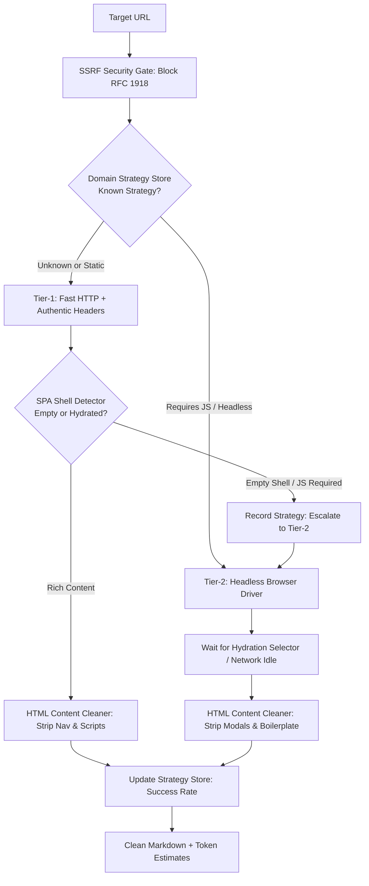

# Adaptive Web Crawler Reference Application (`examples/adaptive-web-crawler/`)

A production-grade, two-tier adaptive web crawler and documentation extractor for AI agents that dynamically navigates around the limitations of headless browsing.

---

## 🎯 The Core Problem: Headless Browsing Limitations

AI agents frequently need to fetch external technical documentation, API specifications, and code examples. In practice, agents encounter five pervasive failure modes:

1. **The SPA Empty Shell Trap**:
   Modern documentation engines (Docusaurus, Next.js, GitBook, VitePress) serve minimal static HTML shells (`<div id="root"></div>` or `<div id="__next"></div>`). Simple HTTP scrapers capture only unhydrated loader scripts.
2. **Headless Browser Resource Bloat**:
   Spawning a full Chromium instance for every simple static page introduces 2–5 seconds of startup latency, high memory consumption, and potential zombie process leaks.
3. **Hydration Race Conditions & Incomplete Renders**:
   Headless browsers often trigger content extraction before asynchronous client-side API calls or React component hydration completes, resulting in partial text.
4. **Overlay Pollution (Cookie Banners & Modals)**:
   Cookie consent overlays, promotional dialogs, and sticky sidebars pollute the extracted text, wasting context window tokens on boilerplate.
5. **Agent Amnesia (Zero Learning Across Crawls)**:
   Traditional agents treat every URL independently, repeatedly attempting failing static HTTP requests before falling back, rather than remembering domain capabilities.

---

## 🏗️ Architecture: Two-Tier Adaptive Pipeline

The **Adaptive Web Crawler** resolves these issues with a hybrid execution engine and an **Epistemic Strategy Store**:



---

## 🔑 Key Engineering Capabilities

1. **Two-Tier Dynamic Escalation**:
   - **Tier 1 (Fast HTTP)**: Employs realistic browser headers (`Sec-CH-UA`, `Accept-Language`, modern `User-Agent`) to fetch pages in <100ms.
   - **Tier 2 (Headless Browser)**: Invoked only when `SPADetector` identifies an unhydrated shell, saving up to 80% CPU and memory across mixed documentation sites.
2. **Domain Strategy Learning (`DomainStrategyStore`)**:
   - Remembers whether a domain (e.g. `docs.python.org` vs. client-rendered apps) requires JavaScript rendering.
   - Subsequent crawls to the same domain automatically bypass Tier 1 and start immediately on the optimal tier.
   - Persists learned strategies to JSON across agent sessions.
3. **Boilerplate & Modal Stripping (`HTMLContentCleaner`)**:
   - Automatically drops `<script>`, `<style>`, `<nav>`, `<header>`, `<footer>`, `<svg>`, and modal dialogs.
   - Formats headings (`#`, `##`), bullet lists, and paragraphs into compact markdown, eliminating token bloat.
4. **Politeness & Rate-Limit Backoff**:
   - Detects HTTP 429 (`Too Many Requests`) and doubles the per-domain delay with exponential backoff.
5. **Zero-Trust Egress Defense (SSRF Mitigation)**:
   - Validates all destination URLs against private RFC 1918 IP addresses (`10.0.0.0/8`, `172.16.0.0/12`, `192.168.0.0/16`) and cloud metadata endpoints (`169.254.169.254`).

---

## 🚀 Running the Automated Test Suite

The reference app includes comprehensive unit tests verifying tier escalation, strategy learning, rate limiting, and sanitization:

```bash
python3 -m pytest examples/adaptive-web-crawler/test_crawler.py -v
```

---

## 💻 Programmatic Usage

```python
from pathlib import Path
from crawler import AdaptiveWebCrawler, DomainStrategyStore

# Initialize crawler with persistent domain strategy memory
store = DomainStrategyStore(persistence_path=Path(".data/crawler_strategies.json"))
crawler = AdaptiveWebCrawler(strategy_store=store)

# First crawl to an SPA domain: automatically detects shell and escalates
page = crawler.crawl_page("http://example.com/docs")
print(f"Title: {page.title}")
print(f"Tier Used: {page.tier_used.value}")  # "headless_browser"
print(f"Tokens: ~{page.token_estimate}")

# Second crawl to the same domain: starts directly on Tier 2 with zero wasted latency!
page2 = crawler.crawl_page("http://example.com/api-reference")
print(f"Tier Used: {page2.tier_used.value}")  # "headless_browser" (instant dispatch)
```

---

## Model-Ready Output

[`markdown_extract.py`](./markdown_extract.py) turns a fetched page into text that can be
handed to a model directly. The extractor it replaces walked the document and appended
visible strings, which loses the three things that matter most once a page is out of its
browser.

| Loss | Consequence |
|---|---|
| `<pre><code>` dropped | A snippet arrives as one unindented line with no language. Indentation is the whole meaning of some of it. |
| Hrefs collected separately | The text says "see the guide" and the URL sits elsewhere with nothing joining them — and stays relative, which is a dead link off-origin. |
| Page text emitted raw | A line beginning `#` becomes a heading in the prompt; a run of backticks closes the fence that was opened around it. |

That third row is the one worth stating plainly. **Output shaped for model consumption is
output something downstream will parse, so every string lifted from the page is untrusted
input to that parser.** It is the rule this repository already applies to a workflow `run:`
block and to a contract's rendered answers, arriving a third time by another route.

```python
from markdown_extract import extract

document = extract(html, "https://example.com/guide/page", max_chars=8000)
print(document.with_provenance())
print(document.region, document.warnings)
```

### What it does

- **Fences that the content sizes.** CommonMark closes a fence on the first run of at least
  the opening length, so a snippet containing three backticks needs four.
- **Links resolved against `<base href>`** and inlined as `[text](url)`.
- **Chrome removed with everything inside it**, by tag and by ARIA landmark, tracked on a
  stack rather than a counter — a counter guesses which end tag closes the region, and the
  first version let `</a>` end a `<nav>`, emitting the rest of the menu as content.
- **Warnings instead of silence.** `no_content`, `no_main_region` and `truncated` are
  states a caller must be able to act on. An empty string and a page with nothing to say
  are the same value, and only one of them is worth re-fetching with a browser.
- **Provenance.** A page in a prompt with no attribution is a claim the model cannot
  qualify.

### The defect that cost the most to find

`HTMLParser` in CPython 3.14 keeps a private `self._pending`, and its `close()` runs
`self.rawdata += ''.join(self._pending)`. This extractor used that name for its own text
buffer — so on `close()` the parser appended the buffer to its input and re-parsed it, and
every synthesised link and image came back through as page text and was escaped a second
time. `` rendered as `!\[alt\](src)`. Nothing failed, no traceback named the
collision, and the only symptom was literal brackets in the output.

**Subclassing puts a base class's private attributes in your namespace: `_name` is a
convention, not a scope.** `test_markdown_extract.py` now asserts the set of attributes
this class introduces beyond a bare `HTMLParser`, which fails if any of them is ever
shadowed again.
