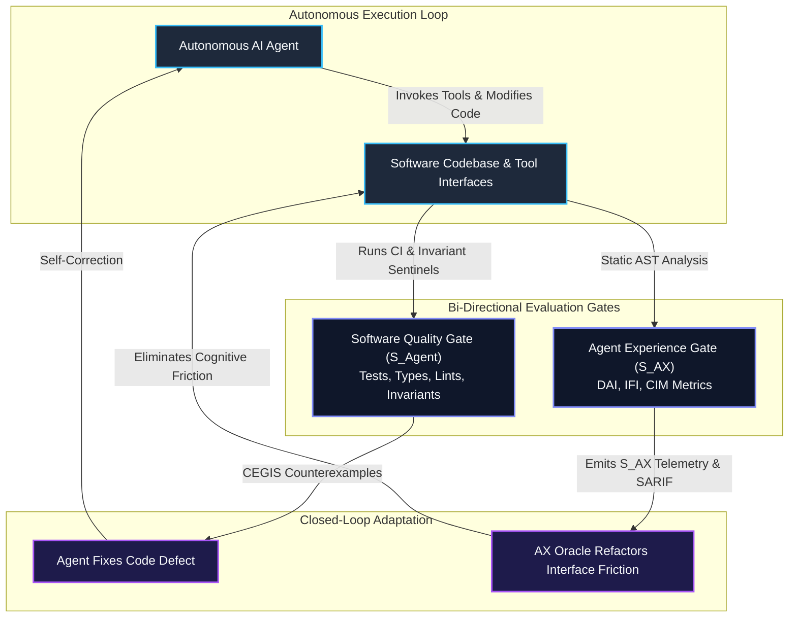

# Sample App: Agent Experience (AX) Evaluator

An executable, zero-dependency Python static analyzer that measures and scores the usability, cognitive impedance, and friction of software interfaces from the perspective of autonomous AI agents.

---

## Why This Exists: The Dual-Surface Imperative

Modern software engineering is transitioning from single-consumer systems (human developers) to **dual-surface architectures** where human developers and autonomous AI agents act as co-equal first-class consumers.

Traditional developer tooling measures whether the agent satisfied the software's invariants ($S_{\text{Agent}}$), but lacks any measurement of the friction the software imposes on the agent ($S_{\text{AX}}$):
- **Permissive Interface Hazards**: Ambiguous tool schemas, missing negative bounds (`additionalProperties: false`), and unconstrained `**kwargs` that induce hallucination spirals.
- **Unstructured Diagnostic Hazards**: Errors and exceptions emitted as raw prose strings rather than machine-actionable counterexamples or structural diffs.
- **Cognitive Impedance Hotspots**: Deeply nested logic and procedural branching ($M > 6$, depth $> 3$) that exhaust the agent's attention budget during self-correction.

When software only evaluates the agent, the agent silently works around poorly designed interfaces, wasting tokens and degrading codebase structure. The **Agent Experience (AX) Evaluator** closes the cybernetic feedback loop by measuring the software's friction and emitting machine-readable SARIF/Markdown telemetry.

---

## Architectural Feedback Loop



---

## Core Evaluation Metrics

The composite Agent Experience score ($S_{\text{AX}} \in [0, 1]$) integrates three foundational telemetry indices:

$$S_{\text{AX}} = 0.40 \cdot \text{DAI} + 0.30 \cdot (1 - \text{IFI}) + 0.30 \cdot \text{CIM}$$

| Dimension | Metric | Formula | Target | Description |
|---|---|---|---|---|
| **Diagnostic Actionability** | **DAI** | $\frac{\text{Structured Diagnostics}}{\text{Total Diagnostics}}$ | $\ge 0.800$ | Measures whether exceptions and assertions provide machine-actionable context rather than raw text prose. |
| **Interface Friction** | **IFI** | $\frac{\text{Permissive Schemas}}{\text{Total Schemas}}$ | $\le 0.100$ | Rates prevalence of unconstrained parameters, untyped `**kwargs`, and missing `additionalProperties: false`. |
| **Cognitive Impedance** | **CIM** | $1 - \frac{\text{High Impedance Functions}}{\text{Total Functions}}$ | $\ge 0.850$ | Assesses structural headroom preservation (functions maintaining $M \le 6$ and block depth $\le 3$). |

> [!NOTE]
> Any unconstrained schema hazard (`AX001`) acts as a hard veto: even if the composite score exceeds the threshold, the pass verdict is withheld until interface boundaries are strictly enclosed.

---

## Quick Start

### Running the Evaluator

```bash
# Evaluate a single file or entire directory
python3 ax_evaluator.py path/to/module.py
python3 ax_evaluator.py tools/ examples/

# Output human- and agent-readable Markdown
python3 ax_evaluator.py tools/ --format markdown

# Generate OASIS SARIF 2.1.0 telemetry for GitHub Code Scanning
python3 ax_evaluator.py tools/ --format sarif --out ax_findings.sarif

# Enforce a custom composite threshold (default: 0.75)
python3 ax_evaluator.py tools/ --threshold 0.85
```

### Sample Output (Markdown Format)

```markdown
# Agent Experience (AX) Evaluation Summary

**Verdict**: ✅ PASSED (Score: **0.95** / Target: **0.75**)

| Evaluation Metric | Observed | Target / Best | Meaning |
|---|---|---|---|
| **Diagnostic Actionability (DAI)** | `0.920` | `>= 0.800` | Ratio of structured error vectors to unstructured prose |
| **Interface Friction Index (IFI)** | `0.000` | `<= 0.100` | Rate of permissive or unconstrained tool parameters |
| **Cognitive Impedance (CIM)** | `0.965` | `>= 0.850` | Structural headroom ratio (functions with M <= 6, depth <= 3) |
| **Total Files Analyzed** | `14` | — | Evaluated Python source modules |
| **Total AX Findings** | `2` | `0` | Discovered friction hotspots and schema risks |
```

---

## Executing the Test Suite

The exhibit is self-contained with zero third-party dependencies, testable via either standard library `unittest` or `pytest`:

```bash
# Run with Python standard library unittest
python3 -m unittest test_ax_evaluator.py

# Run with pytest and measure code coverage
pytest test_ax_evaluator.py -v --cov=ax_evaluator --cov-report=term-missing
```

---

## Architectural Invariant Compliance

The implementation of `ax_evaluator.py` is certified against the [AST Invariant Sentinel](../ast-invariant-sentinel/):
- **Cyclomatic Complexity**: All functions maintain $M \le 4$ (far below the $M \le 10$ gate).
- **Block Nesting Depth**: Maximum indentation depth $\le 2$ levels across all routines.
- **Zero-Trust Egress**: Zero external dependencies, network calls, or private infrastructure leak hazards.
