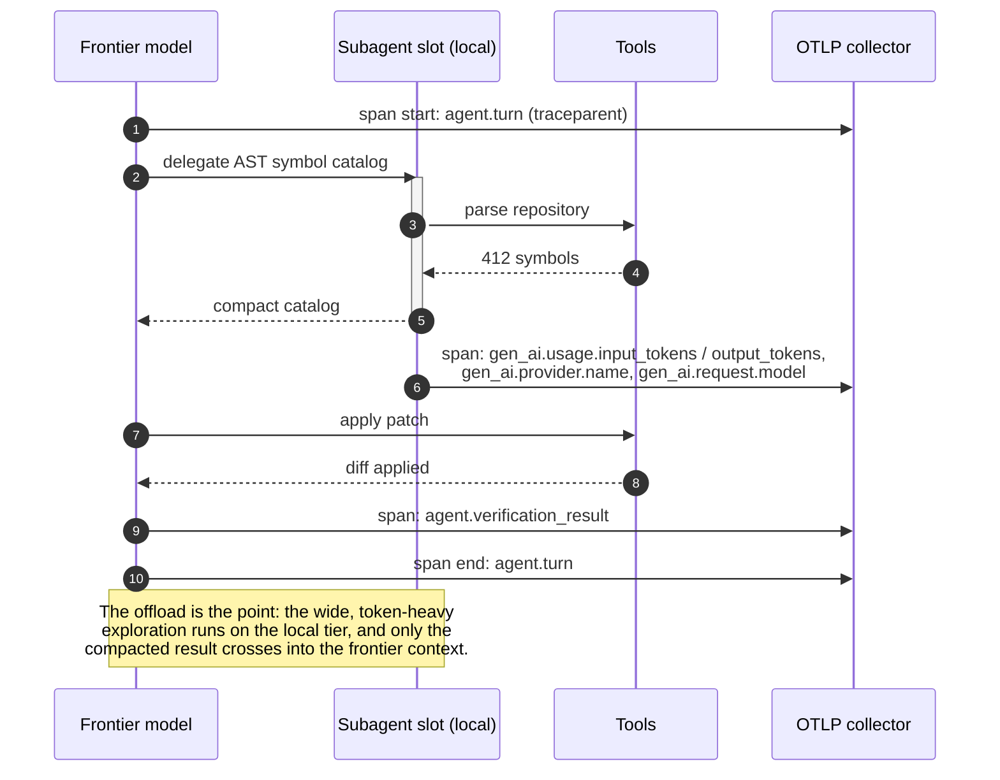

# Sample App: OpenTelemetry Agent Waterfall Trace Generator

An executable generator modeling autonomous multi-turn agent sessions into OpenTelemetry-compliant spans with token spend attributes, model tier metadata, and ASCII waterfall visualizations.

---

## Why This Exists

As autonomous AI agents execute multi-step workflows (such as architectural planning, AST symbol extraction, CEGIS defect patching, and invariant validation), understanding **where time and tokens are spent** is critical:
- Which step spent the most tokens?
- Was token-heavy symbol exploration properly offloaded to local models?
- Where are the execution latency bottlenecks?

The **Agent Waterfall Trace Generator** models this lifecycle using standard OpenTelemetry semantic conventions and renders clean waterfall timelines.



---

## Quick Start

### Run the Interactive Waterfall Generator
```bash
python3 generator.py
```

### Export as OpenTelemetry JSON
```bash
python3 generator.py --json
```

### Export as Standard OTLP Protobuf-JSON (`v1/traces`)
```bash
python3 generator.py --otlp
```

### Stream Spans Directly to Live OTLP/HTTP Collector or Jaeger
```bash
# Streams trace directly to OpenTelemetry Collector or Jaeger OTLP ingest (default port 4318)
python3 generator.py --export-otlp http://localhost:4318/v1/traces
```

### Check Conformance With the GenAI Semantic Conventions
```bash
python3 examples/agent-telemetry-trace-generator/generator.py --validate
```

### Run the Unit Tests
```bash
pytest test_generator.py -v
```

---

## Sample ASCII Waterfall Output

```text
==============================================================================
📊 AGENT WATERFALL TRACE [TraceID: 3a9f81d4...]
Goal: Refactor legacy parser with CEGIS & AST complexity constraints
Total Duration: 1045.0ms
==============================================================================
SPAN NAME                          | DURATION  | TIMELINE WATERFALL
------------------------------------------------------------------------------
AgentSession                       | 1045.0ms  | ████████████████████████████████████████
  FrontierPlanning                 |  450.0ms  | ███████████████
  LocalSubAgentOffload:ASTExplore  |  180.0ms  |                 ██████
  CEGISConstraintLoop              |  320.0ms  |                        ███████████
  ASTInvariantSentinel             |   45.0ms  |                                   █
------------------------------------------------------------------------------
Tokens: Prompt=51600, Completion=2530, Cached=18000 (Total: 54130)
==============================================================================
```

---

## Semantic Conventions, and Why the Envelope Is Not the Convention

This generator used to emit valid OTLP carrying a private vocabulary — `ai.tokens.prompt`,
`ai.model.name`, `agent.persona` — with every span kind hard-coded to `INTERNAL`. Every
collector accepted it. No GenAI-aware backend could chart it, and nothing anywhere said so:
a span with the wrong key is never rejected, it just never appears in the dashboard built
to read it, and an empty dashboard reads as *no traffic*.

| Then | Now |
|---|---|
| `ai.tokens.prompt` | `gen_ai.usage.input_tokens` |
| `ai.tokens.completion` | `gen_ai.usage.output_tokens` |
| `ai.model.name` | `gen_ai.request.model`, `gen_ai.response.model` |
| — | `gen_ai.operation.name`, `gen_ai.provider.name` (both **required**) |
| `name: "FrontierPlanning"` | `name: "chat claude-3-5-sonnet"` |
| `kind: 1` on every span | `kind: 3` (CLIENT) on model calls |
| `agent.persona` | `vibes.agent.persona` — still ours, and no longer pretending otherwise |

The convention is not restated in this repository. [`tools/semconv_snapshot.py`](../../tools/semconv_snapshot.py)
fetches the upstream model at a **pinned commit**, resolves its attribute groups, and writes
`semconv_genai.json`; [`semconv.py`](./semconv.py) reads that with nothing but the standard
library. `--validate` prints the provenance before the findings, so a reader can tell what
the table is a snapshot *of*.

### Four things this turned up

**The conventions moved repository.** `open-telemetry/semantic-conventions` now redirects:
the GenAI definitions live in `open-telemetry/semantic-conventions-genai`, which has no
tagged release, so the pin is a commit and the snapshot says so.

**"Moved" is not "deprecated".** Every GenAI attribute is marked deprecated in the
repository they left, with the reason `moved`. Reading that table before the live registry
reported all thirty conformant attributes on a correct span as obsolete. A record that an
attribute's *definition* moved is not a statement that the *attribute* is obsolete.

**A silent re-reference is not a requirement level.** `gen_ai.inference.client`
re-references `gen_ai.operation.name` with no `requirement_level`, purely to mark it
sampling-relevant, while its attribute group declares it **required**. Reading the silence
as the default downgraded it to `recommended`, and a validator built on that snapshot would
have accepted a span missing the one attribute the convention mandates.

**A rename is a silent outage, and the eight of them are the point.**
`gen_ai.usage.prompt_tokens` became `gen_ai.usage.input_tokens`. A dashboard still querying
the old key returns zero rows, and zero rows renders as no traffic. The outage is in the
reading, not in the pipeline, so nothing is red and nothing alerts — which is why emitting
a renamed key is an error here and not a note.

### What is a warning rather than an error

`gen_ai.provider.name: "ollama"` is not a well-known value. OpenTelemetry enums are open
unless declared closed, so a local runtime is permitted — and a typo looks exactly the
same. The exhibit keeps one deliberately, so the distinction is visible in the output
rather than described in prose. The span name rule is a SHOULD and warns for the same
reason: reporting a SHOULD as an error teaches its reader to ignore the report.
