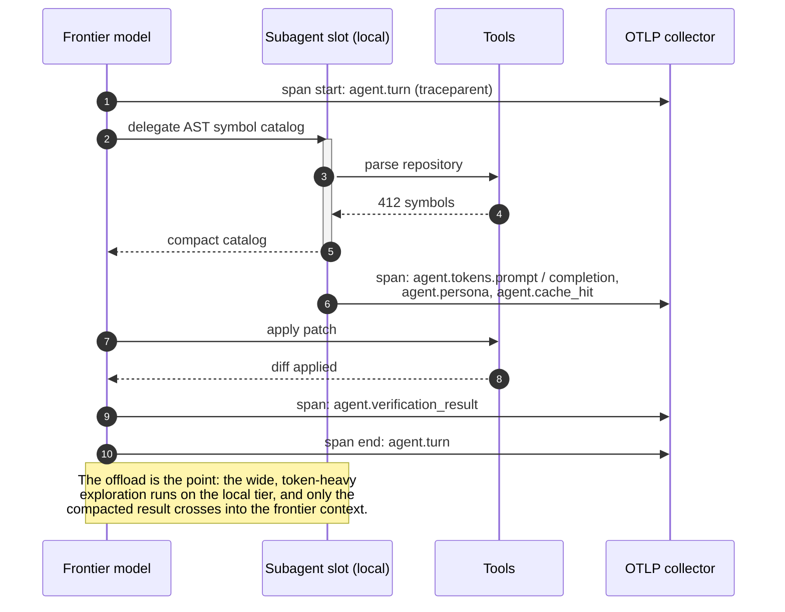

# Sample App: OpenTelemetry Agent Waterfall Trace Generator

An executable generator modeling autonomous multi-turn agent sessions into OpenTelemetry-compliant spans with token spend attributes, model tier metadata, and ASCII waterfall visualizations.

---

## Why This Exists

As autonomous AI agents execute multi-step workflows (such as architectural planning, AST symbol extraction, CEGIS defect patching, and invariant validation), understanding **where time and tokens are spent** is critical:
- Which step spent the most tokens?
- Was token-heavy symbol exploration properly offloaded to local models?
- Where are the execution latency bottlenecks?

The **Agent Waterfall Trace Generator** models this lifecycle using standard OpenTelemetry semantic conventions and renders clean waterfall timelines.



---

## Quick Start

### Run the Interactive Waterfall Generator
```bash
python3 generator.py
```

### Export as OpenTelemetry JSON
```bash
python3 generator.py --json
```

### Export as Standard OTLP Protobuf-JSON (`v1/traces`)
```bash
python3 generator.py --otlp
```

### Stream Spans Directly to Live OTLP/HTTP Collector or Jaeger
```bash
# Streams trace directly to OpenTelemetry Collector or Jaeger OTLP ingest (default port 4318)
python3 generator.py --export-otlp http://localhost:4318/v1/traces
```

### Run the Unit Tests
```bash
pytest test_generator.py -v
```

---

## Sample ASCII Waterfall Output

```text
==============================================================================
📊 AGENT WATERFALL TRACE [TraceID: 3a9f81d4...]
Goal: Refactor legacy parser with CEGIS & AST complexity constraints
Total Duration: 1045.0ms
==============================================================================
SPAN NAME                          | DURATION  | TIMELINE WATERFALL
------------------------------------------------------------------------------
AgentSession                       | 1045.0ms  | ████████████████████████████████████████
  FrontierPlanning                 |  450.0ms  | ███████████████
  LocalSubAgentOffload:ASTExplore  |  180.0ms  |                 ██████
  CEGISConstraintLoop              |  320.0ms  |                        ███████████
  ASTInvariantSentinel             |   45.0ms  |                                   █
------------------------------------------------------------------------------
Tokens: Prompt=51600, Completion=2530, Cached=18000 (Total: 54130)
==============================================================================
```
