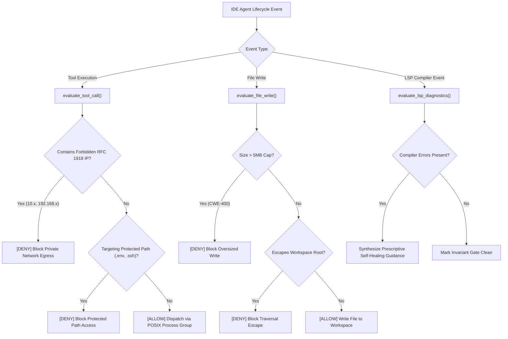

# Agentic IDE Lifecycle Hook Sentinel & Zero-Trust Execution Guard

Reference implementation of a zero-trust lifecycle interception engine for Agentic IDE control planes (VS Code, Google Antigravity, Cursor). Intercepts tool execution calls, file writes, and compiler diagnostics to enforce deterministic safety boundaries around autonomous coding assistants.

---

## 🏛️ The Threat Model in Agentic IDEs

When an autonomous AI agent is given tool-calling agency inside an IDE, unrestricted execution creates critical security and stability hazards:
1. **Secret & Credential Infiltration**: Agents can inadvertently read or overwrite `.env`, `~/.ssh/id_rsa`, or `/etc/shadow` when exploring unfamiliar projects.
2. **Private Network Egress / SSRF**: Prompts or hijacked tools can probe private RFC 1918 subnets (`10.0.0.0/8`, `192.168.0.0/16`) or internal metadata endpoints.
3. **Runaway Zombie Processes**: Terminal commands executed via standard `proc.kill()` leave grandchild background processes running as unmonitored zombies.
4. **Denial-of-Service via Minified Bundles (CWE-400)**: Ingesting or generating multi-megabyte minified bundles exhausts editor memory.
5. **Ignoring Compiler Oracles**: Models repeatedly apologize for compilation errors rather than treating Language Server (LSP) diagnostics as deterministic boundary conditions.

---

## 🧭 Architecture



---

## 🚀 Usage

```python
from pathlib import Path
from hook_sentinel import HookDecision, IdeHookSentinel

workspace_dir = Path("/workspaces/my-project")
sentinel = IdeHookSentinel(workspace_root=workspace_dir)

# 1. Intercept pre-tool execution
tool_eval = sentinel.evaluate_tool_call(
    tool_name="http_request",
    arguments={"url": "http://10.0.0.1:8080/api"},
)
if tool_eval.decision == HookDecision.DENY:
    print(f"Blocked dangerous tool call: {tool_eval.reason}")

# 2. Run shell command with POSIX process group isolation
cmd_result = sentinel.run_isolated_command(
    command=["pytest", "tests/"],
    timeout_seconds=30.0,
)
if cmd_result.timed_out:
    print("Process exceeded timeout and was terminated cleanly via SIGTERM/SIGKILL.")

# 3. Evaluate compiler diagnostics from Language Server Protocol (LSP)
lsp_eval = sentinel.evaluate_lsp_diagnostics(
    file_path="src/main.rs",
    diagnostics=[{"severity": 1, "range": {"start": {"line": 10}}, "message": "Mismatched types"}],
)
if not lsp_eval.is_clean:
    print(f"Corrective guidance for agent: {lsp_eval.prescriptive_guidance}")
```

---

## 🧪 Testing

Run the isolated test suite:
```bash
pytest examples/agentic-ide-hook-sentinel/test_hook_sentinel.py
```

