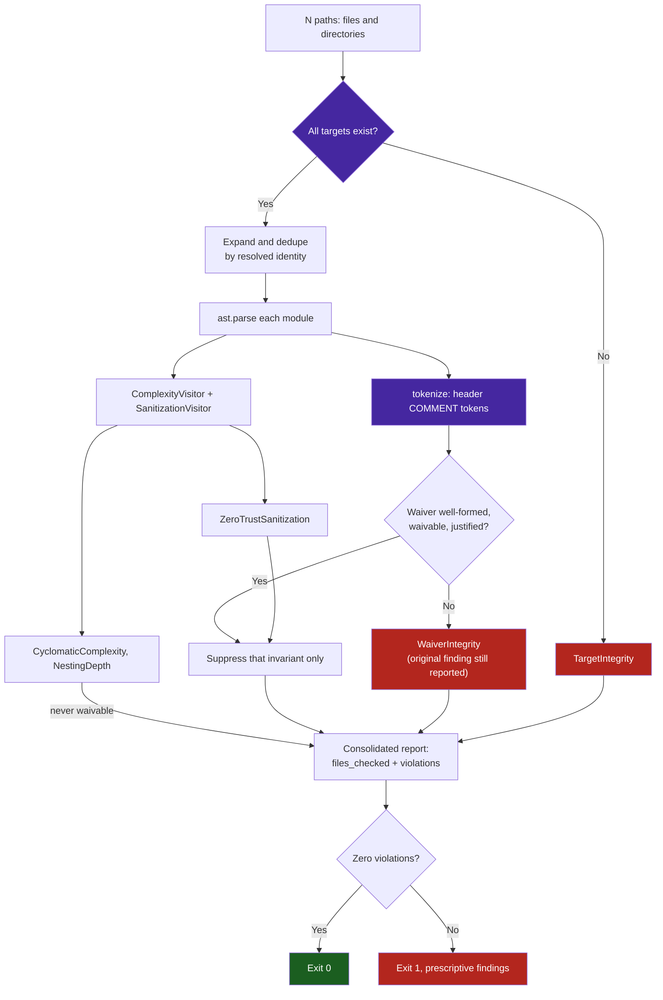

# Sample App: AST Invariant Sentinel

An executable, zero-dependency Python static analyzer that mechanically enforces architectural invariants on codebases developed by AI agents.

---

## Why This Exists

When AI coding assistants are asked to add features or fix bugs, their path of least resistance is to wrap existing logic in another conditional block or procedural ladder. Without automated mechanical gates, code quickly degrades into high cyclomatic complexity and deep nesting.

The **AST Invariant Sentinel** converts soft architectural guidelines into deterministic verification gates:
- **Cyclomatic Complexity**: Enforces $M \le 10$ across all functions and methods.
- **Nesting Depth**: Enforces indentation depth $\le 5$ levels.
- **Zero-Trust Sanitization**: Flags private RFC 1918 IPs (`192.168.x`, `10.x`) and enforces standardized dummy domains (`example.com` with no subdomains).

---

## Quick Start

### Running the Sentinel
```bash
# One or many targets; files and directories may be mixed freely.
python3 sentinel.py /path/to/python/code
python3 sentinel.py tools examples tests benchmarks
```

> [!IMPORTANT]
> Every supplied path is audited. Pre-commit hooks with `pass_filenames: true` hand the sentinel
> N staged files per invocation, so an entrypoint that reads only `argv[1]` certifies code it never
> opened. Targets that do not exist raise `TargetIntegrity` rather than passing as a clean audit of
> zero files.

### Running the Tests
```bash
pytest test_sentinel.py -v
```



---

## Auditable Waivers

A detector's own negative fixtures must embed the strings it hunts. Such modules declare a justified
waiver in the first 15 lines, parsed from real comment tokens so text inside a string literal can
never disarm the gate:

```python
"""Unit tests for the egress guard."""

# sentinel: allow[ZeroTrustSanitization] — negative fixtures asserting the detector fires
```

Only `ZeroTrustSanitization` is waivable. `CyclomaticComplexity` and `NestingDepth` are not: a metric
you can opt out of is not an invariant. A malformed waiver, one naming a non-waivable invariant, or one
lacking a justification of at least 12 characters raises `WaiverIntegrity` **and** leaves the original
violation reported.

---

## Programmatic Integration

```python
from pathlib import Path
from sentinel import audit_targets

report = audit_targets([Path("tools"), Path("tests")])
if not report.is_clean:
    for violation in report.violations:
        print(f"{violation.file_path}:{violation.line_number} — {violation.message}")
    exit(1)
```
