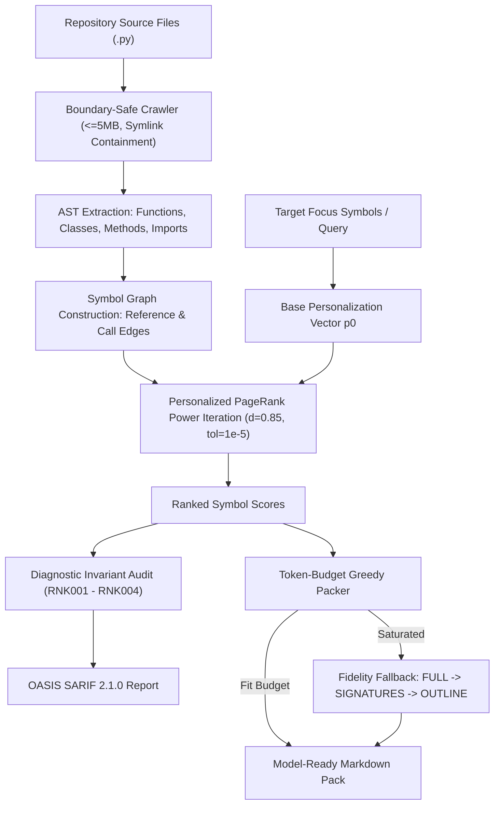

# Graph-Ranked AST Context Optimizer & Relevance Packer

> **Exemplar Status**: Living Artifact & Executable Reference Implementation  
> **Classification**: Context Engineering, AST Graph Centrality, Token Budgeting, Information Foraging  
> **Related**: [Observation 38](../../observations/systems/38-graph-ranked-ast-context-optimization-and-personalized-pagerank.md), [Pattern: AST Graph Relevance Ranking & Context Packing](../../patterns/ast-graph-relevance-ranking-and-context-packing.md)

---

## 1. Executive Overview

When autonomous AI coding agents navigate large, multi-file codebases, naive file-level prompt packing faces a fundamental dilemma:
1. **The Greed Dilemma**: Packing whole files in alphabetical or arbitrary order saturates context budgets with irrelevant utility modules, pushing architectural focal points out of the context window.
2. **The Syntax Fracture Dilemma**: Arbitrary line truncation breaks function bodies and class scopes in half, inducing hallucinated syntax errors and missing closing token failures in downstream models.

The **Graph-Ranked AST Context Optimizer** resolves both failures. It ingests the repository source tree into an abstract syntax tree (AST) symbol graph (functions, classes, methods, imports, and call/reference edges). It then computes **Personalized PageRank** over the symbol topology rooted at the agent's target focal symbols (the functions or classes being edited or investigated).

By ranking individual AST symbol definitions by graph centrality and packing down to an exact token budget with graceful fidelity degradation (`FULL` $\to$ `SIGNATURES` $\to$ `OUTLINE`), the optimizer yields maximal architectural signal per token with 0% syntactic fracture.

---

## 2. Graph Centrality & Packing Pipeline



---

## 3. Mathematical Formulation of Personalized PageRank

Given a symbol graph $G = (V, E)$ where nodes $v \in V$ represent AST symbol declarations and directed edges $(u, v) \in E$ indicate that symbol $u$ invokes, inherits, or imports symbol $v$:

Let $p \in \mathbb{R}^{|V|}$ be the personalization distribution vector:
- If a focal symbol set $S_{\text{focal}} \subseteq V$ is specified (e.g. `calc.py::run_pipeline`), then:
  $$p(v) = \begin{cases} \frac{1}{|S_{\text{focal}}|}, & \text{if } v \in S_{\text{focal}} \\ 0, & \text{otherwise} \end{cases}$$
- If no focus is provided, $p$ defaults to the uniform distribution $p(v) = \frac{1}{|V|}$.

The ranking vector $r^{(k+1)}$ is iteratively computed using the power method:

$$r^{(k+1)}(v) = (1 - d) \cdot p(v) + d \sum_{u \in \text{In}(v)} \frac{r^{(k)}(u)}{\text{OutDeg}(u)} + d \cdot p(v) \sum_{w \in \text{Dangling}} r^{(k)}(w)$$

where:
- $d = 0.85$ is the damping factor.
- $\text{In}(v) = \{u \in V \mid (u, v) \in E\}$ is the set of callers referencing symbol $v$.
- $\text{OutDeg}(u) = |\{w \in V \mid (u, w) \in E\}|$ is the out-degree of symbol $u$.
- Convergence is guaranteed when $\|r^{(k+1)} - r^{(k)}\|_1 < 10^{-5}$.

---

## 4. Diagnostic Rules & Invariants

| Rule ID | Invariant Category | Severity | Description |
|---|---|---|---|
| `RNK001` | Isolation Detection | `note` | Orphaned symbol with zero in-degree and zero out-degree graph connections. |
| `RNK002` | Hub Hotspot | `warning` | Centrality hotspot exceeding mean $+ 3\sigma$ score, representing a critical architectural nexus. |
| `RNK003` | Budget Saturation | `warning` | Token budget exhausted: one or more ranked symbols excluded from the final context pack. |
| `RNK004` | Cycle Hazard | `warning` | Mutual circular dependency 2-cycle detected between symbols. |

---

## 5. CLI Usage & Verification

```bash
# Rank symbols in a repository by global centrality
python3 examples/ast-relevance-context-ranker/context_ranker.py rank --dir .

# Rank symbols personalized to a target focal symbol
python3 examples/ast-relevance-context-ranker/context_ranker.py rank --dir . --focus "calc.py::run_pipeline"

# Pack repository symbols to a 2000-token budget
python3 examples/ast-relevance-context-ranker/context_ranker.py pack --dir . --budget 2000 --format pack

# Export diagnostic findings in OASIS SARIF 2.1.0 format
python3 examples/ast-relevance-context-ranker/context_ranker.py pack --dir . --format sarif

# Run unit and integration tests
uv run pytest -q examples/ast-relevance-context-ranker/test_context_ranker.py
```

---

## 6. Zero-Dependency Statement

This reference implementation strictly leverages the **Python standard library** (`argparse`, `ast`, `collections.abc`, `dataclasses`, `enum`, `json`, `math`, `os`, `pathlib`, `typing`), requiring zero external runtime packages.
