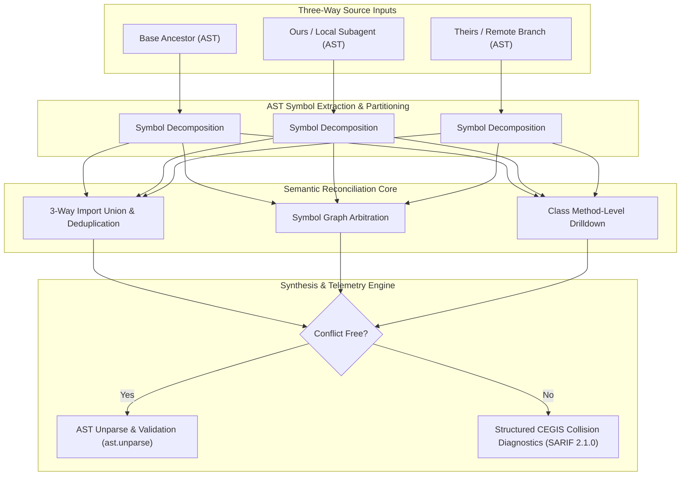

# Autonomous 3-Way AST Semantic Reconciler & Conflict Arbitrator ✨

> **Executable Reference Implementation** | **Deliverable #2029**  
> Pairs with [Observation 35](../../observations/systems/35-3-way-ast-semantic-reconciliation-and-worktree-collision-arbitration.md) and [Pattern: 3-Way AST Semantic Reconciliation](../../patterns/3-way-ast-semantic-reconciliation.md).

---

## 🎯 The Problem: Line-Based Merge Brittleness in Multi-Agent Swarms

When autonomous subagents operate concurrently in isolated git worktrees (managed via [`worktree-swarm-arbiter`](../worktree-swarm-arbiter/)), they frequently branch from a common base ancestor (`Base`) and make independent additions to the same files.

Standard git 3-way merge tools (`diff3`, `ort`, `recursive`) evaluate changes on a purely **lexical, line-oriented basis**. This induces severe **false merge conflicts** on perfectly commutative changes:

1. **Disjoint Function Additions**: Subagent A appends `def helper_alpha()` to the end of a module; Subagent B appends `def helper_beta()` to the end of the same module. Git emits a fatal conflict marker (`<<<<<<< HEAD ... ======= ... >>>>>>>`).
2. **Disjoint Class Methods**: Subagent A adds `def pause(self)` inside `class Worker`; Subagent B adds `def resume(self)` inside the same class. Line-based merge marks the class body as conflicted.
3. **Import Set Collisions**: Independent subagents add distinct third-party or local imports to the top of a file, clashing on line offsets.

The **Autonomous 3-Way AST Semantic Reconciler** resolves these collisions by operating directly on **commutative Python Abstract Syntax Tree (AST) symbol graphs**.

---

## 🏗️ Architecture & Reconciliation Pipeline



---

## ⚡ Key Capabilities

1. **Commutative Disjoint Function Reconciliation**:
   - Computes deterministic SHA-256 structural fingerprints (`hash_ast_node`).
   - Automatically unifies independent function additions without ordering bias.
2. **Recursive Class Method Arbitration**:
   - Inspects `ast.ClassDef` bodies and merges disjoint method definitions across branches.
3. **Deterministic Import Set Union**:
   - Computes 3-way set differences (`(ours - base) | (theirs - base)`), deduplicating and sorting imports according to PEP 8 standards.
4. **Structured CEGIS Collision Diagnostics**:
   - When a true semantic collision occurs (both branches modified the exact same function body incompatibly), the reconciler avoids emitting invalid syntax markers and instead produces structured diagnostic telemetry with exact AST node snippets and OASIS SARIF 2.1.0 output.

---

## 💻 CLI & Git Merge Driver Usage

### Standalone Command

```bash
# Perform 3-way semantic reconciliation
python reconciler.py --base base.py --ours ours.py --theirs theirs.py --output merged.py

# Emit OASIS SARIF 2.1.0 diagnostic report
python reconciler.py --base base.py --ours ours.py --theirs theirs.py --format sarif

# Emit Markdown summary table
python reconciler.py --base base.py --ours ours.py --theirs theirs.py --format markdown
```

### Git Custom Merge Driver Configuration

Configure git to route Python file merges through the AST Semantic Reconciler:

```ini
# In .git/config or ~/.gitconfig
[merge "ast-reconciler"]
    name = Autonomous 3-Way AST Semantic Reconciler
    driver = python /path/to/reconciler.py --base %O --ours %A --theirs %B --output %A
```

```ini
# In .gitattributes
*.py merge=ast-reconciler
```

---

## 🧪 Verification & Invariant Certification

Run the comprehensive unit test suite:

```bash
uv run pytest examples/ast-semantic-reconciler/test_reconciler.py -v
```

Audit architectural invariants ($M \le 6$, depth $\le 3$):

```bash
python examples/ast-invariant-sentinel/sentinel.py examples/ast-semantic-reconciler/ --preset strict
```
