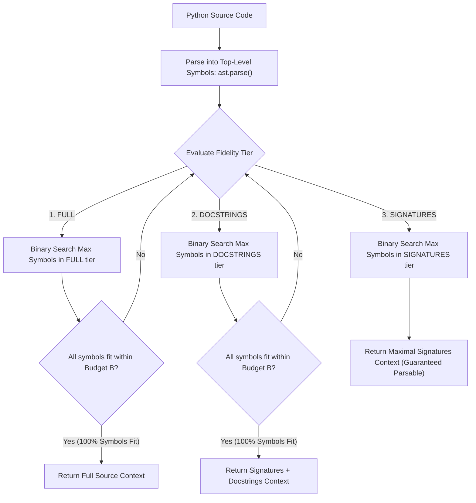

# High-Performance AST Context Packer with Binary Search Truncation

Reference implementation of an algorithmic prompt context packing engine that packs multi-symbol Python source files into an exact token budget window without breaking AST syntactic validity or producing truncated function/class blocks.

---

## 🏛️ The Problem with Naive Context Truncation

When autonomous agents assemble prompt context across multi-file repositories (repomaps, architectural outlines, review context), they face strict context window budgets ($B$ tokens).

Two failure modes consistently degrade LLM reasoning:
1. **The Mid-Block Syntax Fracture**: Arbitrary line truncation cuts a function or class in half. Downstream language models receive malformed Python code, triggering hallucinated syntax error reports or misattributing missing closing braces to developer bugs.
2. **The Greedy Packing Gap**: Greedily packing whole files in sequence either leaves massive token gaps (when the next file is slightly too large to fit the remaining budget) or overshoots the budget, triggering API context length rejection.

---

## 🧭 Binary Search Convergence Architecture

Rather than treating source code as flat text, the engine parses code into top-level structural units (`AstSymbol`) using Python's `ast` module. It then evaluates three hierarchical fidelity tiers (`FULL`, `DOCSTRINGS`, `SIGNATURES`) and executes a monotonic binary search to maximize token utilization in $O(\log N)$ iterations.



---

## 🚀 Usage

### Packing to an Exact Token Budget

```python
from context_packer import pack_source_to_budget

source_code = Path("my_module.py").read_text()
budget_tokens = 500

# Packs source code to fit budget, degrading gracefully from FULL -> DOCSTRINGS -> SIGNATURES
rendered_context, fidelity_level, symbol_count = pack_source_to_budget(
    source_code,
    budget_tokens=budget_tokens,
)

print(f"Packed {symbol_count} symbols at {fidelity_level} fidelity.")
```

---

## 🧪 Testing

Run the isolated test suite:
```bash
pytest examples/binary-search-context-packer/test_context_packer.py
```
