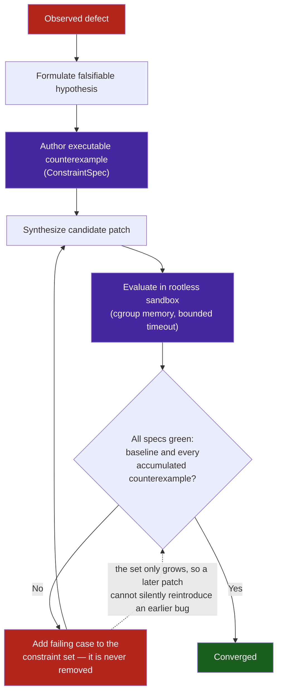

# Sample App: CEGIS Debugging Workbench

An executable demonstration of **Counterexample-Guided Inductive Synthesis (CEGIS)** for autonomous defect remediation.

---

## Why This Exists

When an autonomous AI agent encounters a bug, the default behavior is often single-shot trial-and-error:
1. The agent guesses a superficial code modification.
2. It tries applying naive workarounds (e.g. `try/except: pass`) that mask the symptom while breaking the underlying contract.
3. If it fails, the agent wanders aimlessly through solution space.

## Key Mechanics

1. **Hypothesis Formulation**: State a falsifiable theory explaining the root cause.
2. **Counterexample Isolation**: Author an executable test asserting the failure (`ConstraintSpec`).
3. **Oracle Verification**: Evaluate candidate patches against both baseline specifications and accumulated counterexamples.
4. **Sandboxed Patch Evaluation (`SandboxedPatchEvaluator`)**: Untrusted candidate patches are executed inside isolated rootless containers (`ContainerSandboxHarness` / POSIX process groups) with cgroup memory and bounded timeout containment, preventing runaway loops (`while True: pass`) from hanging host execution.
5. **Convergence**: Only declare completion when all constraints are certified green.



Trial-and-error also loops. The difference is the accumulating constraint set: a naive retry loop forgets every failure it has already seen, so it can cycle forever between two patches that each fix what the other breaks.

---

## Quick Start

### Running the Interactive Simulation
```bash
python3 workbench.py
```

### Running the Test Suite
```bash
python3 -m pytest test_workbench.py -v
```

---

## Pattern Implementation

```python
from workbench import (
    CEGISRunner,
    ConstraintSpec,
    Hypothesis,
    SandboxedPatchEvaluator,
)

runner = CEGISRunner(baseline_tests)

# Add failing counterexample
runner.record_counterexample(failing_test_case)

# Evaluate candidate patch in-process
is_valid = runner.verify_and_converge(my_patch_fn, hypothesis)

# Or evaluate untrusted source code inside the isolated container sandbox
evaluator = SandboxedPatchEvaluator(timeout_seconds=0.5, force_simulator=True)
is_sandboxed_valid = runner.verify_and_converge_sandboxed(
    patch_source_code,
    "entrypoint_function",
    hypothesis,
    evaluator=evaluator,
)
```
