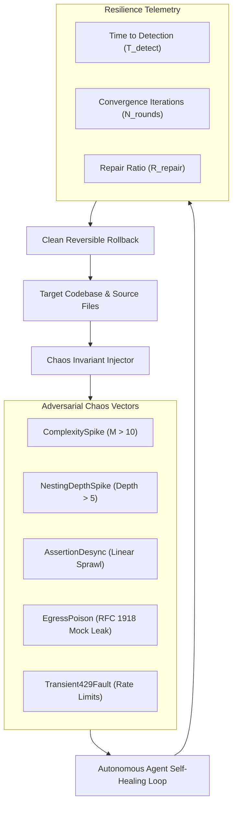

# Sample App: Chaos Invariant Injector & Agent Resilience Benchmark

An executable, zero-dependency Python chaos engineering tool that injects controlled, reversible mechanical mutations into codebases to benchmark autonomous AI agent self-healing convergence.

---

## Why This Exists: Beyond Ideal Lab Conditions

Autonomous coding agents are typically evaluated under sterile benchmark conditions: pristine problem statements, static unit tests, and undisturbed source files.

In production environments, however, software development is messy:
- **Latent Complexity Creep**: Legacy functions that breach complexity caps ($M > 10$) when edited.
- **Deep Nesting Spikes**: Fast agent refactors that introduce nested branching ladders ($> 5$ levels).
- **Assertion Drift**: Consolidated structural tuple checks broken into fragile assertion sprawl.
- **Egress Leak Traps**: Accidental leakage of internal IP addresses or private tokens into test fixtures.
- **Transient Failures**: Intermittent HTTP 429 rate limits from inference or tool gateways.

The **Chaos Invariant Injector** acts as a resilience benchmark by introducing synthetic invariant violations, measuring time-to-detection ($T_{\text{detect}}$) and repair ratio ($R_{\text{repair}}$), and cleanly rolling back all modifications.

---

## Architecture & Chaos Loop



---

## Quick Start

### CLI Usage

```bash
# Inject complexity spike into a target file
python3 chaos_monkey.py inject path/to/file.py --type COMPLEXITY_SPIKE

# Inject deep nesting invasion
python3 chaos_monkey.py inject path/to/file.py --type NESTING_SPIKE

# Inject simulated egress leak
python3 chaos_monkey.py inject path/to/file.py --type EGRESS_POISON

# Run simulated resilience benchmark and output Markdown
python3 chaos_monkey.py benchmark --format markdown

# Export OASIS SARIF 2.1.0 telemetry
python3 chaos_monkey.py benchmark --format sarif
```

---

## Invariant Verification

- **Zero External Dependencies**: Standard library Python (`ast`, `json`, `dataclasses`, `time`).
- **Clean Rollback**: Guaranteed exact byte-level restoration of all modified files.
- **Structural Bounds**: All functions certified at $M \le 4$, nesting depth $\le 2$, and parameter count $\le 4$.

