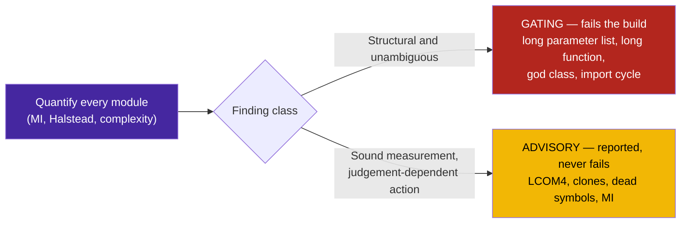

# Sample App: Code Smell Quantifier

A deterministic, zero-dependency measurement of structural decay: ten metrics that established tooling reports and this repository previously did not, each expressed as a **measured value against a cited threshold**.

---

## Why This Exists

This repository enforces two metrics — cyclomatic complexity and nesting depth — and both are pass/fail gates. A gate answers *may this ship*. It does not answer *where is this getting worse, and by how much*, and a self-improving loop needs the second question answered to know what to work on.

Surveying what established tools measure against what was measured here:

| Metric | Established tool | Present before |
|---|---|---|
| Cyclomatic complexity | `radon cc`, lizard, xenon | yes |
| Nesting depth | lizard, sonar | yes |
| Maintainability index | `radon mi` | no |
| Halstead volume | `radon hal` | no |
| Duplicated blocks | PMD-CPD, jscpd | no |
| Long parameter list | pylint R0913 | no |
| Long function | pylint R0915 | no |
| God class | pylint R0902/R0904 | no |
| Cohesion (LCOM4) | sonar, cohesion | no |
| Import cycles | import-linter, pylint R0401 | no |
| Unreferenced symbols | vulture | no |

Two of twelve. None of the missing tools were installable here without taking a dependency, and the repository's tooling is deliberately stdlib-only, so the metrics are implemented against `ast`.

---

## Quick Start

```bash
python3 smell_quantifier.py ../../tools ../../examples --fail-on gating
python3 smell_quantifier.py .. --json          # machine-readable, for trending
pytest test_smell_quantifier.py -v
```

---

## Gating Versus Advisory

Every detector is sound as a *measurement*. They differ in how confidently a finding translates into an action, and conflating those is how a backlog fills with work nobody owed:



Each advisory smell has a known false-positive mode, stated rather than hidden:

- **LCOM4** flags any facade of independent checkers. A validator exposing six unrelated rules scores 6 and is correctly designed.
- **Duplicated blocks** flags deliberate boilerplate as readily as copied logic.
- **Unreferenced symbols** cannot see reflective access. String constants are counted as references for this reason, and modules discovered by naming convention — pytest files — are skipped entirely, because a detector that recommends deleting the test suite is worse than no detector.
- **Maintainability index** is dominated by module length; a large, well-factored module scores lower than a small tangled one.

---

## Calibration

Thresholds are the published defaults of the tool each detector mirrors, so every number traces to a source rather than to taste. Two required empirical calibration against this corpus:

- **Maintainability index floor: 20.** Radon's normalized scale grades A at 20–100, B at 10–19, C below 10. The commonly cited *65* belongs to the unnormalized SEI scale and is a transcription error; using it would mark almost every module unmaintainable.
- **Clone node-mass floor: 40.** Statement count alone makes six consecutive imports a clone of any other six imports. Measured on this corpus, import windows peak at **27** AST nodes while code windows have a median of **128**, so a 40-node floor excludes every import run and retains 90% of real code windows.

> [!IMPORTANT]
> A detector that cannot state its number is an opinion. Each finding carries the measured value, the threshold, and the excess, so a disagreement is about the threshold rather than about whether the thing is true.

---

## What It Found On Its First Run

Run against this repository, the quantifier immediately reported three things that were real:

1. Two byte-identical functions in the context packer, differing only in a docstring — now a single `_extract_declaration_signature`.
2. `audit_directory`, a compatibility shim left behind when the sentinel gained multi-path support earlier in the same session, referenced by nothing.
3. `LifecycleEventType`, an enum defined, exported, documented nowhere and used nowhere.

It also flagged its own author's `_referenced_names` at nesting depth 6, which the AST sentinel then confirmed.
