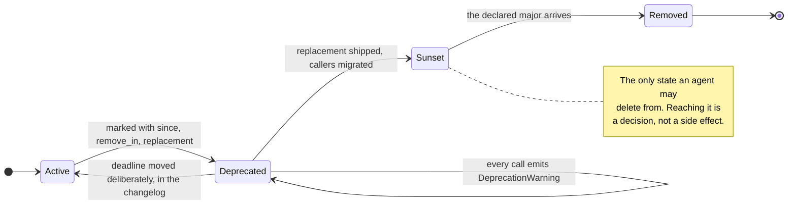

# Sample App: Deprecation Lifecycle Sentinel

An executable, zero-dependency enforcer for the post-1.0 deprecation contract: every deprecated symbol must declare when it started, what replaces it, and the version that removes it — and must actually be removed when that version arrives.

---

## Why This Exists

Before 1.0, deletion is free. This repository mandates zero legacy shims and removes obsolete code on sight, and that is the correct reflex while no one depends on the surface.

After 1.0 the same reflex breaks callers. The obvious correction — never delete anything — is worse: it accumulates a permanent maintenance tax that no release ever pays down, and every deprecated path remains a live code path that must be tested, secured, and reasoned about forever.

Autonomous agents make both failure modes sharper. An agent told "keep the codebase clean of legacy references" will happily delete a public API that a downstream team pinned last week. An agent told "preserve backwards compatibility" will add a shim beside every change and never remove one, because removal is never the locally safe action.

Neither reflex is a policy. A deprecation is a **contract with a deadline**, and this sentinel is the mechanism that makes the deadline real.



---

## The Six Contract Rules

| Defect | Rule | Why it matters |
|---|---|---|
| **`MissingMetadata`** | A deprecation declares `since`, `remove_in`, and `replacement`. | A deprecation without a removal version is a promise no one made; one without a replacement asks callers to guess. |
| **`OverdueRemoval`** | A deprecation whose `remove_in` has arrived must be deleted. | Otherwise the deadline is decorative and the debt is permanent. |
| **`NonMajorRemoval`** | Post-1.0, removal happens in a major bump. | SemVer promises callers that no minor or patch release removes what they depend on. |
| **`SilentDeprecation`** | The runtime emits a `DeprecationWarning`. | Callers who never read the changelog otherwise learn at build-break time. |
| **`UnmigratedCallSite`** | The project's own code does not call what it deprecated. | Owners migrate before asking downstream callers to. |
| **Missing target** | A path that does not exist fails the audit. | A gate that certifies zero files as clean is worse than no gate. |

> [!NOTE]
> Rules that bind after 1.0 do not bind before it. `NonMajorRemoval` is deliberately inert while the major version is `0`, so a pre-1.0 repository keeps its freedom to delete on sight and inherits the discipline automatically at the 1.0 boundary.

---

## Quick Start

```bash
# Audit a release candidate: deprecations due at or before this version must be gone.
python3 deprecation_sentinel.py ../../tools ../../examples --current-version 1.4.0

# What must be removed before cutting 2.0.0?
python3 deprecation_sentinel.py .. --current-version 1.4.0 --due-before 2.0.0

pytest test_deprecation_sentinel.py -v
```

---

## Declaring a Deprecation

```python
from deprecation_sentinel import deprecated

@deprecated(since="1.2.0", remove_in="2.0.0", replacement="render_report(fmt='json')")
def render_json_report(data):
    """Superseded by the unified renderer."""
    return render_report(data, fmt="json")
```

The decorator carries both halves of the contract in one place: the metadata the sentinel enforces statically, and the `DeprecationWarning` the caller experiences at runtime. It refuses to construct an incomplete contract, so the failure arrives at import time rather than at the release that was supposed to remove the symbol.

---

## Release Integration

```bash
# In the release pipeline, before tagging:
python3 deprecation_sentinel.py src --current-version "${RELEASE_VERSION}"
```

The audit fails the release when a symbol has outlived its own deadline. That inverts the usual dynamic: removal stops being a chore someone remembers and becomes the condition of shipping.
