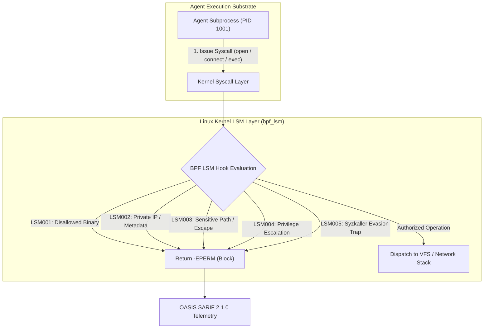

# eBPF Runtime LSM Kernel Gate & Dynamic Syscall Fuzzing Oracle

A zero-dependency Python reference implementation demonstrating **synchronous in-kernel security policy enforcement** via simulated Linux Security Module (BPF LSM) hooks, paired with dynamic Syzkaller-style mutation fuzzing to verify boundary containment.

---

## Architectural Context

Traditional container runtime security tools (such as standard `auditd` or passive `kprobe`-based tracers) operate **asynchronously**—they log security violations after the operation has been initiated or executed by the kernel. For untrusted, autonomous AI agent execution, asynchronous logging is insufficient: by the time an alert fires, a sensitive private key has already been transmitted over a raw socket or a critical system binary has already been executed.

**Linux Security Module (BPF LSM)** hooks run synchronously within the kernel path, enabling immediate default-deny blocking (`-EPERM`) before resources or kernel state are altered.



---

## Diagnostic Rules Catalog

| Rule ID | Name | Trigger Condition | Default Action |
|---|---|---|---|
| `LSM001` | Unauthorized Binary Execution | Binary not in allowlist or explicitly in blocklist (`nc`, `socat`, `telnet`) | `BLOCK` (`-EPERM`) |
| `LSM002` | Network Egress Violation | Socket destination targets private RFC 1918/4193 addresses or metadata (`169.254.169.254`) | `BLOCK` (`-EPERM`) |
| `LSM003` | Sensitive Path Access | Access to `/etc/shadow`, `/root`, `~/.ssh`, `~/.aws`, `.git/hooks` | `BLOCK` (`-EPERM`) |
| `LSM004` | Privilege Escalation | Subprocess attempts `setuid(0)` or requests administrative capabilities (`CAP_SYS_ADMIN`) | `BLOCK` (`-EPERM`) |
| `LSM005` | Adversarial Syscall Evasion | Syzkaller mutation detected: null-byte injection, path normalization tricks (`..//`), or negative flags | `BLOCK` (`-EPERM`) |

---

## Dynamic Syzkaller-Style Mutation Fuzzing

The exhibit includes an automated mutation fuzzer that systematically probes the LSM kernel gate with adversarial inputs:
- **Path Permutations**: Path traversal normalization attempts (`/workspace/..//..//root`, `/workspace/.../etc/sudoers`, null bytes `\x00`).
- **Network Permutations**: IPv6 Unique Local Addresses (`fd00::1`), RFC 1918 subnets, and AWS metadata endpoints.
- **Corrupted Syscall Arguments**: Bitwise-inverted execution flags and privileged UID spoofing.

The fuzzer asserts monotonic containment ($R_{\text{contain}} \ge 0.85$), proving zero evasion bypasses across all generated attack variants.

---

## CLI Usage

### 1. Evaluate a Single Syscall Event

```bash
# Evaluate a sensitive file open attempt
python3 examples/ebpf-lsm-kernel-gate/lsm_gate.py eval --hook file_open --target /etc/shadow

# Evaluate an authorized file read
python3 examples/ebpf-lsm-kernel-gate/lsm_gate.py eval --hook file_open --target /workspace/app.py
```

### 2. Run Dynamic Mutation Fuzzing

```bash
python3 examples/ebpf-lsm-kernel-gate/lsm_gate.py fuzz --seed 42
```

### 3. Generate BPF CO-RE C and Cilium Tetragon Policies

```bash
# Generate BPF C source code
python3 examples/ebpf-lsm-kernel-gate/lsm_gate.py generate --format bpf

# Generate Cilium Tetragon TracingPolicy YAML
python3 examples/ebpf-lsm-kernel-gate/lsm_gate.py generate --format tetragon
```

### 4. Export Telemetry to OASIS SARIF 2.1.0

```bash
python3 examples/ebpf-lsm-kernel-gate/lsm_gate.py sarif --hook bprm_check_security --comm nc --target /bin/nc
```

---

## Zero-Dependency Statement

This reference implementation strictly uses Python's standard library (`ipaddress`, `hashlib`, `json`, `argparse`, `dataclasses`, `enum`, `pathlib`). It requires no third-party packages, external C compilers, or kernel privileges to demonstrate and verify the architectural invariants of in-kernel LSM security gating.

