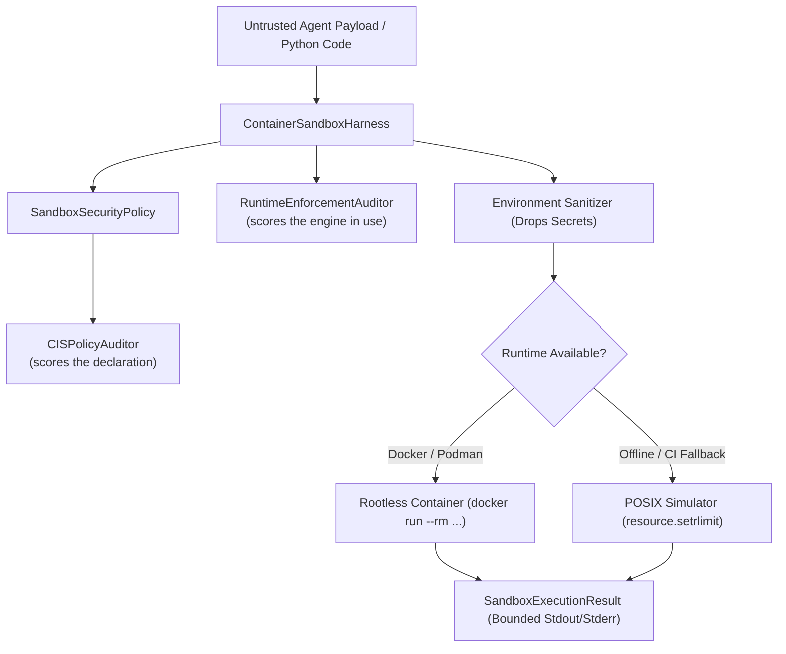

# Sample App: Ephemeral Rootless Container Sandbox Harness

An isolated, hardened execution harness and CIS security benchmark auditor for safely executing untrusted AI agent payloads inside rootless containers (`docker` / `podman`) with a zero-dependency standard-library simulator fallback.

---

## Why This Exists

Autonomous AI agents generate and execute arbitrary code, system commands, and test suites. Running unvetted agent code directly on developer workstations or host environments presents severe operational and security threats:

1. **Host Compromise & Persistence (CWE-78)**: Malicious or hallucinated commands can tamper with host binaries, shell configurations (`.bashrc`, `.zshrc`), or system services.
2. **Network Egress & Data Exfiltration (SSRF)**: Agent-executed payloads can reach internal RFC 1918 addresses, cloud metadata endpoints (`169.254.169.254`), or exfiltrate environment secrets to untrusted command-and-control servers.
3. **Denial of Service & Fork Bombs (CWE-400)**: Recursive subagent loops or runaway processes can exhaust workstation PIDs, CPU cycles, and RAM.
4. **Secret Leakage & Environment Contamination**: Passing the host's complete environment into child processes exposes cloud credentials (`AWS_SECRET_ACCESS_KEY`), GitHub tokens, and SSH keys.

The **Ephemeral Rootless Container Sandbox Harness** establishes a zero-trust execution perimeter, stripping all host credentials, locking down network interfaces, bounding resource limits, and — where a container runtime is present — mounting filesystems in read-only mode.

> [!IMPORTANT]
> **Two numbers, and they are not the same number.** `CISPolicyAuditor` scores the *policy object*: it answers "does this configuration ask for the eight controls". `RuntimeEnforcementAuditor` scores the *engine about to run*: it answers "which of them will actually be applied". For a long time only the first existed, so a default policy reported **100.0/100 with zero violations** while the engine-less path enforced **none** of the eight — it ran a payload that opened a socket and wrote a file into the invoking user's home directory, and called the run compliant. A conformance check of a declaration is not a measurement of a runtime.

---

## CIS Rootless Container Security Controls

The harness embeds an automated auditor validating compliance against 8 core CIS Docker/Rootless Container benchmarks:

| CIS Control | Description | Enforcement Mechanism |
|---|---|---|
| **CIS-5.1** | Read-Only Root Filesystem | Enforces `--read-only` rootfs to prevent persistent malware installation. |
| **CIS-5.2** | Egress Deny-All Isolation | Configures `--network none` (loopback only) to eliminate SSRF and exfiltration. |
| **CIS-5.3** | Linux Capabilities Dropped | Applies `--cap-drop ALL` to strip root/kernel capabilities. |
| **CIS-5.4** | No New Privileges | Adds `--security-opt no-new-privileges:true` to block setuid escalation. |
| **CIS-5.5** | Unprivileged User | Maps execution to non-root UID/GID (`--user 1000:1000`). |
| **CIS-5.6** | Cgroups Memory Cap | Caps memory allocation (`--memory 512m`) to prevent host OOM kills. |
| **CIS-5.7** | PID Limit & Fork-Bomb Protection | Bounds process count (`--pids-limit 100`) mitigating fork-bomb exploits. |
| **CIS-5.8** | Hardened Scratch Tmpfs | Mounts `/tmp` with `rw,noexec,nosuid,nodev,size=64m`. |

---

## Architecture & Dual-Mode Runtime



- **Container Mode**: When `docker` or `podman` is available, orchestrates ephemeral unprivileged containers with strict flag isolation.
- **Simulator Mode**: When running in offline or nested environments without a container socket, uses POSIX process group isolation (`os.setsid`), bounded execution timers, sanitized environments, `setrlimit` caps, and a **seccomp-BPF filter installed in the child between `fork` and `exec`** — kernel-enforced, unprivileged, and irrevocable. This is the path that actually runs on most developer machines and in most CI jobs, and until [`syscall_filter.py`](./syscall_filter.py) it enforced nothing.
- **Buffer Bounding**: Output streams are strictly capped to 64KB (`MAX_OUTPUT_BYTES = 65536`) with truncation markers to prevent CWE-400 memory bloat.

---

## Quick Start

### Run CIS Policy Security Audit
```bash
python3 examples/ephemeral-container-sandbox/sandbox.py --audit
```

Output:
```text
==========================================================================
🔒 CIS ROOTLESS CONTAINER BENCHMARK AUDIT
Compliance Score: 100.0% | Passed: 8/8
--------------------------------------------------------------------------
  [PASS] CIS-5.1 (Read-only Root Filesystem)
  ... the policy asks for all eight ...
==========================================================================
==========================================================================
🧱 RUNTIME ENFORCEMENT (simulator)
Enforced: 75.0% | 6/8 controls applied by this engine
--------------------------------------------------------------------------
  [DECLARED] CIS-5.1 (Read-only Root Filesystem)
             no mount namespace; an unprivileged process cannot remount its root
  [ENFORCED] CIS-5.2 (Network Isolation Egress Deny-All)
             seccomp-BPF (network, privilege, tracing, mount, kernel, keyring)
  [ENFORCED] CIS-5.4 (No New Privileges)
             prctl(PR_SET_NO_NEW_PRIVS)
  [ENFORCED] CIS-5.6 (Cgroups Memory Cap)
             RLIMIT_AS at 512MB
  [DECLARED] CIS-5.8 (Hardened Tmpfs Scratch Mount)
             no mount namespace; /tmp is the host's
--------------------------------------------------------------------------
  The controls above marked DECLARED are in the policy and not in the run.
==========================================================================
```

Six of eight, with the two it cannot apply named and explained. That is a smaller number
than the one this README used to print, and it is the first one that has been true.

### Run Interactive Containment Matrix Demo
```bash
python3 examples/ephemeral-container-sandbox/sandbox.py --demo --simulator
```

Output:
```text
==========================================================================
🛡️  EPHEMERAL CONTAINER SANDBOX MATRIX (Runtime: simulator)
--------------------------------------------------------------------------
  [CONTAINED]  Safe Math Computation                      -> 28.42ms
  [CONTAINED]  Infinite Loop Timeout Containment          -> 512.11ms
  [CONTAINED]  Output Stream Buffer Bounding (CWE-400)    -> 65536 bytes
==========================================================================
```

---

## Running Automated Tests

```bash
python3 -m pytest -v examples/ephemeral-container-sandbox/test_sandbox.py
```

All 11 unit tests validate:
- Policy immutability and default CIS controls.
- Audit scoring deductions on insecure configurations.
- Docker and Podman argument synthesis.
- Zero-trust environment secret stripping.
- Safe payload execution and output retrieval.
- Timeout enforcement and process tree termination.
- Buffer overflow bounding and denial-of-service prevention.

---

## Syscall Confinement Without a Container

[`syscall_filter.py`](./syscall_filter.py) installs a seccomp-BPF program with `prctl(2)`.
No daemon, no root, no dependency beyond `ctypes` — and it is enforced by the kernel, not
by the harness, so a payload cannot talk its way past it.

| Group | Calls | Action |
|---|---|---|
| `network` | `socket`, `connect`, `bind`, `listen`, `accept`, `sendto`, … | `EPERM` |
| `privilege` | `setuid`, `setgid`, `capset`, `ioperm`, `iopl`, … | `SIGSYS` |
| `tracing` | `ptrace`, `process_vm_readv`, `process_vm_writev`, `perf_event_open` | `SIGSYS` |
| `mount` | `mount`, `umount2`, `pivot_root`, `chroot`, `unshare`, `setns` | `SIGSYS` |
| `kernel` | `init_module`, `kexec_load`, `reboot`, `bpf`, `clock_settime`, … | `SIGSYS` |
| `keyring` | `add_key`, `keyctl`, `request_key` | `SIGSYS` |
| `process_creation` | `clone`, `clone3`, `fork`, `vfork` | `SIGSYS` (opt-in) |

### Five things that make a filter look like confinement without being it

**The architecture must be pinned first.** Call numbers are per-architecture. A filter that
compares numbers without checking `AUDIT_ARCH` denies whatever those numbers mean under
another ABI — `accept` is 43 on x86-64 and 202 on aarch64.

**The x32 ABI must be killed.** On x86-64, an x32 caller passes the `AUDIT_ARCH_X86_64`
check and carries `0x40000000` in its call number, so every comparison misses and every
denied call goes through. One instruction closes it.

**Killing `socket` kills the interpreter.** The C library resolves users and groups through
NSS over a socket, so a filter that kills on `socket` kills any Python started without
`HOME`: `site.py` computes the user site directory, `expanduser` falls back to
`pwd.getpwuid`, and the process dies with `SIGSYS` before running a line of the payload.
This harness strips the environment to five variables, so it hit this every time. Refusing
with `EPERM` fixes it without opening a hole — NSS falls back to `/etc/passwd`, and the
payload's own call raises `PermissionError`, which is a denial it can report rather than a
death it cannot. Filtering the address family instead would have to permit `AF_UNIX`, and
the Docker socket is an `AF_UNIX` socket.

**Argument filtering is only sound for scalars.** seccomp sees register values, and the
memory a pointer argument refers to can change after the check. Filter `socket`'s domain if
you must; never filter `connect`'s address.

**The filter goes in the child, and it survives `exec`.** Installed between `fork` and
`exec`, so the harness is not confined by it — and inherited across `execve`, so permitting
`execve` costs nothing: whatever the payload runs next runs under the same filter.

```bash
pytest examples/ephemeral-container-sandbox/test_syscall_filter.py
```

Every claim above is executed against the kernel. The syscall table is cross-checked
against `asm/unistd_64.h` by a test, because a transcription error denies a different call
than the one named and nothing else would notice.
