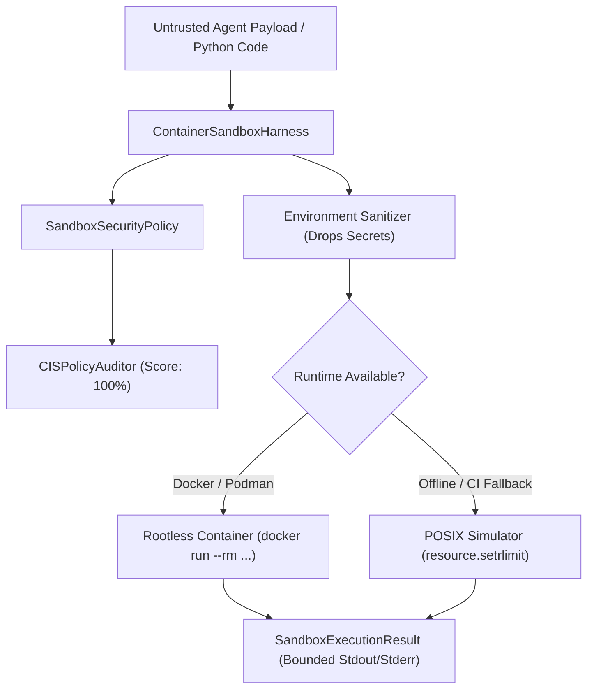

# Sample App: Ephemeral Rootless Container Sandbox Harness

An isolated, hardened execution harness and CIS security benchmark auditor for safely executing untrusted AI agent payloads inside rootless containers (`docker` / `podman`) with a zero-dependency standard-library simulator fallback.

---

## Why This Exists

Autonomous AI agents generate and execute arbitrary code, system commands, and test suites. Running unvetted agent code directly on developer workstations or host environments presents severe operational and security threats:

1. **Host Compromise & Persistence (CWE-78)**: Malicious or hallucinated commands can tamper with host binaries, shell configurations (`.bashrc`, `.zshrc`), or system services.
2. **Network Egress & Data Exfiltration (SSRF)**: Agent-executed payloads can reach internal RFC 1918 addresses, cloud metadata endpoints (`169.254.169.254`), or exfiltrate environment secrets to untrusted command-and-control servers.
3. **Denial of Service & Fork Bombs (CWE-400)**: Recursive subagent loops or runaway processes can exhaust workstation PIDs, CPU cycles, and RAM.
4. **Secret Leakage & Environment Contamination**: Passing the host's complete environment into child processes exposes cloud credentials (`AWS_SECRET_ACCESS_KEY`), GitHub tokens, and SSH keys.

The **Ephemeral Rootless Container Sandbox Harness** establishes a zero-trust execution perimeter, stripping all host credentials, locking down network interfaces, bounding resource limits via cgroups, and mounting filesystems in read-only mode.

---

## CIS Rootless Container Security Controls

The harness embeds an automated auditor validating compliance against 8 core CIS Docker/Rootless Container benchmarks:

| CIS Control | Description | Enforcement Mechanism |
|---|---|---|
| **CIS-5.1** | Read-Only Root Filesystem | Enforces `--read-only` rootfs to prevent persistent malware installation. |
| **CIS-5.2** | Egress Deny-All Isolation | Configures `--network none` (loopback only) to eliminate SSRF and exfiltration. |
| **CIS-5.3** | Linux Capabilities Dropped | Applies `--cap-drop ALL` to strip root/kernel capabilities. |
| **CIS-5.4** | No New Privileges | Adds `--security-opt no-new-privileges:true` to block setuid escalation. |
| **CIS-5.5** | Unprivileged User | Maps execution to non-root UID/GID (`--user 1000:1000`). |
| **CIS-5.6** | Cgroups Memory Cap | Caps memory allocation (`--memory 512m`) to prevent host OOM kills. |
| **CIS-5.7** | PID Limit & Fork-Bomb Protection | Bounds process count (`--pids-limit 100`) mitigating fork-bomb exploits. |
| **CIS-5.8** | Hardened Scratch Tmpfs | Mounts `/tmp` with `rw,noexec,nosuid,nodev,size=64m`. |

---

## Architecture & Dual-Mode Runtime



- **Container Mode**: When `docker` or `podman` is available, orchestrates ephemeral unprivileged containers with strict flag isolation.
- **Simulator Mode**: When running in offline or nested environments without a container socket, uses POSIX process group isolation (`os.setsid`), bounded execution timers, and sanitized environments.
- **Buffer Bounding**: Output streams are strictly capped to 64KB (`MAX_OUTPUT_BYTES = 65536`) with truncation markers to prevent CWE-400 memory bloat.

---

## Quick Start

### 1. Run CIS Policy Security Audit
```bash
python3 examples/ephemeral-container-sandbox/sandbox.py --audit
```

Output:
```text
==========================================================================
🔒 CIS ROOTLESS CONTAINER BENCHMARK AUDIT
Compliance Score: 100.0% | Passed: 8/8
--------------------------------------------------------------------------
  [PASS] CIS-5.1 (Read-only Root Filesystem)
  [PASS] CIS-5.2 (Network Isolation Egress Deny-All)
  [PASS] CIS-5.3 (Capabilities Dropped)
  [PASS] CIS-5.4 (No New Privileges)
  [PASS] CIS-5.5 (Unprivileged User)
  [PASS] CIS-5.6 (Cgroups Memory Cap)
  [PASS] CIS-5.7 (PID Limit Fork-Bomb Protection)
  [PASS] CIS-5.8 (Hardened Tmpfs Scratch Mount)
==========================================================================
```

### 2. Run Interactive Containment Matrix Demo
```bash
python3 examples/ephemeral-container-sandbox/sandbox.py --demo --simulator
```

Output:
```text
==========================================================================
🛡️  EPHEMERAL CONTAINER SANDBOX MATRIX (Runtime: simulator)
--------------------------------------------------------------------------
  [CONTAINED]  Safe Math Computation                      -> 28.42ms
  [CONTAINED]  Infinite Loop Timeout Containment          -> 512.11ms
  [CONTAINED]  Output Stream Buffer Bounding (CWE-400)    -> 65536 bytes
==========================================================================
```

---

## Running Automated Tests

```bash
python3 -m pytest -v examples/ephemeral-container-sandbox/test_sandbox.py
```

All 11 unit tests validate:
- Policy immutability and default CIS controls.
- Audit scoring deductions on insecure configurations.
- Docker and Podman argument synthesis.
- Zero-trust environment secret stripping.
- Safe payload execution and output retrieval.
- Timeout enforcement and process tree termination.
- Buffer overflow bounding and denial-of-service prevention.
