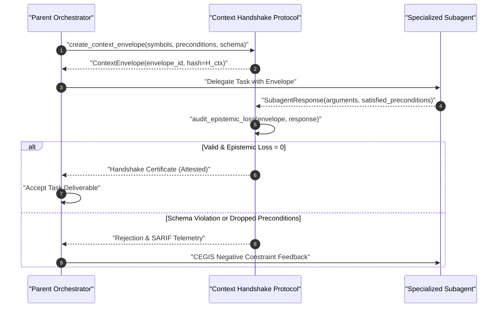

# Sample App: Typed Epistemic Seam & Context Handshake

An executable, zero-dependency Python protocol engine that enforces cryptographic context envelope hashing, negative schema boundaries, and epistemic loss auditing across hierarchical agent delegation seams.

---

## Why This Exists: The Delegation Boundary Trap

In multi-agent architectures (as analyzed in [Observation 21](../../observations/systems/21-hierarchical-subagent-slot-offloading-and-epistemic-loss.md) and [Observation 29](../../observations/systems/29-epistemic-drift-and-the-unreliable-teacher-in-autonomous-verification.md)), hierarchical delegation ("Big decides, small types, big checks") frequently suffers from **epistemic loss**:
- **Lossy Context Summarization**: When a parent agent delegating to a subagent passes unstructured prompts, critical preconditions and invariants are dropped.
- **Hallucinated Parameter Drift**: Subagents invent uncontracted tool arguments or unexpected return structures, confusing parent orchestrators.
- **Silent Degradation**: The subagent reports success, but the delivered code fails parent-level architectural invariants.

The **Typed Context Handshake** protocol solves this by establishing an immutable, content-addressed contract envelope ($H_{\text{ctx}}$) with strict negative schema enforcement (`additionalProperties: false`) and cryptographic completion certificates.

---

## Handshake Architecture



---

## Quick Start

### CLI Usage

```bash
# Generate a new context envelope
python3 context_handshake.py envelope --parent lead-agent --target sub-refactorer

# Run a sample handshake audit
python3 context_handshake.py audit

# Output Markdown telemetry
python3 context_handshake.py audit --format markdown

# Export OASIS SARIF 2.1.0 telemetry for Code Scanning
python3 context_handshake.py audit --format sarif
```

---

## Invariant Verification

- **Zero External Dependencies**: Standard library Python (`hashlib`, `json`, `dataclasses`, `time`).
- **Mathematical Bound**: Epistemic Loss ($E_{\text{loss}} \in [0, 1]$) strictly quantified over dropped preconditions and schema violations.
- **Strict Complexity**: All functions certified at $M \le 4$, nesting depth $\le 2$, and parameter count $\le 4$.

