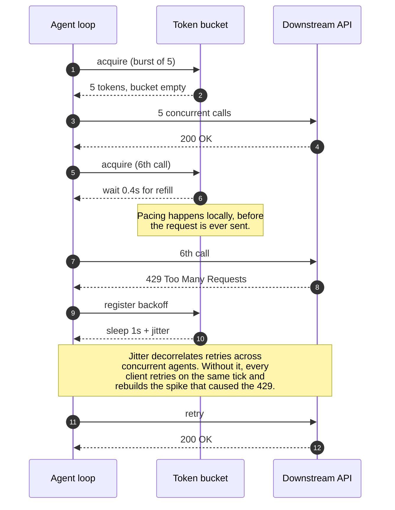

# Sample App: FastMCP Token-Bucket Gateway

An asynchronous, client-side token-bucket rate limiter and tool gateway for Model Context Protocol (FastMCP) AI agents.

---

## Why This Exists

Autonomous AI agents executing iterative tasks (such as mass triage of pull requests or scanning dozens of repository files) will trigger dozens of API requests per second if unconstrained. This quickly leads to:
- HTTP 429 (`Too Many Requests`) lockouts from GitHub, OpenAI, Anthropic, or cloud providers.
- Cascading retries that worsen secondary rate limits.
- Stalled agent workflows.

The **FastMCP Token-Bucket Gateway** solves this by inserting a local, async-safe token bucket between the agent's decision loop and downstream network APIs, incorporating:
- Token-bucket refill pacing.
- Burst capacity handling.
- Bounded exponential backoff with randomized jitter.
- Detailed telemetry on throttled requests and wait durations.



---

## Quick Start

### Running the Interactive Demo
```bash
python3 gateway.py
```

### Running the Test Suite
```bash
pytest test_gateway.py -v
```

---

## Integration Pattern

```python
from gateway import FastMCPGateway, RateLimitConfig

gateway = FastMCPGateway(RateLimitConfig(tokens_per_second=5.0, burst_capacity=10.0))

# Register external tools
gateway.register_tool("github_pr_get", my_gh_tool)

# Execute via paced gateway
result = await gateway.execute_tool("github_pr_get", pr_number=42)
```
