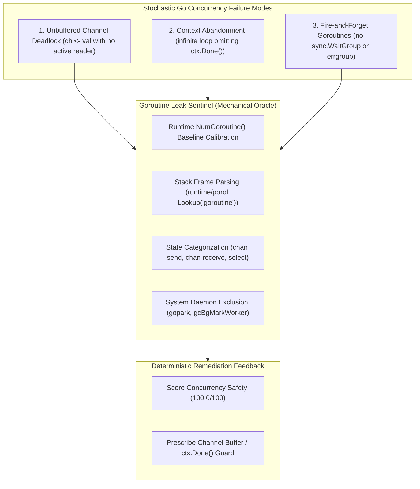
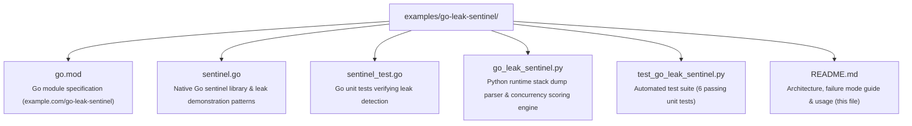

# Go Concurrency & Goroutine Leak Sentinel

> **Sample Application**: Concurrency Verification & Goroutine Leak Sentinel  
> **Classification**: Polyglot Systems Invariant Enforcement  
> **Source Project**: [`vibes`](https://github.com/dan-petty/vibes)  
> **Primary Tech**: Go 1.22+, `runtime/pprof`, Python 3.12+  

---

## 1. Overview & Problem Statement

In concurrent Go applications, autonomous AI coding assistants frequently introduce subtle **goroutine leaks**—background goroutines that block indefinitely on channel operations, system calls, or synchronization locks, silently accumulating memory and thread table entries until the process exhausts resources.

Because Go lacks compile-time affine lifetime checks like Rust, concurrency invariants must be guarded by **deterministic runtime stack oracles**:



---

## 2. The 3 Common Concurrency Traps & Fixes

### Trap 1: Unbuffered Channel Send Hang
```go
// ❌ FLAGGED: Goroutine hangs permanently if caller abandons channel
func LeakyWorker(val int) <-chan int {
    ch := make(chan int) // Unbuffered
    go func() {
        ch <- val // BLOCKS forever if not read
    }()
    return ch
}

// ✅ CLEAN: Buffered channel guarantees non-blocking send and termination
func CleanWorker(val int) <-chan int {
    ch := make(chan int, 1) // Buffer size 1 prevents deadlock
    go func() {
        defer close(ch)
        ch <- val
    }()
    return ch
}
```

### Trap 2: Context Cancellation Omission
```go
// ❌ FLAGGED: Goroutine ignores caller context cancellation
func LeakyContextLoop(stopCh <-chan struct{}) {
    go func() {
        for {
            time.Sleep(100 * time.Millisecond) // Keeps running forever
        }
    }()
}

// ✅ CLEAN: Select listens to ctx.Done() for deterministic termination
func CleanContextLoop(ctx context.Context, wg *sync.WaitGroup) {
    wg.Add(1)
    go func() {
        defer wg.Done()
        for {
            select {
            case <-ctx.Done():
                return
            case <-time.After(10 * time.Millisecond):
                // Work step
            }
        }
    }()
}
```

---

## 3. Directory Layout & Architecture



---

## 4. Quickstart & CLI Usage

### Run the Interactive Demonstration
```bash
python3 examples/go-leak-sentinel/go_leak_sentinel.py --demo
```

### Output:
```text
================================================================================
🐹 GO CONCURRENCY & GOROUTINE LEAK SENTINEL — AUDIT REPORT
================================================================================
Total Goroutines:    4
System Daemons:      1
User Goroutines:     3
Leaked Goroutines:   2
Severity Rating:     CRITICAL
Concurrency Score:   50.0/100.0
--------------------------------------------------------------------------------
🚨 IDENTIFIED CONCURRENCY LEAKS & REMEDIATIONS:
  • [example.com/go-leak-sentinel.LeakyChannelWorker.func1] Channel send blocked indefinitely. Ensure channel has capacity or active reader.
  • [example.com/go-leak-sentinel.LeakyContextWorker.func1] Select blocked without termination. Add 'case <-ctx.Done(): return'.
================================================================================
```

### Scan a Live Stack Dump File
```bash
python3 examples/go-leak-sentinel/go_leak_sentinel.py --scan /path/to/stack.dump --json
```

### Run Automated Unit Tests
```bash
python3 -m pytest -v examples/go-leak-sentinel/test_go_leak_sentinel.py
```
