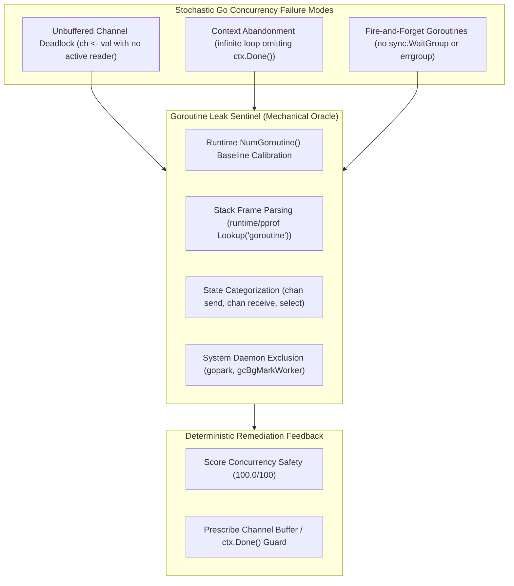

# Go Concurrency & Goroutine Leak Sentinel

> **Sample Application**: Concurrency Verification & Goroutine Leak Sentinel
> **Classification**: Polyglot Systems Invariant Enforcement
> **Source Project**: [`vibes`](https://github.com/dan-petty/vibes)
> **Primary Tech**: Go 1.22+, `runtime/pprof`, Python 3.12+

---

## Overview & Problem Statement

In concurrent Go applications, autonomous AI coding assistants frequently introduce subtle **goroutine leaks**—background goroutines that block indefinitely on channel operations, system calls, or synchronization locks, silently accumulating memory and thread table entries until the process exhausts resources.

Because Go lacks compile-time affine lifetime checks like Rust, concurrency invariants must be guarded by **deterministic runtime stack oracles**:


```mermaid
flowchart TD
    subgraph LLMConcurrenyTraps["Stochastic Go Concurrency Failure Modes"]
        T1["Unbuffered Channel Deadlock (ch <- val with no active reader)"]
        T2["Context Abandonment (infinite loop omitting ctx.Done())"]
        T3["Fire-and-Forget Goroutines (no sync.WaitGroup or errgroup)"]
    end

    subgraph Oracle["Goroutine Leak Sentinel (Mechanical Oracle)"]
        O1["Runtime NumGoroutine() Baseline Calibration"]
        O2["Stack Frame Parsing (runtime/pprof Lookup('goroutine'))"]
        O3["State Categorization (chan send, chan receive, select)"]
        O4["System Daemon Exclusion (gopark, gcBgMarkWorker)"]
    end

    subgraph Actions["Deterministic Remediation Feedback"]
        A1["Score Concurrency Safety (100.0/100)"]
        A2["Prescribe Channel Buffer / ctx.Done() Guard"]
    end

    T1 --> Oracle
    T2 --> Oracle
    T3 --> Oracle
    Oracle --> Actions
```

---

## Common Concurrency Traps & Fixes

### Trap 1: Unbuffered Channel Send Hang
```go
// ❌ FLAGGED: Goroutine hangs permanently if caller abandons channel
func LeakyWorker(val int) <-chan int {
    ch := make(chan int) // Unbuffered
    go func() {
        ch <- val // BLOCKS forever if not read
    }()
    return ch
}

// ✅ CLEAN: Buffered channel guarantees non-blocking send and termination
func CleanWorker(val int) <-chan int {
    ch := make(chan int, 1) // Buffer size 1 prevents deadlock
    go func() {
        defer close(ch)
        ch <- val
    }()
    return ch
}
```

### Trap 2: Context Cancellation Omission
```go
// ❌ FLAGGED: Goroutine ignores caller context cancellation
func LeakyContextLoop(stopCh <-chan struct{}) {
    go func() {
        for {
            time.Sleep(100 * time.Millisecond) // Keeps running forever
        }
    }()
}

// ✅ CLEAN: Select listens to ctx.Done() for deterministic termination
func CleanContextLoop(ctx context.Context, wg *sync.WaitGroup) {
    wg.Add(1)
    go func() {
        defer wg.Done()
        for {
            select {
            case <-ctx.Done():
                return
            case <-time.After(10 * time.Millisecond):
                // Work step
            }
        }
    }()
}
```

---

## Quickstart & CLI Usage

### Run the Interactive Demonstration
```bash
python3 examples/go-leak-sentinel/go_leak_sentinel.py --demo
```

### Output:
```text
================================================================================
🐹 GO CONCURRENCY & GOROUTINE LEAK SENTINEL — AUDIT REPORT
================================================================================
Total Goroutines:    4
System Daemons:      1
User Goroutines:     3
Leaked Goroutines:   2
Severity Rating:     CRITICAL
Concurrency Score:   50.0/100.0
--------------------------------------------------------------------------------
🚨 IDENTIFIED CONCURRENCY LEAKS & REMEDIATIONS:
  • [example.com/go-leak-sentinel.LeakyChannelWorker.func1] Channel send blocked indefinitely. Ensure channel has capacity or active reader.
  • [example.com/go-leak-sentinel.LeakyContextWorker.func1] Select blocked without termination. Add 'case <-ctx.Done(): return'.
================================================================================
```

### Scan a Live Stack Dump File
```bash
python3 examples/go-leak-sentinel/go_leak_sentinel.py --scan /path/to/stack.dump --json
```

### Test Harness Integration (Fail Ordinary Test Runs on Leaks)

#### Go `testing.T` Integration:
```go
import (
    "testing"
    "time"
    sentinel "example.com/go-leak-sentinel"
)

func TestMyConcurrentWorker(t *testing.T) {
    // Fails t with a stack dump and diagnostic if goroutines outlive the test
    defer sentinel.Check(t, sentinel.WithTimeout(50*time.Millisecond))()

    ch := SafeChannelWorker(42)
    <-ch
}

func TestImmediateVerification(t *testing.T) {
    // Verifies no leaks exist at this moment
    sentinel.VerifyNone(t)
}
```

#### Python Test Runner Integration (`pytest` / `unittest`):
```python
from go_leak_sentinel import assert_no_goroutine_leaks, verify_test_run

def test_service_concurrency():
    # Executes workload...
    # Automatically raises AssertionError failing the test if leaks are detected:
    verify_test_run(stack_dump_text, fail_on_leak=True)
```

#### CLI Test Runner Gate:
```bash
# Returns exit code 1 and writes diagnostic to stderr if leaks are detected:
python3 examples/go-leak-sentinel/go_leak_sentinel.py --scan /path/to/stack.dump --fail-on-leak
```

### Run Automated Unit Tests
```bash
uv run pytest examples/go-leak-sentinel/test_go_leak_sentinel.py
```

---

## Directory Layout & Architecture

```text
├── go.mod                  # Go module specification (example.com/go-leak-sentinel)
├── sentinel.go             # Native Go sentinel library, test harness integration (Check, VerifyNone)
├── sentinel_test.go        # Go unit tests verifying leak detection & mock TestingT harness
├── go_leak_sentinel.py     # Python runtime stack dump parser & test runner verification engine
├── test_go_leak_sentinel.py # Automated test suite (15 passing unit tests in < 0.6s)
└── README.md               # Architecture, failure mode guide & usage (this file)
```
