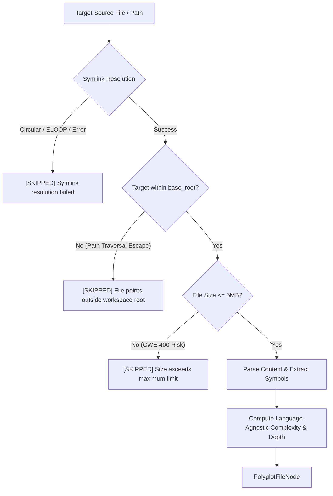

# Sample App: Polyglot CST Ingestion Engine

A language-agnostic Concrete Syntax Tree (CST) and AST ingestion engine that extracts symbols, calculates unified cyclomatic complexity ($M$) and nesting depth, and enforces defensive pre-flight file size and symlink containment boundaries across **Python, Rust, Go, TypeScript/JavaScript, and Bash**.

---

## Why This Exists

In multi-language monorepos and polyglot microservice architectures, AI coding assistants must inspect, understand, and refactor code spanning multiple programming languages.

However, naive file ingestion and language-specific AST engines introduce severe operational risks:

1. **The Minified & Oversized File Ingestion Trap (CWE-400)**: Ingesting massive bundles (`dist/bundle.js` > 10MB), generated test fixtures, or binary files causes high memory spikes and out-of-memory (OOM) crashes.
2. **Symlink Traversal Escapes & Circular Loops (`ELOOP`)**: Complex projects often contain symlinks (e.g. `pnpm` store links, shared modules) that point outside the repository workspace or form circular loops, triggering infinite recursion.
3. **AST Fragmentation**: Python's standard `ast` module only parses Python. Evaluating cross-language architectural invariants requires a unified, language-agnostic complexity and symbol extraction framework.

The **Polyglot CST Ingestion Engine** solves this by pairing multi-language token and AST inspection with pre-flight boundary verification.

---

## Multi-Language Complexity Decision Points

The engine maps language-specific control-flow statements to unified McCabe Cyclomatic Complexity ($M$):

| Language | Extracted Symbols | Decision Points Contributing to Complexity ($M$) |
|---|---|---|
| **Python** | `def` (functions/methods), `class` | `if`, `elif`, `for`, `while`, `try/except`, `assert`, `and`, `or`, ternary `if/else` |
| **Rust** | `fn`, `struct`, `trait`, `impl` | `if`, `match`, `for`, `while`, `loop`, `?` (try operator), `&&`, `\|\|` |
| **Go** | `func`, `type ... struct`, `type ... interface` | `if`, `for`, `switch/case`, `select/case`, `&&`, `\|\|` |
| **TypeScript / JS** | `function`, `class`, `interface` | `if`, `else if`, `for`, `while`, `case`, `catch`, `&&`, `\|\|`, ternary `? :` |
| **Bash** | `name() { ... }`, `function name` | `if`, `elif`, `for`, `while`, `case`, `&&`, `\|\|` |

---

## Defensive Boundary Guards



1. **Pre-Flight File Size Bound**: Strict cap of `MAX_FILE_SIZE_BYTES = 5MB`. Files exceeding the limit are skipped with a structured diagnostic warning.
2. **Symlink Containment**: Defensively resolves paths with `path.resolve()` and asserts `is_relative_to(base_root)`, preventing circular symlink exhaustion (`ELOOP`) and directory traversal escapes.
3. **Zero External Dependencies**: Fast, deterministic execution using Python standard library.

---

## Quick Start

### 1. Run the Multi-Language Demonstration
```bash
python3 examples/polyglot-cst-parser/parser.py --demo
```

Output:
```text
==========================================================================
🌐 POLYGLOT CST INGESTION SCORECARD
--------------------------------------------------------------------------
LANGUAGE       | CANONICAL ID   | SYMBOLS    | COMPLEXITY (M)
--------------------------------------------------------------------------
Python         | python         | 1          | 2             
Rust           | rust           | 2          | 2             
Go             | go             | 2          | 1             
TypeScript     | typescript     | 2          | 1             
Bash           | bash           | 1          | 2             
==========================================================================
```

### 2. Scan a Single Source File
```bash
python3 examples/polyglot-cst-parser/parser.py --scan path/to/file.ts
```

---

## Running Automated Tests

```bash
python3 -m pytest -v examples/polyglot-cst-parser/test_cst_parser.py
```

All 9 unit tests validate:
- Language detection across extensions (`.py`, `.rs`, `.go`, `.ts`, `.sh`).
- Symbol extraction for all 5 languages.
- Complexity ($M$) and nesting depth calculations.
- Pre-flight file size boundary enforcement (> 5MB).
- Symlink containment and workspace boundary defense.
