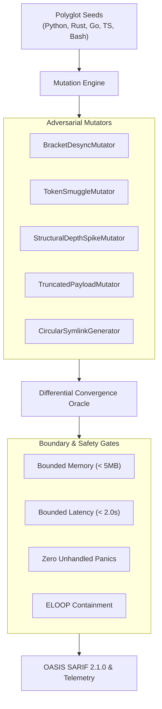

# Sample App: Differential Polyglot AST Mutation Fuzzer

An executable, zero-dependency Python fuzzing harness that evaluates parser resilience, boundary containment, and memory safety across multi-language CST/AST parsers and file loaders under adversarial structural mutations.

---

## Why This Exists: The Polyglot Boundary Problem

Autonomous AI coding agents frequently synthesize and ingest code across multiple programming languages (Python, Go, Rust, TypeScript, Bash). When extracting symbols or calculating complexity, agents route code through language-specific AST/CST parsers (such as [`polyglot-cst-parser`](../polyglot-cst-parser/)).

However, agent-generated code frequently contains boundary pathologies:
- **Bracket and Delimiter Desynchronization**: Truncated code blocks resulting in unbalanced tokens and parser crashes.
- **Token Smuggling & Null Injection**: Hidden characters (`\x00`) in comments or multi-line string literals that bypass static analysis.
- **Recursive Structural Spikes**: Code with deeply nested conditional or loop statements ($> 20$ levels) triggering recursion limits or stack overflows.
- **Circular Symlink Traversal**: Cyclic filesystem paths causing infinite loops (`ELOOP`) during repository repomap crawling.

The **Differential Polyglot AST Mutation Fuzzer** systematically perturbs seed files across five mutation operators and asserts bounded memory ($< 5\text{MB}$), deterministic termination, and zero unhandled interpreter panics.

---

## Architecture



---

## Quick Start

### Running the Fuzzer

```bash
# Run standalone fuzz campaign with summary output
python3 polyglot_fuzzer.py

# Emit human-readable Markdown summary
python3 polyglot_fuzzer.py --format markdown

# Export OASIS SARIF 2.1.0 telemetry for GitHub Code Scanning
python3 polyglot_fuzzer.py --format sarif --out fuzzer_findings.sarif

# Export JSON telemetry
python3 polyglot_fuzzer.py --format json --out fuzzer_report.json
```

---

## Invariant Verification

This exhibit is strictly certified against the Seven Pillars of Disciplined Agentic Development:
- **Zero External Dependencies**: Standard library Python (`ast`, `json`, `pathlib`, `time`).
- **Strict Structural Bounds**: All functions certified at cyclomatic complexity $M \le 4$, nesting depth $\le 2$, and parameter count $\le 4$.
- **Assertion Density**: Unit test suite uses consolidated structural tuple equality checks.

