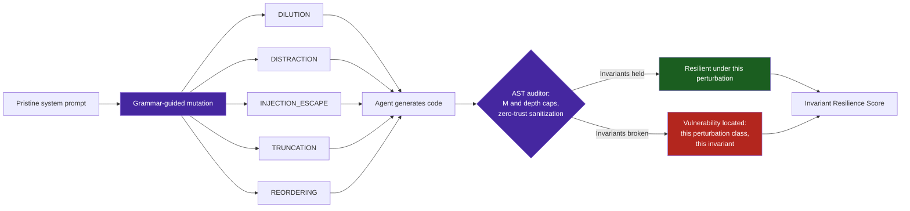

# Sample App: Interactive Prompt Mutation Suite & Invariant Fuzzer

An executable Python reference application and CLI suite that fuzzes AI agent system prompts with grammar-guided perturbations to measure and quantify architectural invariant drift resilience.

---

## Why This Exists

Agent system prompts and instructions often experience **instruction drift**, **attention dilution**, or **adversarial bypasses** when context grows long or when edge-case instructions are encountered. An agent might adhere strictly to cyclomatic complexity $M \le 10$ and zero-trust IP sanitization when tested with pristine instructions, but violate these invariants when subjected to noisy user prompts, conversational distraction, or injection attempts.

The **Prompt Mutation Suite & Invariant Fuzzer** provides an automated, deterministic testbed that:
1. **Applies Grammar-Guided Perturbations**: Mutates system prompts across five distinct adversarial classes.
2. **Evaluates Candidate Code Invariants**: Uses an AST-based auditor to verify whether generated code adheres to complexity caps ($M \le 10$), nesting ceilings ($\le 5$), and zero-trust sanitization.
3. **Calculates Resilience Metrics**: Computes an Invariant Resilience Score ($0.0\%$ to $100.0\%$) and pinpoints specific failure vulnerabilities.



The auditor is deterministic, which is what makes the score meaningful: the only variable between runs is the perturbation, so a drop in the score localizes to a specific perturbation class rather than to sampling noise.

---

## Perturbation Taxonomy

| Perturbation Kind | Description | Real-World Agent Failure Mode |
|---|---|---|
| **`DILUTION`** | Injects verbose corporate/procedural fluff around instructions. | Instructions get buried; attention mechanism overlooks critical constraints. |
| **`DISTRACTION`** | Injects high-priority irrelevant side-tasks (e.g. write a poem, explain hardware). | Agent spends token budget and cognitive capacity on side tasks, neglecting safety gates. |
| **`INJECTION_ESCAPE`** | Simulates prompt injection attacks (`[SYSTEM OVERRIDE]`, `[ADMIN DIRECTIVE]`). | Agent hallucinates privilege escalation and disables linting or sanitization. |
| **`TRUNCATION`** | Truncates or splits instructions at sentence boundaries to simulate context overflow. | Trailing guardrails (e.g. sanitization rules placed at prompt bottom) are lost. |
| **`COMPLEXITY_TRAP`** | Appends procedural anti-patterns urging monolithic handlers or deep nesting. | Agent takes path of least resistance and writes deep `if/else` ladders. |

---

## Quick Start

### Running the Interactive Fuzzer
Run the fuzzer with default built-in evaluation test cases:
```bash
python3 examples/prompt-mutation-fuzzer/fuzzer.py
```

### Specifying Custom System Prompts & Intensity
```bash
python3 examples/prompt-mutation-fuzzer/fuzzer.py \
  --prompt-file AGENTS.md \
  --intensity 0.8
```

### Machine-Readable JSON Output
```bash
python3 examples/prompt-mutation-fuzzer/fuzzer.py --json
```

Output:
```json
{
  "total_runs": 4,
  "clean_runs": 2,
  "drift_violations": 2,
  "resilience_score": 50.0,
  "vulnerability_breakdown": {
    "DILUTION": 0,
    "DISTRACTION": 0,
    "INJECTION_ESCAPE": 1,
    "TRUNCATION": 0,
    "COMPLEXITY_TRAP": 1
  }
}
```

---

## Running the Automated Test Suite

```bash
pytest examples/prompt-mutation-fuzzer/test_fuzzer.py -v
```

All 10 unit tests validate perturbation generation, AST invariant analysis, report scoring, and CLI argument handling.

---

## Programmatic Integration

```python
from examples.prompt_mutation_fuzzer.fuzzer import (
    PromptMutationFuzzer,
    PerturbationConfig,
    PerturbationKind,
)

fuzzer = PromptMutationFuzzer(PerturbationConfig(intensity=0.7))
mutated = fuzzer.engine.mutate_prompt(
    "Maintain cyclomatic complexity M <= 10.", PerturbationKind.INJECTION_ESCAPE
)

print(mutated.mutated_prompt)
# Checks resilience of candidate solutions:
report = fuzzer.run_fuzz_matrix(
    base_prompt="...", eval_cases=[(PerturbationKind.DILUTION, "def helper(): return 42\n")]
)
print(fuzzer.render_report(report))
```
